# SSIS Package: ERP_POReceipts

**Project:** ERP_POReceipts  
**Folder:** SSIS  
**Server:** STL-SSIS-P-01  

## Architecture Diagram

```mermaid
flowchart TD
    subgraph Connections
        Archive_conn(["Archive [FILE]"])
        IntegrationStaging_conn(["IntegrationStaging [OLEDB]"])
        me_01_conn(["me_01 [OLEDB]"])
        SMTP_EMAIL_conn(["SMTP_EMAIL [SMTP]"])
        SQL_LOG_conn(["SQL_LOG [OLEDB]"])
    end
    subgraph ControlFlow
        ERP_POReceipts_task["ERP_POReceipts"]
        Sequence___Generate_XML_and_Upload_to_D365_task["Sequence - Generate XML and Upload to D365"]
        ERP_POReceipts_task --> Sequence___Generate_XML_and_Upload_to_D365_task
        Foreach_Loop___PO_Receipts_task["Foreach Loop - PO Receipts"]
        Sequence___Generate_XML_and_Upload_to_D365_task --> Foreach_Loop___PO_Receipts_task
        Archive_File_task["Archive File"]
        Foreach_Loop___PO_Receipts_task --> Archive_File_task
        Copy_File_to_D365_task["Copy File to D365"]
        Archive_File_task --> Copy_File_to_D365_task
        Foreach_Loop___Transfer_Receipts_task["Foreach Loop - Transfer Receipts"]
        Copy_File_to_D365_task --> Foreach_Loop___Transfer_Receipts_task
        Archive_File_task["Archive File"]
        Foreach_Loop___Transfer_Receipts_task --> Archive_File_task
        Copy_File_To_D365_task["Copy File To D365"]
        Archive_File_task --> Copy_File_To_D365_task
        spOutputD365PurchaseOrderReceiptXMLByEntity_task["spOutputD365PurchaseOrderReceiptXMLByEntity"]
        Copy_File_To_D365_task --> spOutputD365PurchaseOrderReceiptXMLByEntity_task
        spOutputTransferPalletReceipt_task["spOutputTransferPalletReceipt"]
        spOutputD365PurchaseOrderReceiptXMLByEntity_task --> spOutputTransferPalletReceipt_task
        Sequence___Stage_Receipts_from_Warehouses_task["Sequence - Stage Receipts from Warehouses"]
        spOutputTransferPalletReceipt_task --> Sequence___Stage_Receipts_from_Warehouses_task
        Merge_Non_PO_Receipts_task["Merge Non PO Receipts"]
        Sequence___Stage_Receipts_from_Warehouses_task --> Merge_Non_PO_Receipts_task
        Merge_PO_Receipts_task["Merge PO Receipts"]
        Merge_Non_PO_Receipts_task --> Merge_PO_Receipts_task
        PO_Exceptions_task["PO Exceptions"]
        Merge_PO_Receipts_task --> PO_Exceptions_task
        Sequence_Container_task["Sequence Container"]
        PO_Exceptions_task --> Sequence_Container_task
        Data_Flow___Stage_3PL_Receipts_task["Data Flow - Stage 3PL Receipts"]
        Sequence_Container_task --> Data_Flow___Stage_3PL_Receipts_task
        Data_Flow___Stage_WC_Receipts_task["Data Flow - Stage WC Receipts"]
        Data_Flow___Stage_3PL_Receipts_task --> Data_Flow___Stage_WC_Receipts_task
        Stage_Pallet_Receipts_task["Stage Pallet Receipts"]
        Data_Flow___Stage_WC_Receipts_task --> Stage_Pallet_Receipts_task
        Truncate_Stage_task["Truncate Stage"]
        Stage_Pallet_Receipts_task --> Truncate_Stage_task
        Send_Email_onError_task["Send Email onError"]
        Truncate_Stage_task --> Send_Email_onError_task
    end
```

## Connection Managers

| Name | Type |
|---|---|
| Archive | FILE |
| IntegrationStaging | OLEDB |
| me_01 | OLEDB |
| SMTP_EMAIL | SMTP |
| SQL_LOG | OLEDB |

## Control Flow Tasks

| Task | Type |
|---|---|
| ERP_POReceipts | Microsoft.Package |
| Sequence - Generate XML and Upload to D365 | STOCK:SEQUENCE |
| Foreach Loop - PO Receipts | STOCK:FOREACHLOOP |
| Archive File | Microsoft.FileSystemTask |
| Copy File to D365 | Microsoft.FileSystemTask |
| Foreach Loop - Transfer Receipts | STOCK:FOREACHLOOP |
| Archive File | Microsoft.FileSystemTask |
| Copy File To D365 | Microsoft.FileSystemTask |
| spOutputD365PurchaseOrderReceiptXMLByEntity | Microsoft.ExecuteSQLTask |
| spOutputTransferPalletReceipt | Microsoft.ExecuteSQLTask |
| Sequence - Stage Receipts from Warehouses | STOCK:SEQUENCE |
| Merge Non PO Receipts | Microsoft.ExecuteSQLTask |
| Merge PO Receipts | Microsoft.ExecuteSQLTask |
| PO Exceptions | Microsoft.Pipeline |
| Sequence Container | STOCK:SEQUENCE |
| Data Flow - Stage 3PL Receipts | Microsoft.Pipeline |
| Data Flow - Stage WC Receipts | Microsoft.Pipeline |
| Stage Pallet Receipts | Microsoft.Pipeline |
| Truncate Stage | Microsoft.ExecuteSQLTask |
| Send Email onError | Microsoft.SendMailTask |

## Data Flow: Sources

| Component | SQL Preview |
|---|---|
|  | with  Receipt as 	( 		select 			PurchaseOrderNumber, 			ReceiptLocation, 			ReceiptDate, 			cast(concat(ReceiptLocation, replace(ReceiptDate,'-',''), ItemID) as varchar(50)) as CaseNumber, 			ItemID, 			Qty, 			cast(InsertDate as date) InsertDate, 			Entity  		from D365_PurchaseOrderReceiptStage  		where datediff(dd, InsertDate, getdate()) <= 1 	) select  	PurchaseOrderNumber, 	ReceiptLocation, 	R |
|  | select h.PurchaseOrderNumber as DynamicsPO,  h.PurchaseOrderNumber as LookupPO, cast(l.ItemID as varchar(6)) as ItemNumber from ERP.PurchaseOrderHeader h with (nolock) join ERP.PurchaseOrderLines l with (nolock) on h.PurchaseOrderNumber=l.PurchaseOrderNumber group by h.PurchaseOrderNumber,  h.PurchaseOrderNumber, cast(l.ItemID as varchar(6))  union select cast(DynamicsPO as varchar) as DynamicsPO, |
|  | with  Receipt as 	( 		select 			PurchaseOrderNumber, 			ReceiptLocation, 			ReceiptDate, 			cast(concat(ReceiptLocation, replace(ReceiptDate,'-',''), ItemID) as varchar(50)) as CaseNumber, 			ItemID, 			Qty, 			cast(InsertDate as date) InsertDate, 			Entity  		from D365_PurchaseOrderReceiptStage  		where datediff(dd, InsertDate, getdate()) <= 1 	) select  	PurchaseOrderNumber, 	ReceiptLocation, 	R |
|  | select h.PurchaseOrderNumber as DynamicsPO,  h.PurchaseOrderNumber as LookupPO, cast(l.ItemID as varchar(6)) as ItemNumber from ERP.PurchaseOrderHeader h with (nolock) join ERP.PurchaseOrderLines l with (nolock) on h.PurchaseOrderNumber=l.PurchaseOrderNumber group by h.PurchaseOrderNumber,  h.PurchaseOrderNumber, cast(l.ItemID as varchar(6))  union select cast(DynamicsPO as varchar) as DynamicsPO, |
|  | select * from ERP_WCPalletReceipts  where datediff(dd, ReceiptDate, getdate()) = 0 |

## Data Flow: Destinations

| Component | Destination |
|---|---|
|  | [ERP].[PurchaseOrderReceiptExceptions] |
|  | [ERP].[vwPOReceiptIntegrationExceptionLog] |
|  | [dbo].[D365_PurchaseOrderReceiptStage] |
|  | [ERP].[PurchaseOrderReceiptStage] |
|  | [ERP].[WhseReceiptStage_NonPO] |
|  | [dbo].[D365_PurchaseOrderReceiptStage] |
|  | [ERP].[PurchaseOrderReceiptStage] |
|  | [ERP].[WhseReceiptStage_NonPO] |
|  | [dbo].[ERP_WCPalletReceipts] |
|  | [ERP].[WCPalletReceipts] |

