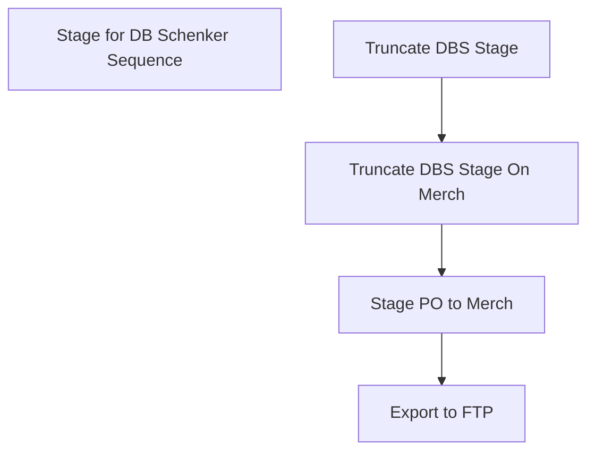

# SSIS Package: ERP_PO_Export_To_DBSchenker_OnDemand

**Project:** ERP_PurchaseOrderFromD365  
**Folder:** SSIS  
**Server:** STL-SSIS-P-01  

## Connection Managers

| Name | Type | Server | Catalog | Connection (sanitized) |
|---|---|---|---|---|
| IntegrationStaging | OLEDB | STL-SSIS-P-01 | IntegrationStaging | Data Source=STL-SSIS-P-01; Initial Catalog=IntegrationStaging; Provider=SQLNCLI11.1; Integrated Security=SSPI; Auto Translate=False |
| me_01 | OLEDB | BEDROCKDB02 | me_01 | Data Source=BEDROCKDB02; Initial Catalog=me_01; Provider=SQLNCLI11.1; Integrated Security=SSPI; Auto Translate=False |

## Control Flow Tasks

| Task | Type |
|---|---|
| ERP_PO_Export_To_DBSchenker_OnDemand | Package |
| Stage for DB Schenker Sequence | SEQUENCE |
| Export to FTP | ExecuteSQLTask |
| Stage PO to Merch | Pipeline |
| Truncate DBS Stage | ExecuteSQLTask |
| Truncate DBS Stage On Merch | ExecuteSQLTask |

## Control Flow Outline

```text
- Stage for DB Schenker Sequence [SEQUENCE]
  - Export to FTP [ExecuteSQLTask]
  - Stage PO to Merch [Pipeline]
  - Truncate DBS Stage [ExecuteSQLTask]
  - Truncate DBS Stage On Merch [ExecuteSQLTask]
```

## Architecture Diagram



## Variables

| Namespace | Name | Expression-bound |
|---|---|---|
| User | PoNumbers | No |
| User | PoView | Yes |

### Expression-bound variable values

#### User::PoView

**Expression:**

```sql
"select *
from [ERP].[vwPurchaseOrderDBSchenkerONDemand]
where PurchaseOrder in " +  @[User::PoNumbers]
```

**Evaluated value:**

```sql
select *
from [ERP].[vwPurchaseOrderDBSchenkerONDemand]
where PurchaseOrder in ('PO110008073')
```

## Execute SQL Tasks

### Export to FTP

**Path:** `Package\Stage for DB Schenker Sequence\Export to FTP`  
**Connection:** me_01 (BEDROCKDB02/me_01)  

```sql
exec spMerchandisingDBSchenkerPOExport_7_Export_OnDemandExportFromDynamicsOnly
```

### Truncate DBS Stage

**Path:** `Package\Stage for DB Schenker Sequence\Truncate DBS Stage`  
**Connection:** IntegrationStaging (STL-SSIS-P-01/IntegrationStaging)  

```sql
TRUNCATE TABLE ERP.PurchaseOrderToDBSchenkerStage

```

### Truncate DBS Stage On Merch

**Path:** `Package\Stage for DB Schenker Sequence\Truncate DBS Stage On Merch`  
**Connection:** me_01 (BEDROCKDB02/me_01)  

```sql
truncate table tmpHoldDBSchenkerPO_FromD365
```

## Data Flow: Sources

| Component | Source Object | Type | Data Flow Task | Connection | SQL Kind |
|---|---|---|---|---|---|
| vwPurchaseOrderDBSchenker |  | OLEDBSource | Stage PO to Merch | IntegrationStaging |  |

## Data Flow: Destinations

| Component | Target Table | Type | Data Flow Task | Connection | SQL Kind |
|---|---|---|---|---|---|
| tmpHoldDBSchenkerPO_FromD365 |  | OLEDBDestination | Stage PO to Merch | me_01 |  |
