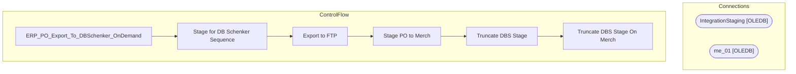

# SSIS Package: ERP_PO_Export_To_DBSchenker_OnDemand

**Project:** ERP_PurchaseOrderFromD365  
**Folder:** SSIS  
**Server:** STL-SSIS-P-01  

## Architecture Diagram

## Connection Managers

| Name | Type |
|---|---|
| IntegrationStaging | OLEDB |
| me_01 | OLEDB |

## Control Flow Tasks

| Task | Type |
|---|---|
| ERP_PO_Export_To_DBSchenker_OnDemand | Microsoft.Package |
| Stage for DB Schenker Sequence | STOCK:SEQUENCE |
| Export to FTP | Microsoft.ExecuteSQLTask |
| Stage PO to Merch | Microsoft.Pipeline |
| Truncate DBS Stage | Microsoft.ExecuteSQLTask |
| Truncate DBS Stage On Merch | Microsoft.ExecuteSQLTask |

## Data Flow: Sources

| Component | SQL Preview |
|---|---|
|  | update ERP.PurchaseOrderHeader set Exported_DBS = getdate()  where Exported_DBS is NULL  and cast(PurchaseOrderNumber as nvarchar) = ? |
|  | update ERP.PurchaseOrderLines set Exported_DBS = getdate()  where Exported_DBS is NULL  and cast(PurchaseOrderNumber as nvarchar) = ?  and LineNumber = ? |

## Data Flow: Destinations

| Component | Destination |
|---|---|
|  | [dbo].[tmpHoldDBSchenkerPO_FromD365] |
|  | [ERP].[vwPurchaseOrderDBSchenker] |

