# SSIS Package: ERP_PurchaseOrderFromD365

**Project:** ERP_PurchaseOrderFromD365  
**Folder:** SSIS  
**Server:** STL-SSIS-P-01  

## Connection Managers

| Name | Type | Server | Catalog | Connection (sanitized) |
|---|---|---|---|---|
| 10_TPM_Order_XML | FILE |  |  |  |
| CN_Archive | FILE |  |  |  |
| CN_PO_ASN | FLATFILE |  |  |  |
| CN_Stage | FILE |  |  |  |
| IntegrationStaging | OLEDB | stl-ssis-p-01 | IntegrationStaging | Data Source=stl-ssis-p-01; Initial Catalog=IntegrationStaging; Provider=SQLNCLI11.1; Integrated Security=SSPI; Auto Translate=False |
| SMTP_EMAIL | SMTP |  |  |  |
| SQL_LOG | OLEDB | stl-ssis-p-01 | msdb | Data Source=stl-ssis-p-01; Initial Catalog=msdb; Provider=SQLNCLI11.1; Integrated Security=SSPI; Auto Translate=False |
| TPM_IntegrationStagingArchive | FILE |  |  |  |
| UK_Archive | FILE |  |  |  |
| UK_PO_ASN | FLATFILE |  |  |  |
| UK_Stage | FILE |  |  |  |
| me_01 | OLEDB | bedrockdb02 | me_01 | Data Source=bedrockdb02; Initial Catalog=me_01; Provider=SQLNCLI11.1; Integrated Security=SSPI; Auto Translate=False |

## Control Flow Tasks

| Task | Type |
|---|---|
| ERP_PurchaseOrderFromD365 | Package |
| Stage for 3rd Party Sequence | SEQUENCE |
| PO ASN to China | SEQUENCE |
| CN PO ASN CSV | Pipeline |
| Count CN PO | ExecuteSQLTask |
| Foreach Loop Container | FOREACHLOOP |
| Copy To CN_Distro Stage | FileSystemTask |
| FTP and Archive | ExecuteSQLTask |
| PO ASN to UK | SEQUENCE |
| Count UK PO | ExecuteSQLTask |
| Foreach Loop Container | FOREACHLOOP |
| Copy To UK_Distro Stage | FileSystemTask |
| Move To Archive | FileSystemTask |
| UK PO ASN CSV | Pipeline |
| Stage for DB Schenker Sequence | SEQUENCE |
| Stage PO to Merch | Pipeline |
| Truncate DBS Stage | ExecuteSQLTask |
| Truncate DBS Stage On Merch | ExecuteSQLTask |
| Stage for TPM Sequence | SEQUENCE |
| Foreach Loop - Move TPM Files | FOREACHLOOP |
| Copy File To Archive | FileSystemTask |
| Move Files To TPM | FileSystemTask |
| Generate TPM PO XML | ExecuteSQLTask |
| Send Email onError | SendMailTask |

## Control Flow Outline

```text
- Send Email onError [SendMailTask]
- Stage for 3rd Party Sequence [SEQUENCE]
  - PO ASN to China [SEQUENCE]
    - CN PO ASN CSV [Pipeline]
    - Count CN PO [ExecuteSQLTask]
    - Foreach Loop Container [FOREACHLOOP]
      - Copy To CN_Distro Stage [FileSystemTask]
      - FTP and Archive [ExecuteSQLTask]
  - PO ASN to UK [SEQUENCE]
    - Count UK PO [ExecuteSQLTask]
    - Foreach Loop Container [FOREACHLOOP]
      - Copy To UK_Distro Stage [FileSystemTask]
      - Move To Archive [FileSystemTask]
    - UK PO ASN CSV [Pipeline]
  - Stage for DB Schenker Sequence [SEQUENCE]
    - Stage PO to Merch [Pipeline]
    - Truncate DBS Stage [ExecuteSQLTask]
    - Truncate DBS Stage On Merch [ExecuteSQLTask]
  - Stage for TPM Sequence [SEQUENCE]
    - Foreach Loop - Move TPM Files [FOREACHLOOP]
      - Copy File To Archive [FileSystemTask]
      - Move Files To TPM [FileSystemTask]
    - Generate TPM PO XML [ExecuteSQLTask]
```

## Architecture Diagram

```mermaid
flowchart TD
    n_Package_Stage_for_3rd_Party_Sequence["Stage for 3rd Party Sequence"]
    n_Package_Stage_for_3rd_Party_Sequence_PO_ASN_to_China["PO ASN to China"]
    n_Package_Stage_for_3rd_Party_Sequence_PO_ASN_to_China_CN_PO_ASN_CSV["CN PO ASN CSV"]
    n_Package_Stage_for_3rd_Party_Sequence_PO_ASN_to_China_Count_CN_PO["Count CN PO"]
    n_Package_Stage_for_3rd_Party_Sequence_PO_ASN_to_China_Foreach_Loop_Container["Foreach Loop Container"]
    n_Package_Stage_for_3rd_Party_Sequence_PO_ASN_to_China_Foreach_Loop_Container_Copy_To_CN_Distro_Stage["Copy To CN_Distro Stage"]
    n_Package_Stage_for_3rd_Party_Sequence_PO_ASN_to_China_Foreach_Loop_Container_FTP_and_Archive["FTP and Archive"]
    n_Package_Stage_for_3rd_Party_Sequence_PO_ASN_to_UK["PO ASN to UK"]
    n_Package_Stage_for_3rd_Party_Sequence_PO_ASN_to_UK_Count_UK_PO["Count UK PO"]
    n_Package_Stage_for_3rd_Party_Sequence_PO_ASN_to_UK_Foreach_Loop_Container["Foreach Loop Container"]
    n_Package_Stage_for_3rd_Party_Sequence_PO_ASN_to_UK_Foreach_Loop_Container_Copy_To_UK_Distro_Stage["Copy To UK_Distro Stage"]
    n_Package_Stage_for_3rd_Party_Sequence_PO_ASN_to_UK_Foreach_Loop_Container_Move_To_Archive["Move To Archive"]
    n_Package_Stage_for_3rd_Party_Sequence_PO_ASN_to_UK_UK_PO_ASN_CSV["UK PO ASN CSV"]
    n_Package_Stage_for_3rd_Party_Sequence_Stage_for_DB_Schenker_Sequence["Stage for DB Schenker Sequence"]
    n_Package_Stage_for_3rd_Party_Sequence_Stage_for_DB_Schenker_Sequence_Stage_PO_to_Merch["Stage PO to Merch"]
    n_Package_Stage_for_3rd_Party_Sequence_Stage_for_DB_Schenker_Sequence_Truncate_DBS_Stage["Truncate DBS Stage"]
    n_Package_Stage_for_3rd_Party_Sequence_Stage_for_DB_Schenker_Sequence_Truncate_DBS_Stage_On_Merch["Truncate DBS Stage On Merch"]
    n_Package_Stage_for_3rd_Party_Sequence_Stage_for_TPM_Sequence["Stage for TPM Sequence"]
    n_Package_Stage_for_3rd_Party_Sequence_Stage_for_TPM_Sequence_Foreach_Loop___Move_TPM_Files["Foreach Loop - Move TPM Files"]
    n_Package_Stage_for_3rd_Party_Sequence_Stage_for_TPM_Sequence_Foreach_Loop___Move_TPM_Files_Copy_File_To_Archive["Copy File To Archive"]
    n_Package_Stage_for_3rd_Party_Sequence_Stage_for_TPM_Sequence_Foreach_Loop___Move_TPM_Files_Move_Files_To_TPM["Move Files To TPM"]
    n_Package_Stage_for_3rd_Party_Sequence_Stage_for_TPM_Sequence_Generate_TPM_PO_XML["Generate TPM PO XML"]
    n_Package_EventHandlers_OnError__Send_Email_onError["Send Email onError"]
    n_Package_Stage_for_3rd_Party_Sequence_PO_ASN_to_China_Foreach_Loop_Container_Copy_To_CN_Distro_Stage --> n_Package_Stage_for_3rd_Party_Sequence_PO_ASN_to_China_Foreach_Loop_Container_FTP_and_Archive
    n_Package_Stage_for_3rd_Party_Sequence_PO_ASN_to_China_Count_CN_PO --> n_Package_Stage_for_3rd_Party_Sequence_PO_ASN_to_China_CN_PO_ASN_CSV
    n_Package_Stage_for_3rd_Party_Sequence_PO_ASN_to_China_CN_PO_ASN_CSV --> n_Package_Stage_for_3rd_Party_Sequence_PO_ASN_to_China_Foreach_Loop_Container
    n_Package_Stage_for_3rd_Party_Sequence_PO_ASN_to_UK_Foreach_Loop_Container_Copy_To_UK_Distro_Stage --> n_Package_Stage_for_3rd_Party_Sequence_PO_ASN_to_UK_Foreach_Loop_Container_Move_To_Archive
    n_Package_Stage_for_3rd_Party_Sequence_PO_ASN_to_UK_UK_PO_ASN_CSV --> n_Package_Stage_for_3rd_Party_Sequence_PO_ASN_to_UK_Foreach_Loop_Container
    n_Package_Stage_for_3rd_Party_Sequence_PO_ASN_to_UK_Count_UK_PO --> n_Package_Stage_for_3rd_Party_Sequence_PO_ASN_to_UK_UK_PO_ASN_CSV
    n_Package_Stage_for_3rd_Party_Sequence_Stage_for_DB_Schenker_Sequence_Truncate_DBS_Stage --> n_Package_Stage_for_3rd_Party_Sequence_Stage_for_DB_Schenker_Sequence_Truncate_DBS_Stage_On_Merch
    n_Package_Stage_for_3rd_Party_Sequence_Stage_for_DB_Schenker_Sequence_Truncate_DBS_Stage_On_Merch --> n_Package_Stage_for_3rd_Party_Sequence_Stage_for_DB_Schenker_Sequence_Stage_PO_to_Merch
    n_Package_Stage_for_3rd_Party_Sequence_Stage_for_TPM_Sequence_Foreach_Loop___Move_TPM_Files_Copy_File_To_Archive --> n_Package_Stage_for_3rd_Party_Sequence_Stage_for_TPM_Sequence_Foreach_Loop___Move_TPM_Files_Move_Files_To_TPM
    n_Package_Stage_for_3rd_Party_Sequence_Stage_for_TPM_Sequence_Generate_TPM_PO_XML --> n_Package_Stage_for_3rd_Party_Sequence_Stage_for_TPM_Sequence_Foreach_Loop___Move_TPM_Files
    n_Package_Stage_for_3rd_Party_Sequence_Stage_for_TPM_Sequence --> n_Package_Stage_for_3rd_Party_Sequence_Stage_for_DB_Schenker_Sequence
    n_Package_Stage_for_3rd_Party_Sequence_Stage_for_DB_Schenker_Sequence --> n_Package_Stage_for_3rd_Party_Sequence_PO_ASN_to_China
    n_Package_Stage_for_3rd_Party_Sequence_Stage_for_DB_Schenker_Sequence --> n_Package_Stage_for_3rd_Party_Sequence_PO_ASN_to_UK
```



## Variables

| Namespace | Name | Expression-bound |
|---|---|---|
| System | Propagate | No |
| User | CN_PO_ASN | No |
| User | CN_PreDropFolder | Yes |
| User | Count | No |
| User | Entity | No |
| User | FileLocationTPM | Yes |
| User | PO_ArchiveFileName | Yes |
| User | PO_CountCN | No |
| User | PO_CountUK | No |
| User | PO_ErrorFileName | Yes |
| User | PO_OriginalFileName | No |
| User | PO_XML_FileName | Yes |
| User | PurchaseOrderDropFolder | Yes |
| User | RunHour | Yes |
| User | TPMFileName | No |
| User | TPMOutboundStagingFolder | Yes |
| User | UK_PO_ASN | No |
| User | UK_PreDropFolder | Yes |
| User | XSDLocation | Yes |

### Expression-bound variable values

#### User::CN_PreDropFolder

**Expression:**

```sql
"\\\\stl-ssis-p-01\\IntegrationStaging\\Dynamics\\WarehouseInterfaces\\PurchaseOrder\\CN\\"
```

**Evaluated value:**

```sql
\\stl-ssis-p-01\IntegrationStaging\Dynamics\WarehouseInterfaces\PurchaseOrder\CN\
```

#### User::FileLocationTPM

**Expression:**

```sql
@[$Package::ERP_TPMFileDropFolder]
```

**Evaluated value:**

```sql
\\wmtpmdb\e$\TPMInterfaces\Host_TPM_Order\10_TPM_Order_XML\
```

#### User::PO_ArchiveFileName

**Expression:**

```sql
@[$Package::ERP_PurchaseOrderDropFolder] + @[User::Entity] + "\\Export\\Archive\\PO." + 
(DT_WSTR, 4) YEAR(getdate() ) +  (DT_WSTR, 2) MONTH( getdate()  ) + (DT_WSTR, 2) DAY( getdate()  ) +  (DT_WSTR, 2) DATEPART("Hh", getdate() ) + (DT_WSTR, 2) DATEPART("mi", getdate() ) + (DT_WSTR, 2) DATEPART("ss", getdate() ) + (DT_WSTR, 3) DATEPART("Ms", getdate() ) + ".xml"
```

**Evaluated value:**

```sql
\\stl-dynsnc-p-01\BABWIntegrations\WMS_PO\prod\3001\Export\Archive\PO.2021614124422167.xml
```

#### User::PO_ErrorFileName

**Expression:**

```sql
@[$Package::ERP_PurchaseOrderDropFolder] + @[User::Entity] + "\\Export\\Archive\\PO_ErrorFile." + 
(DT_WSTR, 4) YEAR(getdate() ) +  (DT_WSTR, 2) MONTH( getdate()  ) + (DT_WSTR, 2) DAY( getdate()  ) +  (DT_WSTR, 2) DATEPART("Hh", getdate() ) + (DT_WSTR, 2) DATEPART("mi", getdate() ) + (DT_WSTR, 2) DATEPART("ss", getdate() ) + (DT_WSTR, 3) DATEPART("Ms", getdate() ) + ".xml"
```

**Evaluated value:**

```sql
\\stl-dynsnc-p-01\BABWIntegrations\WMS_PO\prod\3001\Export\Archive\PO_ErrorFile.2021614124422167.xml
```

#### User::PO_XML_FileName

**Expression:**

```sql
@[$Package::ERP_PurchaseOrderDropFolder] + @[User::Entity] + "\\Export\\ETLStage\\PO.xml"
```

**Evaluated value:**

```sql
\\stl-dynsnc-p-01\BABWIntegrations\WMS_PO\prod\3001\Export\ETLStage\PO.xml
```

#### User::PurchaseOrderDropFolder

**Expression:**

```sql
@[$Package::ERP_PurchaseOrderDropFolder] + @[User::Entity]  + "\\Export\\"
```

**Evaluated value:**

```sql
\\stl-dynsnc-p-01\BABWIntegrations\WMS_PO\prod\3001\Export\
```

#### User::RunHour

**Expression:**

```sql
datepart("hour", getdate())
```

**Evaluated value:**

```sql
12
```

#### User::TPMOutboundStagingFolder

**Expression:**

```sql
@[$Package::ERP_OutboundToTPMStageFolder]
```

**Evaluated value:**

```sql
\\stl-ssis-p-01\IntegrationStaging\Dynamics\WarehouseInterfaces\PurchaseOrder\TPM\
```

#### User::UK_PreDropFolder

**Expression:**

```sql
"\\\\stl-ssis-p-01\\IntegrationStaging\\Dynamics\\WarehouseInterfaces\\PurchaseOrder\\UK\\"
```

**Evaluated value:**

```sql
\\stl-ssis-p-01\IntegrationStaging\Dynamics\WarehouseInterfaces\PurchaseOrder\UK\
```

#### User::XSDLocation

**Expression:**

```sql
@[$Package::ERP_XSDLocation] + "POConfirm.xsd"
```

**Evaluated value:**

```sql
\\stl-dynsnc-t-01\d$\BABWIntegrations\XSD\POConfirm.xsd
```

## Execute SQL Tasks

### Count CN PO

**Path:** `Package\Stage for 3rd Party Sequence\PO ASN to China\Count CN PO`  
**Connection:** IntegrationStaging (stl-ssis-p-01/IntegrationStaging)  

```sql
select count(*) as Rowz from ERP.vwPurchaseOrderCN
```

### FTP and Archive

**Path:** `Package\Stage for 3rd Party Sequence\PO ASN to China\Foreach Loop Container\FTP and Archive`  
**Connection:** me_01 (bedrockdb02/me_01)  

```sql
exec spMerchandisingFtpCN_ASN
```

### Count UK PO

**Path:** `Package\Stage for 3rd Party Sequence\PO ASN to UK\Count UK PO`  
**Connection:** IntegrationStaging (stl-ssis-p-01/IntegrationStaging)  

```sql
select count(*) from ERP.vwPurchaseOrderUK
```

### Truncate DBS Stage

**Path:** `Package\Stage for 3rd Party Sequence\Stage for DB Schenker Sequence\Truncate DBS Stage`  
**Connection:** IntegrationStaging (stl-ssis-p-01/IntegrationStaging)  

```sql
TRUNCATE TABLE ERP.PurchaseOrderToDBSchenkerStage

```

### Truncate DBS Stage On Merch

**Path:** `Package\Stage for 3rd Party Sequence\Stage for DB Schenker Sequence\Truncate DBS Stage On Merch`  
**Connection:** me_01 (bedrockdb02/me_01)  

```sql
truncate table tmpHoldDBSchenkerPO_FromD365
```

### Generate TPM PO XML

**Path:** `Package\Stage for 3rd Party Sequence\Stage for TPM Sequence\Generate TPM PO XML`  
**Connection:** IntegrationStaging (stl-ssis-p-01/IntegrationStaging)  

> ⚠️ `SqlStatementSource` is overridden at runtime by a property expression (shown below); the static SQL may not be what executes.

**Static SqlStatementSource:**

```sql
exec ERP.spOutputTPMPurchaseOrderXML @FileDrop = '\\stl-ssis-p-01\IntegrationStaging\Dynamics\WarehouseInterfaces\PurchaseOrder\TPM\'
```

**Property expression (runtime override):**

```sql
"exec ERP.spOutputTPMPurchaseOrderXML @FileDrop = '" + @[$Package::ERP_OutboundToTPMStageFolder] + "'"
```

## Data Flow: Sources

| Component | Source Object | Type | Data Flow Task | Connection | SQL Kind |
|---|---|---|---|---|---|
| vwPurchaseOrderCN |  | OLEDBSource | CN PO ASN CSV | IntegrationStaging | SqlCommand |
| vwPurchaseOrderUK |  | OLEDBSource | UK PO ASN CSV | IntegrationStaging |  |
| vwPurchaseOrderDBSchenker |  | OLEDBSource | Stage PO to Merch | IntegrationStaging |  |

#### vwPurchaseOrderCN — SqlCommand

```sql
select 
	ASN,
	PurchaseOrder,
	SupplierName,
	ShipToCode,
	ShipToName,
	FactoryName,
	StyleCode,
	StyleDescription,
	Units,
	cast(ExpectedReceiptDate as varchar(10)) as ExpectedReceiptDate,
	EstimatedCartons 
from ERP.vwPurchaseOrderCN
```

## Data Flow: Destinations

| Component | Target Table | Type | Data Flow Task | Connection | SQL Kind |
|---|---|---|---|---|---|
| CN_PO_ASN |  | FlatFileDestination | CN PO ASN CSV | CN_PO_ASN |  |
| UK_PO_ASN |  | FlatFileDestination | UK PO ASN CSV | UK_PO_ASN |  |
| tmpHoldDBSchenkerPO_FromD365 |  | OLEDBDestination | Stage PO to Merch | me_01 |  |
