# SSIS Package: ERP_TransfersAndSalesOrderDistros

**Project:** ERP_TransfersAndSalesOrderDistros  
**Folder:** SSIS  
**Server:** STL-SSIS-P-01  

## Architecture Diagram

```mermaid
flowchart TD
    subgraph Connections
        ArchiveFolder_conn(["ArchiveFolder [FILE]"])
        BearData_conn(["BearData [OLEDB]"])
        IntegrationStaging_conn(["IntegrationStaging [OLEDB]"])
        ME_01_conn(["ME_01 [OLEDB]"])
        PickCollectionXML_conn(["PickCollectionXML [FILE]"])
        SMTP_conn(["SMTP [SMTP]"])
        SQL_LOG_conn(["SQL_LOG [OLEDB]"])
        StorMasterXMLdropFolder_conn(["StorMasterXMLdropFolder [FILE]"])
    end
    subgraph ControlFlow
        ERP_TransfersAndSalesOrderDistros_task["ERP_TransfersAndSalesOrderDistros"]
        Count_Distros_Ready_To_Release___By_Entity_task["Count Distros Ready To Release - By Entity"]
        ERP_TransfersAndSalesOrderDistros_task --> Count_Distros_Ready_To_Release___By_Entity_task
        Create_Files_task["Create Files"]
        Count_Distros_Ready_To_Release___By_Entity_task --> Create_Files_task
        Generate_Files___CN_task["Generate Files - CN"]
        Create_Files_task --> Generate_Files___CN_task
        Generate_Files___UK_task["Generate Files - UK"]
        Generate_Files___CN_task --> Generate_Files___UK_task
        Generate_Files___WC_task["Generate Files - WC"]
        Generate_Files___UK_task --> Generate_Files___WC_task
        Send_Failure_Email_CN_task["Send Failure Email CN"]
        Generate_Files___WC_task --> Send_Failure_Email_CN_task
        Send_Failure_Email_UK_task["Send Failure Email UK"]
        Send_Failure_Email_CN_task --> Send_Failure_Email_UK_task
        Send_Failure_Email_WC_task["Send Failure Email WC"]
        Send_Failure_Email_UK_task --> Send_Failure_Email_WC_task
        Export_Summary_Emails_task["Export Summary Emails"]
        Send_Failure_Email_WC_task --> Export_Summary_Emails_task
        Export_Summary___UK_task["Export Summary - UK"]
        Export_Summary_Emails_task --> Export_Summary___UK_task
        Export_Summary___WC_task["Export Summary - WC"]
        Export_Summary___UK_task --> Export_Summary___WC_task
        Store_Shipment_Confirmation___CN_task["Store Shipment Confirmation - CN"]
        Export_Summary___WC_task --> Store_Shipment_Confirmation___CN_task
        Store_Shipment_Confirmation___UK_task["Store Shipment Confirmation - UK"]
        Store_Shipment_Confirmation___CN_task --> Store_Shipment_Confirmation___UK_task
        Store_Shipment_Confirmation___WC_task["Store Shipment Confirmation - WC"]
        Store_Shipment_Confirmation___UK_task --> Store_Shipment_Confirmation___WC_task
        FTP_task["FTP"]
        Store_Shipment_Confirmation___WC_task --> FTP_task
        FTP___CN_task["FTP - CN"]
        FTP_task --> FTP___CN_task
        FTP___UK_task["FTP - UK"]
        FTP___CN_task --> FTP___UK_task
        FTP___WC_task["FTP - WC"]
        FTP___UK_task --> FTP___WC_task
        PreStage_Sequence_task["PreStage Sequence"]
        FTP___WC_task --> PreStage_Sequence_task
        Data_Flow___Stage_Costco_Locations_task["Data Flow - Stage Costco Locations"]
        PreStage_Sequence_task --> Data_Flow___Stage_Costco_Locations_task
        Get_RecTypes_task["Get RecTypes"]
        Data_Flow___Stage_Costco_Locations_task --> Get_RecTypes_task
        Truncate_ERP_DistributionLookupStage_task["Truncate ERP_DistributionLookupStage"]
        Get_RecTypes_task --> Truncate_ERP_DistributionLookupStage_task
        Truncate_Stage_task["Truncate Stage"]
        Truncate_ERP_DistributionLookupStage_task --> Truncate_Stage_task
        Route_Data_task["Route Data"]
        Truncate_Stage_task --> Route_Data_task
        Data_Flow___Insert_Dummy_Records_into_ME01_Store_Shipment_Export_task["Data Flow - Insert Dummy Records into ME01 Store Shipment Export"]
        Route_Data_task --> Data_Flow___Insert_Dummy_Records_into_ME01_Store_Shipment_Export_task
        DataFlow___Store_Shipment_Export___3PL_Stage_task["DataFlow - Store_Shipment_Export | 3PL Stage"]
        Data_Flow___Insert_Dummy_Records_into_ME01_Store_Shipment_Export_task --> DataFlow___Store_Shipment_Export___3PL_Stage_task
        Execute_SQL_Task___spDistributionsReadyToRelease_task["Execute SQL Task - spDistributionsReadyToRelease"]
        DataFlow___Store_Shipment_Export___3PL_Stage_task --> Execute_SQL_Task___spDistributionsReadyToRelease_task
        Merge_DistributionDataLookup_task["Merge DistributionDataLookup"]
        Execute_SQL_Task___spDistributionsReadyToRelease_task --> Merge_DistributionDataLookup_task
        Merge_DynamicsTo3PLOrderExport_task["Merge DynamicsTo3PLOrderExport"]
        Merge_DistributionDataLookup_task --> Merge_DynamicsTo3PLOrderExport_task
        Old____DataFlow___Store_Shipment_Export___3PL_Stage_task["Old  - DataFlow - Store_Shipment_Export | 3PL Stage"]
        Merge_DynamicsTo3PLOrderExport_task --> Old____DataFlow___Store_Shipment_Export___3PL_Stage_task
        Old___Route_Distros___Transfer_Orders_vs_Sales_Orders_task["Old - Route Distros - Transfer Orders vs Sales Orders"]
        Old____DataFlow___Store_Shipment_Export___3PL_Stage_task --> Old___Route_Distros___Transfer_Orders_vs_Sales_Orders_task
        Route_Distros___Transfer_Orders_vs_Sales_Orders_task["Route Distros - Transfer Orders vs Sales Orders"]
        Old___Route_Distros___Transfer_Orders_vs_Sales_Orders_task --> Route_Distros___Transfer_Orders_vs_Sales_Orders_task
        Run_Split_Tool_for_Dynamics_task["Run Split Tool for Dynamics"]
        Route_Distros___Transfer_Orders_vs_Sales_Orders_task --> Run_Split_Tool_for_Dynamics_task
        SeqCont___Reporting___Compare_Export_Tables___Load_Reporting_Table_task["SeqCont - Reporting - Compare Export Tables - Load Reporting Table"]
        Run_Split_Tool_for_Dynamics_task --> SeqCont___Reporting___Compare_Export_Tables___Load_Reporting_Table_task
        Data_Flow_Task___Load_Reporting_AptosTo3plValidation_task["Data Flow Task - Load Reporting-AptosTo3plValidation"]
        SeqCont___Reporting___Compare_Export_Tables___Load_Reporting_Table_task --> Data_Flow_Task___Load_Reporting_AptosTo3plValidation_task
        Execute_SQL_Task___Truncate_Reporting_Table_task["Execute SQL Task - Truncate Reporting Table"]
        Data_Flow_Task___Load_Reporting_AptosTo3plValidation_task --> Execute_SQL_Task___Truncate_Reporting_Table_task
        Send_Email_onError_task["Send Email onError"]
        Execute_SQL_Task___Truncate_Reporting_Table_task --> Send_Email_onError_task
    end
```

## Connection Managers

| Name | Type |
|---|---|
| ArchiveFolder | FILE |
| BearData | OLEDB |
| IntegrationStaging | OLEDB |
| ME_01 | OLEDB |
| PickCollectionXML | FILE |
| SMTP | SMTP |
| SQL_LOG | OLEDB |
| StorMasterXMLdropFolder | FILE |

## Control Flow Tasks

| Task | Type |
|---|---|
| ERP_TransfersAndSalesOrderDistros | Microsoft.Package |
| Count Distros Ready To Release - By Entity | Microsoft.ExecuteSQLTask |
| Create Files | STOCK:SEQUENCE |
| Generate Files - CN | Microsoft.ExecuteSQLTask |
| Generate Files - UK | Microsoft.ExecuteSQLTask |
| Generate Files - WC | Microsoft.ExecuteSQLTask |
| Send Failure Email CN | Microsoft.SendMailTask |
| Send Failure Email UK | Microsoft.SendMailTask |
| Send Failure Email WC | Microsoft.SendMailTask |
| Export Summary Emails | STOCK:SEQUENCE |
| Export Summary - UK | Microsoft.ExecuteSQLTask |
| Export Summary - WC | Microsoft.ExecuteSQLTask |
| Store Shipment Confirmation - CN | Microsoft.ExecuteSQLTask |
| Store Shipment Confirmation - UK | Microsoft.ExecuteSQLTask |
| Store Shipment Confirmation - WC | Microsoft.ExecuteSQLTask |
| FTP | STOCK:SEQUENCE |
| FTP - CN | Microsoft.ExecuteSQLTask |
| FTP - UK | Microsoft.ExecuteSQLTask |
| FTP - WC | Microsoft.ExecuteSQLTask |
| PreStage Sequence | STOCK:SEQUENCE |
| Data Flow - Stage Costco Locations | Microsoft.Pipeline |
| Get RecTypes | Microsoft.Pipeline |
| Truncate ERP_DistributionLookupStage | Microsoft.ExecuteSQLTask |
| Truncate Stage | Microsoft.ExecuteSQLTask |
| Route Data | STOCK:SEQUENCE |
| Data Flow - Insert Dummy Records into ME01 Store Shipment Export | Microsoft.Pipeline |
| DataFlow - Store_Shipment_Export | 3PL Stage | Microsoft.Pipeline |
| Execute SQL Task - spDistributionsReadyToRelease | Microsoft.ExecuteSQLTask |
| Merge DistributionDataLookup | Microsoft.ExecuteSQLTask |
| Merge DynamicsTo3PLOrderExport | Microsoft.ExecuteSQLTask |
| Old  - DataFlow - Store_Shipment_Export | 3PL Stage | Microsoft.Pipeline |
| Old - Route Distros - Transfer Orders vs Sales Orders | Microsoft.Pipeline |
| Route Distros - Transfer Orders vs Sales Orders | Microsoft.Pipeline |
| Run Split Tool for Dynamics | Microsoft.ExecuteSQLTask |
| SeqCont - Reporting - Compare Export Tables - Load Reporting Table | STOCK:SEQUENCE |
| Data Flow Task - Load Reporting-AptosTo3plValidation | Microsoft.Pipeline |
| Execute SQL Task - Truncate Reporting Table | Microsoft.ExecuteSQLTask |
| Send Email onError | Microsoft.SendMailTask |

## Data Flow: Sources

| Component | SQL Preview |
|---|---|
|  | with MaxLocationCode as  ( 	select max(location_code) LocationCode  	from tblCostcoLocations  	group by location_name ) select * from tblCostcoLocations  where location_code in (select LocationCode from MaxLocationCode) |
|  | select  document_number,  sourceid, destid,  rec_type,  '1' as Exported,  InsertDate as release_date , 'DynamicsTo3PLOrdrExp' as distribution_number_note  from [WMS].[DynamicsTo3PLOrderExport] where ExportDate is null  group by document_number ,  sourceid, destid,  rec_type ,  InsertDate |
|  | select * from [dbo].[vwDistroExportDynamicsDataAFterSplitExport]   ---- Old Code Below ---- Replaced with view on 8/8/2022  ----declare @seed bigint ----select @seed = round(max(document_number), 0) from store_shipment_export   ----; --with  --InventoryUnit as --( --	select  --		im.Entity, --		im.ItemNumber, --		right(im.ItemNumber,6) as StyleCode, --		im.InventoryUnitSymbol, --		cast(uom.Factor a |
|  | Update DynamicsDataAfterSplit set released=1, release_date = getdate() where DynId = ?  |
|  | declare @seed bigint select @seed = round(max(document_number), 0) from store_shipment_export   ; with  InventoryUnit as ( 	select  		im.Entity, 		im.ItemNumber, 		right(im.ItemNumber,6) as StyleCode, 		im.InventoryUnitSymbol, 		cast(uom.Factor as int) as Factor  	from [stl-ssis-p-01].IntegrationStaging.WMS.ItemMaster im  	join [stl-ssis-p-01].IntegrationStaging.WMS.ItemsUOM uom  		on im.Entity =  |
|  | Update DynamicsDataAfterSplit set released=1 where id = ? |
|  | select cast(s.style_code as varchar(6)) as StyleCode, 'Y' as ActivePick from style s (nolock) join entity_attribute_set eas (nolock) on eas.parent_id = s.style_id join attribute_set att (nolock) on eas.attribute_set_id = att.attribute_set_id join attribute a (nolock) on att.attribute_id = a.attribute_id and a.parent_type = 1 where a.attribute_code = 'ACTIVE' and att.attribute_set_code = 'YES' |
|  | select cast('000000' as varchar(6)) as style_code, 'Y' as ActivePick /* -previously queried wm select cast(im.style as varchar(6)) as style_code, 'Y' as ActivePick from wmdb01.wmprod.dbo.item_master im  join wmdb01.wmprod.dbo.item_whse_master iwm on im.sku_id = iwm.sku_id where iwm.dflt_wave_proc_type in ('15', '5')  and iwm.pick_locn_assign_type in ('A', 'B', 'C') */ |
|  | select  	AptosShipmentNumber, 	AptosDistroNumber, 	ItemNumber from wms.StoreShipmentExport group by AptosShipmentNumber, 	AptosDistroNumber, 	ItemNumber |
|  | select  	cast(case  		when sourceid in ('0980', '0960') then 1100 		when sourceid in ('2970') then 2100 		when sourceid in ('3970', '8502') then 3001 	end as nvarchar(4)) as Entity,  	distribution_number,  		max(sequencenbr) MaxSequence from distribution_split  where left(distribution_number, 2) = 'TO' group by  	case  		when sourceid in ('0980', '0960') then 1100 		when sourceid in ('2970') then  |
|  | select * from [dbo].[vw_DistroShipDayConfiguration] |
|  | select  	api.StoreShipmentNumber,  	cast( 			case  				when api.ResponseBody like '%Transfer order%was created successully%' 					then substring(api.ResponseBody, charindex('Transfer order ', api.ResponseBody, 1)+15, 12) 				when api.ResponseBody like '%Intercompany sales order%has been created%' 					then replace(substring(api.ResponseBody, charindex('Intercompany sales order ', api.ResponseBody, |
|  | update ERP.DistributionDetail set ReleaseDate = getdate() where ReleaseDate is NULL and Entity = ?  and OrderID = ? and PickListID = ? and right(ITEMNUMBER,6) = ? |
|  | update ERP.DistributionHeader set ReleaseDate = getdate() where ReleaseDate is NULL and Entity = ?  and OrderID = ? and PickListID = ? |
|  | update ERP.DistributionDetail set ReleaseDate = getdate() where ReleaseDate is NULL and Entity = ?  and OrderID = ? and PickListID = ? and right(ITEMNUMBER,6) = ? |
|  | update ERP.DistributionHeader set ReleaseDate = getdate() where ReleaseDate is NULL and Entity = ?  and OrderID = ? and PickListID = ? |
|  | update ERP.DistributionDetail set ReleaseDate = getdate() where ReleaseDate is NULL and Entity = ?  and OrderID = ? and PickListID = ? and right(ITEMNUMBER,6) = ? |
|  | update ERP.DistributionHeader set ReleaseDate = getdate() where ReleaseDate is NULL and Entity = ?  and OrderID = ? and PickListID = ? |
|  | select * from ERP.vwDistributionsReadyToRelease where Entity = ? |
|  | select cast(s.style_code as varchar(6)) as StyleCode, 'Y' as ActivePick from style s (nolock) join entity_attribute_set eas (nolock) on eas.parent_id = s.style_id join attribute_set att (nolock) on eas.attribute_set_id = att.attribute_set_id join attribute a (nolock) on att.attribute_id = a.attribute_id and a.parent_type = 1 where a.attribute_code = 'ACTIVE' and att.attribute_set_code = 'YES' |
|  | select cast('000000' as varchar(6)) as style_code, 'Y' as ActivePick /* -previously queried wm select cast(im.style as varchar(6)) as style_code, 'Y' as ActivePick from wmdb01.wmprod.dbo.item_master im  join wmdb01.wmprod.dbo.item_whse_master iwm on im.sku_id = iwm.sku_id where iwm.dflt_wave_proc_type in ('15', '5')  and iwm.pick_locn_assign_type in ('A', 'B', 'C') */ |
|  | select  	cast(case  		when sourceid in ('0980', '0960') then 1100 		when sourceid in ('2970') then 2100 		when sourceid in ('3970', '8502') then 3001 	end as nvarchar(4)) as Entity,  	distribution_number,  		max(sequencenbr) MaxSequence from distribution_split  where left(distribution_number, 2) = 'TO' group by  	case  		when sourceid in ('0980', '0960') then 1100 		when sourceid in ('2970') then  |
|  | select * from [dbo].[vw_DistroShipDayConfiguration] |
|  | select  	api.StoreShipmentNumber,  	cast( 			case  				when api.ResponseBody like '%Transfer order%was created successully%' 					then substring(api.ResponseBody, charindex('Transfer order ', api.ResponseBody, 1)+15, 12) 				when api.ResponseBody like '%Intercompany sales order%has been created%' 					then replace(substring(api.ResponseBody, charindex('Intercompany sales order ', api.ResponseBody, |
|  | update ERP.DistributionDetail set ReleaseDate = getdate() where ReleaseDate is NULL and Entity = ?  and OrderID = ? --and PickListID = ? and right(ITEMNUMBER,6) = ? |
|  | update ERP.DistributionHeader set ReleaseDate = getdate() where ReleaseDate is NULL and Entity = ?  and OrderID = ? --and PickListID = ? |
|  | update ERP.DistributionDetail set ReleaseDate = getdate() where ReleaseDate is NULL and Entity = ?  and OrderID = ? and right(ITEMNUMBER,6) = ? |
|  | update ERP.DistributionHeader set ReleaseDate = getdate() where ReleaseDate is NULL and Entity = ?  and OrderID = ? --and PickListID = ? |
|  | update ERP.DistributionDetail set ReleaseDate = getdate() where ReleaseDate is NULL and Entity = ?  and OrderID = ? --and PickListID = ? and right(ITEMNUMBER,6) = ? |
|  | update ERP.DistributionHeader set ReleaseDate = getdate() where ReleaseDate is NULL and Entity = ?  and OrderID = ? --and PickListID = ? |
|  | --select * --from ERP.vwDistributionsReadyToRelease --where Entity = ?  select * from erp.tmpDistributionsReadyToRelease where Entity = ? |
|  | with AptosExportDocumentNumberLookup as (  select OrderId as DynamicsOrderId,  AptosShipmentNumber as AptosExportDocumentNumber from erp.DistributionHeader (nolock)  where entity = '1100' and FROMWAREHOUSE in ('9960') and OrderCreateSource = 'Aptos' and DATEDIFF(dd,TransactionDateTime,getdate()) <= 14 group by orderid,  AptosShipmentNumber union all  select OrderId as DynamicsOrderId,  AptosShipme |
|  | select  document_number as AptosExportDocumentNumber,  distribution_number,  distribution_line_number,  warehouse,  location_code,  rec_type,  rec_label,  style_code,  quantity,  release_date from store_shipment_export (nolock)  where distribution_number <> 'DynamicsTo3PLOrdrExp' and warehouse in ('0960','2970') and (datediff(dd,release_date,getdate()) <= 14 and release_date >= '08-01-2022') and q |

## Data Flow: Destinations

| Component | Destination |
|---|---|
|  | [ERP].[DistributionAddressDimStage] |
|  | [dbo].[tblCostcoLocations] |
|  | [ERP].[DistributionRecType] |
|  | [dbo].[rec_type] |
|  | [dbo].[store_shipment_export] |
|  | [WMS].[DynamicsTo3PLOrderExportStage] |
|  | [WMS].[DynamicsTo3PLOrderExportStage] |
|  | [dbo].[store_shipment_export] |
|  | [dbo].[ERP_DistributionDataLookupStage] |
|  | [dbo].[distribution_split] |
|  | [dbo].[DynamicsDataAfterSplit] |
|  | [WMS].[DynamicsTo3PLOrderExportStage] |
|  | [dbo].[ERP_DistributionDataLookupStage] |
|  | [ERP].[vwDistributionsReadyToRelease] |
|  | [dbo].[ERP_DistributionDataLookupStage] |
|  | [dbo].[DynamicsDataAfterSplit] |
|  | [WMS].[DynamicsTo3PLOrderExportStage] |
|  | [dbo].[ERP_DistributionDataLookupStage] |
|  | [dbo].[DynamicsDataAfterSplit] |
|  | [ERP].[vwDistributionsReadyToRelease] |
|  | [Reporting].[AptosTo3plValidation] |

