# SSIS Package: ERP_TransfersAndSalesOrderDistros

**Project:** ERP_TransfersAndSalesOrderDistros  
**Folder:** SSIS  
**Server:** STL-SSIS-P-01  

## Connection Managers

| Name | Type | Server | Catalog | Connection (sanitized) |
|---|---|---|---|---|
| ArchiveFolder | FILE |  |  |  |
| BearData | OLEDB | Kodiak | BearData | Data Source=Kodiak; Initial Catalog=BearData; Provider=SQLNCLI11.1; Integrated Security=SSPI; Auto Translate=False |
| IntegrationStaging | OLEDB | STL-SSIS-P-01 | IntegrationStaging | Data Source=STL-SSIS-P-01; Initial Catalog=IntegrationStaging; Provider=SQLNCLI11.1; Integrated Security=SSPI; Auto Translate=False |
| ME_01 | OLEDB | bedrockdb02 | me_01 | Data Source=bedrockdb02; Initial Catalog=me_01; Provider=SQLNCLI11.1; Auto Translate=False |
| PickCollectionXML | FILE |  |  |  |
| SMTP | SMTP |  |  |  |
| SQL_LOG | OLEDB | stl-ssis-p-01 | msdb | Data Source=stl-ssis-p-01; Initial Catalog=msdb; Provider=SQLNCLI11.1; Integrated Security=SSPI; Auto Translate=False |
| StorMasterXMLdropFolder | FILE |  |  |  |

## Control Flow Tasks

| Task | Type |
|---|---|
| ERP_TransfersAndSalesOrderDistros | Package |
| Count Distros Ready To Release - By Entity | ExecuteSQLTask |
| Create Files | SEQUENCE |
| Generate Files - CN | ExecuteSQLTask |
| Generate Files - UK | ExecuteSQLTask |
| Generate Files - WC | ExecuteSQLTask |
| Send Failure Email CN | SendMailTask |
| Send Failure Email UK | SendMailTask |
| Send Failure Email WC | SendMailTask |
| Export Summary Emails | SEQUENCE |
| Export Summary - UK | ExecuteSQLTask |
| Export Summary - WC | ExecuteSQLTask |
| Store Shipment Confirmation - CN | ExecuteSQLTask |
| Store Shipment Confirmation - UK | ExecuteSQLTask |
| Store Shipment Confirmation - WC | ExecuteSQLTask |
| FTP | SEQUENCE |
| FTP - CN | ExecuteSQLTask |
| FTP - UK | ExecuteSQLTask |
| FTP - WC | ExecuteSQLTask |
| PreStage Sequence | SEQUENCE |
| Data Flow - Stage Costco Locations | Pipeline |
| Get RecTypes | Pipeline |
| Truncate ERP_DistributionLookupStage | ExecuteSQLTask |
| Truncate Stage | ExecuteSQLTask |
| Route Data | SEQUENCE |
| Data Flow - Insert Dummy Records into ME01 Store Shipment Export | Pipeline |
| DataFlow - Store_Shipment_Export | 3PL Stage | Pipeline |
| Execute SQL Task - spDistributionsReadyToRelease | ExecuteSQLTask |
| Merge DistributionDataLookup | ExecuteSQLTask |
| Merge DynamicsTo3PLOrderExport | ExecuteSQLTask |
| Old  - DataFlow - Store_Shipment_Export | 3PL Stage | Pipeline |
| Old - Route Distros - Transfer Orders vs Sales Orders | Pipeline |
| Route Distros - Transfer Orders vs Sales Orders | Pipeline |
| Run Split Tool for Dynamics | ExecuteSQLTask |
| SeqCont - Reporting - Compare Export Tables - Load Reporting Table | SEQUENCE |
| Data Flow Task - Load Reporting-AptosTo3plValidation | Pipeline |
| Execute SQL Task - Truncate Reporting Table | ExecuteSQLTask |
| Send Email onError | SendMailTask |

## Control Flow Outline

```text
- Send Email onError [SendMailTask]
- Count Distros Ready To Release - By Entity [ExecuteSQLTask]
- Create Files [SEQUENCE]
  - Generate Files - CN [ExecuteSQLTask]
  - Generate Files - UK [ExecuteSQLTask]
  - Generate Files - WC [ExecuteSQLTask]
  - Send Failure Email CN [SendMailTask]
  - Send Failure Email UK [SendMailTask]
  - Send Failure Email WC [SendMailTask]
- Export Summary Emails [SEQUENCE]
  - Export Summary - UK [ExecuteSQLTask]
  - Export Summary - WC [ExecuteSQLTask]
  - Store Shipment Confirmation - CN [ExecuteSQLTask]
  - Store Shipment Confirmation - UK [ExecuteSQLTask]
  - Store Shipment Confirmation - WC [ExecuteSQLTask]
- FTP [SEQUENCE]
  - FTP - CN [ExecuteSQLTask]
  - FTP - UK [ExecuteSQLTask]
  - FTP - WC [ExecuteSQLTask]
- PreStage Sequence [SEQUENCE]
  - Data Flow - Stage Costco Locations [Pipeline]
  - Get RecTypes [Pipeline]
  - Truncate ERP_DistributionLookupStage [ExecuteSQLTask]
  - Truncate Stage [ExecuteSQLTask]
- Route Data [SEQUENCE]
  - Data Flow - Insert Dummy Records into ME01 Store Shipment Export [Pipeline]
  - DataFlow - Store_Shipment_Export | 3PL Stage [Pipeline]
  - Execute SQL Task - spDistributionsReadyToRelease [ExecuteSQLTask]
  - Merge DistributionDataLookup [ExecuteSQLTask]
  - Merge DynamicsTo3PLOrderExport [ExecuteSQLTask]
  - Old  - DataFlow - Store_Shipment_Export | 3PL Stage [Pipeline]
  - Old - Route Distros - Transfer Orders vs Sales Orders [Pipeline]
  - Route Distros - Transfer Orders vs Sales Orders [Pipeline]
  - Run Split Tool for Dynamics [ExecuteSQLTask]
- SeqCont - Reporting - Compare Export Tables - Load Reporting Table [SEQUENCE]
  - Data Flow Task - Load Reporting-AptosTo3plValidation [Pipeline]
  - Execute SQL Task - Truncate Reporting Table [ExecuteSQLTask]
```

## Architecture Diagram

```mermaid
flowchart TD
    n_Package_Count_Distros_Ready_To_Release___By_Entity["Count Distros Ready To Release - By Entity"]
    n_Package_Create_Files["Create Files"]
    n_Package_Create_Files_Generate_Files___CN["Generate Files - CN"]
    n_Package_Create_Files_Generate_Files___UK["Generate Files - UK"]
    n_Package_Create_Files_Generate_Files___WC["Generate Files - WC"]
    n_Package_Create_Files_Send_Failure_Email_CN["Send Failure Email CN"]
    n_Package_Create_Files_Send_Failure_Email_UK["Send Failure Email UK"]
    n_Package_Create_Files_Send_Failure_Email_WC["Send Failure Email WC"]
    n_Package_Export_Summary_Emails["Export Summary Emails"]
    n_Package_Export_Summary_Emails_Export_Summary___UK["Export Summary - UK"]
    n_Package_Export_Summary_Emails_Export_Summary___WC["Export Summary - WC"]
    n_Package_Export_Summary_Emails_Store_Shipment_Confirmation___CN["Store Shipment Confirmation - CN"]
    n_Package_Export_Summary_Emails_Store_Shipment_Confirmation___UK["Store Shipment Confirmation - UK"]
    n_Package_Export_Summary_Emails_Store_Shipment_Confirmation___WC["Store Shipment Confirmation - WC"]
    n_Package_FTP["FTP"]
    n_Package_FTP_FTP___CN["FTP - CN"]
    n_Package_FTP_FTP___UK["FTP - UK"]
    n_Package_FTP_FTP___WC["FTP - WC"]
    n_Package_PreStage_Sequence["PreStage Sequence"]
    n_Package_PreStage_Sequence_Data_Flow___Stage_Costco_Locations["Data Flow - Stage Costco Locations"]
    n_Package_PreStage_Sequence_Get_RecTypes["Get RecTypes"]
    n_Package_PreStage_Sequence_Truncate_ERP_DistributionLookupStage["Truncate ERP_DistributionLookupStage"]
    n_Package_PreStage_Sequence_Truncate_Stage["Truncate Stage"]
    n_Package_Route_Data["Route Data"]
    n_Package_Route_Data_Data_Flow___Insert_Dummy_Records_into_ME01_Store_Shipment_Export["Data Flow - Insert Dummy Records into ME01 Store Shipment Export"]
    n_Package_Route_Data_DataFlow___Store_Shipment_Export___3PL_Stage["DataFlow - Store_Shipment_Export | 3PL Stage"]
    n_Package_Route_Data_Execute_SQL_Task___spDistributionsReadyToRelease["Execute SQL Task - spDistributionsReadyToRelease"]
    n_Package_Route_Data_Merge_DistributionDataLookup["Merge DistributionDataLookup"]
    n_Package_Route_Data_Merge_DynamicsTo3PLOrderExport["Merge DynamicsTo3PLOrderExport"]
    n_Package_Route_Data_Old____DataFlow___Store_Shipment_Export___3PL_Stage["Old  - DataFlow - Store_Shipment_Export | 3PL Stage"]
    n_Package_Route_Data_Old___Route_Distros___Transfer_Orders_vs_Sales_Orders["Old - Route Distros - Transfer Orders vs Sales Orders"]
    n_Package_Route_Data_Route_Distros___Transfer_Orders_vs_Sales_Orders["Route Distros - Transfer Orders vs Sales Orders"]
    n_Package_Route_Data_Run_Split_Tool_for_Dynamics["Run Split Tool for Dynamics"]
    n_Package_SeqCont___Reporting___Compare_Export_Tables___Load_Reporting_Table["SeqCont - Reporting - Compare Export Tables - Load Reporting Table"]
    n_Package_SeqCont___Reporting___Compare_Export_Tables___Load_Reporting_Table_Data_Flow_Task___Load_Reporting_AptosTo3plValidation["Data Flow Task - Load Reporting-AptosTo3plValidation"]
    n_Package_SeqCont___Reporting___Compare_Export_Tables___Load_Reporting_Table_Execute_SQL_Task___Truncate_Reporting_Table["Execute SQL Task - Truncate Reporting Table"]
    n_Package_EventHandlers_OnError__Send_Email_onError["Send Email onError"]
    n_Package_Create_Files_Generate_Files___WC --> n_Package_Create_Files_Send_Failure_Email_WC
    n_Package_Create_Files_Generate_Files___UK --> n_Package_Create_Files_Send_Failure_Email_UK
    n_Package_Create_Files_Generate_Files___CN --> n_Package_Create_Files_Send_Failure_Email_CN
    n_Package_Create_Files_Generate_Files___WC --> n_Package_Create_Files_Generate_Files___UK
    n_Package_Create_Files_Generate_Files___UK --> n_Package_Create_Files_Generate_Files___CN
    n_Package_Export_Summary_Emails_Store_Shipment_Confirmation___WC --> n_Package_Export_Summary_Emails_Export_Summary___WC
    n_Package_Export_Summary_Emails_Store_Shipment_Confirmation___UK --> n_Package_Export_Summary_Emails_Export_Summary___UK
    n_Package_Export_Summary_Emails_Export_Summary___WC --> n_Package_Export_Summary_Emails_Store_Shipment_Confirmation___UK
    n_Package_Export_Summary_Emails_Export_Summary___UK --> n_Package_Export_Summary_Emails_Store_Shipment_Confirmation___CN
    n_Package_FTP_FTP___WC --> n_Package_FTP_FTP___UK
    n_Package_FTP_FTP___UK --> n_Package_FTP_FTP___CN
    n_Package_PreStage_Sequence_Truncate_Stage --> n_Package_PreStage_Sequence_Truncate_ERP_DistributionLookupStage
    n_Package_PreStage_Sequence_Truncate_ERP_DistributionLookupStage --> n_Package_PreStage_Sequence_Get_RecTypes
    n_Package_PreStage_Sequence_Get_RecTypes --> n_Package_PreStage_Sequence_Data_Flow___Stage_Costco_Locations
    n_Package_Route_Data_Route_Distros___Transfer_Orders_vs_Sales_Orders --> n_Package_Route_Data_Merge_DistributionDataLookup
    n_Package_Route_Data_Merge_DistributionDataLookup --> n_Package_Route_Data_Run_Split_Tool_for_Dynamics
    n_Package_Route_Data_Run_Split_Tool_for_Dynamics --> n_Package_Route_Data_DataFlow___Store_Shipment_Export___3PL_Stage
    n_Package_Route_Data_DataFlow___Store_Shipment_Export___3PL_Stage --> n_Package_Route_Data_Merge_DynamicsTo3PLOrderExport
    n_Package_Route_Data_Merge_DynamicsTo3PLOrderExport --> n_Package_Route_Data_Data_Flow___Insert_Dummy_Records_into_ME01_Store_Shipment_Export
    n_Package_Route_Data_Execute_SQL_Task___spDistributionsReadyToRelease --> n_Package_Route_Data_Route_Distros___Transfer_Orders_vs_Sales_Orders
    n_Package_SeqCont___Reporting___Compare_Export_Tables___Load_Reporting_Table_Execute_SQL_Task___Truncate_Reporting_Table --> n_Package_SeqCont___Reporting___Compare_Export_Tables___Load_Reporting_Table_Data_Flow_Task___Load_Reporting_AptosTo3plValidation
    n_Package_PreStage_Sequence --> n_Package_Count_Distros_Ready_To_Release___By_Entity
    n_Package_Count_Distros_Ready_To_Release___By_Entity --> n_Package_Route_Data
    n_Package_Route_Data --> n_Package_Create_Files
    n_Package_Create_Files --> n_Package_FTP
    n_Package_SeqCont___Reporting___Compare_Export_Tables___Load_Reporting_Table --> n_Package_Export_Summary_Emails
    n_Package_FTP --> n_Package_SeqCont___Reporting___Compare_Export_Tables___Load_Reporting_Table
```



## Variables

| Namespace | Name | Expression-bound |
|---|---|---|
| System | Propagate | No |
| User | AddressInsertUpdateCount | No |
| User | DateString | Yes |
| User | DistrosReadyToRelease | No |
| User | Entity | No |
| User | FTPStageDirrectory | No |
| User | FailureEmailAddress | No |
| User | FileName | No |
| User | FileRename | Yes |
| User | SalesOrderArchiveFileName | Yes |
| User | SalesOrderErrorFileName | Yes |
| User | SalesOrderHeaderStagedCount | No |
| User | SalesOrderOriginalFileName | No |
| User | SalesOrderXMLFileName | Yes |
| User | SplitToolCommand | Yes |
| User | SplitToolCommandForDynamics | Yes |
| User | StoreMasterBridgeCommand | Yes |
| User | TotalHeaderStagedCount | Yes |
| User | TransferOrderArchiveFileName | Yes |
| User | TransferOrderErrorFileName | Yes |
| User | TransferOrderHeaderStagedCount | No |
| User | TransferOrderOriginalFileName | No |
| User | TransferOrderXMLFileName | Yes |
| User | XMLArchiveDirectory | No |

### Expression-bound variable values

#### User::DateString

**Expression:**

```sql
(DT_STR, 4, 1252) DATEPART("yy" , GETDATE()) + RIGHT("0" + (DT_STR, 2, 1252) DATEPART("mm" , GETDATE()), 2) + (DT_STR, 2, 1252) DATEPART("dd" , GETDATE()) + (DT_STR, 2, 1252) DATEPART("hh" , GETDATE()) + (DT_STR, 2, 1252) DATEPART("mi" , GETDATE())+ (DT_STR, 2, 1252) DATEPART("ss" , GETDATE()) +  (DT_STR, 3, 1252) DATEPART("ms" , GETDATE())
```

**Evaluated value:**

```sql
2023125191234757
```

#### User::FileRename

**Expression:**

```sql
@[User::XMLArchiveDirectory] + "DistroProcessed"  +  @[User::DateString] + ".xml"
```

**Evaluated value:**

```sql
\\stl-sftp-p-01\erp\from-D365\Archive\DistroProcessed2023125191234757.xml
```

#### User::SalesOrderArchiveFileName

**Expression:**

```sql
@[$Package::ERP_SalesOrderFileDropFolder] + @[User::Entity] + "\\Archive\\SalesOrder." + 
(DT_WSTR, 4) YEAR( @[System::ContainerStartTime]  ) +  (DT_WSTR, 2) MONTH( @[System::ContainerStartTime]  ) + (DT_WSTR, 2) DAY( @[System::ContainerStartTime]  ) +  (DT_WSTR, 2) DATEPART("Hh", @[System::ContainerStartTime] ) + (DT_WSTR, 2) DATEPART("mi", @[System::ContainerStartTime] ) + (DT_WSTR, 2) DATEPART("ss", @[System::ContainerStartTime] ) + (DT_WSTR, 2) DATEPART("Ms", @[System::ContainerStartTime] ) + ".xml"
```

**Evaluated value:**

```sql
\\stl-dynsnc-P-01\BABWIntegrations\WMSSalesOrders\Outbound\prod\1100\Archive\SalesOrder.20231251912330.xml
```

#### User::SalesOrderErrorFileName

**Expression:**

```sql
@[$Package::ERP_SalesOrderFileDropFolder] + @[User::Entity] + "\\Archive\\SalesOrder_ErrorFile." + 
(DT_WSTR, 4) YEAR( @[System::ContainerStartTime]  ) +  (DT_WSTR, 2) MONTH( @[System::ContainerStartTime]  ) + (DT_WSTR, 2) DAY( @[System::ContainerStartTime]  ) +  (DT_WSTR, 2) DATEPART("Hh", @[System::ContainerStartTime] ) + (DT_WSTR, 2) DATEPART("mi", @[System::ContainerStartTime] ) + (DT_WSTR, 2) DATEPART("ss", @[System::ContainerStartTime] ) + (DT_WSTR, 2) DATEPART("Ms", @[System::ContainerStartTime] ) + ".xml"
```

**Evaluated value:**

```sql
\\stl-dynsnc-P-01\BABWIntegrations\WMSSalesOrders\Outbound\prod\1100\Archive\SalesOrder_ErrorFile.20231251912330.xml
```

#### User::SalesOrderXMLFileName

**Expression:**

```sql
@[$Package::ERP_SalesOrderFileDropFolder] + @[User::Entity] +  "\\ETLStage\\SalesOrder.xml"
```

**Evaluated value:**

```sql
\\stl-dynsnc-P-01\BABWIntegrations\WMSSalesOrders\Outbound\prod\1100\ETLStage\SalesOrder.xml
```

#### User::SplitToolCommand

**Expression:**

```sql
"EXEC master..xp_cmdshell " + "'\"" + @[$Package::ERP_SplitToolServer] + "\\d$\\ETL Executables\\DistroSplit\\SplitWithNoUI\\DistroSplitToolInterface.exe\"'"
```

**Evaluated value:**

```sql
EXEC master..xp_cmdshell '"\\kermode\d$\ETL Executables\DistroSplit\SplitWithNoUI\DistroSplitToolInterface.exe"'
```

#### User::SplitToolCommandForDynamics

**Expression:**

```sql
"EXEC master..xp_cmdshell " + "'\"" + @[$Package::ERP_SplitToolServer] + "\\d$\\ETL Executables\\DistroSplit\\SplitWithNoUI\\Dynamics\\DistroSplitToolInterface.exe\"'"
```

**Evaluated value:**

```sql
EXEC master..xp_cmdshell '"\\kermode\d$\ETL Executables\DistroSplit\SplitWithNoUI\Dynamics\DistroSplitToolInterface.exe"'
```

#### User::StoreMasterBridgeCommand

**Expression:**

```sql
"WAITFOR DELAY '00:00:15' EXEC master..xp_cmdshell 'schtasks /run /s "+ @[$Package::ERP_WM_AppServer] + ".buildabear.com /TN \"PkStoreMasterBridge\"'WAITFOR DELAY '00:00:45'"
```

**Evaluated value:**

```sql
WAITFOR DELAY '00:00:15' EXEC master..xp_cmdshell 'schtasks /run /s wmapp01.buildabear.com /TN "PkStoreMasterBridge"'WAITFOR DELAY '00:00:45'
```

#### User::TotalHeaderStagedCount

**Expression:**

```sql
@[User::TransferOrderHeaderStagedCount] + @[User::SalesOrderHeaderStagedCount]
```

**Evaluated value:**

```sql
0
```

#### User::TransferOrderArchiveFileName

**Expression:**

```sql
@[$Package::ERP_TransferOrderFileDropFolder] + @[User::Entity] + "\\Archive\\TransferOrder." + 
(DT_WSTR, 4) YEAR( @[System::ContainerStartTime]  ) +  (DT_WSTR, 2) MONTH( @[System::ContainerStartTime]  ) + (DT_WSTR, 2) DAY( @[System::ContainerStartTime]  ) +  (DT_WSTR, 2) DATEPART("Hh", @[System::ContainerStartTime] ) + (DT_WSTR, 2) DATEPART("mi", @[System::ContainerStartTime] ) + (DT_WSTR, 2) DATEPART("ss", @[System::ContainerStartTime] ) + (DT_WSTR, 2) DATEPART("Ms", @[System::ContainerStartTime] ) + ".xml"
```

**Evaluated value:**

```sql
\\stl-dynsnc-p-01\BABWIntegrations\WMSTransferOrders\Outbound\prod\1100\Archive\TransferOrder.20231251912330.xml
```

#### User::TransferOrderErrorFileName

**Expression:**

```sql
@[$Package::ERP_TransferOrderFileDropFolder] + @[User::Entity] + "\\Archive\\TransferOrder_ErrorFile." + 
(DT_WSTR, 4) YEAR( @[System::ContainerStartTime]  ) +  (DT_WSTR, 2) MONTH( @[System::ContainerStartTime]  ) + (DT_WSTR, 2) DAY( @[System::ContainerStartTime]  ) +  (DT_WSTR, 2) DATEPART("Hh", @[System::ContainerStartTime] ) + (DT_WSTR, 2) DATEPART("mi", @[System::ContainerStartTime] ) + (DT_WSTR, 2) DATEPART("ss", @[System::ContainerStartTime] ) + (DT_WSTR, 2) DATEPART("Ms", @[System::ContainerStartTime] ) + ".xml"
```

**Evaluated value:**

```sql
\\stl-dynsnc-p-01\BABWIntegrations\WMSTransferOrders\Outbound\prod\1100\Archive\TransferOrder_ErrorFile.20231251912330.xml
```

#### User::TransferOrderXMLFileName

**Expression:**

```sql
@[$Package::ERP_TransferOrderFileDropFolder] + @[User::Entity] + "\\ETLStage\\TransferOrder.xml"
```

**Evaluated value:**

```sql
\\stl-dynsnc-p-01\BABWIntegrations\WMSTransferOrders\Outbound\prod\1100\ETLStage\TransferOrder.xml
```

## Execute SQL Tasks

### Count Distros Ready To Release - By Entity

**Path:** `Package\Count Distros Ready To Release - By Entity`  
**Connection:** IntegrationStaging (STL-SSIS-P-01/IntegrationStaging)  

```sql
select count (*) DistrosReadyToRelease
from ERP.vwDistributionsReadyToRelease
--where Entity = '1100'
where Entity = ?
```

### Generate Files - CN

**Path:** `Package\Create Files\Generate Files - CN`  
**Connection:** IntegrationStaging (STL-SSIS-P-01/IntegrationStaging)  

```sql
exec WMS.spOutputDynamicsDistroFilesCN
```

### Generate Files - UK

**Path:** `Package\Create Files\Generate Files - UK`  
**Connection:** IntegrationStaging (STL-SSIS-P-01/IntegrationStaging)  

```sql
exec WMS.spOutputDynamicsDistroFilesUK
```

### Generate Files - WC

**Path:** `Package\Create Files\Generate Files - WC`  
**Connection:** IntegrationStaging (STL-SSIS-P-01/IntegrationStaging)  

```sql
exec WMS.spOutputDynamicsDistroFilesWC


```

### Export Summary - UK

**Path:** `Package\Export Summary Emails\Export Summary - UK`  
**Connection:** ME_01 (bedrockdb02/me_01)  

```sql
exec me_01.dbo.spMerchandisingToUKDistroExportNotification
```

### Export Summary - WC

**Path:** `Package\Export Summary Emails\Export Summary - WC`  
**Connection:** ME_01 (bedrockdb02/me_01)  

```sql
--IF DATEPART(HOUR, GETDATE()) >= '13'
IF CONVERT(VARCHAR,GETDATE(), 108) >= '12:30:00' -- Updated to 12:30 per SR #28327, LT 09/16/20

Begin 

	exec me_01.dbo.spMerchandisingToWCDistroExportNotification

End 

```

### Store Shipment Confirmation - CN

**Path:** `Package\Export Summary Emails\Store Shipment Confirmation - CN`  
**Connection:** ME_01 (bedrockdb02/me_01)  

```sql
exec spMerchandisingReportStoreShipmentExportConfirmationCN
```

### Store Shipment Confirmation - UK

**Path:** `Package\Export Summary Emails\Store Shipment Confirmation - UK`  
**Connection:** ME_01 (bedrockdb02/me_01)  

```sql
exec spMerchandisingReportStoreShipmentExportConfirmationUK
```

### Store Shipment Confirmation - WC

**Path:** `Package\Export Summary Emails\Store Shipment Confirmation - WC`  
**Connection:** ME_01 (bedrockdb02/me_01)  

```sql
exec spMerchandisingReportStoreShipmentExportConfirmationWC


```

### FTP - CN

**Path:** `Package\FTP\FTP - CN`  
**Connection:** ME_01 (bedrockdb02/me_01)  

```sql
exec spMerchandisingFtpCNDistro
```

### FTP - UK

**Path:** `Package\FTP\FTP - UK`  
**Connection:** ME_01 (bedrockdb02/me_01)  

```sql
exec me_01.dbo.spMerchandisingFTPUKDistro_WinSCP
```

### FTP - WC

**Path:** `Package\FTP\FTP - WC`  
**Connection:** ME_01 (bedrockdb02/me_01)  

```sql
exec me_01.dbo.spMerchandisingFtpWCDistroWinSCP
```

### Truncate ERP_DistributionLookupStage

**Path:** `Package\PreStage Sequence\Truncate ERP_DistributionLookupStage`  
**Connection:** ME_01 (bedrockdb02/me_01)  

```sql
TRUNCATE TABLE ERP_DistributionDataLookupStage
```

### Truncate Stage

**Path:** `Package\PreStage Sequence\Truncate Stage`  
**Connection:** IntegrationStaging (STL-SSIS-P-01/IntegrationStaging)  

```sql
TRUNCATE TABLE ERP.DistributionHeaderStage
TRUNCATE TABLE ERP.DistributionDetailStage
TRUNCATE TABLE ERP.DistributionAddressDimStage
--TRUNCATE TABLE ERP.DistributionRecType
TRUNCATE TABLE ERP.DistroShipDayConfig
TRUNCATE TABLE WMS.DynamicsTo3PLOrderExportStage
```

### Execute SQL Task - spDistributionsReadyToRelease

**Path:** `Package\Route Data\Execute SQL Task - spDistributionsReadyToRelease`  
**Connection:** IntegrationStaging (STL-SSIS-P-01/IntegrationStaging)  

```sql
exec [erp].[spDistributionsReadyToRelease]
```

### Merge DistributionDataLookup

**Path:** `Package\Route Data\Merge DistributionDataLookup`  
**Connection:** ME_01 (bedrockdb02/me_01)  

```sql
exec spERP_MergeDistributionDataLookup
```

### Merge DynamicsTo3PLOrderExport

**Path:** `Package\Route Data\Merge DynamicsTo3PLOrderExport`  
**Connection:** IntegrationStaging (STL-SSIS-P-01/IntegrationStaging)  

```sql
exec WMS.spMergeDynamicsTo3PLOrderExport
```

### Run Split Tool for Dynamics

**Path:** `Package\Route Data\Run Split Tool for Dynamics`  
**Connection:** ME_01 (bedrockdb02/me_01)  

> ⚠️ `SqlStatementSource` is overridden at runtime by a property expression (shown below); the static SQL may not be what executes.

**Static SqlStatementSource:**

```sql
EXEC master..xp_cmdshell '"\\kermode\d$\ETL Executables\DistroSplit\SplitWithNoUI\Dynamics\DistroSplitToolInterface.exe"'
```

**Property expression (runtime override):**

```sql
@[User::SplitToolCommandForDynamics]
```

### Execute SQL Task - Truncate Reporting Table

**Path:** `Package\SeqCont - Reporting - Compare Export Tables - Load Reporting Table\Execute SQL Task - Truncate Reporting Table`  
**Connection:** IntegrationStaging (STL-SSIS-P-01/IntegrationStaging)  

```sql
truncate table REPORTING.[AptosTo3plValidation]
```

## Data Flow: Sources

| Component | Source Object | Type | Data Flow Task | Connection | SQL Kind |
|---|---|---|---|---|---|
| tblCostcoLocations |  | OLEDBSource | Data Flow - Stage Costco Locations | BearData | SqlCommand |
| me_01 rec_type |  | OLEDBSource | Get RecTypes | ME_01 |  |
| OLE DB Source - IntStaging - WMS DynamicsTo3PLOrderExport |  | OLEDBSource | Data Flow - Insert Dummy Records into ME01 Store Shipment Export | IntegrationStaging | SqlCommand |
| DynamicsDataAfterSplit |  | OLEDBSource | DataFlow - Store_Shipment_Export | 3PL Stage | ME_01 | SqlCommand |
| DynamicsDataAfterSplit |  | OLEDBSource | Old  - DataFlow - Store_Shipment_Export | 3PL Stage | ME_01 | SqlCommand |
| vwDistributionsToBeReleased |  | OLEDBSource | Old - Route Distros - Transfer Orders vs Sales Orders | IntegrationStaging | SqlCommand |
| vwDistributionsToBeReleased |  | OLEDBSource | Route Distros - Transfer Orders vs Sales Orders | IntegrationStaging | SqlCommand |
| OLE DB Source - IntStaging - wms DynamicsTo3PLOrderExport |  | OLEDBSource | Data Flow Task - Load Reporting-AptosTo3plValidation | IntegrationStaging | SqlCommand |
| OLE DB Source - ME01 - StoreShipmentExport |  | OLEDBSource | Data Flow Task - Load Reporting-AptosTo3plValidation | ME_01 | SqlCommand |

#### tblCostcoLocations — SqlCommand

```sql
with MaxLocationCode as 
(
	select max(location_code) LocationCode 
	from tblCostcoLocations 
	group by location_name
)
select *
from tblCostcoLocations 
where location_code in (select LocationCode from MaxLocationCode)
```

#### OLE DB Source - IntStaging - WMS DynamicsTo3PLOrderExport — SqlCommand

```sql
select 
document_number, 
sourceid,
destid, 
rec_type, 
'1' as Exported, 
InsertDate as release_date ,
'DynamicsTo3PLOrdrExp' as distribution_number_note 
from [WMS].[DynamicsTo3PLOrderExport]
where ExportDate is null 
group by document_number , 
sourceid,
destid, 
rec_type , 
InsertDate
```

#### DynamicsDataAfterSplit — SqlCommand

```sql
select *
from [dbo].[vwDistroExportDynamicsDataAFterSplitExport]


---- Old Code Below
---- Replaced with view on 8/8/2022

----declare @seed bigint
----select @seed = round(max(document_number), 0) from store_shipment_export 

----;
--with 
--InventoryUnit as
--(
--	select 
--		im.Entity,
--		im.ItemNumber,
--		right(im.ItemNumber,6) as StyleCode,
--		im.InventoryUnitSymbol,
--		cast(uom.Factor as int) as Factor 
--	from [stl-ssis-p-01].IntegrationStaging.WMS.ItemMaster im 
--	join [stl-ssis-p-01].IntegrationStaging.WMS.ItemsUOM uom 
--		on im.Entity = uom.Entity 
--		and im.PRODUCTNUMBER = uom.PRODUCTNUMBER
--		and im.INVENTORYUNITSYMBOL = uom.FROMUNITSYMBOL
--		and uom.TOUNITSYMBOL = 'wmea'
--	where im.NecessaryProductionWorkingTimeSchedulingPropertyId in ('Merch','Supplies')
--),
--DistroData as
--(
--	select		
--		ddas.id,
--		cast(ddas.SourceID as varchar(4)) as SourceID,
--		cast(
--				case 
--					when rec_type = 3
--						then ddas.destid + 'B'
--					when rec_type = 7
--						then ddas.destid + 'C'
--					when rec_type = 8
--						then ddas.destid + 'D'
--					when rec_type = 9
--						then ddas.destid + 'E'
--					else ddas.destid
--				end 
--				as varchar(5)
--			)
--			as destid,
--		ddas.rec_type,
--		cast(left(rt.message, 20) as varchar(20)) as message,
--		cast(ddas.style_code as varchar(6)) as style_code,
--		ddas.quantity * isnull(uom.Factor,1) as quantity, --converts from staged unit to wm eaches
--		convert(varchar, ddas.release_date,101) as release_date,
--		cast(ddas.distribution_number as varchar(20)) as distribution_number,
--		ddas.ref_field_1,
--		ddl.ShortDescription as short_desc,  
--		ddl.VendorStyle as vendor_style, 
--		ddl.ColorCode as color_code, 
--		ddl.DistributionMultiple as distribution_multiple,
--		case 
--			when SourceID in ('3970','8502')
--			then 
--				case 
--					when datepart(dw, ddas.release_date) < 4 
--					then 
--						case ddas.rec_type
--							when 1 then 3 
--							when 3 then 4 
--							when 7 then 5 
--							else 2
--						end
--					else 
--						case ddas.rec_type
--							when 1 then 3
--							when 3 then 4
--							when 7 then 5
--							else 3 
--						end
--			end 
--			else 1 
--		end as handling_days
--	from DynamicsDataAfterSplit ddas with (nolock)
--	inner join rec_type rt with (nolock) on	ddas.rec_type = rt.rectype
--	join ERP_DistributionDataLookup ddl with (nolock) 
--		on ddas.distribution_number = ddl.OrderID
--		and ddas.style_code = ddl.ItemNumber
--		and ddas.sequencenbr = ddl.SequenceNumber
--		and case 
--				when ddas.sourceid in ('0980', '0960') then '1100'
--				when ddas.sourceid in ('2970') then '2110'
--				when ddas.sourceid in ('3970','8502') then '3001'
--			end = ddl.Entity
--	left join InventoryUnit uom on 
--		case 
--			when ddas.sourceid in ('0980', '0960') then '1100'
--			when ddas.sourceid in ('2970') then '2110'
--			when ddas.sourceid in ('3970','8502') then '3001'
--		end = uom.Entity
--		and ddas.style_code = uom.StyleCode 
--	where		1=1      
--	and			(cast(rt.rectype as int) >= 50 --ADD BACK IN FOR GO-LIVE
--	or			(cast(rt.rectype as int) < 50 and convert(varchar, getdate(), 108) >= '16:30:00')) -- Updated from 18 to 14:30, SR 27924
--	and ddas.released is null
--	and quantity <> 0
--)
--select 
--	id,
--	SourceID,
--	DestID,
--	rec_type,
--	message,
--	style_code,
--	quantity, 
--	release_date,
--	distribution_number, 
--	ref_field_1,
--	short_desc,  
--	vendor_style, 
--	color_code, 
--	distribution_multiple,
--	case 
--		when SourceID in ('3970','8502')
--		then 
--			case 
--				when 
--					(datepart(dw, release_date) = 1 and handling_days >= 7)
--				OR	(datepart(dw, release_date) = 2 and handling_days >= 6)
--				OR	(datepart(dw, release_date) = 3 and handling_days >= 5)
--				OR	(datepart(dw, release_date) = 4 and handling_days >= 4)
--				OR	(datepart(dw, release_date) = 5 and handling_days >= 3)
--				OR	(datepart(dw, release_date) = 6 and handling_days >= 2)
--				OR	(datepart(dw, release_date) = 7 and handling_days >= 1)
--					then cast( dateadd(dd, (handling_days +1), release_date) as date)
--				else cast( dateadd(dd, handling_days, release_date) as date)
--			end 
--		else NULL
--	end as expected_ship_date
--	--,	@seed + DENSE_RANK() OVER (ORDER BY destid, rec_type) as document_number
--from DistroData
```

#### DynamicsDataAfterSplit — SqlCommand

```sql
declare @seed bigint
select @seed = round(max(document_number), 0) from store_shipment_export 

;
with 
InventoryUnit as
(
	select 
		im.Entity,
		im.ItemNumber,
		right(im.ItemNumber,6) as StyleCode,
		im.InventoryUnitSymbol,
		cast(uom.Factor as int) as Factor 
	from [stl-ssis-p-01].IntegrationStaging.WMS.ItemMaster im 
	join [stl-ssis-p-01].IntegrationStaging.WMS.ItemsUOM uom 
		on im.Entity = uom.Entity 
		and im.PRODUCTNUMBER = uom.PRODUCTNUMBER
		and im.INVENTORYUNITSYMBOL = uom.FROMUNITSYMBOL
		and uom.TOUNITSYMBOL = 'wmea'
	where im.NecessaryProductionWorkingTimeSchedulingPropertyId in ('Merch','Supplies')
),
DistroData as
(
	select		
		ddas.id,
		cast(ddas.SourceID as varchar(4)) as SourceID,
		cast(
				case 
					when rec_type = 3
						then ddas.destid + 'B'
					when rec_type = 7
						then ddas.destid + 'C'
					when rec_type = 8
						then ddas.destid + 'D'
					when rec_type = 9
						then ddas.destid + 'E'
					else ddas.destid
				end 
				as varchar(5)
			)
			as destid,
		ddas.rec_type,
		cast(left(rt.message, 20) as varchar(20)) as message,
		cast(ddas.style_code as varchar(6)) as style_code,
		ddas.quantity * isnull(uom.Factor,1) as quantity, --converts from staged unit to wm eaches
		convert(varchar, ddas.release_date,101) as release_date,
		cast(ddas.distribution_number as varchar(20)) as distribution_number,
		ddas.ref_field_1,
		ddl.ShortDescription as short_desc,  
		ddl.VendorStyle as vendor_style, 
		ddl.ColorCode as color_code, 
		ddl.DistributionMultiple as distribution_multiple,
		case 
			when SourceID in ('3970','8502')
			then 
				case 
					when datepart(dw, ddas.release_date) < 4 
					then 
						case ddas.rec_type
							when 1 then 3 
							when 3 then 4 
							when 7 then 5 
							else 2
						end
					else 
						case ddas.rec_type
							when 1 then 3
							when 3 then 4
							when 7 then 5
							else 3 
						end
			end 
			else 1 
		end as handling_days
	from DynamicsDataAfterSplit ddas with (nolock)
	inner join rec_type rt with (nolock) on	ddas.rec_type = rt.rectype
	join ERP_DistributionDataLookup ddl with (nolock) 
		on ddas.distribution_number = ddl.OrderID
		and ddas.style_code = ddl.ItemNumber
		and ddas.sequencenbr = ddl.SequenceNumber
		and case 
				when ddas.sourceid in ('0980', '0960') then '1100'
				when ddas.sourceid in ('2970') then '2110'
				when ddas.sourceid in ('3970','8502') then '3001'
			end = ddl.Entity
	left join InventoryUnit uom on 
		case 
			when ddas.sourceid in ('0980', '0960') then '1100'
			when ddas.sourceid in ('2970') then '2110'
			when ddas.sourceid in ('3970','8502') then '3001'
		end = uom.Entity
		and ddas.style_code = uom.StyleCode 
	where		1=1      
	and			(cast(rt.rectype as int) >= 50 --ADD BACK IN FOR GO-LIVE
	or			(cast(rt.rectype as int) < 50 and convert(varchar, getdate(), 108) >= '16:30:00')) -- Updated from 18 to 14:30, SR 27924
	and ddas.released is null
	and quantity <> 0
)
select 
	id,
	SourceID,
	DestID,
	rec_type,
	message,
	style_code,
	quantity, 
	release_date,
	distribution_number, 
	ref_field_1,
	short_desc,  
	vendor_style, 
	color_code, 
	distribution_multiple,
	case 
		when SourceID in ('3970','8502')
		then 
			case 
				when 
					(datepart(dw, release_date) = 1 and handling_days >= 7)
				OR	(datepart(dw, release_date) = 2 and handling_days >= 6)
				OR	(datepart(dw, release_date) = 3 and handling_days >= 5)
				OR	(datepart(dw, release_date) = 4 and handling_days >= 4)
				OR	(datepart(dw, release_date) = 5 and handling_days >= 3)
				OR	(datepart(dw, release_date) = 6 and handling_days >= 2)
				OR	(datepart(dw, release_date) = 7 and handling_days >= 1)
					then cast( dateadd(dd, (handling_days +1), release_date) as date)
				else cast( dateadd(dd, handling_days, release_date) as date)
			end 
		else NULL
	end as expected_ship_date,
	@seed + DENSE_RANK() OVER (ORDER BY destid, rec_type) as document_number
from DistroData
```

#### vwDistributionsToBeReleased — SqlCommand

```sql
select *
from ERP.vwDistributionsReadyToRelease
where Entity = ?
```

#### vwDistributionsToBeReleased — SqlCommand

```sql
--select *
--from ERP.vwDistributionsReadyToRelease
--where Entity = ?

select *
from erp.tmpDistributionsReadyToRelease
where Entity = ?
```

#### OLE DB Source - IntStaging - wms DynamicsTo3PLOrderExport — SqlCommand

```sql
with AptosExportDocumentNumberLookup as (

select OrderId as DynamicsOrderId, 
AptosShipmentNumber as AptosExportDocumentNumber
from erp.DistributionHeader (nolock) 
where entity = '1100'
and FROMWAREHOUSE in ('9960')
and OrderCreateSource = 'Aptos'
and DATEDIFF(dd,TransactionDateTime,getdate()) <= 14
group by orderid, 
AptosShipmentNumber
union all 
select OrderId as DynamicsOrderId, 
AptosShipmentNumber as AptosExportDocumentNumber
from erp.DistributionHeader (nolock) 
where entity = '2110'
and FROMWAREHOUSE in ('9970')
and OrderCreateSource = 'Aptos'
and DATEDIFF(dd,TransactionDateTime,getdate()) <= 14
group by orderid, 
AptosShipmentNumber

)

select a.DynamicsOrderId,
distribution_number, 
sourceid as warehouse, 
destid as location_code, 
rec_type, 
message as rec_label, 
style_code, 
quantity, 
document_number as ShipmentDocumentNumber3PL, 
a.AptosExportDocumentNumber, 
release_date, 
ExportDate as ShipmentDocumentExportDate
from AptosExportDocumentNumberLookup A
left join wms.DynamicsTo3PLOrderExport OE  on a.DynamicsOrderId=oe.DynamicsOrderId
where  (oe.document_number is null) or 
(
ExportDate is not null 
and DATEDIFF(dd,release_date, getdate()) <= 14
and left(distribution_number,2) not in ('SO','TO')
)
```

#### OLE DB Source - ME01 - StoreShipmentExport — SqlCommand

```sql
select 
document_number as AptosExportDocumentNumber, 
distribution_number, 
distribution_line_number, 
warehouse, 
location_code, 
rec_type, 
rec_label, 
style_code, 
quantity, 
release_date
from store_shipment_export (nolock) 
where distribution_number <> 'DynamicsTo3PLOrdrExp'
and warehouse in ('0960','2970')
and (datediff(dd,release_date,getdate()) <= 14 and release_date >= '08-01-2022')
and quantity <> 0 
and exported = '1'
order by 1, 2
```

## Data Flow: Destinations

| Component | Target Table | Type | Data Flow Task | Connection | SQL Kind |
|---|---|---|---|---|---|
| DistributionAddressDimStage |  | OLEDBDestination | Data Flow - Stage Costco Locations | IntegrationStaging |  |
| DistributionRecType |  | OLEDBDestination | Get RecTypes | IntegrationStaging |  |
| OLE DB Destination - me_01 - StoreShipmentExport |  | OLEDBDestination | Data Flow - Insert Dummy Records into ME01 Store Shipment Export | ME_01 |  |
| DynamicsTo3PLOrderExportStage |  | OLEDBDestination | DataFlow - Store_Shipment_Export | 3PL Stage | IntegrationStaging |  |
| DynamicsTo3PLOrderExportStage |  | OLEDBDestination | Old  - DataFlow - Store_Shipment_Export | 3PL Stage | IntegrationStaging |  |
| Store_Shipment_Export |  | OLEDBDestination | Old  - DataFlow - Store_Shipment_Export | 3PL Stage | ME_01 |  |
| DistributionDataLookup |  | OLEDBDestination | Old - Route Distros - Transfer Orders vs Sales Orders | ME_01 |  |
| Distribution_Split |  | OLEDBDestination | Old - Route Distros - Transfer Orders vs Sales Orders | ME_01 |  |
| DynamicsDataAfterSplit |  | OLEDBDestination | Old - Route Distros - Transfer Orders vs Sales Orders | ME_01 |  |
| DynamicsTo3PLOrderExportStage |  | OLEDBDestination | Old - Route Distros - Transfer Orders vs Sales Orders | IntegrationStaging |  |
| ERP_DistributionDataLookup |  | OLEDBDestination | Old - Route Distros - Transfer Orders vs Sales Orders | ME_01 |  |
| DistributionDataLookup |  | OLEDBDestination | Route Distros - Transfer Orders vs Sales Orders | ME_01 |  |
| DynamicsDataAfterSplit |  | OLEDBDestination | Route Distros - Transfer Orders vs Sales Orders | ME_01 |  |
| DynamicsTo3PLOrderExportStage |  | OLEDBDestination | Route Distros - Transfer Orders vs Sales Orders | IntegrationStaging |  |
| ERP_DistributionDataLookup |  | OLEDBDestination | Route Distros - Transfer Orders vs Sales Orders | ME_01 |  |
| TOs - DynamicsDataAfterSplit |  | OLEDBDestination | Route Distros - Transfer Orders vs Sales Orders | ME_01 |  |
| OLE DB Destination |  | OLEDBDestination | Data Flow Task - Load Reporting-AptosTo3plValidation | IntegrationStaging |  |
