# SSIS Package: ERP_WarehouseInventoryAdjustments

**Project:** ERP_WarehouseInventoryAdjustments  
**Folder:** SSIS  
**Server:** STL-SSIS-P-01  

## Connection Managers

| Name | Type | Server | Catalog | Connection (sanitized) |
|---|---|---|---|---|
| IntegrationStaging | OLEDB | STL-SSIS-T-01 | IntegrationStaging | Data Source=STL-SSIS-T-01; Initial Catalog=IntegrationStaging; Provider=SQLNCLI11.1; Integrated Security=SSPI; Auto Translate=False |
| ME_01 | OLEDB | bedrocktestdb02 | me_01 | Data Source=bedrocktestdb02; Initial Catalog=me_01; Provider=SQLNCLI11.1; Integrated Security=SSPI; Auto Translate=False |
| SMTP_EMAIL | SMTP |  |  |  |
| SQL_LOG | OLEDB | stl-ssis-p-01 | msdb | Data Source=stl-ssis-p-01; Initial Catalog=msdb; Provider=SQLNCLI11.1; Integrated Security=SSPI; Auto Translate=False |
| WM | OLEDB | wmdb01 | WMPROD | Data Source=wmdb01; Initial Catalog=WMPROD; Provider=SQLNCLI10.1; Integrated Security=SSPI; Auto Translate=False; Application Name=SSIS-ERP_WarehouseInventoryAdjustments-{0D2C9613-828E-46AA-84A0-EF761B36B855}WM |

## Control Flow Tasks

| Task | Type |
|---|---|
| ERP_WarehouseInventoryAdjustments | Package |
| Generate File | SEQUENCE |
| Foreach Loop Container | FOREACHLOOP |
| Copy File to Dynamics | FileSystemTask |
| Move File To Archive | FileSystemTask |
| Output Adjustment XML | ExecuteSQLTask |
| Stage Data | SEQUENCE |
| Merge WarehouseInventoryAdjustment | ExecuteSQLTask |
| Sequence Container | SEQUENCE |
| MerchInfiniteInventory | Pipeline |
| MerchInfinitInventory | Pipeline |
| Stage UK CN | Pipeline |
| Stage WC | Pipeline |
| Stage WM | Pipeline |
| Truncate Stage | ExecuteSQLTask |
| TEMP FOR TESTING - IMPORT 3PL ADJ FILES | SEQUENCE |
| Stage CN Data | ExecuteSQLTask |
| Stage UK Data | ExecuteSQLTask |
| Stage WC Data | ExecuteSQLTask |
| Send Email onError | SendMailTask |

## Control Flow Outline

```text
- Send Email onError [SendMailTask]
- Generate File [SEQUENCE]
  - Foreach Loop Container [FOREACHLOOP]
    - Copy File to Dynamics [FileSystemTask]
    - Move File To Archive [FileSystemTask]
  - Output Adjustment XML [ExecuteSQLTask]
- Stage Data [SEQUENCE]
  - Merge WarehouseInventoryAdjustment [ExecuteSQLTask]
  - Sequence Container [SEQUENCE]
    - MerchInfinitInventory [Pipeline]
    - MerchInfiniteInventory [Pipeline]
    - Stage UK CN [Pipeline]
    - Stage WC [Pipeline]
    - Stage WM [Pipeline]
    - Truncate Stage [ExecuteSQLTask]
- TEMP FOR TESTING - IMPORT 3PL ADJ FILES [SEQUENCE]
  - Stage CN Data [ExecuteSQLTask]
  - Stage UK Data [ExecuteSQLTask]
  - Stage WC Data [ExecuteSQLTask]
```

## Architecture Diagram

```mermaid
flowchart TD
    n_Package_Generate_File["Generate File"]
    n_Package_Generate_File_Foreach_Loop_Container["Foreach Loop Container"]
    n_Package_Generate_File_Foreach_Loop_Container_Copy_File_to_Dynamics["Copy File to Dynamics"]
    n_Package_Generate_File_Foreach_Loop_Container_Move_File_To_Archive["Move File To Archive"]
    n_Package_Generate_File_Output_Adjustment_XML["Output Adjustment XML"]
    n_Package_Stage_Data["Stage Data"]
    n_Package_Stage_Data_Merge_WarehouseInventoryAdjustment["Merge WarehouseInventoryAdjustment"]
    n_Package_Stage_Data_Sequence_Container["Sequence Container"]
    n_Package_Stage_Data_Sequence_Container_MerchInfiniteInventory["MerchInfiniteInventory"]
    n_Package_Stage_Data_Sequence_Container_MerchInfinitInventory["MerchInfinitInventory"]
    n_Package_Stage_Data_Sequence_Container_Stage_UK_CN["Stage UK CN"]
    n_Package_Stage_Data_Sequence_Container_Stage_WC["Stage WC"]
    n_Package_Stage_Data_Sequence_Container_Stage_WM["Stage WM"]
    n_Package_Stage_Data_Sequence_Container_Truncate_Stage["Truncate Stage"]
    n_Package_TEMP_FOR_TESTING___IMPORT_3PL_ADJ_FILES["TEMP FOR TESTING - IMPORT 3PL ADJ FILES"]
    n_Package_TEMP_FOR_TESTING___IMPORT_3PL_ADJ_FILES_Stage_CN_Data["Stage CN Data"]
    n_Package_TEMP_FOR_TESTING___IMPORT_3PL_ADJ_FILES_Stage_UK_Data["Stage UK Data"]
    n_Package_TEMP_FOR_TESTING___IMPORT_3PL_ADJ_FILES_Stage_WC_Data["Stage WC Data"]
    n_Package_EventHandlers_OnError__Send_Email_onError["Send Email onError"]
    n_Package_Generate_File_Foreach_Loop_Container_Copy_File_to_Dynamics --> n_Package_Generate_File_Foreach_Loop_Container_Move_File_To_Archive
    n_Package_Generate_File_Output_Adjustment_XML --> n_Package_Generate_File_Foreach_Loop_Container
    n_Package_Stage_Data_Sequence_Container_Truncate_Stage --> n_Package_Stage_Data_Sequence_Container_Stage_WM
    n_Package_Stage_Data_Sequence_Container_Truncate_Stage --> n_Package_Stage_Data_Sequence_Container_Stage_UK_CN
    n_Package_Stage_Data_Sequence_Container_Stage_WM --> n_Package_Stage_Data_Sequence_Container_Stage_WC
    n_Package_Stage_Data_Sequence_Container_Stage_WC --> n_Package_Stage_Data_Sequence_Container_MerchInfiniteInventory
    n_Package_Stage_Data_Sequence_Container_Stage_UK_CN --> n_Package_Stage_Data_Sequence_Container_MerchInfinitInventory
    n_Package_Stage_Data_Sequence_Container --> n_Package_Stage_Data_Merge_WarehouseInventoryAdjustment
    n_Package_TEMP_FOR_TESTING___IMPORT_3PL_ADJ_FILES_Stage_CN_Data --> n_Package_TEMP_FOR_TESTING___IMPORT_3PL_ADJ_FILES_Stage_UK_Data
    n_Package_TEMP_FOR_TESTING___IMPORT_3PL_ADJ_FILES_Stage_UK_Data --> n_Package_TEMP_FOR_TESTING___IMPORT_3PL_ADJ_FILES_Stage_WC_Data
    n_Package_Stage_Data --> n_Package_Generate_File
```



## Variables

| Namespace | Name | Expression-bound |
|---|---|---|
| System | Propagate | No |
| User | Entity | No |
| User | InvAdjArchive | Yes |
| User | InvAdjFileName | No |
| User | InvAdj_DynamicsDropFolder | Yes |
| User | InventoryAdjustments_LocalFileStage | Yes |
| User | SQLByEntityExpression_UK_CN | Yes |
| User | SQLByEntityExpression_WC | Yes |

### Expression-bound variable values

#### User::InvAdjArchive

**Expression:**

```sql
@[User::InventoryAdjustments_LocalFileStage] + "Archive\\"
```

**Evaluated value:**

```sql
\\stl-ssis-t-01\IntegrationStaging\ERP\test\InventoryAdjustments\3001\Archive\
```

#### User::InvAdj_DynamicsDropFolder

**Expression:**

```sql
@[$Package::ERP_WhseInvAdj_DynamicsDropFolder] +  @[User::Entity] + "\\"
```

**Evaluated value:**

```sql
\\stl-dynsnc-t-01\BABWIntegrations\WMS_InvSync\test1\3001\
```

#### User::InventoryAdjustments_LocalFileStage

**Expression:**

```sql
@[$Package::ERP_WhseInvAdj_LocalFileStage] +  @[User::Entity] + "\\"
```

**Evaluated value:**

```sql
\\stl-ssis-t-01\IntegrationStaging\ERP\test\InventoryAdjustments\3001\
```

#### User::SQLByEntityExpression_UK_CN

**Expression:**

```sql
"select
	cast('" + @[User::Entity]  + "' as nvarchar(10)) as Entity,
	LocationCode,
	Style, 
	style as ItemID, sum(Qty) as Qty,
	Description,
	cast(InsertDate as Date) as AdjustmentDate
from ERP_InventoryAdjustmentLog with (nolock)
where 
LocationCode not in ('0980', '0960') 
and cast('" + @[User::Entity]  + "' as nvarchar(10)) = 
 case 
		when LocationCode = '2970' 
			then '2110' 
		when LocationCode = '3980'
			then '1200'
		else '3001'
	end 
and datediff(dd, InsertDate, getdate()) <= 1 
group by 
	LocationCode,
	Style,
	Description,
	cast(InsertDate as Date)
"
```

**Evaluated value:**

```sql
select
	cast('3001' as nvarchar(10)) as Entity,
	LocationCode,
	Style, 
	style as ItemID, sum(Qty) as Qty,
	Description,
	cast(InsertDate as Date) as AdjustmentDate
from ERP_InventoryAdjustmentLog with (nolock)
where 
LocationCode not in ('0980', '0960') 
and cast('3001' as nvarchar(10)) = 
 case 
		when LocationCode = '2970' 
			then '2110' 
		when LocationCode = '3980'
			then '1200'
		else '3001'
	end 
and datediff(dd, InsertDate, getdate()) <= 1 
group by 
	LocationCode,
	Style,
	Description,
	cast(InsertDate as Date)

```

#### User::SQLByEntityExpression_WC

**Expression:**

```sql
"select
	cast('" + @[User::Entity]  + "' as nvarchar(10)) as Entity,
	LocationCode,
	Style, 
	style as ItemID, sum(Qty) as Qty,
	Description,
	cast(InsertDate as Date) as AdjustmentDate
from ERP_InventoryAdjustmentLog with (nolock)
where LocationCode = '0960'
and cast('" + @[User::Entity]  + "' as nvarchar(10)) = '1100' and 
	datediff(dd, InsertDate, getdate()) <= 1  

group by 
	LocationCode,
	Style,
	Description,
	cast(InsertDate as Date)
"
```

**Evaluated value:**

```sql
select
	cast('3001' as nvarchar(10)) as Entity,
	LocationCode,
	Style, 
	style as ItemID, sum(Qty) as Qty,
	Description,
	cast(InsertDate as Date) as AdjustmentDate
from ERP_InventoryAdjustmentLog with (nolock)
where LocationCode = '0960'
and cast('3001' as nvarchar(10)) = '1100' and 
	datediff(dd, InsertDate, getdate()) <= 1  

group by 
	LocationCode,
	Style,
	Description,
	cast(InsertDate as Date)

```

## Execute SQL Tasks

### Output Adjustment XML

**Path:** `Package\Generate File\Output Adjustment XML`  
**Connection:** IntegrationStaging (STL-SSIS-T-01/IntegrationStaging)  

> ⚠️ `SqlStatementSource` is overridden at runtime by a property expression (shown below); the static SQL may not be what executes.

**Static SqlStatementSource:**

```sql
exec erp.spOutputWarehouseInvAdjXML @FileDrop = '\\stl-ssis-t-01\IntegrationStaging\ERP\test\InventoryAdjustments\3001\' , @Entity = 3001
```

**Property expression (runtime override):**

```sql
"exec erp.spOutputWarehouseInvAdjXML @FileDrop = '" + @[User::InventoryAdjustments_LocalFileStage]  + "' , @Entity = " +  @[User::Entity]
```

### Merge WarehouseInventoryAdjustment

**Path:** `Package\Stage Data\Merge WarehouseInventoryAdjustment`  
**Connection:** IntegrationStaging (STL-SSIS-T-01/IntegrationStaging)  

```sql
exec ERP.spMergeWarehouseInventoryAdjustment
```

### Truncate Stage

**Path:** `Package\Stage Data\Sequence Container\Truncate Stage`  
**Connection:** IntegrationStaging (STL-SSIS-T-01/IntegrationStaging)  

```sql
TRUNCATE TABLE ERP.WarehouseInventoryAdjustmentStage
```

### Stage CN Data

**Path:** `Package\TEMP FOR TESTING - IMPORT 3PL ADJ FILES\Stage CN Data`  
**Connection:** ME_01 (bedrocktestdb02/me_01)  

```sql
exec spMerchandisingImportCNInvAdj -- \\kermodetest\FileRepository\MERCHANDISING\CN_Distro\INBOUND\STOCKADJ\


```

### Stage UK Data

**Path:** `Package\TEMP FOR TESTING - IMPORT 3PL ADJ FILES\Stage UK Data`  
**Connection:** ME_01 (bedrocktestdb02/me_01)  

```sql
exec spUKStockAdjustment -- \\kermodetest\FileRepository\MERCHANDISING\uk_distro\STOCKADJ\

```

### Stage WC Data

**Path:** `Package\TEMP FOR TESTING - IMPORT 3PL ADJ FILES\Stage WC Data`  
**Connection:** ME_01 (bedrocktestdb02/me_01)  

```sql
exec spMerchandisingProcessWcStockAdj --\\kermodetest\FileRepository\MERCHANDISING\WC_Distro\STOCKADJ
```

## Data Flow: Sources

| Component | Source Object | Type | Data Flow Task | Connection | SQL Kind |
|---|---|---|---|---|---|
| vwMerchandiseInventoryAdjustment |  | OLEDBSource | MerchInfiniteInventory | IntegrationStaging | SqlCommand |
| vwMerchandiseInventoryAdjustment |  | OLEDBSource | MerchInfinitInventory | IntegrationStaging | SqlCommand |
| ERP_InventoryAdjustmentLog |  | OLEDBSource | Stage UK CN | ME_01 | SqlCommand |
| ERP_InventoryAdjustmentLog |  | OLEDBSource | Stage WC | ME_01 | SqlCommand |
| WM |  | OLEDBSource | Stage WM | WM | SqlCommand |

#### vwMerchandiseInventoryAdjustment — SqlCommand

```sql
select *
from ERP.vwMerchandiseInventoryAdjustment 
where entity = ?
```

#### ERP_InventoryAdjustmentLog — SqlCommand

```sql
select
	cast(case when LocationCode in ('0980', '0960')
			then '1100'
		 when LocationCode = '2970'
			then '2110'
		else '3001'
	end as nvarchar(10)) as Entity,
	LocationCode,
	Style, 
	sum(Qty) as Qty,
	Description,
	cast(InsertDate as Date) as AdjustmentDate
from ERP_InventoryAdjustmentLog with (nolock)
where datediff(dd, InsertDate, getdate()) = 0
group by 
	case when LocationCode in ('0980', '0960')
			then '1100'
		 when LocationCode = '2970'
			then '2110'
		else '3001'
	end,
	LocationCode,
	Style,
	Description,
	cast(InsertDate as Date)
```

#### WM — SqlCommand

```sql
select cast('1100' as nvarchar(10)) as Entity, '0980' as LocationCode, style, qty, cast(adjust as varchar(52))  as Description, InsertDate as AdjustmentDate
from ERP_InventoryAdjustments with (nolock) 
where datediff(dd, InsertDate, getdate()) <=3
```

## Data Flow: Destinations

| Component | Target Table | Type | Data Flow Task | Connection | SQL Kind |
|---|---|---|---|---|---|
| WarehouseInventoryAdjustmentStage |  | OLEDBDestination | MerchInfiniteInventory | IntegrationStaging |  |
| WarehouseInventoryAdjustmentStage |  | OLEDBDestination | MerchInfinitInventory | IntegrationStaging |  |
| WarehouseInventoryAdjustmentStage |  | OLEDBDestination | Stage UK CN | IntegrationStaging |  |
| WarehouseInventoryAdjustmentStage |  | OLEDBDestination | Stage WC | IntegrationStaging |  |
| WarehouseInventoryAdjustmentStage |  | OLEDBDestination | Stage WM | IntegrationStaging |  |
