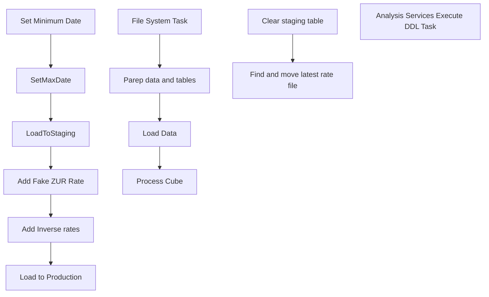

# SSIS Package: Exchange%20Rate%20Upsert

**Project:** Exchange Rate Update  
**Folder:** SSIS  
**Server:** STL-SSIS-P-01  

## Connection Managers

_None detected._

## Control Flow Tasks

| Task | Type |
|---|---|
| Exchange Rate Upsert | Package |
| File System Task | FileSystemTask |
| Load Data | SEQUENCE |
| Add Fake ZUR Rate | Pipeline |
| Add Inverse rates | Pipeline |
| Load  to Production | Pipeline |
| LoadToStaging | Pipeline |
| Set Minimum Date | ExecuteSQLTask |
| SetMaxDate | ExecuteSQLTask |
| Parep data and tables | SEQUENCE |
| Clear staging table | ExecuteSQLTask |
| Find and move latest rate file | ScriptTask |
| Process Cube | SEQUENCE |
| Analysis Services Execute DDL Task | ASExecuteDDLTask |

## Control Flow Outline

```text
- File System Task [FileSystemTask]
- Load Data [SEQUENCE]
  - Add Fake ZUR Rate [Pipeline]
  - Add Inverse rates [Pipeline]
  - Load  to Production [Pipeline]
  - LoadToStaging [Pipeline]
  - Set Minimum Date [ExecuteSQLTask]
  - SetMaxDate [ExecuteSQLTask]
- Parep data and tables [SEQUENCE]
  - Clear staging table [ExecuteSQLTask]
  - Find and move latest rate file [ScriptTask]
- Process Cube [SEQUENCE]
  - Analysis Services Execute DDL Task [ASExecuteDDLTask]
```

## Architecture Diagram



## Variables

| Namespace | Name | Expression-bound |
|---|---|---|
| User | ExchangeRatesFile | Yes |
| User | ExchangerRateXSD | Yes |
| User | MinDate | No |
| User | MxDate | No |

### Expression-bound variable values

#### User::ExchangeRatesFile

**Expression:**

```sql
@[$Project::RateLoadingLocation] +  @[$Project::RateFileName]
```

**Evaluated value:**

```sql
\\Kermode\FileRepository\TestExchangeRates\ExchangeRates.xml
```

#### User::ExchangerRateXSD

**Expression:**

```sql
@[$Project::RateLoadingLocation] +  @[$Project::RateFileXSD]
```

**Evaluated value:**

```sql
\\Kermode\FileRepository\TestExchangeRates\ExchangeRates.xsd
```

## Execute SQL Tasks

### Set Minimum Date

**Path:** `Package\Load Data\Set Minimum Date`  
**Connection:** {39EA5B9D-06E6-42C3-82DF-21F36148E330}  

```sql
select min(Actual_Date) as MinDate  from date_dim
where Cast(fiscal_year as varchar(4)) + right('0' + Cast( fiscal_period as varchar(2)),2)  = (
select Cast(fiscal_year as varchar(4)) + right('0' + Cast( fiscal_period as varchar(2)),2)  from date_dim
where actual_date = 
(select min(Actual_Date) - 1 from date_dim
where Cast(fiscal_year as varchar(4)) + right('0' + Cast( fiscal_period as varchar(2)),2)  = (
select Cast(fiscal_year as varchar(4)) + right('0' + Cast( fiscal_period as varchar(2)),2)  from date_dim
where actual_date Between GetDate() -1 and GetDate())))
```

### SetMaxDate

**Path:** `Package\Load Data\SetMaxDate`  
**Connection:** {39EA5B9D-06E6-42C3-82DF-21F36148E330}  

```sql
select max(Actual_Date)  from date_dim
where Cast(fiscal_year as varchar(4)) + right('0' + Cast( fiscal_period as varchar(2)),2)  = (
select Cast(fiscal_year as varchar(4)) + right('0' + Cast( fiscal_period as varchar(2)),2)  from date_dim
where actual_date = 
(select max(Actual_Date) + 1 from date_dim
where Cast(fiscal_year as varchar(4)) + right('0' + Cast( fiscal_period as varchar(2)),2)  = (
select Cast(fiscal_year as varchar(4)) + right('0' + Cast( fiscal_period as varchar(2)),2)  from date_dim
where actual_date Between GetDate() -1 and GetDate())))
```

### Clear staging table

**Path:** `Package\Parep data and tables\Clear staging table`  
**Connection:** {50B4039E-5143-4DFF-BD2A-A86A26B2DD62}  

```sql
truncate table stagingExchangeRate
```

## Data Flow: Sources

| Component | Source Object | Type | Data Flow Task | Connection | SQL Kind |
|---|---|---|---|---|---|
| OLE DB Source |  | OLEDBSource | Add Fake ZUR Rate | {50B4039E-5143-4DFF-BD2A-A86A26B2DD62}:external | SqlCommand |
| Inverse Rates |  | OLEDBSource | Add Inverse rates | {50B4039E-5143-4DFF-BD2A-A86A26B2DD62}:external | SqlCommand |
| Average and Daily Rates |  | OLEDBSource | Load  to Production | {50B4039E-5143-4DFF-BD2A-A86A26B2DD62}:external | SqlCommand |
| Current Exchange Rates |  | OLEDBSource | Load  to Production | {39EA5B9D-06E6-42C3-82DF-21F36148E330}:external | SqlCommand |
| MonthEndRates |  | OLEDBSource | Load  to Production | {50B4039E-5143-4DFF-BD2A-A86A26B2DD62}:external | SqlCommand |

#### OLE DB Source — SqlCommand

```sql
SELECT        ConversionFactor, EndDate, 'ZUR' as FromCurrency, Rate, RateTypeDescription, RateTypeName, StartDate, ToCurrency
FROM            StagingExchangeRate
WHERE        (FromCurrency = 'eur')
```

#### Inverse Rates — SqlCommand

```sql
select ConversionFactor,EndDate,ToCurrency AS FromCurrency2,1/Rate ASRate,RateTypeDescription,RateTypeName,StartDate,FromCurrency AS ToCurrency2,'Inverse' as InverseFlag
 from StagingExchangeRate 
 Order by StartDate,EndDate,FromCurrency,ToCurrency,RateTypeDescription
```

#### Average and Daily Rates — SqlCommand

```sql
select Actual_Date,FromCurrency,ToCurrency,Rate,RateTypeName
 from 
--truncate table 
stagingExchangeRate E
inner join (select actual_date from papamart.dw.dbo.date_dim where actual_Date between ? and ?) D on (D.Actual_Date between StartDate and EndDate)
Order By Actual_Date,FromCurrency,ToCurrency
```

#### Current Exchange Rates — SqlCommand

```sql
SELECT        exchange_rate_facts_key, date_key, from_currency_key, to_currency_key,actual_date, from_currency_code, to_currency_code, bbw_rate, actual_rate, fiscal_month_ave_rate, fiscal_month_end_rate, 
                         calendar_month_ave_rate, calendar_month_end_rate
FROM            exchange_rate_facts 
where actual_date between ? and ?
ORDER BY actual_date, from_currency_code, to_currency_code
```

#### MonthEndRates — SqlCommand

```sql
with EndRates AS(
select MonthBegDate,MonthEndDate,FromCurrency,ToCurrency,Rate,'MonthEndRate' as RateTypeName
 from 
--truncate table 
stagingExchangeRate E
inner join (select actual_date from papamart.dw.dbo.date_dim where actual_Date between ?  and ?) D on (D.Actual_Date between StartDate and EndDate)
inner join 
 (select fiscal_period,Max(Actual_Date)as MonthEndDate,Min(Actual_Date) as MonthBegDate from papamart.dw.dbo.date_dim where actual_Date between ? and ? group by fiscal_period) D1
  on (D.Actual_Date = D1.MonthEndDate)  where RateTypeName = 'Daily')

  Select 
  Actual_Date,FromCurrency,ToCurrency,Rate,RateTypeName
  from EndRates
  inner join (select actual_date from papamart.dw.dbo.date_dim where actual_Date between ? and ? ) D3 on (D3.Actual_Date between MonthBegDate and MonthEndDate)

Order by   Actual_Date,FromCurrency,ToCurrency
```

## Data Flow: Destinations

| Component | Target Table | Type | Data Flow Task | Connection | SQL Kind |
|---|---|---|---|---|---|
| OLE DB Destination |  | OLEDBDestination | Add Fake ZUR Rate | {50B4039E-5143-4DFF-BD2A-A86A26B2DD62}:external |  |
| OLE DB Destination |  | OLEDBDestination | Add Inverse rates | {50B4039E-5143-4DFF-BD2A-A86A26B2DD62}:external |  |
| Load to table |  | OLEDBDestination | LoadToStaging | {50B4039E-5143-4DFF-BD2A-A86A26B2DD62}:external |  |
