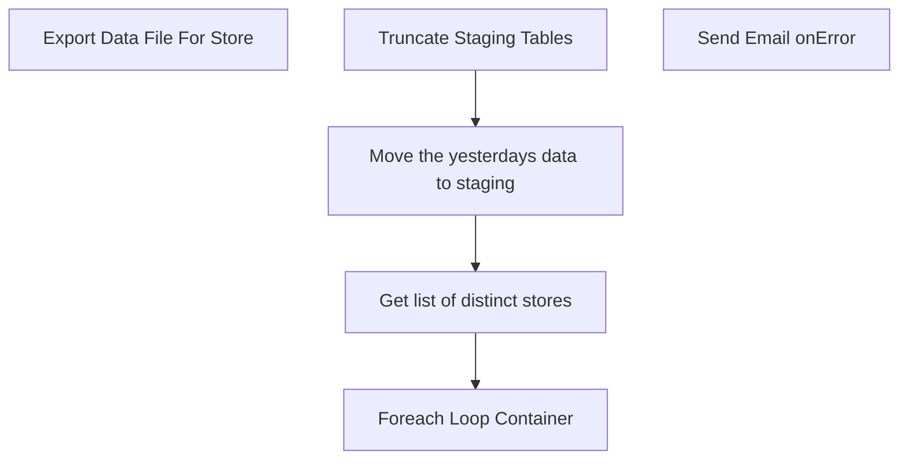

# SSIS Package: Package

**Project:** GenerateTnAReportsForStores  
**Folder:** SSIS  
**Server:** STL-SSIS-P-01  

## Connection Managers

| Name | Type | Server | Catalog | Connection (sanitized) |
|---|---|---|---|---|
| KODIAK.BABWTimeAndAttendance | OLEDB | KODIAK | BABWTimeAndAttendance | Data Source=KODIAK; Initial Catalog=BABWTimeAndAttendance; Provider=SQLNCLI11.1; Integrated Security=SSPI; Auto Translate=False |
| SMTP_EMAIL | SMTP |  |  |  |
| SQL_LOG | OLEDB | stl-ssis-p-01 | msdb | Data Source=stl-ssis-p-01; Initial Catalog=msdb; Provider=SQLNCLI11.1; Integrated Security=SSPI; Auto Translate=False |
| STL-SSIS-P-01.IntegrationStaging | OLEDB | STL-SSIS-P-01 | IntegrationStaging | Data Source=STL-SSIS-P-01; Initial Catalog=IntegrationStaging; Provider=SQLNCLI11.1; Integrated Security=SSPI; Auto Translate=False |
| StoreDataFile | FLATFILE |  |  |  |

## Control Flow Tasks

| Task | Type |
|---|---|
| Package | Package |
| Foreach Loop Container | FOREACHLOOP |
| Export Data File For Store | Pipeline |
| Get list of distinct stores | ExecuteSQLTask |
| Move the yesterdays data to staging | Pipeline |
| Truncate Staging Tables | ExecuteSQLTask |
| Send Email onError | SendMailTask |

## Control Flow Outline

```text
- Send Email onError [SendMailTask]
- Foreach Loop Container [FOREACHLOOP]
  - Export Data File For Store [Pipeline]
- Get list of distinct stores [ExecuteSQLTask]
- Move the yesterdays data to staging [Pipeline]
- Truncate Staging Tables [ExecuteSQLTask]
```

## Architecture Diagram



## Variables

| Namespace | Name | Expression-bound |
|---|---|---|
| System | Propagate | No |
| User | CurrentStore | No |
| User | ListOfStores | No |
| User | StoreDataFileName | Yes |
| User | StoreDataFilePath | No |
| User | TestDate | No |
| User | YesterdaysDate | Yes |

### Expression-bound variable values

#### User::StoreDataFileName

**Expression:**

```sql
(DT_STR, 6, 1252)@[User::CurrentStore]+"Labor"+(DT_STR, 4, 1252)DATEPART("yyyy", @[System::ContainerStartTime]) + 
RIGHT("0" + (DT_STR, 2, 1252)DATEPART("mm", @[System::ContainerStartTime]), 2) + 
RIGHT("0" + (DT_STR, 2, 1252)DATEPART("dd", @[System::ContainerStartTime]), 2) + "010000.txt"
```

**Evaluated value:**

```sql
555Labor20170605010000.txt
```

#### User::YesterdaysDate

**Expression:**

```sql
(DT_WSTR,4) DATEPART("yyyy", DATEADD( "d", -1, getdate() ))+"-"+ (DT_WSTR,2) DATEPART("mm", DATEADD( "d", -1, getdate() )) +"-"+ (DT_WSTR,2)DATEPART("dd", DATEADD( "d", -1, getdate() ))
```

**Evaluated value:**

```sql
2017-6-4
```

## Execute SQL Tasks

### Get list of distinct stores

**Path:** `Package\Get list of distinct stores`  
**Connection:** STL-SSIS-P-01.IntegrationStaging (STL-SSIS-P-01/IntegrationStaging)  

```sql
SELECT DISTINCT StoreId
FROM            BABW_TnA_Staging
```

### Truncate Staging Tables

**Path:** `Package\Truncate Staging Tables`  
**Connection:** STL-SSIS-P-01.IntegrationStaging (STL-SSIS-P-01/IntegrationStaging)  

```sql
EXEC	[dbo].[spTruncateTnAStaging]
```

## Data Flow: Sources

| Component | Source Object | Type | Data Flow Task | Connection | SQL Kind |
|---|---|---|---|---|---|
| Staging Table |  | OLEDBSource | Export Data File For Store | STL-SSIS-P-01.IntegrationStaging | SqlCommand |
| sp_GenerateDailyTimeAndAttendanceReport |  | OLEDBSource | Move the yesterdays data to staging | KODIAK.BABWTimeAndAttendance | SqlCommand |

#### Staging Table — SqlCommand

```sql
SELECT        StoreId, POSCode, PunchInTime, PunchOutTime, JobCodeName, Status
FROM            BABW_TnA_Staging
WHERE        (StoreId = ?)
```

#### sp_GenerateDailyTimeAndAttendanceReport — SqlCommand

```sql
EXEC [dbo].[sp_GenerateDailyTimeAndAttendanceReport] @ReportStartDate = ?, @ReportEndDate = ?
```

## Data Flow: Destinations

| Component | Target Table | Type | Data Flow Task | Connection | SQL Kind |
|---|---|---|---|---|---|
| Store Data Filename |  | FlatFileDestination | Export Data File For Store | StoreDataFile |  |
| BABW_TnAStaging |  | OLEDBDestination | Move the yesterdays data to staging | STL-SSIS-P-01.IntegrationStaging |  |
