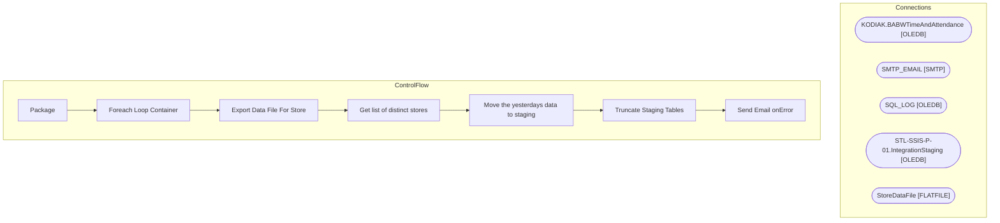

# SSIS Package: Package

**Project:** GenerateTnAReportsForStores  
**Folder:** SSIS  
**Server:** STL-SSIS-P-01  

## Architecture Diagram

## Connection Managers

| Name | Type |
|---|---|
| KODIAK.BABWTimeAndAttendance | OLEDB |
| SMTP_EMAIL | SMTP |
| SQL_LOG | OLEDB |
| STL-SSIS-P-01.IntegrationStaging | OLEDB |
| StoreDataFile | FLATFILE |

## Control Flow Tasks

| Task | Type |
|---|---|
| Package | Microsoft.Package |
| Foreach Loop Container | STOCK:FOREACHLOOP |
| Export Data File For Store | Microsoft.Pipeline |
| Get list of distinct stores | Microsoft.ExecuteSQLTask |
| Move the yesterdays data to staging | Microsoft.Pipeline |
| Truncate Staging Tables | Microsoft.ExecuteSQLTask |
| Send Email onError | Microsoft.SendMailTask |

## Data Flow: Sources

| Component | SQL Preview |
|---|---|
|  | SELECT        StoreId, POSCode, PunchInTime, PunchOutTime, JobCodeName, Status FROM            BABW_TnA_Staging WHERE        (StoreId = ?) |
|  | EXEC [dbo].[sp_GenerateDailyTimeAndAttendanceReport] @ReportStartDate = ?, @ReportEndDate = ? |

## Data Flow: Destinations

| Component | Destination |
|---|---|
|  | [BABW_TnA_Staging] |

