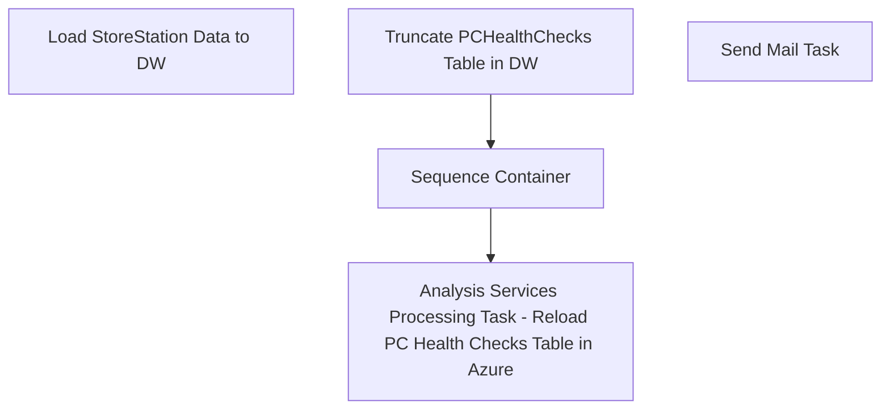

# SSIS Package: PCHealthChecks

**Project:** PCHealthChecks  
**Folder:** SSIS  
**Server:** STL-SSIS-P-01  

## Connection Managers

| Name | Type | Server | Catalog | Connection (sanitized) |
|---|---|---|---|---|
| Azure | MSOLAP100 | asazure://northcentralus.asazure.windows.net/azasp01 | BABW-DW | Data Source=asazure://northcentralus.asazure.windows.net/azasp01; Initial Catalog=BABW-DW; Provider=MSOLAP.8; Impersonation Level=Impersonate |
| DW | OLEDB | papamart | dw | Data Source=papamart; Initial Catalog=dw; Provider=SQLNCLI11.1; Integrated Security=SSPI; Auto Translate=False |
| KODIAK | OLEDB | kodiak | ITOpsEngineering | Data Source=kodiak; Initial Catalog=ITOpsEngineering; Provider=SQLNCLI11.1; Integrated Security=SSPI; Auto Translate=False |
| SMTP | SMTP |  |  |  |

## Control Flow Tasks

| Task | Type |
|---|---|
| PCHealthChecks | Package |
| Analysis Services Processing Task - Reload PC Health Checks Table in Azure | DTSProcessingTask |
| Sequence Container | SEQUENCE |
| Load StoreStation Data to DW | Pipeline |
| Truncate PCHealthChecks Table in DW | ExecuteSQLTask |
| Send Mail Task | SendMailTask |

## Control Flow Outline

```text
- Send Mail Task [SendMailTask]
- Analysis Services Processing Task - Reload PC Health Checks Table in Azure [DTSProcessingTask]
- Sequence Container [SEQUENCE]
  - Load StoreStation Data to DW [Pipeline]
- Truncate PCHealthChecks Table in DW [ExecuteSQLTask]
```

## Architecture Diagram



## Variables

| Namespace | Name | Expression-bound |
|---|---|---|
| System | Propagate | No |
| User | DateTimeStamp | Yes |
| User | EndDate | Yes |
| User | EndDateAsDATE | Yes |
| User | GetDate | Yes |
| User | GetDateAsDATE | Yes |
| User | StartDate | Yes |
| User | StartDateAsDATE | Yes |

### Expression-bound variable values

#### User::DateTimeStamp

**Expression:**

```sql
(DT_WSTR,4)DATEPART("yyyy",GetDate()) 
+ (DT_WSTR,4)DATEPART("mm",GetDate()) 
+ (DT_WSTR,4)DATEPART("dd",GetDate()) 
+ (DT_WSTR,4)DATEPART("hh",GetDate()) 
+ (DT_WSTR,4)DATEPART("mi",GetDate()) 
+ (DT_WSTR,4)DATEPART("ss",GetDate()) 
+ (DT_WSTR,4)DATEPART("ms",GetDate())
```

**Evaluated value:**

```sql
202162510017967
```

#### User::EndDate

**Expression:**

```sql
dateadd("dd", @[$Package::DaysToInclude], @[User::StartDate])
```

**Evaluated value:**

```sql
6/24/2021
```

#### User::EndDateAsDATE

**Expression:**

```sql
(DT_WSTR, 4) datepart("year", @[User::EndDate])  + "-" + 
(DT_WSTR, 2) datepart("mm", @[User::EndDate])  + "-" + 
(DT_WSTR, 2) datepart("dd",  @[User::EndDate])
```

**Evaluated value:**

```sql
2021-6-24
```

#### User::GetDate

**Expression:**

```sql
(DT_DATE)DATEDIFF("Day", (DT_DATE) 0, GETDATE())
```

**Evaluated value:**

```sql
6/25/2021
```

#### User::GetDateAsDATE

**Expression:**

```sql
(DT_WSTR, 4) datepart("year", @[User::GetDate])  + "-" + 
(DT_WSTR, 2) datepart("mm", @[User::GetDate])  + "-" + 
(DT_WSTR, 2) datepart("dd",  @[User::GetDate])
```

**Evaluated value:**

```sql
2021-6-25
```

#### User::StartDate

**Expression:**

```sql
dateadd("dd", -@[$Package::DaysToGoBack] , @[User::GetDate] )
```

**Evaluated value:**

```sql
6/23/2021
```

#### User::StartDateAsDATE

**Expression:**

```sql
(DT_WSTR, 4) datepart("year", @[User::StartDate])  + "-" + 
(DT_WSTR, 2) datepart("mm", @[User::StartDate])  + "-" + 
(DT_WSTR, 2) datepart("dd",  @[User::StartDate])
```

**Evaluated value:**

```sql
2021-6-23
```

## Execute SQL Tasks

### Truncate PCHealthChecks Table in DW

**Path:** `Package\Truncate PCHealthChecks Table in DW`  
**Connection:** DW (papamart/dw)  

```sql
truncate table Azure.PCHealthChecks
```

## Data Flow: Sources

| Component | Source Object | Type | Data Flow Task | Connection | SQL Kind |
|---|---|---|---|---|---|
| Kodiak-ITOpsEngineering-StoreStations |  | OLEDBSource | Load StoreStation Data to DW | KODIAK | SqlCommand |

#### Kodiak-ITOpsEngineering-StoreStations — SqlCommand

```sql
select Hostname,
isnull(Store,SUBSTRING(Hostname,4,4))as Store, 
Role,
Model,
GoPostReportErrors,
GoPostReportWarnings,
(Select top 1 Description from OsdStatusMessages where OsdStatusMessages.HostID=StoreStations.id order by Date desc) Description,
(Select top 1 Status from OsdStatusMessages where OsdStatusMessages.HostID=StoreStations.id order by Date desc) Status,
(Select top 1 Date from OsdStatusMessages where OsdStatusMessages.HostID=StoreStations.id order by Date desc) as DateTime, 
cast ((Select top 1 Date from OsdStatusMessages where OsdStatusMessages.HostID=StoreStations.id order by Date desc) as date) as [Date]
from StoreStations 
where (GoPostReportErrors > 0 or GoPostReportWarnings > 0)
--and Role like 'HearMe%'
order by Hostname
```

## Data Flow: Destinations

| Component | Target Table | Type | Data Flow Task | Connection | SQL Kind |
|---|---|---|---|---|---|
| DW-Azure-PCHealthChecks |  | OLEDBDestination | Load StoreStation Data to DW | DW |  |
