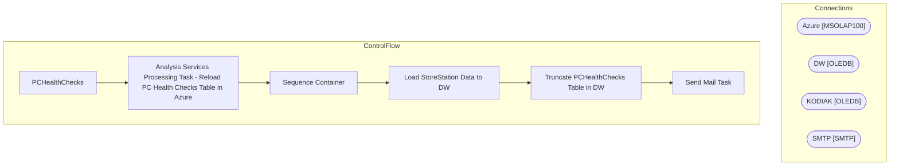

# SSIS Package: PCHealthChecks

**Project:** PCHealthChecks  
**Folder:** SSIS  
**Server:** STL-SSIS-P-01  

## Architecture Diagram

## Connection Managers

| Name | Type |
|---|---|
| Azure | MSOLAP100 |
| DW | OLEDB |
| KODIAK | OLEDB |
| SMTP | SMTP |

## Control Flow Tasks

| Task | Type |
|---|---|
| PCHealthChecks | Microsoft.Package |
| Analysis Services Processing Task - Reload PC Health Checks Table in Azure | Microsoft.DTSProcessingTask |
| Sequence Container | STOCK:SEQUENCE |
| Load StoreStation Data to DW | Microsoft.Pipeline |
| Truncate PCHealthChecks Table in DW | Microsoft.ExecuteSQLTask |
| Send Mail Task | Microsoft.SendMailTask |

## Data Flow: Sources

| Component | SQL Preview |
|---|---|
|  | select Hostname, isnull(Store,SUBSTRING(Hostname,4,4))as Store,  Role, Model, GoPostReportErrors, GoPostReportWarnings, (Select top 1 Description from OsdStatusMessages where OsdStatusMessages.HostID=StoreStations.id order by Date desc) Description, (Select top 1 Status from OsdStatusMessages where OsdStatusMessages.HostID=StoreStations.id order by Date desc) Status, (Select top 1 Date from OsdSta |

## Data Flow: Destinations

| Component | Destination |
|---|---|
|  | [Azure].[PCHealthChecks] |

