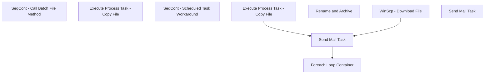

# SSIS Package: PLM_ExtractedFilesProcessing

**Project:** PLM_ExtractedFilesProcessing  
**Folder:** SSIS  
**Server:** STL-SSIS-P-01  

## Connection Managers

| Name | Type | Server | Catalog | Connection (sanitized) |
|---|---|---|---|---|
| IntegrationStaging | OLEDB | stl-ssis-p-01 | IntegrationStaging | Data Source=stl-ssis-p-01; Initial Catalog=IntegrationStaging; Provider=SQLNCLI11.1; Integrated Security=SSPI; Auto Translate=False |
| SMTP | SMTP |  |  |  |

## Control Flow Tasks

| Task | Type |
|---|---|
| PLM_ExtractedFilesProcessing | Package |
| SeqCont - Call Batch File Method | SEQUENCE |
| Execute Process Task - Copy File | ExecuteProcess |
| SeqCont - Scheduled Task Workaround | SEQUENCE |
| Execute Process Task - Copy File | ExecuteProcess |
| Foreach Loop Container | FOREACHLOOP |
| Rename and Archive | FileSystemTask |
| Send Mail Task | SendMailTask |
| WinScp - Download File | ExecuteProcess |
| Send Mail Task | SendMailTask |

## Control Flow Outline

```text
- Send Mail Task [SendMailTask]
- SeqCont - Call Batch File Method [SEQUENCE]
  - Execute Process Task - Copy File [ExecuteProcess]
- SeqCont - Scheduled Task Workaround [SEQUENCE]
  - Execute Process Task - Copy File [ExecuteProcess]
  - Foreach Loop Container [FOREACHLOOP]
    - Rename and Archive [FileSystemTask]
  - Send Mail Task [SendMailTask]
  - WinScp - Download File [ExecuteProcess]
```

## Architecture Diagram



## Variables

| Namespace | Name | Expression-bound |
|---|---|---|
| System | Propagate | No |
| User | ArchiveFileNameAndPath | Yes |
| User | ArchiveFolder | Yes |
| User | DateTimeStamp | Yes |
| User | EndDate | Yes |
| User | EndDateAsDATE | Yes |
| User | FEL_PlmExportedFileName | No |
| User | Fel_FileToBeArchived | No |
| User | GetDate | Yes |
| User | GetDateAsDATE | Yes |
| User | StagingFolderDestination | Yes |
| User | StartDate | Yes |
| User | StartDateAsDATE | Yes |

### Expression-bound variable values

#### User::ArchiveFileNameAndPath

**Expression:**

```sql
@[User::ArchiveFolder]+"CartonDimensions"+ @[User::GetDateAsDATE]+".csv"
```

**Evaluated value:**

```sql
\\Kermode\FileRepository\PLM\CartonDimensions\Archive\CartonDimensions2024-02-26.csv
```

#### User::ArchiveFolder

**Expression:**

```sql
@[User::StagingFolderDestination]+"Archive"+"\\"
```

**Evaluated value:**

```sql
\\Kermode\FileRepository\PLM\CartonDimensions\Archive\
```

#### User::DateTimeStamp

**Expression:**

```sql
(DT_WSTR,4)DATEPART("yyyy",GetDate()) 
+ (DT_WSTR,4)DATEPART("mm",GetDate()) 
+ (DT_WSTR,4)DATEPART("dd",GetDate()) 
+ (DT_WSTR,4)DATEPART("hh",GetDate()) 
+ (DT_WSTR,4)DATEPART("mi",GetDate()) 
+ (DT_WSTR,4)DATEPART("ss",GetDate()) 
+ (DT_WSTR,4)DATEPART("ms",GetDate())
```

**Evaluated value:**

```sql
202422614398413
```

#### User::EndDate

**Expression:**

```sql
dateadd("dd", @[$Package::DaysToInclude], @[User::StartDate])
```

**Evaluated value:**

```sql
2/26/2024
```

#### User::EndDateAsDATE

**Expression:**

```sql
(DT_WSTR, 4) datepart("year", @[User::EndDate])  + "-" +
right("0"+ (DT_WSTR, 2) datepart("mm", @[User::EndDate]),2)  + "-" +
right("0" +(DT_WSTR, 2) datepart("dd",  @[User::EndDate]),2)
```

**Evaluated value:**

```sql
2024-02-26
```

#### User::GetDate

**Expression:**

```sql
(DT_DATE)DATEDIFF("Day", (DT_DATE) 0, GETDATE())
```

**Evaluated value:**

```sql
2/26/2024
```

#### User::GetDateAsDATE

**Expression:**

```sql
(DT_WSTR, 4) datepart("year", @[User::GetDate])  + "-" +
right("0"+ (DT_WSTR, 2) datepart("mm", @[User::GetDate]),2)  + "-" +
right("0" +(DT_WSTR, 2) datepart("dd",  @[User::GetDate]),2)
```

**Evaluated value:**

```sql
2024-02-26
```

#### User::StagingFolderDestination

**Expression:**

```sql
"\\\\"+ @[$Package::FileServer]+@[$Package::FileServerStagingFolder]
```

**Evaluated value:**

```sql
\\Kermode\FileRepository\PLM\CartonDimensions\
```

#### User::StartDate

**Expression:**

```sql
dateadd("dd", -@[$Package::DaysToGoBack] , @[User::GetDate] )
```

**Evaluated value:**

```sql
2/25/2024
```

#### User::StartDateAsDATE

**Expression:**

```sql
(DT_WSTR, 4) datepart("year", @[User::StartDate])  + "-" +
right("0"+ (DT_WSTR, 2) datepart("mm", @[User::StartDate]),2)  + "-" +
right("0" +(DT_WSTR, 2) datepart("dd",  @[User::StartDate]),2)
```

**Evaluated value:**

```sql
2024-02-25
```

## Execute SQL Tasks

_None detected._

## Data Flow: Sources

_None detected._

## Data Flow: Destinations

_None detected._
