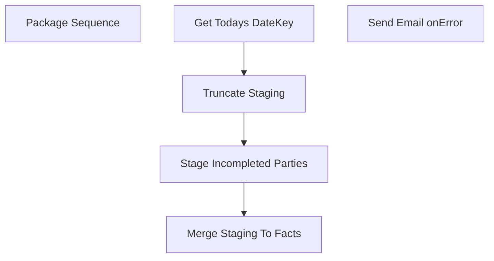

# SSIS Package: MergePartyFacts

**Project:** PartyFacts  
**Folder:** SSIS  
**Server:** STL-SSIS-P-01  

## Connection Managers

| Name | Type | Server | Catalog | Connection (sanitized) |
|---|---|---|---|---|
| BABWPartyPlanner | OLEDB | bearcluster01.sql.buildabear.com | BABWPartyPlanner | Data Source=bearcluster01.sql.buildabear.com; Initial Catalog=BABWPartyPlanner; Provider=SQLNCLI11.1; Integrated Security=SSPI; Auto Translate=False |
| DWStaging | OLEDB | papamart | DWStaging | Data Source=papamart; Initial Catalog=DWStaging; Provider=SQLNCLI11.1; Integrated Security=SSPI; Auto Translate=False |
| PartyRequest | OLEDB | kodiak | PartyRequest | Data Source=kodiak; Initial Catalog=PartyRequest; Provider=SQLNCLI11.1; Integrated Security=SSPI; Auto Translate=False |
| SMTP_EMAIL | SMTP |  |  |  |
| dw | OLEDB | papamart | dw | Data Source=papamart; Initial Catalog=dw; Provider=SQLNCLI11.1; Integrated Security=SSPI; Auto Translate=False |

## Control Flow Tasks

| Task | Type |
|---|---|
| MergePartyFacts | Package |
| Package Sequence | SEQUENCE |
| Get Todays DateKey | ExecuteSQLTask |
| Merge Staging To Facts | ExecuteSQLTask |
| Stage Incompleted Parties | Pipeline |
| Truncate Staging | ExecuteSQLTask |
| Send Email onError | SendMailTask |

## Control Flow Outline

```text
- Send Email onError [SendMailTask]
- Package Sequence [SEQUENCE]
  - Get Todays DateKey [ExecuteSQLTask]
  - Merge Staging To Facts [ExecuteSQLTask]
  - Stage Incompleted Parties [Pipeline]
  - Truncate Staging [ExecuteSQLTask]
```

## Architecture Diagram



## Variables

| Namespace | Name | Expression-bound |
|---|---|---|
| System | Propagate | No |
| User | TodayDateKey | No |
| User | sqlPullIncompletedParties | Yes |

### Expression-bound variable values

#### User::sqlPullIncompletedParties

**Expression:**

```sql
"WITH ValidPMR AS (
	 SELECT MAX(PartyID) as PMRNumber, 
			CAST(CAST(EventID AS FLOAT) AS INT) AS EventID
	 FROM PartyRequest.dbo.Party
	 WHERE (ISNUMERIC(EventID) = 1) 
	 AND (EventID <> '1111111111111111111111111111111111')
	 GROUP BY CAST(CAST(EventID AS FLOAT) AS INT)
)


SELECT party.*,
	   pmr.PMRNumber
FROM BABWPartyPlanner.dbo.vwDWPartyFacts party
LEFT JOIN ValidPMR pmr
	ON party.PartyID = pmr.EventID
WHERE party.ExecuteDateKey > "  +  @[User::TodayDateKey]
```

**Evaluated value:**

```sql
WITH ValidPMR AS (
	 SELECT MAX(PartyID) as PMRNumber, 
			CAST(CAST(EventID AS FLOAT) AS INT) AS EventID
	 FROM PartyRequest.dbo.Party
	 WHERE (ISNUMERIC(EventID) = 1) 
	 AND (EventID <> '1111111111111111111111111111111111')
	 GROUP BY CAST(CAST(EventID AS FLOAT) AS INT)
)


SELECT party.*,
	   pmr.PMRNumber
FROM BABWPartyPlanner.dbo.vwDWPartyFacts party
LEFT JOIN ValidPMR pmr
	ON party.PartyID = pmr.EventID
WHERE party.ExecuteDateKey > 1234
```

## Execute SQL Tasks

### Get Todays DateKey

**Path:** `Package\Package Sequence\Get Todays DateKey`  
**Connection:** dw (papamart/dw)  

```sql
SELECT date_key FROM papamart.dw.dbo.date_dim WHERE actual_date = CAST(GETDATE() as Date)
```

### Merge Staging To Facts

**Path:** `Package\Package Sequence\Merge Staging To Facts`  
**Connection:** dw (papamart/dw)  

```sql
exec spPartyFactsMergeFromStaging
```

### Truncate Staging

**Path:** `Package\Package Sequence\Truncate Staging`  
**Connection:** DWStaging (papamart/DWStaging)  

```sql
TRUNCATE TABLE PartyFacts_Staging;
```

## Data Flow: Sources

| Component | Source Object | Type | Data Flow Task | Connection | SQL Kind |
|---|---|---|---|---|---|
| Incompleted Parties |  | OLEDBSource | Stage Incompleted Parties | BABWPartyPlanner | SqlCommand |

#### Incompleted Parties — SqlCommand

```sql
select *
from vwDWPartyFacts
where ExecuteDateKey > 1234
```

## Data Flow: Destinations

| Component | Target Table | Type | Data Flow Task | Connection | SQL Kind |
|---|---|---|---|---|---|
| Staging |  | OLEDBDestination | Stage Incompleted Parties | DWStaging |  |
