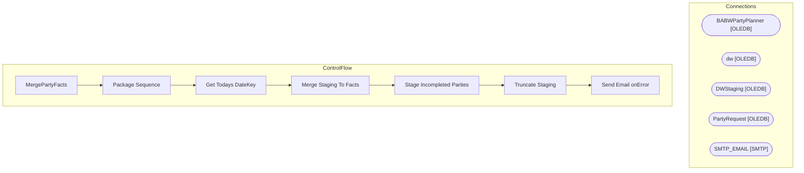

# SSIS Package: MergePartyFacts

**Project:** PartyFacts  
**Folder:** SSIS  
**Server:** STL-SSIS-P-01  

## Architecture Diagram

## Connection Managers

| Name | Type |
|---|---|
| BABWPartyPlanner | OLEDB |
| dw | OLEDB |
| DWStaging | OLEDB |
| PartyRequest | OLEDB |
| SMTP_EMAIL | SMTP |

## Control Flow Tasks

| Task | Type |
|---|---|
| MergePartyFacts | Microsoft.Package |
| Package Sequence | STOCK:SEQUENCE |
| Get Todays DateKey | Microsoft.ExecuteSQLTask |
| Merge Staging To Facts | Microsoft.ExecuteSQLTask |
| Stage Incompleted Parties | Microsoft.Pipeline |
| Truncate Staging | Microsoft.ExecuteSQLTask |
| Send Email onError | Microsoft.SendMailTask |

## Data Flow: Sources

| Component | SQL Preview |
|---|---|
|  | select * from vwDWPartyFacts where ExecuteDateKey > 1234 |
|  | SELECT  	MAX(PartyID) as PMRNumber,  	CAST(CAST(EventID AS FLOAT) AS INT) AS EventID FROM KODIAK.PartyRequest.dbo.Party WHERE 1=1 and (ISNUMERIC(EventID) = 1)  and  EventID not like '%.%' AND (EventID <> '1111111111111111111111111111111111') and cast(cast(EventID as float) as bigint) <= 2147483647 --biggest int GROUP BY CAST(CAST(EventID AS FLOAT) AS INT) |

## Data Flow: Destinations

| Component | Destination |
|---|---|
|  | [dbo].[vwDWPartyFacts] |
|  | [dbo].[PartyFacts_Staging] |

