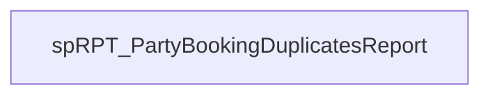

# SSIS Package: PartyDupes

**Project:** PartyReports  
**Folder:** SSIS  
**Server:** STL-SSIS-P-01  

## Connection Managers

| Name | Type | Server | Catalog | Connection (sanitized) |
|---|---|---|---|---|
| stl-sqlaag-p-01.BABWPartyPlanner | OLEDB | stl-sqlaag-p-01 | BABWPartyPlanner | Data Source=stl-sqlaag-p-01; Initial Catalog=BABWPartyPlanner; Provider=SQLNCLI11.1; Integrated Security=SSPI; Auto Translate=False |

## Control Flow Tasks

| Task | Type |
|---|---|
| PartyDupes | Package |
| spRPT_PartyBookingDuplicatesReport | ExecuteSQLTask |

## Control Flow Outline

```text
- spRPT_PartyBookingDuplicatesReport [ExecuteSQLTask]
```

## Architecture Diagram



## Variables

_None detected._

## Execute SQL Tasks

### spRPT_PartyBookingDuplicatesReport

**Path:** `Package\spRPT_PartyBookingDuplicatesReport`  
**Connection:** stl-sqlaag-p-01.BABWPartyPlanner (stl-sqlaag-p-01/BABWPartyPlanner)  

```sql
exec spRPT_PartyBookingDuplicatesReport @ac_recipients = 'KevinPa@buildabear.com;Develobears@buildabear.com;ArtH@buildabear.com;SheelaA@buildabear.com;'
```

## Data Flow: Sources

_None detected._

## Data Flow: Destinations

_None detected._
