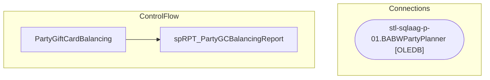

# SSIS Package: PartyGiftCardBalancing

**Project:** PartyReports  
**Folder:** SSIS  
**Server:** STL-SSIS-P-01  

## Architecture Diagram

## Connection Managers

| Name | Type |
|---|---|
| stl-sqlaag-p-01.BABWPartyPlanner | OLEDB |

## Control Flow Tasks

| Task | Type |
|---|---|
| PartyGiftCardBalancing | Microsoft.Package |
| spRPT_PartyGCBalancingReport | Microsoft.ExecuteSQLTask |

## Data Flow: Sources

_None detected._

## Data Flow: Destinations

_None detected._

