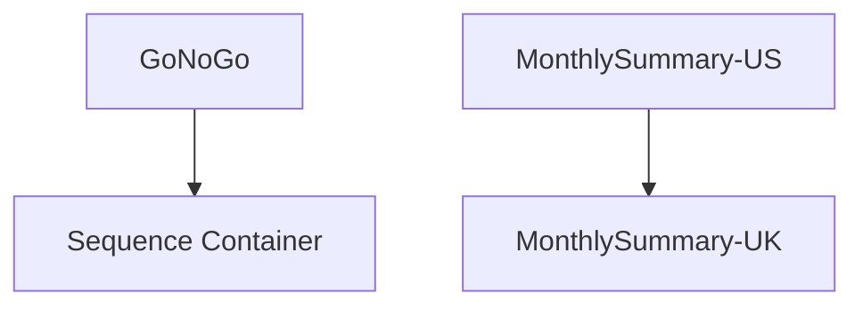

# SSIS Package: PartyMonthly

**Project:** PartyReports  
**Folder:** SSIS  
**Server:** STL-SSIS-P-01  

## Connection Managers

| Name | Type | Server | Catalog | Connection (sanitized) |
|---|---|---|---|---|
| dw | OLEDB | papamart | dw | Data Source=papamart; Initial Catalog=dw; Provider=SQLNCLI11.1; Integrated Security=SSPI; Auto Translate=False |
| stl-sqlaag-p-01.BABWPartyPlanner | OLEDB | stl-sqlaag-p-01 | BABWPartyPlanner | Data Source=stl-sqlaag-p-01; Initial Catalog=BABWPartyPlanner; Provider=SQLNCLI11.1; Integrated Security=SSPI; Auto Translate=False |

## Control Flow Tasks

| Task | Type |
|---|---|
| PartyMonthly | Package |
| GoNoGo | ExecuteSQLTask |
| Sequence Container | SEQUENCE |
| MonthlySummary-UK | ExecuteSQLTask |
| MonthlySummary-US | ExecuteSQLTask |

## Control Flow Outline

```text
- GoNoGo [ExecuteSQLTask]
- Sequence Container [SEQUENCE]
  - MonthlySummary-UK [ExecuteSQLTask]
  - MonthlySummary-US [ExecuteSQLTask]
```

## Architecture Diagram



## Variables

| Namespace | Name | Expression-bound |
|---|---|---|
| User | GO | No |

## Execute SQL Tasks

### GoNoGo

**Path:** `Package\GoNoGo`  
**Connection:** dw (papamart/dw)  

```sql
select 
	case 
		when cast(getdate() as date) in (select Date from vwDW_date_dim_FirstDateOfFiscalMonth) 
		then 1
		else 0
	end as GoNoGo
```

### MonthlySummary-UK

**Path:** `Package\Sequence Container\MonthlySummary-UK`  
**Connection:** stl-sqlaag-p-01.BABWPartyPlanner (stl-sqlaag-p-01/BABWPartyPlanner)  

```sql
exec spRPT_PartyBookingMonthlySummary 'BABW_UK','PartyReportsUK@buildabear.com'
```

### MonthlySummary-US

**Path:** `Package\Sequence Container\MonthlySummary-US`  
**Connection:** stl-sqlaag-p-01.BABWPartyPlanner (stl-sqlaag-p-01/BABWPartyPlanner)  

```sql
exec spRPT_PartyBookingMonthlySummary 'BABW_US','PartyReportsUS@buildabear.com'
```

## Data Flow: Sources

_None detected._

## Data Flow: Destinations

_None detected._
