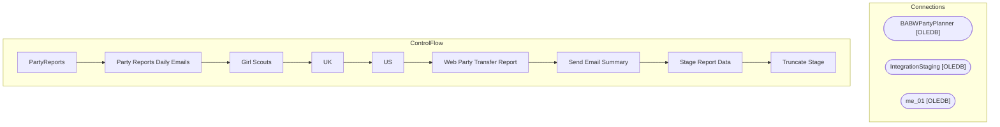

# SSIS Package: PartyReports

**Project:** PartyReports  
**Folder:** SSIS  
**Server:** STL-SSIS-P-01  

## Architecture Diagram

## Connection Managers

| Name | Type |
|---|---|
| BABWPartyPlanner | OLEDB |
| IntegrationStaging | OLEDB |
| me_01 | OLEDB |

## Control Flow Tasks

| Task | Type |
|---|---|
| PartyReports | Microsoft.Package |
| Party Reports Daily Emails | STOCK:SEQUENCE |
| Girl Scouts | Microsoft.ExecuteSQLTask |
| UK | Microsoft.ExecuteSQLTask |
| US | Microsoft.ExecuteSQLTask |
| Web Party Transfer Report | STOCK:SEQUENCE |
| Send Email Summary | Microsoft.ExecuteSQLTask |
| Stage Report Data | Microsoft.Pipeline |
| Truncate Stage | Microsoft.ExecuteSQLTask |

## Data Flow: Sources

_None detected._

## Data Flow: Destinations

| Component | Destination |
|---|---|
|  | [WEB].[PartyTransferOrdersShipped] |
|  | [WEB].[vwPartyWebOrdersShipped] |

