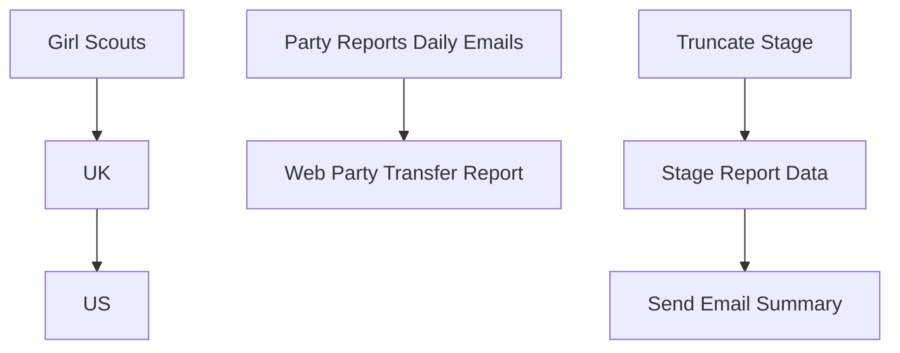

# SSIS Package: PartyReports

**Project:** PartyReports  
**Folder:** SSIS  
**Server:** STL-SSIS-P-01  

## Connection Managers

| Name | Type | Server | Catalog | Connection (sanitized) |
|---|---|---|---|---|
| BABWPartyPlanner | OLEDB | stl-sqlaag-p-01 | BABWPartyPlanner | Data Source=stl-sqlaag-p-01; Initial Catalog=BABWPartyPlanner; Provider=SQLNCLI11.1; Integrated Security=SSPI; Auto Translate=False |
| IntegrationStaging | OLEDB | STL-SSIS-P-01 | IntegrationStaging | Data Source=STL-SSIS-P-01; Initial Catalog=IntegrationStaging; Provider=SQLNCLI11.1; Integrated Security=SSPI; Auto Translate=False |
| me_01 | OLEDB | bedrockdb02 | me_01 | Data Source=bedrockdb02; Initial Catalog=me_01; Provider=SQLNCLI11.1; Integrated Security=SSPI; Auto Translate=False |

## Control Flow Tasks

| Task | Type |
|---|---|
| PartyReports | Package |
| Party Reports Daily Emails | SEQUENCE |
| Girl Scouts | ExecuteSQLTask |
| UK | ExecuteSQLTask |
| US | ExecuteSQLTask |
| Web Party Transfer Report | SEQUENCE |
| Send Email Summary | ExecuteSQLTask |
| Stage Report Data | Pipeline |
| Truncate Stage | ExecuteSQLTask |

## Control Flow Outline

```text
- Party Reports Daily Emails [SEQUENCE]
  - Girl Scouts [ExecuteSQLTask]
  - UK [ExecuteSQLTask]
  - US [ExecuteSQLTask]
- Web Party Transfer Report [SEQUENCE]
  - Send Email Summary [ExecuteSQLTask]
  - Stage Report Data [Pipeline]
  - Truncate Stage [ExecuteSQLTask]
```

## Architecture Diagram



## Variables

_None detected._

## Execute SQL Tasks

### Girl Scouts

**Path:** `Package\Party Reports Daily Emails\Girl Scouts`  
**Connection:** BABWPartyPlanner (stl-sqlaag-p-01/BABWPartyPlanner)  

```sql
exec spRPT_GSPartyBookingsReportDaily

```

### UK

**Path:** `Package\Party Reports Daily Emails\UK`  
**Connection:** BABWPartyPlanner (stl-sqlaag-p-01/BABWPartyPlanner)  

```sql
exec spRPT_PartyBookingSummaryDailyUK 'PartyReportsUK@buildabear.com'
```

### US

**Path:** `Package\Party Reports Daily Emails\US`  
**Connection:** BABWPartyPlanner (stl-sqlaag-p-01/BABWPartyPlanner)  

```sql
exec spRPT_PartyBookingSummaryDailyUS 'PartyReportsUS@buildabear.com'
```

### Send Email Summary

**Path:** `Package\Web Party Transfer Report\Send Email Summary`  
**Connection:** IntegrationStaging (STL-SSIS-P-01/IntegrationStaging)  

```sql
exec web.spEmailPartyWebOrderShippedSummary
```

### Truncate Stage

**Path:** `Package\Web Party Transfer Report\Truncate Stage`  
**Connection:** IntegrationStaging (STL-SSIS-P-01/IntegrationStaging)  

```sql
Truncate Table WEB.PartyTransferOrdersShipped
```

## Data Flow: Sources

| Component | Source Object | Type | Data Flow Task | Connection | SQL Kind |
|---|---|---|---|---|---|
| vwPartyWebOrdersShipped |  | OLEDBSource | Stage Report Data | IntegrationStaging |  |

## Data Flow: Destinations

| Component | Target Table | Type | Data Flow Task | Connection | SQL Kind |
|---|---|---|---|---|---|
| PartyTransferOrdersShipped |  | OLEDBDestination | Stage Report Data | IntegrationStaging |  |
