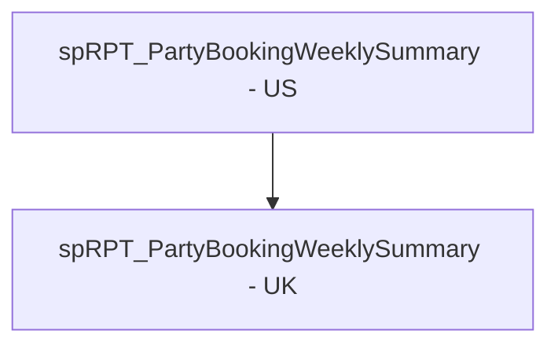

# SSIS Package: PartyWeekly

**Project:** PartyReports  
**Folder:** SSIS  
**Server:** STL-SSIS-P-01  

## Connection Managers

| Name | Type | Server | Catalog | Connection (sanitized) |
|---|---|---|---|---|
| stl-sqlaag-p-01.BABWPartyPlanner | OLEDB | stl-sqlaag-p-01 | BABWPartyPlanner | Data Source=stl-sqlaag-p-01; Initial Catalog=BABWPartyPlanner; Provider=SQLNCLI11.1; Integrated Security=SSPI; Auto Translate=False |

## Control Flow Tasks

| Task | Type |
|---|---|
| PartyWeekly | Package |
| spRPT_PartyBookingWeeklySummary - UK | ExecuteSQLTask |
| spRPT_PartyBookingWeeklySummary - US | ExecuteSQLTask |

## Control Flow Outline

```text
- spRPT_PartyBookingWeeklySummary - UK [ExecuteSQLTask]
- spRPT_PartyBookingWeeklySummary - US [ExecuteSQLTask]
```

## Architecture Diagram



## Variables

_None detected._

## Execute SQL Tasks

### spRPT_PartyBookingWeeklySummary - UK

**Path:** `Package\spRPT_PartyBookingWeeklySummary - UK`  
**Connection:** stl-sqlaag-p-01.BABWPartyPlanner (stl-sqlaag-p-01/BABWPartyPlanner)  

```sql
exec spRPT_PartyBookingWeeklySummary 'BABW_UK','PartyReportsUK@buildabear.com'
```

### spRPT_PartyBookingWeeklySummary - US

**Path:** `Package\spRPT_PartyBookingWeeklySummary - US`  
**Connection:** stl-sqlaag-p-01.BABWPartyPlanner (stl-sqlaag-p-01/BABWPartyPlanner)  

```sql
exec spRPT_PartyBookingWeeklySummary 'BABW_US','PartyReportsUS@buildabear.com'
```

## Data Flow: Sources

_None detected._

## Data Flow: Destinations

_None detected._
