# SSIS Package: PartyRequestETl

**Project:** PartyRequestETL  
**Folder:** SSIS  
**Server:** STL-SSIS-P-01  

## Architecture Diagram

```mermaid
flowchart TD
    subgraph Connections
        BABWMstrData_conn(["BABWMstrData [OLEDB]"])
        me_01_conn(["me_01 [OLEDB]"])
        PartyRequest_conn(["PartyRequest [OLEDB]"])
        SMTP_conn(["SMTP [SMTP]"])
    end
    subgraph ControlFlow
        PartyRequestETl_task["PartyRequestETl"]
        Sequence_Container___Stores_task["Sequence Container - Stores"]
        PartyRequestETl_task --> Sequence_Container___Stores_task
        Data_Flow_Task___Store_Data_to_Staging_Table_task["Data Flow Task - Store Data to Staging Table"]
        Sequence_Container___Stores_task --> Data_Flow_Task___Store_Data_to_Staging_Table_task
        Execute_SQL_Task____Merge_Store_Data_task["Execute SQL Task  - Merge Store Data"]
        Data_Flow_Task___Store_Data_to_Staging_Table_task --> Execute_SQL_Task____Merge_Store_Data_task
        Execute_SQL_Task___Populate_Store_Working_Table_task["Execute SQL Task - Populate Store Working Table"]
        Execute_SQL_Task____Merge_Store_Data_task --> Execute_SQL_Task___Populate_Store_Working_Table_task
        Truncate_StoreStage_task["Truncate StoreStage"]
        Execute_SQL_Task___Populate_Store_Working_Table_task --> Truncate_StoreStage_task
        Sequence_Container___Styles_task["Sequence Container - Styles"]
        Truncate_StoreStage_task --> Sequence_Container___Styles_task
        Data_Flow_Task___Style_Data_to_Staging_Table_task["Data Flow Task - Style Data to Staging Table"]
        Sequence_Container___Styles_task --> Data_Flow_Task___Style_Data_to_Staging_Table_task
        Execute_SQL_Task___Merge_Style_Data_task["Execute SQL Task - Merge Style Data"]
        Data_Flow_Task___Style_Data_to_Staging_Table_task --> Execute_SQL_Task___Merge_Style_Data_task
        Execute_SQL_Task___Populate_Styles_Working_Table_task["Execute SQL Task - Populate Styles Working Table"]
        Execute_SQL_Task___Merge_Style_Data_task --> Execute_SQL_Task___Populate_Styles_Working_Table_task
        Truncate_StyleStage_task["Truncate StyleStage"]
        Execute_SQL_Task___Populate_Styles_Working_Table_task --> Truncate_StyleStage_task
        Send_Mail_Task_task["Send Mail Task"]
        Truncate_StyleStage_task --> Send_Mail_Task_task
    end
```

## Connection Managers

| Name | Type |
|---|---|
| BABWMstrData | OLEDB |
| me_01 | OLEDB |
| PartyRequest | OLEDB |
| SMTP | SMTP |

## Control Flow Tasks

| Task | Type |
|---|---|
| PartyRequestETl | Microsoft.Package |
| Sequence Container - Stores | STOCK:SEQUENCE |
| Data Flow Task - Store Data to Staging Table | Microsoft.Pipeline |
| Execute SQL Task  - Merge Store Data | Microsoft.ExecuteSQLTask |
| Execute SQL Task - Populate Store Working Table | Microsoft.ExecuteSQLTask |
| Truncate StoreStage | Microsoft.ExecuteSQLTask |
| Sequence Container - Styles | STOCK:SEQUENCE |
| Data Flow Task - Style Data to Staging Table | Microsoft.Pipeline |
| Execute SQL Task - Merge Style Data | Microsoft.ExecuteSQLTask |
| Execute SQL Task - Populate Styles Working Table | Microsoft.ExecuteSQLTask |
| Truncate StyleStage | Microsoft.ExecuteSQLTask |
| Send Mail Task | Microsoft.SendMailTask |

## Data Flow: Sources

| Component | SQL Preview |
|---|---|
|  | SELECT STR_ID, STR_NUM, NM_FULL, DeliveryDay, DistroDay, DC_ID FROM BABWMstrData.dbo.tmpPartyManager_Stores  ORDER BY 2 |
|  | SELECT StyleCode, CAST(active_flag AS BIT) active_flag, short_desc, hierarchy_group_code, total_on_hand_units, allocated, available_to_distribute  FROM tmpPartyManager_Styles ORDER BY StyleCode |

## Data Flow: Destinations

| Component | Destination |
|---|---|
|  | [dbo].[StoreStage] |
|  | [dbo].[StyleStage] |

