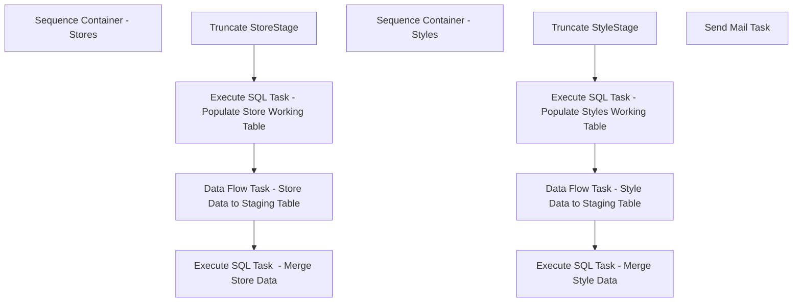

# SSIS Package: PartyRequestETl

**Project:** PartyRequestETL  
**Folder:** SSIS  
**Server:** STL-SSIS-P-01  

## Connection Managers

| Name | Type | Server | Catalog | Connection (sanitized) |
|---|---|---|---|---|
| BABWMstrData | OLEDB | KODIAK | BABWMstrData | Data Source=KODIAK; Initial Catalog=BABWMstrData; Provider=SQLNCLI11.1; Integrated Security=SSPI; Auto Translate=False |
| PartyRequest | OLEDB | KODIAK | PartyRequest | Data Source=KODIAK; Initial Catalog=PartyRequest; Provider=SQLNCLI11.1; Integrated Security=SSPI; Auto Translate=False |
| SMTP | SMTP |  |  |  |
| me_01 | OLEDB | BEDROCKDB02 | me_01 | Data Source=BEDROCKDB02; Initial Catalog=me_01; Provider=SQLNCLI11.1; Integrated Security=SSPI; Auto Translate=False |

## Control Flow Tasks

| Task | Type |
|---|---|
| PartyRequestETl | Package |
| Sequence Container - Stores | SEQUENCE |
| Data Flow Task - Store Data to Staging Table | Pipeline |
| Execute SQL Task  - Merge Store Data | ExecuteSQLTask |
| Execute SQL Task - Populate Store Working Table | ExecuteSQLTask |
| Truncate StoreStage | ExecuteSQLTask |
| Sequence Container - Styles | SEQUENCE |
| Data Flow Task - Style Data to Staging Table | Pipeline |
| Execute SQL Task - Merge Style Data | ExecuteSQLTask |
| Execute SQL Task - Populate Styles Working Table | ExecuteSQLTask |
| Truncate StyleStage | ExecuteSQLTask |
| Send Mail Task | SendMailTask |

## Control Flow Outline

```text
- Send Mail Task [SendMailTask]
- Sequence Container - Stores [SEQUENCE]
  - Data Flow Task - Store Data to Staging Table [Pipeline]
  - Execute SQL Task  - Merge Store Data [ExecuteSQLTask]
  - Execute SQL Task - Populate Store Working Table [ExecuteSQLTask]
  - Truncate StoreStage [ExecuteSQLTask]
- Sequence Container - Styles [SEQUENCE]
  - Data Flow Task - Style Data to Staging Table [Pipeline]
  - Execute SQL Task - Merge Style Data [ExecuteSQLTask]
  - Execute SQL Task - Populate Styles Working Table [ExecuteSQLTask]
  - Truncate StyleStage [ExecuteSQLTask]
```

## Architecture Diagram



## Variables

| Namespace | Name | Expression-bound |
|---|---|---|
| System | Propagate | No |
| User | DateTimeStamp | Yes |
| User | EndDate | Yes |
| User | EndDateAsDATE | Yes |
| User | GetDate | Yes |
| User | GetDateAsDATE | Yes |
| User | StartDate | Yes |
| User | StartDateAsDATE | Yes |

### Expression-bound variable values

#### User::DateTimeStamp

**Expression:**

```sql
(DT_WSTR,4)DATEPART("yyyy",GetDate()) 
+ (DT_WSTR,4)DATEPART("mm",GetDate()) 
+ (DT_WSTR,4)DATEPART("dd",GetDate()) 
+ (DT_WSTR,4)DATEPART("hh",GetDate()) 
+ (DT_WSTR,4)DATEPART("mi",GetDate()) 
+ (DT_WSTR,4)DATEPART("ss",GetDate()) 
+ (DT_WSTR,4)DATEPART("ms",GetDate())
```

**Evaluated value:**

```sql
20211018212916550
```

#### User::EndDate

**Expression:**

```sql
dateadd("dd", @[$Package::DaysToInclude], @[User::StartDate])
```

**Evaluated value:**

```sql
10/5/2021
```

#### User::EndDateAsDATE

**Expression:**

```sql
(DT_WSTR, 4) datepart("year", @[User::EndDate])  + "-" +
right("0"+ (DT_WSTR, 2) datepart("mm", @[User::EndDate]),2)  + "-" +
right("0" +(DT_WSTR, 2) datepart("dd",  @[User::EndDate]),2)
```

**Evaluated value:**

```sql
2021-10-05
```

#### User::GetDate

**Expression:**

```sql
(DT_DATE)DATEDIFF("Day", (DT_DATE) 0, GETDATE())
```

**Evaluated value:**

```sql
10/18/2021
```

#### User::GetDateAsDATE

**Expression:**

```sql
(DT_WSTR, 4) datepart("year", @[User::GetDate])  + "-" +
right("0"+ (DT_WSTR, 2) datepart("mm", @[User::GetDate]),2)  + "-" +
right("0" +(DT_WSTR, 2) datepart("dd",  @[User::GetDate]),2)
```

**Evaluated value:**

```sql
2021-10-18
```

#### User::StartDate

**Expression:**

```sql
dateadd("dd", -@[$Package::DaysToGoBack] , @[User::GetDate] )
```

**Evaluated value:**

```sql
10/4/2021
```

#### User::StartDateAsDATE

**Expression:**

```sql
(DT_WSTR, 4) datepart("year", @[User::StartDate])  + "-" +
right("0"+ (DT_WSTR, 2) datepart("mm", @[User::StartDate]),2)  + "-" +
right("0" +(DT_WSTR, 2) datepart("dd",  @[User::StartDate]),2)
```

**Evaluated value:**

```sql
2021-10-04
```

## Execute SQL Tasks

### Execute SQL Task  - Merge Store Data

**Path:** `Package\Sequence Container - Stores\Execute SQL Task  - Merge Store Data`  
**Connection:** PartyRequest (KODIAK/PartyRequest)  

```sql
exec spMergePartyRequestStores
```

### Execute SQL Task - Populate Store Working Table

**Path:** `Package\Sequence Container - Stores\Execute SQL Task - Populate Store Working Table`  
**Connection:** BABWMstrData (KODIAK/BABWMstrData)  

```sql
EXEC dbo.spPartyManager_ActiveStores
```

### Truncate StoreStage

**Path:** `Package\Sequence Container - Stores\Truncate StoreStage`  
**Connection:** PartyRequest (KODIAK/PartyRequest)  

```sql
truncate table StoreStage

```

### Execute SQL Task - Merge Style Data

**Path:** `Package\Sequence Container - Styles\Execute SQL Task - Merge Style Data`  
**Connection:** PartyRequest (KODIAK/PartyRequest)  

```sql
exec spMergePartyRequestStyles
```

### Execute SQL Task - Populate Styles Working Table

**Path:** `Package\Sequence Container - Styles\Execute SQL Task - Populate Styles Working Table`  
**Connection:** me_01 (BEDROCKDB02/me_01)  

```sql
EXEC dbo.spPartyManager_ActiveDistro
```

### Truncate StyleStage

**Path:** `Package\Sequence Container - Styles\Truncate StyleStage`  
**Connection:** PartyRequest (KODIAK/PartyRequest)  

```sql
truncate table StyleStage
```

## Data Flow: Sources

| Component | Source Object | Type | Data Flow Task | Connection | SQL Kind |
|---|---|---|---|---|---|
| OLE DB Source - tmpPartyManager_Stores |  | OLEDBSource | Data Flow Task - Store Data to Staging Table | BABWMstrData | SqlCommand |
| OLE DB Source - tmpPartyManager_Styles |  | OLEDBSource | Data Flow Task - Style Data to Staging Table | me_01 | SqlCommand |

#### OLE DB Source - tmpPartyManager_Stores — SqlCommand

```sql
SELECT STR_ID, STR_NUM, NM_FULL, DeliveryDay, DistroDay, DC_ID
FROM BABWMstrData.dbo.tmpPartyManager_Stores 
ORDER BY 2
```

#### OLE DB Source - tmpPartyManager_Styles — SqlCommand

```sql
SELECT StyleCode, CAST(active_flag AS BIT) active_flag, short_desc, hierarchy_group_code, total_on_hand_units, allocated, available_to_distribute 
FROM tmpPartyManager_Styles
ORDER BY StyleCode
```

## Data Flow: Destinations

| Component | Target Table | Type | Data Flow Task | Connection | SQL Kind |
|---|---|---|---|---|---|
| OLE DB Destination - StoreStage |  | OLEDBDestination | Data Flow Task - Store Data to Staging Table | PartyRequest |  |
| OLE DB Destination - StyleStage |  | OLEDBDestination | Data Flow Task - Style Data to Staging Table | PartyRequest |  |
