# SSIS Package: MerchDataLoad

**Project:** PowerBILoad  
**Folder:** SSIS  
**Server:** STL-SSIS-P-01  

## Connection Managers

_None detected._

## Control Flow Tasks

| Task | Type |
|---|---|
| MerchDataLoad | Package |
| Clear PO Data | ExecuteSQLTask |
| Load PO Headers | Pipeline |
| Load Product Atrributes | Pipeline |
| Sequence Container | SEQUENCE |
| CreateCacheFiles | Pipeline |
| Load On Order (new) | Pipeline |
| Load On Order (orig) | Pipeline |
| Load Sales | Pipeline |
| Load Style Attributes | Pipeline |
| Sequence Container 1 | SEQUENCE |
| Data Flow Task | Pipeline |
| Data Flow Task 1 | Pipeline |
| Data Flow Task 1 1 | Pipeline |
| Data Flow Task 2 | Pipeline |
| Load Dummy records | ExecuteSQLTask |
| Sequence Container 2 | SEQUENCE |
| Data Flow Task | Pipeline |
| Data Flow Task 1 | Pipeline |
| Data Flow Task 2 | Pipeline |
| Set Parameters | SEQUENCE |
| Assign EndYear | ExecuteSQLTask |
| AssignBegWeek1 | ExecuteSQLTask |
| AssignBegWeek2 | ExecuteSQLTask |
| AssignBegYear | ExecuteSQLTask |
| AssignEndWeek1 | ExecuteSQLTask |
| AssignEndWeek2 | ExecuteSQLTask |
| AssignEndWeek3 | ExecuteSQLTask |
| Send Mail Task | SendMailTask |

## Control Flow Outline

```text
- Send Mail Task [SendMailTask]
- Clear PO Data [ExecuteSQLTask]
- Load PO Headers [Pipeline]
- Load Product Atrributes [Pipeline]
- Sequence Container [SEQUENCE]
  - CreateCacheFiles [Pipeline]
  - Load On Order (new) [Pipeline]
  - Load On Order (orig) [Pipeline]
  - Load Sales [Pipeline]
  - Load Style Attributes [Pipeline]
  - Sequence Container 1 [SEQUENCE]
    - Data Flow Task [Pipeline]
    - Data Flow Task 1 [Pipeline]
    - Data Flow Task 1 1 [Pipeline]
    - Data Flow Task 2 [Pipeline]
    - Load Dummy records [ExecuteSQLTask]
  - Sequence Container 2 [SEQUENCE]
    - Data Flow Task [Pipeline]
    - Data Flow Task 1 [Pipeline]
    - Data Flow Task 2 [Pipeline]
  - Set Parameters [SEQUENCE]
    - Assign EndYear [ExecuteSQLTask]
    - AssignBegWeek1 [ExecuteSQLTask]
    - AssignBegWeek2 [ExecuteSQLTask]
    - AssignBegYear [ExecuteSQLTask]
    - AssignEndWeek1 [ExecuteSQLTask]
    - AssignEndWeek2 [ExecuteSQLTask]
    - AssignEndWeek3 [ExecuteSQLTask]
```

## Architecture Diagram

```mermaid
flowchart TD
    n_Package_Clear_PO_Data["Clear PO Data"]
    n_Package_Load_PO_Headers["Load PO Headers"]
    n_Package_Load_Product_Atrributes["Load Product Atrributes"]
    n_Package_Sequence_Container["Sequence Container"]
    n_Package_Sequence_Container_CreateCacheFiles["CreateCacheFiles"]
    n_Package_Sequence_Container_Load_On_Order__new_["Load On Order (new)"]
    n_Package_Sequence_Container_Load_On_Order__orig_["Load On Order (orig)"]
    n_Package_Sequence_Container_Load_Sales["Load Sales"]
    n_Package_Sequence_Container_Load_Style_Attributes["Load Style Attributes"]
    n_Package_Sequence_Container_Sequence_Container_1["Sequence Container 1"]
    n_Package_Sequence_Container_Sequence_Container_1_Data_Flow_Task["Data Flow Task"]
    n_Package_Sequence_Container_Sequence_Container_1_Data_Flow_Task_1["Data Flow Task 1"]
    n_Package_Sequence_Container_Sequence_Container_1_Data_Flow_Task_1_1["Data Flow Task 1 1"]
    n_Package_Sequence_Container_Sequence_Container_1_Data_Flow_Task_2["Data Flow Task 2"]
    n_Package_Sequence_Container_Sequence_Container_1_Load_Dummy_records["Load Dummy records"]
    n_Package_Sequence_Container_Sequence_Container_2["Sequence Container 2"]
    n_Package_Sequence_Container_Sequence_Container_2_Data_Flow_Task["Data Flow Task"]
    n_Package_Sequence_Container_Sequence_Container_2_Data_Flow_Task_1["Data Flow Task 1"]
    n_Package_Sequence_Container_Sequence_Container_2_Data_Flow_Task_2["Data Flow Task 2"]
    n_Package_Sequence_Container_Set_Parameters["Set Parameters"]
    n_Package_Sequence_Container_Set_Parameters_Assign_EndYear["Assign EndYear"]
    n_Package_Sequence_Container_Set_Parameters_AssignBegWeek1["AssignBegWeek1"]
    n_Package_Sequence_Container_Set_Parameters_AssignBegWeek2["AssignBegWeek2"]
    n_Package_Sequence_Container_Set_Parameters_AssignBegYear["AssignBegYear"]
    n_Package_Sequence_Container_Set_Parameters_AssignEndWeek1["AssignEndWeek1"]
    n_Package_Sequence_Container_Set_Parameters_AssignEndWeek2["AssignEndWeek2"]
    n_Package_Sequence_Container_Set_Parameters_AssignEndWeek3["AssignEndWeek3"]
    n_Package_EventHandlers_OnError__Send_Mail_Task["Send Mail Task"]
    n_Package_Sequence_Container_Sequence_Container_1_Data_Flow_Task --> n_Package_Sequence_Container_Sequence_Container_1_Data_Flow_Task_1
    n_Package_Sequence_Container_Sequence_Container_1_Data_Flow_Task_1 --> n_Package_Sequence_Container_Sequence_Container_1_Data_Flow_Task_2
    n_Package_Sequence_Container_Sequence_Container_1_Data_Flow_Task_2 --> n_Package_Sequence_Container_Sequence_Container_1_Data_Flow_Task_1_1
    n_Package_Sequence_Container_Sequence_Container_1_Data_Flow_Task_1_1 --> n_Package_Sequence_Container_Sequence_Container_1_Load_Dummy_records
    n_Package_Sequence_Container_Sequence_Container_2_Data_Flow_Task --> n_Package_Sequence_Container_Sequence_Container_2_Data_Flow_Task_1
    n_Package_Sequence_Container_Sequence_Container_2_Data_Flow_Task_1 --> n_Package_Sequence_Container_Sequence_Container_2_Data_Flow_Task_2
    n_Package_Sequence_Container_Set_Parameters_AssignBegWeek1 --> n_Package_Sequence_Container_Set_Parameters_AssignBegWeek2
    n_Package_Sequence_Container_Set_Parameters_AssignBegWeek2 --> n_Package_Sequence_Container_Set_Parameters_AssignEndWeek1
    n_Package_Sequence_Container_Set_Parameters_AssignEndWeek1 --> n_Package_Sequence_Container_Set_Parameters_AssignEndWeek2
    n_Package_Sequence_Container_Set_Parameters_AssignEndWeek2 --> n_Package_Sequence_Container_Set_Parameters_AssignEndWeek3
    n_Package_Sequence_Container_Set_Parameters_AssignEndWeek3 --> n_Package_Sequence_Container_Set_Parameters_AssignBegYear
    n_Package_Sequence_Container_Set_Parameters_AssignBegYear --> n_Package_Sequence_Container_Set_Parameters_Assign_EndYear
    n_Package_Sequence_Container_CreateCacheFiles --> n_Package_Sequence_Container_Set_Parameters
    n_Package_Sequence_Container_Set_Parameters --> n_Package_Sequence_Container_Load_On_Order__new_
    n_Package_Sequence_Container_Load_On_Order__new_ --> n_Package_Sequence_Container_Sequence_Container_2
    n_Package_Sequence_Container_Sequence_Container_2 --> n_Package_Sequence_Container_Load_Sales
    n_Package_Sequence_Container_Load_Sales --> n_Package_Sequence_Container_Sequence_Container_1
    n_Package_Sequence_Container_Sequence_Container_1 --> n_Package_Sequence_Container_Load_Style_Attributes
    n_Package_Clear_PO_Data --> n_Package_Sequence_Container
    n_Package_Sequence_Container --> n_Package_Load_PO_Headers
    n_Package_Load_PO_Headers --> n_Package_Load_Product_Atrributes
```



## Variables

| Namespace | Name | Expression-bound |
|---|---|---|
| System | Propagate | No |
| User | BegWeek1 | No |
| User | BegWeek2 | No |
| User | BegYear | Yes |
| User | BegYear | No |
| User | BegYear2 | No |
| User | EndWeek1 | No |
| User | EndWeek2 | No |
| User | EndWeek3 | No |
| User | EndYear | No |
| User | EndYear2 | No |

### Expression-bound variable values

#### User::BegYear

**Expression:**

```sql
(DT_WSTR, 6)  @[User::BegYear2]
```

**Evaluated value:**

```sql
0
```

## Execute SQL Tasks

### Clear PO Data

**Path:** `Package\Clear PO Data`  
**Connection:** {83CF06DC-C8E6-434E-B209-36EB3DE5AD2C}  

```sql
Truncate Table Azure.POHeader
Truncate table Azure.PoDetails
Truncate Table Azure.ProdMSTAT
Truncate table azure.ProdFactory
Truncate Table Azure.ProdLicense
Truncate table Azure.WebActiveDate
Truncate Table azure.MerchSales
Truncate Table Azure.MerchOnOrder
Truncate Table Azure.Price
truncate Table Azure.OnHand
Truncate Table Azure.StyleAttributes
truncate table [dbo].[tmp_merchonOrder]
```

### Load Dummy records

**Path:** `Package\Sequence Container\Sequence Container 1\Load Dummy records`  
**Connection:** {83CF06DC-C8E6-434E-B209-36EB3DE5AD2C}  

```sql

Insert into Azure.OnHand
Select 1,1, 0,'2019'  ,'01','Allocated',0,'ST'
Insert into Azure.OnHand
Select 1,1, 0,'2019' ,'01','Available',0,'ST'
Insert into Azure.OnHand
Select 1,1, 0,'2019'  ,'01','In Transit',0,'ST'
Insert into Azure.OnHand
Select 1,1, 0,'2019'  ,'01','Discrepancy',0,'ST'
Insert into Azure.OnHand
Select 1,1, 0,'2019' ,'01','Pending Shrink',0,'ST'
Insert into Azure.OnHand
Select 1,1, 0,'2019' ,'01','Damaged',0,'ST'
Insert into Azure.OnHand
Select 1,1, 0,'2019' ,'01','Reserved Cust Order',0,'ST'
Insert into Azure.OnHand
Select 253,1, 0,'2019'  ,'01','Allocated',0,'WH'
Insert into Azure.OnHand
Select 253,1, 0,'2019' ,'01','Available',0,'WH'
Insert into Azure.OnHand
Select 253,1, 0,'2019'  ,'01','In Transit',0,'WH'
Insert into Azure.OnHand
Select 253,1, 0,'2019'  ,'01','Discrepancy',0,'WH'
Insert into Azure.OnHand
Select 253,1, 0,'2019' ,'01','Pending Shrink',0,'WH'
Insert into Azure.OnHand
Select 253,1, 0,'2019' ,'01','Damaged',0,'WH'
Insert into Azure.OnHand
Select 253,1, 0,'2019' ,'01','Reserved Cust Order',0,'WH'

```

### Assign EndYear

**Path:** `Package\Sequence Container\Set Parameters\Assign EndYear`  
**Connection:** {83CF06DC-C8E6-434E-B209-36EB3DE5AD2C}  

```sql
(Select Cast(Fiscal_Year as char(4)) + '53' from date_Dim where Actual_Date between GetDate()-2 and GetDate()-1)
```

### AssignBegWeek1

**Path:** `Package\Sequence Container\Set Parameters\AssignBegWeek1`  
**Connection:** {83CF06DC-C8E6-434E-B209-36EB3DE5AD2C}  

```sql
(Select Cast(Fiscal_Year as char(4)) + Right('00' + cast(fiscal_Week as varchar(2)),2) from date_Dim where Actual_Date between GetDate()-29 and GetDate()-28)
```

### AssignBegWeek2

**Path:** `Package\Sequence Container\Set Parameters\AssignBegWeek2`  
**Connection:** {83CF06DC-C8E6-434E-B209-36EB3DE5AD2C}  

```sql
 (Select Cast(Fiscal_Year as char(4)) + Right('00' + cast(fiscal_Week as varchar(2)),2) from date_Dim where Actual_Date between GetDate()-394 and GetDate()-393)
```

### AssignBegYear

**Path:** `Package\Sequence Container\Set Parameters\AssignBegYear`  
**Connection:** {83CF06DC-C8E6-434E-B209-36EB3DE5AD2C}  

```sql
(Select Cast(Fiscal_Year - 1 as char(4)) + '01' from date_Dim where Actual_Date between GetDate()-2 and GetDate()-1)
```

### AssignEndWeek1

**Path:** `Package\Sequence Container\Set Parameters\AssignEndWeek1`  
**Connection:** {83CF06DC-C8E6-434E-B209-36EB3DE5AD2C}  

```sql
(Select Cast(Fiscal_Year as char(4)) + Right('00' + cast(fiscal_Week as varchar(2)),2) from date_Dim where Actual_Date between GetDate()-8 and GetDate()-7)
```

### AssignEndWeek2

**Path:** `Package\Sequence Container\Set Parameters\AssignEndWeek2`  
**Connection:** {83CF06DC-C8E6-434E-B209-36EB3DE5AD2C}  

```sql
(Select Cast(Fiscal_Year as char(4)) + Right('00' + cast(fiscal_Week as varchar(2)),2) from date_Dim where Actual_Date between GetDate()-365 and GetDate()-364)
```

### AssignEndWeek3

**Path:** `Package\Sequence Container\Set Parameters\AssignEndWeek3`  
**Connection:** {83CF06DC-C8E6-434E-B209-36EB3DE5AD2C}  

```sql
 (Select Cast(Fiscal_Year as char(4)) + Right('00' + cast(fiscal_Week as varchar(2)),2) from date_Dim where Actual_Date between GetDate()-2 and GetDate()-1)
```

## Data Flow: Sources

| Component | Source Object | Type | Data Flow Task | Connection | SQL Kind |
|---|---|---|---|---|---|
| OLE DB Source |  | OLEDBSource | Load PO Headers | {2EAE59DC-A5AB-4ACA-922E-5CEEC6EF5A69}:external | SqlCommand |
| OLE DB Source 1 |  | OLEDBSource | Load PO Headers | {2EAE59DC-A5AB-4ACA-922E-5CEEC6EF5A69}:external | SqlCommand |
| AttributeFilter |  | OLEDBSource | Load Product Atrributes | {2EAE59DC-A5AB-4ACA-922E-5CEEC6EF5A69}:external | SqlCommand |
| FactoryInfo |  | OLEDBSource | Load Product Atrributes | {2EAE59DC-A5AB-4ACA-922E-5CEEC6EF5A69}:external | SqlCommand |
| LicenseCode |  | OLEDBSource | Load Product Atrributes | {2EAE59DC-A5AB-4ACA-922E-5CEEC6EF5A69}:external | SqlCommand |
| MSTAT |  | OLEDBSource | Load Product Atrributes | {2EAE59DC-A5AB-4ACA-922E-5CEEC6EF5A69}:external | SqlCommand |
| Style to Product Key |  | OLEDBSource | Load Product Atrributes | {83CF06DC-C8E6-434E-B209-36EB3DE5AD2C}:external | SqlCommand |
| Products |  | OLEDBSource | CreateCacheFiles | {83CF06DC-C8E6-434E-B209-36EB3DE5AD2C}:external | SqlCommand |
| Stores |  | OLEDBSource | CreateCacheFiles | {83CF06DC-C8E6-434E-B209-36EB3DE5AD2C}:external | SqlCommand |
| OLE DB Source |  | OLEDBSource | Load On Order (new) | {2EAE59DC-A5AB-4ACA-922E-5CEEC6EF5A69}:external | SqlCommand |
| OLE DB Source 1 |  | OLEDBSource | Load On Order (new) | {83CF06DC-C8E6-434E-B209-36EB3DE5AD2C}:external | SqlCommand |
| OLE DB Source |  | OLEDBSource | Load On Order (orig) | {2EAE59DC-A5AB-4ACA-922E-5CEEC6EF5A69}:external | SqlCommand |
| OLE DB Source 1 |  | OLEDBSource | Load On Order (orig) | {83CF06DC-C8E6-434E-B209-36EB3DE5AD2C}:external | SqlCommand |
| OLE DB Source |  | OLEDBSource | Load Sales | {2EAE59DC-A5AB-4ACA-922E-5CEEC6EF5A69}:external | SqlCommand |
| OLE DB Source 1 |  | OLEDBSource | Load Sales | {83CF06DC-C8E6-434E-B209-36EB3DE5AD2C}:external | SqlCommand |
| OLE DB Source |  | OLEDBSource | Load Style Attributes | {2EAE59DC-A5AB-4ACA-922E-5CEEC6EF5A69}:external | SqlCommand |
| OnHandSet1 |  | OLEDBSource | Data Flow Task | {2EAE59DC-A5AB-4ACA-922E-5CEEC6EF5A69}:external | SqlCommand |
| OnHandSet1 |  | OLEDBSource | Data Flow Task 1 | {2EAE59DC-A5AB-4ACA-922E-5CEEC6EF5A69}:external | SqlCommand |
| OnHandSet1 |  | OLEDBSource | Data Flow Task 1 1 | {2EAE59DC-A5AB-4ACA-922E-5CEEC6EF5A69}:external | SqlCommand |
| OnHandSet1 |  | OLEDBSource | Data Flow Task 2 | {2EAE59DC-A5AB-4ACA-922E-5CEEC6EF5A69}:external | SqlCommand |
| OLE DB Source |  | OLEDBSource | Data Flow Task | {2EAE59DC-A5AB-4ACA-922E-5CEEC6EF5A69}:external | SqlCommand |
| OLE DB Source |  | OLEDBSource | Data Flow Task 1 | {2EAE59DC-A5AB-4ACA-922E-5CEEC6EF5A69}:external | SqlCommand |
| OLE DB Source |  | OLEDBSource | Data Flow Task 2 | {2EAE59DC-A5AB-4ACA-922E-5CEEC6EF5A69}:external | SqlCommand |

#### OLE DB Source — SqlCommand

```sql
With A as (

SELECT  a.style_code as Field_i, e.po_no as Field_l, c.receipt_date,  SUM(c.on_order_units) as Field_o, SUM(c.on_order_cost) as Field_q 
FROM bedrockdb02.me_01.dbo.style a, 
bedrockdb02.me_01.dbo.location b,
 bedrockdb02.me_01.dbo.view_ib_on_order c,
  bedrockdb02.me_01.dbo.hierarchy_group d01, 
  bedrockdb02.me_01.dbo.hierarchy_group d02, 
  bedrockdb02.me_01.dbo.hierarchy_group d03, 
  bedrockdb02.me_01.dbo.hierarchy_group d04, 
  bedrockdb02.me_01.dbo.hierarchy_group d05, 
  bedrockdb02.me_01.dbo.po e,
   bedrockdb02.me_01.dbo.vendor f, 
   bedrockdb02.me_01.dbo.sku h, 
   bedrockdb02.me_01.dbo.view_style_parent i01, 
   bedrockdb02.me_01.dbo.view_style_parent i02, 
   bedrockdb02.me_01.dbo.view_style_parent i03, 
   bedrockdb02.me_01.dbo.view_style_parent i04, 
   bedrockdb02.me_01.dbo.view_style_parent i05 
WHERE a.style_id = h.style_id 
    AND h.sku_id = c.sku_id   
    AND b.location_id = c.location_id  
    AND a.style_id = i01.style_id 
    AND i01.hierarchy_level_id = 10000002 
    AND a.style_id = i02.style_id 
    AND i02.hierarchy_level_id = 10000003 
    AND a.style_id = i03.style_id 
    AND i03.hierarchy_level_id = 10000005 
    AND a.style_id = i04.style_id 
    AND i04.hierarchy_level_id = 10000006 
    AND a.style_id = i05.style_id 
    AND i05.hierarchy_level_id = 10000007 
    AND i01.parent_hierarchy_group_id = d01.hierarchy_group_id 
    AND i02.parent_hierarchy_group_id = d02.hierarchy_group_id 
    AND i03.parent_hierarchy_group_id = d03.hierarchy_group_id 
    AND i04.parent_hierarchy_group_id = d04.hierarchy_group_id 
    AND i05.parent_hierarchy_group_id = d05.hierarchy_group_id    
    AND c.document_number = e.po_no  
    AND e.vendor_id = f.vendor_id  
    AND (c.receipt_date Between  GetDate() - 365 and  GetDate() + 365) 
GROUP BY a.style_code,e.po_no,b.location_code, c.receipt_date) ,
B as (
SELECT  a.style_code as Field_i, e.po_no as Field_l,  SUM(g.valuation_retail_no_tax) as Field_p  ,c.receipt_date
FROM bedrockdb02.me_01.dbo.style a, 
bedrockdb02.me_01.dbo.location b, 
bedrockdb02.me_01.dbo.view_ib_on_order c,
 bedrockdb02.me_01.dbo.hierarchy_group d01, 
 bedrockdb02.me_01.dbo.hierarchy_group d02, 
 bedrockdb02.me_01.dbo.hierarchy_group d03, 
 bedrockdb02.me_01.dbo.hierarchy_group d04, 
 bedrockdb02.me_01.dbo.hierarchy_group d05, 
 bedrockdb02.me_01.dbo.po e, 
 bedrockdb02.me_01.dbo.vendor f, 
 bedrockdb02.me_01.dbo.ib_oo_notax_retail_work g, 
 bedrockdb02.me_01.dbo.sku h, 
 bedrockdb02.me_01.dbo.view_style_parent i01, 
 bedrockdb02.me_01.dbo.view_style_parent i02, 
 bedrockdb02.me_01.dbo.view_style_parent i03, 
 bedrockdb02.me_01.dbo.view_style_parent i04, 
 bedrockdb02.me_01.dbo.view_style_parent i05 
WHERE a.style_id = h.style_id 
    AND h.sku_id = c.sku_id   
    AND b.location_id = c.location_id  
    AND a.style_id = i01.style_id 
    AND i01.hierarchy_level_id = 10000002 
    AND a.style_id = i02.style_id 
    AND i02.hierarchy_level_id = 10000003 
    AND a.style_id = i03.style_id 
    AND i03.hierarchy_level_id = 10000005 
    AND a.style_id = i04.style_id 
    AND i04.hierarchy_level_id = 10000006 
    AND a.style_id = i05.style_id 
    AND i05.hierarchy_level_id = 10000007 
    AND i01.parent_hierarchy_group_id = d01.hierarchy_group_id 
    AND i02.parent_hierarchy_group_id = d02.hierarchy_group_id 
    AND i03.parent_hierarchy_group_id = d03.hierarchy_group_id 
    AND i04.parent_hierarchy_group_id = d04.hierarchy_group_id 
    AND i05.parent_hierarchy_group_id = d05.hierarchy_group_id    
    AND c.document_number = e.po_no  
    AND e.vendor_id = f.vendor_id   
    AND c.ib_on_order_id = g.ib_on_order_id 
    AND (c.receipt_date Between  GetDate() - 365 and  GetDate() + 365 ) 
GROUP BY a.style_code,e.po_no,b.location_code,c.receipt_date)

SELECT DISTINCT   Cast(a.Field_i as varchar(20)) as  Style,
cast(a.Field_l as varchar(20)) as PoNum,a.Receipt_Date,field_q Cost,Field_o Units,field_p SalesValue
FROM a left join b
on  a.Field_i = b.Field_i 
    AND a.Field_l = b.Field_l
and a.receipt_date = b.receipt_date
where Field_o <>0
```

#### OLE DB Source 1 — SqlCommand

```sql
SELECT Distinct Cast(c.po_no as varchar(20)) as po_no , 
Cast(c.po_description as varchar(60)) as po_Description , 
convert(smalldatetime,convert(varchar, c.create_date,101)) CreateDate, Cast(c.fob_description as varchar(20) )as FreightOnBoard,
  Cast(d.attribute_set_code as varchar(6) ) as PoAttributeCode,  
Cast(d.attribute_set_label as varchar(20)) as PoAttributeLabel,  
 f.po_total_first_cost as TotalFirstCost, 
Cast(a.vendor_code as varchar(20) ) as VendorCode,
 Cast(Vendor_name as varchar(50) ) as VendorName, 
Cast(e.location_code as varchar(20) ) as LocationCode
FROM BedRockdb02.me_01.dbo.vendor a, 
BedRockdb02.me_01.dbo.position b, 
BedRockdb02.me_01.dbo.po c, 
BedRockdb02.me_01.dbo.view_po_attribute_wl d, 
BedRockdb02.me_01.dbo.view_po_location_wl e, 
BedRockdb02.me_01.dbo.view_po_total_cost_retail_wl f, 
BedRockdb02.me_01.dbo.po_shipment g 
WHERE a.vendor_id = c.vendor_id  
    AND b.position_id =c.position_id  
    AND c.po_id = d.po_id  
    AND c.po_id = g.po_id 
    AND g.po_id = e.po_id 
    AND g.po_shipment_id = e.po_shipment_id   
    AND c.po_id = f.po_id 
    AND (convert(smalldatetime,convert(varchar, c.create_date,101)) Between  GetDate() - 730 and   GetDate() + 365)
```

#### AttributeFilter — SqlCommand

```sql
SELECT style_ID,attribute_ID,max(Attribute_set_ID) as setID
  FROM Bedrockdb02.ma_01.dbo.view_style_attribute_outer where attribute_ID in (457,122,74)
  group by style_ID,attribute_ID
Order By style_ID,Attribute_ID,Max(Attribute_Set_ID)
```

#### FactoryInfo — SqlCommand

```sql
Select Style_Code,
Cast(attribute_set_code as varchar(50)) as FactoryCode ,
cast(attribute_set_label as varchar(75)) FactoryLabel,Primary_vendor_cur_cost ,Attribute_Set_ID,a.Style_ID,Attribute_ID
	  from Bedrockdb02.ma_01.dbo.view_style_attribute_outer b
	   inner join Bedrockdb02.ma_01.dbo.style a on b.style_ID = a.style_ID
	  
	    where attribute_id = 122
Order by a.Style_ID,Attribute_ID,Attribute_Set_ID
```

#### LicenseCode — SqlCommand

```sql
Select Style_Code,Cast(attribute_set_code as varchar(50)) LicenseCode,Cast(attribute_set_label as varchar(75)) LicenseLabel,Primary_vendor_cur_cost ,Attribute_Set_ID,a.Style_ID,Attribute_ID
	  from Bedrockdb02.ma_01.dbo.view_style_attribute_outer b
	   inner join Bedrockdb02.ma_01.dbo.style a on b.style_ID = a.style_ID
	  
	    where attribute_id = 457
Order by a.Style_ID,Attribute_ID,Attribute_Set_ID
```

#### MSTAT — SqlCommand

```sql
Select Style_Code,Cast(attribute_set_code as varchar(50) ) as MSTAT ,Attribute_Set_ID,a.Style_ID,Attribute_ID
	  from Bedrockdb02.ma_01.dbo.view_style_attribute_outer b
	   inner join Bedrockdb02.ma_01.dbo.style a on b.style_ID = a.style_ID
	  
	    where attribute_id = 74
Order by a.Style_ID,Attribute_ID,Attribute_Set_ID
```

#### Style to Product Key — SqlCommand

```sql
SELECT        style, ProductKey
FROM            Azure.vwStyleToProdKey
ORDER BY style
```

#### Products — SqlCommand

```sql
select * from azure.vwStyleToProdKey
```

#### Stores — SqlCommand

```sql
select * from azure.vwLocationToStoreKey
```

#### OLE DB Source — SqlCommand

```sql
select d.location_ID , cast( a.style_code  as varchar(20)) as Style_code , left(Merch_year_pd,4) as Fiscal_Year,    Right(Merch_year_pd,2) as Fiscal_Period,
sum(On_Order_Units) as On_Order,((left(Merch_year_pd,4) - 2017) * 12) +  Right(Merch_year_pd,2) AS PeriodKey

from bedrockdb02.ma_01.dbo.oo_all_style_loc_pd d
inner join bedrockdb02.ma_01.dbo.style a on d.style_ID = a.style_id
where left(Merch_year_pd,4) >= ?
and d.location_ID <> 388 --BQ Inventory location excluded
group by  d.location_ID , cast( a.style_code  as varchar(20)), Left(Merch_year_pd,4),    Right(Merch_year_pd,2)
having sum(On_Order_Units) > 0
Order by left(Merch_year_pd,4) ,    Right(Merch_year_pd,2)
```

#### OLE DB Source 1 — SqlCommand

```sql
With D as (

select fiscal_Year,Fiscal_period,Min(Actual_Date) - 7 as NewStart,Max(Actual_date) -7 as NewEnd from date_dim group by Fiscal_year,Fiscal_period

)

select Cast(d.fiscal_Year as varchar(4)) as Fiscal_Year,
right('0' + Cast(d.Fiscal_period as varchar(2)),2) as Fiscal_Period,t.Actual_Date as DateKey,DateDiff("d",t.Actual_Date,NewEnd) TotalFlag
 from date_Dim t inner join D on NewStart <= t.Actual_Date and NewEnd >= t.Actual_Date

where datePart("dw",t.actual_date) = 7  and isnull(d.Fiscal_Year,0) >= 2018
Order by Fiscal_Year,Fiscal_Period
```

#### OLE DB Source — SqlCommand

```sql
select d.location_id,Cast(a.style_code as varchar(20)) as Style_code,
Cast(Left(Merch_year_wk,4) as char(4)) as FiscalYear,
Cast(Right(Merch_year_wk,2) as Char(2)) as FiscalWeek ,
sum(sales_total_units-return_units) as NetSalesUnits,sum(sales_total_retail_te-return_retail_te) as NetSalesRetail 

from bedrockdb02.ma_01.dbo.hist_style_loc_wk d
inner join bedrockdb02.ma_01.dbo.style a on d.style_ID = a.style_id 
where Merch_year_wk between ? and ?
group by d.location_id,Cast(a.style_code as varchar(20)),
Left(Merch_year_wk,4) ,Right(Merch_year_wk,2) 
having sum(sales_total_units-return_units) <> 0
order by Left(Merch_year_wk,4),Right(Merch_year_wk,2)
```

#### OLE DB Source 1 — SqlCommand

```sql
Select Actual_date,right('00' + cast(fiscal_week as varchar(2)),2) as Fiscal_week,Cast(fiscal_year as varchar(4)) as Fiscal_Year from date_dim where datepart(dw,actual_date) = 7 and fiscal_Year >= 2017
```

#### OLE DB Source — SqlCommand

```sql
SELECT --DISTINCT 
a.style_code as StyleCode, b03.attribute_set_code as RoyaltyStyle, 
b02.attribute_set_code as WebStatus,
 b01.attribute_set_code as WholesaleStatus
FROM ma_01.dbo.style a, ma_01.dbo.view_style_attribute_outer b01, 
ma_01.dbo.view_style_attribute_outer b02, ma_01.dbo.view_style_attribute_outer b03 
WHERE a.style_id =b01.style_id and  b01.attribute_id = 632 
    AND a.style_id =b02.style_id and  b02.attribute_id = 104 
    AND a.style_id =b03.style_id and  b03.attribute_id = 70
```

#### OnHandSet1 — SqlCommand

```sql
select 
	d.location_id,
	Cast(Style_Code as varchar(20)) as Style_Code, 
	SUM(on_hand_units) as OnHand,
	Left(Merch_year_wk,4) as workYear,
	Right(Merch_year_wk,2) as workweek,
Case 
	when Inventory_status_ID = 1 then 'Available'
    when Inventory_status_ID = 2 then 'In Transit'
	when Inventory_status_ID = 3 then 'Allocated'
	when Inventory_status_ID = 4 then 'Discrepancy'
	when Inventory_status_ID = 5 then 'Unavailable'
	when Inventory_status_ID = 6 then  'Unavailable'
	when Inventory_status_ID = 7 then 'Pending Shrink'
	when Inventory_status_ID = 8 then 'Damaged'
	when Inventory_status_ID = 9 then 'Reserved Cust Order'
	Else 'Unavailable'
	End AS InventoryType,
	Sum(on_hand_cost) as OnHandCost,
	Case t.location_type when 2 then 'ST' 
                     when 4 then 'WH' else 'HO' end as LocType
from bedrockdb02.ma_01.dbo.hist_oh_style_loc_wk  d
inner join bedrockdb02.ma_01.dbo.style a on d.style_ID = a.style_id
inner join bedrockdb02.ma_01.dbo.location t on d.location_id = t.location_id
where 1=1
and Merch_year_wk between ? and ? or Merch_year_wk between ? and ? 
and Inventory_Status_ID in (1,2,7,9,4)
group by d.location_id,Style_Code , Left(Merch_year_wk,4) ,Right(Merch_year_wk,2) ,
Case 
	when Inventory_status_ID = 1 then 'Available'
    when Inventory_status_ID = 2 then 'In Transit'
	when Inventory_status_ID = 3 then 'Allocated'
	when Inventory_status_ID = 4 then 'Discrepancy'
	when Inventory_status_ID = 5 then 'Unavailable'
	when Inventory_status_ID = 6 then  'Unavailable'
	when Inventory_status_ID = 7 then 'Pending Shrink'
	when Inventory_status_ID = 8 then 'Damaged'
	when Inventory_status_ID = 9 then 'Reserved Cust Order'
	Else 'Unavailable'
	End,
	Case t.location_type when 2 then 'ST' when 4 then 'WH' else 'HO'                     end 
having sum(on_hand_units) <> 0
```

#### OnHandSet1 — SqlCommand

```sql
select d.location_id ,Cast(a.Style_Code as varchar(20)) as Style_Code, 
SUM(on_hand_units) as OnHand ,
Case Inventory_status_ID
	when 1 then 'Available'
    when 2 then 'In Transit'
	when 3 then 'Allocated'
	when 4 then 'Discrepancy'
	when 5 then 'Unavailable'
	when 6 then  'Unavailable'
	when 7 then 'Pending Shrink'
	when 8 then 'Damaged'
	when 9 then 'Reserved Cust Order'
	Else 'Unavailable'
	End AS InventoryType,
	Sum(on_hand_cost) as OnHandCost,
	Case t.location_type when 2 then 'ST' 
                          when 4 then 'WH' else 'HO' end as LocType
from bedrockdb02.ma_01.dbo.hist_oh_style_loc_li   d
inner join bedrockdb02.ma_01.dbo.style a on d.style_ID = a.style_id
inner join bedrockdb02.ma_01.dbo.location t on d.location_id = t.location_id
where Inventory_Status_ID in (1,2,7,9,4)
group by d.location_id ,Cast(a.Style_Code as varchar(20)) ,
Case Inventory_status_ID
	when 1 then 'Available'
    when 2 then 'In Transit'
	when 3 then 'Allocated'
	when 4 then 'Discrepancy'
	when 5 then 'Unavailable'
	when 6 then  'Unavailable'
	when 7 then 'Pending Shrink'
	when 8 then 'Damaged'
	when 9 then 'Reserved Cust Order'
	Else 'Unavailable'
	End,
	Case t.location_type when 2 then 'ST' 
                       when 4 then 'WH' else 'HO' end
having sum(on_hand_units) <> 0
```

#### OnHandSet1 — SqlCommand

```sql
with
FutureAlloc as
	(
		select 
			d.location_id,
			Cast(a.Style_Code as varchar(20)) as Style_Code, 
			SUM(Allocation_units) as OnHand,
			--Left(Merch_year_wk,4) as workYear,
			--Right(Merch_year_wk,2) as WorkWeek,
			'Allocated' as InventoryType,
			--0 as OnHandCost,
			Case t.location_type 
				when 2 then 'ST' 
				when 4 then 'WH' 
				else 'HO'                 
			end as LocType
		from bedrockdb02.ma_01.dbo.oo_all_style_loc_wk d 
		inner join bedrockdb02.ma_01.dbo.style a on d.style_ID = a.style_id
		inner join bedrockdb02.ma_01.dbo.location t on d.location_id = t.location_id
		where merch_year_wk > concat(datepart(yyyy,getdate()+7), datepart(wk,getdate()+7)) 
		and Allocation_Units <> 0
		group by 
			d.location_id,
			Cast(a.Style_Code as varchar(20)),
			--Left(Merch_year_wk,4),
			--Right(Merch_year_wk,2),
			Case t.location_type 
				when 2 then 'ST' 
				when 4 then 'WH' 
				else 'HO'                 
			end
	),
Alloc as
	(
		select 
			d.location_id,
			Cast(a.Style_code as Varchar(20)) as Style_Code, 
			sum(d.Allocation_Units) as OnHand,
			 'Allocated' as InventoryType,
			 0 as OnHandCost,
			Case t.location_type 
				when 2 then 'ST' 
				when 4 then 'WH' 
				else 'HO' 
			end as LocType
		from bedrockdb02.ma_01.dbo.oo_all_style_loc_li d
		inner join bedrockdb02.ma_01.dbo.style a on d.style_ID = a.style_id
		inner join bedrockdb02.ma_01.dbo.location t on d.location_id = t.location_id
		where Allocation_Units <> 0
		group by 
			d.location_id,
			Cast(a.Style_code as Varchar(20)),
			Case t.location_type 
				when 2 then 'ST' 
				when 4 then 'WH' 
				else 'HO' 
			end 
	),
Summary as
	(
		select
			a.location_id,
			Cast(a.Style_code as Varchar(20)) as Style_Code, 
			case 
				when (case when isnull(fa.OnHand,0)>0 then a.OnHand-fa.OnHand else a.OnHand end) < 0 
					then 0 
				else case when isnull(fa.OnHand,0)>0 then a.OnHand-fa.OnHand else a.OnHand end
			end as OnHand,
			a.InventoryType,
			a.OnHandCost,
			a.LocType
		from Alloc a
		left join FutureAlloc fa 
			on a.location_id=fa.location_id 
			and a.style_code=fa.style_code 
			and a.LocType=fa.LocType
	)
select 
	location_id,
	style_code,
	OnHand,
	InventoryType,
	OnHandCost,
	LocType
from Summary
where OnHand <> 0
```

#### OnHandSet1 — SqlCommand

```sql
select 
	d.location_id,
	Cast(a.Style_Code as varchar(20)) as Style_Code, 
	SUM(case 
			when merch_year_wk <= concat(datepart(yyyy,getdate()+7), datepart(wk,getdate()+7)) 
				then Allocation_units
			else 0
		end
		) as OnHand,
	Left(Merch_year_wk,4) as workYear,
	Right(Merch_year_wk,2) as WorkWeek,
	'Allocated' as InventoryType,
	0 as OnHandCost,
	Case t.location_type 
		when 2 then 'ST' 
		when 4 then 'WH' 
		else 'HO'                 
	end as LocType
from bedrockdb02.ma_01.dbo.oo_all_style_loc_wk d 
inner join bedrockdb02.ma_01.dbo.style a on d.style_ID = a.style_id
inner join bedrockdb02.ma_01.dbo.location t on d.location_id = t.location_id
where Merch_year_wk between ? and ? or Merch_year_wk between ? and ?
and Allocation_Units <> 0
group by 
	d.location_id,
	Cast(a.Style_Code as varchar(20)),
	Left(Merch_year_wk,4),
	Right(Merch_year_wk,2),
	Case t.location_type 
		when 2 then 'ST' 
		when 4 then 'WH' 
		else 'HO'                 
	end
```

#### OLE DB Source — SqlCommand

```sql
Select Cast(s.Style_code as varchar(20)) as Style_code,'Home' as PriceType,Current_selling_retail, Original_Selling_Retail
from me_01.dbo.style_retail sr with (nolock)
join me_01.dbo.style s with (nolock) on sr.style_ID = s.style_ID
where (left(style_code,1) in ('0','3') and Jurisdiction_ID = 1) or
(left(style_code,1) = '1' and Jurisdiction_ID = 3) or
(left(style_code,1) = '4' and Jurisdiction_ID = 2) or
(left(style_code,1) = '8' and Jurisdiction_ID = 8)
```

#### OLE DB Source — SqlCommand

```sql
Select Cast(s.Style_code as varchar(20)) as Style_code,'IE Price' as PriceType,Current_selling_retail, Original_Selling_Retail
from bedrockdb02.me_01.dbo.style_retail sr inner join bedrockdb02.me_01.dbo.style s on sr.style_ID = s.style_ID
where (left(style_code,1) = '4' and Jurisdiction_ID = 5)
```

#### OLE DB Source — SqlCommand

```sql
Select Cast(s.Style_code as varchar(20)) as Style_code,'DK Price' as PriceType,Current_selling_retail, Original_Selling_Retail
from bedrockdb02.me_01.dbo.style_retail sr inner join bedrockdb02.me_01.dbo.style s on sr.style_ID = s.style_ID
where (left(style_code,1) = '4' and Jurisdiction_ID = 7)
```

## Data Flow: Destinations

| Component | Target Table | Type | Data Flow Task | Connection | SQL Kind |
|---|---|---|---|---|---|
| OLE DB Destination |  | OLEDBDestination | Load PO Headers | {83CF06DC-C8E6-434E-B209-36EB3DE5AD2C}:external |  |
| OLE DB Destination 1 |  | OLEDBDestination | Load PO Headers | {83CF06DC-C8E6-434E-B209-36EB3DE5AD2C}:external |  |
| OLE DB Destination 4 |  | OLEDBDestination | Load Product Atrributes | {83CF06DC-C8E6-434E-B209-36EB3DE5AD2C}:external |  |
| OLE DB Destination 4 1 |  | OLEDBDestination | Load Product Atrributes | {83CF06DC-C8E6-434E-B209-36EB3DE5AD2C}:external |  |
| OLE DB Destination 4 2 |  | OLEDBDestination | Load Product Atrributes | {83CF06DC-C8E6-434E-B209-36EB3DE5AD2C}:external |  |
| OLE DB Destination |  | OLEDBDestination | Load On Order (new) | {83CF06DC-C8E6-434E-B209-36EB3DE5AD2C}:external |  |
| OLE DB Destination 1 |  | OLEDBDestination | Load On Order (new) | {83CF06DC-C8E6-434E-B209-36EB3DE5AD2C}:external |  |
| OLE DB Destination |  | OLEDBDestination | Load On Order (orig) | {83CF06DC-C8E6-434E-B209-36EB3DE5AD2C}:external |  |
| OLE DB Destination |  | OLEDBDestination | Load Sales | {83CF06DC-C8E6-434E-B209-36EB3DE5AD2C}:external |  |
| OLE DB Destination |  | OLEDBDestination | Load Style Attributes | {83CF06DC-C8E6-434E-B209-36EB3DE5AD2C}:external |  |
| OLE DB Destination |  | OLEDBDestination | Data Flow Task | {83CF06DC-C8E6-434E-B209-36EB3DE5AD2C}:external |  |
| OLE DB Destination |  | OLEDBDestination | Data Flow Task 1 | {83CF06DC-C8E6-434E-B209-36EB3DE5AD2C}:external |  |
| OLE DB Destination |  | OLEDBDestination | Data Flow Task 1 1 | {83CF06DC-C8E6-434E-B209-36EB3DE5AD2C}:external |  |
| OLE DB Destination |  | OLEDBDestination | Data Flow Task 2 | {83CF06DC-C8E6-434E-B209-36EB3DE5AD2C}:external |  |
| OLE DB Destination |  | OLEDBDestination | Data Flow Task | {83CF06DC-C8E6-434E-B209-36EB3DE5AD2C}:external |  |
| OLE DB Destination |  | OLEDBDestination | Data Flow Task 1 | {83CF06DC-C8E6-434E-B209-36EB3DE5AD2C}:external |  |
| OLE DB Destination |  | OLEDBDestination | Data Flow Task 2 | {83CF06DC-C8E6-434E-B209-36EB3DE5AD2C}:external |  |
