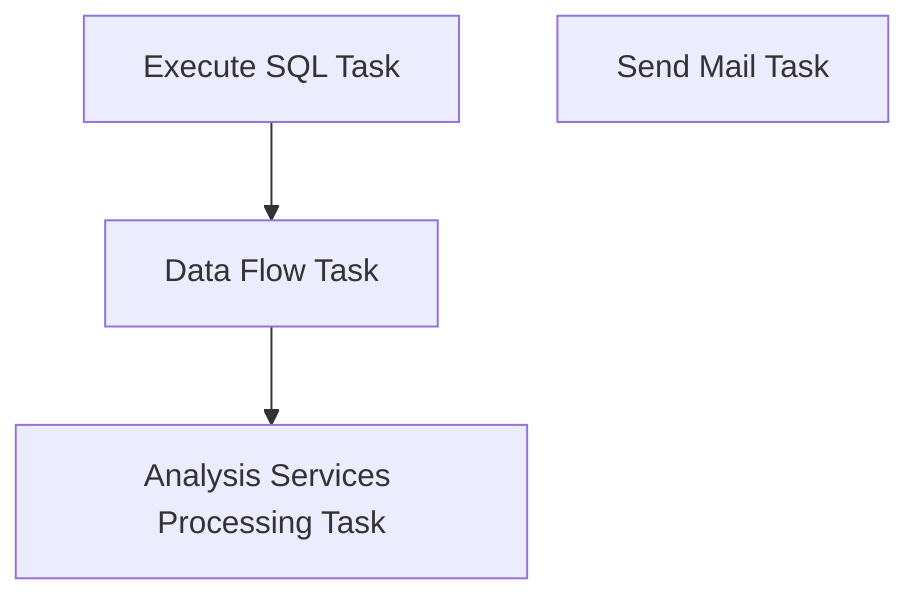

# SSIS Package: UKLoyaltyLoad

**Project:** PowerBILoad  
**Folder:** SSIS  
**Server:** STL-SSIS-P-01  

## Connection Managers

| Name | Type | Server | Catalog | Connection (sanitized) |
|---|---|---|---|---|
| PowerBI | MSOLAP100 | asazure://northcentralus.asazure.windows.net/azasp01 | BABW-DW | Data Source=asazure://northcentralus.asazure.windows.net/azasp01; Initial Catalog=BABW-DW; Provider=MSOLAP.8; Impersonation Level=Impersonate |

## Control Flow Tasks

| Task | Type |
|---|---|
| UKLoyaltyLoad | Package |
| Analysis Services Processing Task | DTSProcessingTask |
| Data Flow Task | Pipeline |
| Execute SQL Task | ExecuteSQLTask |
| Send Mail Task | SendMailTask |

## Control Flow Outline

```text
- Send Mail Task [SendMailTask]
- Analysis Services Processing Task [DTSProcessingTask]
- Data Flow Task [Pipeline]
- Execute SQL Task [ExecuteSQLTask]
```

## Architecture Diagram



## Variables

| Namespace | Name | Expression-bound |
|---|---|---|
| System | Propagate | No |
| User | EndDate | Yes |
| User | YesterDay | Yes |

### Expression-bound variable values

#### User::EndDate

**Expression:**

```sql
(DT_DATE) (RIGHT ( "0" + (DT_WSTR,2)MONTH( @[User::YesterDay] ),2) + "-" 
+ RIGHT ( "0" + (DT_WSTR,2)DAY( @[User::YesterDay]) ,2) +  "-" +
 (DT_WSTR,4)YEAR( @[User::YesterDay] ))
```

**Evaluated value:**

```sql
5/19/2019
```

#### User::YesterDay

**Expression:**

```sql
DATEADD( "dd",-1, GETDATE() )
```

**Evaluated value:**

```sql
5/19/2019 12:43:07 PM
```

## Execute SQL Tasks

### Execute SQL Task

**Path:** `Package\Execute SQL Task`  
**Connection:** {83CF06DC-C8E6-434E-B209-36EB3DE5AD2C}  

```sql
truncate table   Azure.UKLoyatly
```

## Data Flow: Sources

| Component | Source Object | Type | Data Flow Task | Connection | SQL Kind |
|---|---|---|---|---|---|
| ExistingEmail |  | OLEDBSource | Data Flow Task | {0929B922-57D2-4B30-85C6-A4EBA36C7FD6}:external | SqlCommand |
| ExistingEmailNoChange |  | OLEDBSource | Data Flow Task | {0929B922-57D2-4B30-85C6-A4EBA36C7FD6}:external | SqlCommand |
| ExistingGDPR |  | OLEDBSource | Data Flow Task | {0929B922-57D2-4B30-85C6-A4EBA36C7FD6}:external | SqlCommand |
| ExistingGDPRNoChange |  | OLEDBSource | Data Flow Task | {0929B922-57D2-4B30-85C6-A4EBA36C7FD6}:external | SqlCommand |
| POSNew |  | OLEDBSource | Data Flow Task | {0929B922-57D2-4B30-85C6-A4EBA36C7FD6}:external | SqlCommand |
| StoreDates |  | OLEDBSource | Data Flow Task | {83CF06DC-C8E6-434E-B209-36EB3DE5AD2C}:external | SqlCommand |
| TabNewEmail |  | OLEDBSource | Data Flow Task | {0929B922-57D2-4B30-85C6-A4EBA36C7FD6}:external | SqlCommand |
| TabNewGDPR |  | OLEDBSource | Data Flow Task | {0929B922-57D2-4B30-85C6-A4EBA36C7FD6}:external | SqlCommand |

#### ExistingEmail — SqlCommand

```sql
SELECT  cast(th.Transaction_date as date) as DateKey,TH.Store_No as StoreNumber, count(distinct(th.customer_ID )) as ExistingEmail
	
FROM TRANSACTION_hEADER TH 
	INNER JOIN customer_division cd WITH(NOLOCK) ON TH.CUSTOMER_id = CD.CUSTOMER_id AND cd.division_id = 89
	inner JOIN email_division e WITH(NOLOCK) ON th.customer_id = e.customer_id and cd.primary_email_id = e.email_id
	AND cast(e.modify_date as date) = CAST(TH.transaction_date as DATE)
WHERE CAST(cd.create_date as date) < CAST(TH.transaction_date as DATE)
		 and cast(e.modify_date as date) > CAST(cd.create_date as date) and e.email_opt_in_flag = 1	
		 and  th.transaction_date between '01/01/19' and ?
		 and th.store_no >= 2000
		 
group by TH.STORE_NO, cast(th.Transaction_date as date)
Order by TH.STORE_NO, cast(th.Transaction_date as date)
```

#### ExistingEmailNoChange — SqlCommand

```sql
SELECT  cast(th.Transaction_date as date) as DateKey,TH.Store_No as StoreNumber, count(distinct(th.customer_ID )) as ExistingEmailNoChange
FROM TRANSACTION_hEADER TH 
	INNER JOIN customer_division cd WITH(NOLOCK) ON TH.CUSTOMER_id = CD.CUSTOMER_id AND cd.division_id = 89
	inner JOIN email_division e WITH(NOLOCK) ON th.customer_id = e.customer_id and cd.primary_email_id = e.email_id
	AND cast(e.modify_date as date) = CAST(TH.transaction_date as DATE)
	left JOIN customer_attribute ca1 WITH(NOLOCK) ON th.customer_id = ca1.customer_id AND ca1.attribute_grouping_code = 'GDPR'
		AND attribute_code = 'OPTIN' AND attribute_value = 1 AND CAST(ca1.create_date as Date) < th.transaction_date
WHERE CAST(cd.create_date as date) < CAST(TH.transaction_date as DATE)
		 and Cast(ca1.attribute_date as date) = CAST(TH.transaction_date as DATE)
		
		 and cast(e.modify_date as date) = CAST(TH.transaction_date as DATE)and e.email_opt_in_flag = 1	
		 AND CAST(TH.transaction_date as DATE) BETWEEN '01/01/19' AND ?
 
group by TH.STORE_NO, cast(th.Transaction_date as date)
Order  by TH.STORE_NO, cast(th.Transaction_date as date)
```

#### ExistingGDPR — SqlCommand

```sql
SELECT TH.STORE_NO as StoreNumber, cast(th.Transaction_date as date) as DateKey,
	count(distinct(th.customer_ID )) as ExistingGDPR
FROM TRANSACTION_hEADER TH 
	inner JOIN customer_attribute ca1 WITH(NOLOCK) on th.customer_ID = ca1.customer_ID and Cast(ca1.attribute_date as date)=th.transaction_date
	INNER JOIN customer_division cd WITH(NOLOCK) ON TH.CUSTOMER_id = CD.CUSTOMER_id AND cd.division_id = 89
	
WHERE TH.store_no >= 2000 and cast(th.Transaction_date as date) between '01/01/19' and ?  AND ca1.attribute_grouping_code = 'GDPR'
		AND attribute_code = 'OPTIN' AND attribute_value = 1-- and ca1.attribute_grouping_code = 'TAB'
		 AND CAST(cd.create_date as date) < CAST(TH.transaction_date as DATE)
group by TH.STORE_NO, cast(th.Transaction_date as date)
Order  by TH.STORE_NO, cast(th.Transaction_date as date)
```

#### ExistingGDPRNoChange — SqlCommand

```sql
SELECT TH.STORE_NO as StoreNumber,Cast(ca1.attribute_date as date) as DateKey,
	count(distinct(th.customer_ID )) as ExistingGDPTNoChange
FROM TRANSACTION_hEADER TH 
	inner JOIN customer_attribute ca1 WITH(NOLOCK) on th.customer_ID = ca1.customer_ID 
	INNER JOIN customer_division cd WITH(NOLOCK) ON TH.CUSTOMER_id = CD.CUSTOMER_id AND cd.division_id = 89
		 AND CAST(cd.create_date as date) < CAST(TH.transaction_date as DATE)

	
WHERE  ca1.attribute_grouping_code = 'GDPR'
		AND attribute_code = 'OPTIN' AND attribute_value = 1-- and ca1.attribute_grouping_code = 'TAB'
		 AND CAST(cd.create_date as date) < CAST(TH.transaction_date as DATE)
		 and Cast(ca1.attribute_date as date)=th.transaction_date
		 and  CAST(ca1.create_date as Date) < th.transaction_date
		 and  th.transaction_date between '01/01/19' and ?
		 and th.store_no >= 2000
group by TH.STORE_NO,Cast(ca1.attribute_date as date)
Order  by TH.STORE_NO,Cast(ca1.attribute_date as date)
```

#### POSNew — SqlCommand

```sql
select  count(Distinct c.customer_id) as POSNew,
cd.store_no as StoreNumber,Cast(cd.create_date as date) as DateKey

from customer c with (nolock) 
	Left Join customer_division cd with (nolock) ON c.customer_id = cd.customer_id and cd.division_id = 89
	Left Join customer_attribute cs with (nolock) ON c.customer_id = cs.customer_id
	Left Join email_division ed with (nolock) ON c.customer_id = ed.customer_id and cd.primary_email_id = ed.email_id
	--Join StoreDates sd On sd.StoreNumber = cd.store_no and sd.ActualDate = Cast(cd.create_date as date)
Where cd.store_NO >= '2000' and  Cast(cd.create_date as date) between '01/05/19' and ?
and  cd.create_source like 'POS%'

Group by cd.store_no, Cast(cd.create_date as date)
Order By Store_NO,Cast(cd.create_date as date)
```

#### StoreDates — SqlCommand

```sql
select Cast(Storeid as int) as StoreNumber,StoreKey,Date_Key as DateKey from azure.vwStores
cross join  Azure.NewDateDim 
where CountryNameAbbr = 'UK' and storeID <> '2013' and permclosestatus = 0
and bearRange = 'Europe' and Date_Key  between '01/01/19' and ?
Order by Cast(Storeid as int),Date_Key
```

#### TabNewEmail — SqlCommand

```sql
select  count(Distinct c.customer_id) as TabNewEmail,
cd.store_no as StoreNumber,Cast(cd.create_date as date) as DateKey

from customer c with (nolock) 
	Left Join customer_division cd with (nolock) ON c.customer_id = cd.customer_id and cd.division_id = 89
	Left Join customer_attribute cs with (nolock) ON c.customer_id = cs.customer_id
	Left Join email_division ed with (nolock) ON c.customer_id = ed.customer_id and cd.primary_email_id = ed.email_id
	--Join StoreDates sd On sd.StoreNumber = cd.store_no and sd.ActualDate = Cast(cd.create_date as date)
Where cd.store_NO >= '2000' and  Cast(cd.create_date as date) between '01/05/19' and ?
and cs.attribute_grouping_code = 'SRCE' and cs.attribute_code = 'TAB'  and cd.create_source is null
and email_opt_in_flag = 1 
Group by cd.store_no,Cast(cd.create_date as date)
Order by cd.store_no,Cast(cd.create_date as date)
```

#### TabNewGDPR — SqlCommand

```sql
select  count(Distinct c.customer_id) as TabNewGDPR,
cd.store_no as StoreNumber,Cast(cd.create_date as date) as DateKey

from customer c with (nolock) 
	Left Join customer_division cd with (nolock) ON c.customer_id = cd.customer_id and cd.division_id = 89
	Left Join customer_attribute cs with (nolock) ON c.customer_id = cs.customer_id
	Left Join email_division ed with (nolock) ON c.customer_id = ed.customer_id and cd.primary_email_id = ed.email_id
	--Join StoreDates sd On sd.StoreNumber = cd.store_no and sd.ActualDate = Cast(cd.create_date as date)
Where cd.store_NO >= '2000' and  Cast(cd.create_date as date) between '01/05/19' and ?
and cs.attribute_grouping_code = 'SRCE' and cs.attribute_code = 'TAB'  and cd.create_source is null

Group by cd.store_no, Cast(cd.create_date as date)
Order By cd.store_no, Cast(cd.create_date as date)
```

## Data Flow: Destinations

| Component | Target Table | Type | Data Flow Task | Connection | SQL Kind |
|---|---|---|---|---|---|
| OLE DB Destination |  | OLEDBDestination | Data Flow Task | {83CF06DC-C8E6-434E-B209-36EB3DE5AD2C}:external |  |
