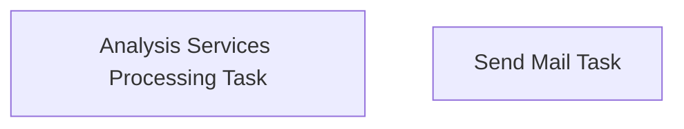

# SSIS Package: FlashGaap

**Project:** PowerBIProcessing  
**Folder:** SSIS  
**Server:** STL-SSIS-P-01  

## Connection Managers

_None detected._

## Control Flow Tasks

| Task | Type |
|---|---|
| FlashGaap | Package |
| Analysis Services Processing Task | DTSProcessingTask |
| Send Mail Task | SendMailTask |

## Control Flow Outline

```text
- Send Mail Task [SendMailTask]
- Analysis Services Processing Task [DTSProcessingTask]
```

## Architecture Diagram



## Variables

| Namespace | Name | Expression-bound |
|---|---|---|
| System | Propagate | No |

## Execute SQL Tasks

_None detected._

## Data Flow: Sources

_None detected._

## Data Flow: Destinations

_None detected._
