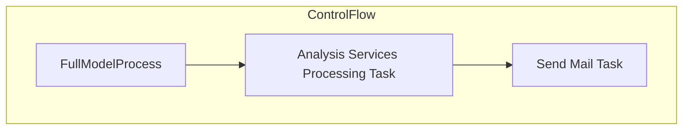

# SSIS Package: FullModelProcess

**Project:** PowerBIProcessing  
**Folder:** SSIS  
**Server:** STL-SSIS-P-01  

## Architecture Diagram

## Connection Managers

_None detected._

## Control Flow Tasks

| Task | Type |
|---|---|
| FullModelProcess | Microsoft.Package |
| Analysis Services Processing Task | Microsoft.DTSProcessingTask |
| Send Mail Task | Microsoft.SendMailTask |

## Data Flow: Sources

_None detected._

## Data Flow: Destinations

_None detected._

