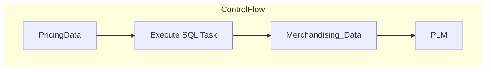

# SSIS Package: PricingData

**Project:** PricingData  
**Folder:** SSIS  
**Server:** STL-SSIS-P-01  

## Architecture Diagram

## Connection Managers

_None detected._

## Control Flow Tasks

| Task | Type |
|---|---|
| PricingData | SSIS.Package.3 |
| Execute SQL Task | Microsoft.SqlServer.Dts.Tasks.ExecuteSQLTask.ExecuteSQLTask, Microsoft.SqlServer.SQLTask, Version=11.0.0.0, Culture=neutral, PublicKeyToken=89845dcd8080cc91 |
| Merchandising_Data | SSIS.Pipeline.3 |
| PLM | SSIS.Pipeline.3 |

## Data Flow: Sources

_None detected._

## Data Flow: Destinations

| Component | Destination |
|---|---|
|  | [dbo].[entity_custom_property] |
|  | [dbo].[entity_custom_property] |
|  | [dbo].[hierarchy_group] |
|  | [dbo].[hierarchy_group] |
|  | [dbo].[ib_price] |
|  | [dbo].[ib_price] |
|  | [dbo].[jurisdiction] |
|  | [dbo].[jurisdiction] |
|  | [dbo].[style] |
|  | [dbo].[style_group] |
|  | [dbo].[style] |
|  | [dbo].[style_group] |
|  | [dbo].[style_retail] |
|  | [dbo].[style_retail] |
|  | [dbo].[style_vendor] |
|  | [dbo].[style_vendor] |
|  | [archive].[Products] |
|  | [dbo].[PLM_Products] |

