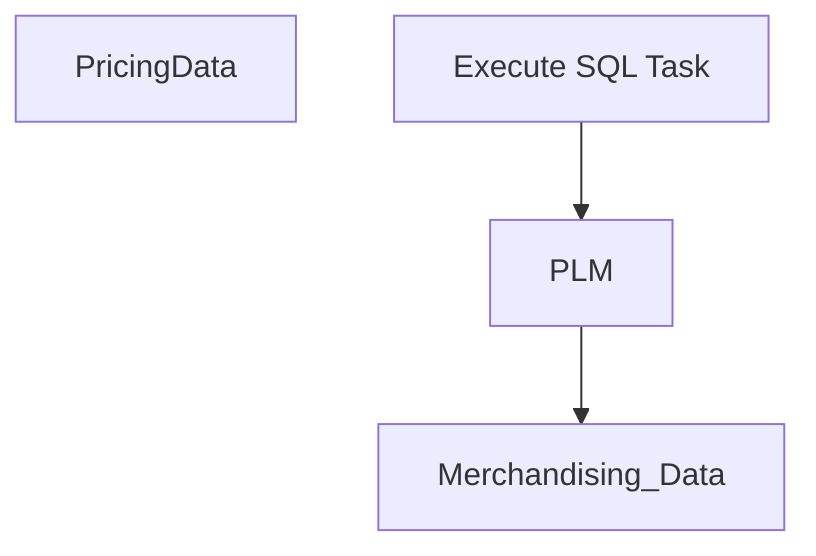

# SSIS Package: PricingData

**Project:** PricingData  
**Folder:** SSIS  
**Server:** STL-SSIS-P-01  

## Connection Managers

_None detected._

## Control Flow Tasks

| Task | Type |
|---|---|
| PricingData | SSIS.Package.3 |
| Execute SQL Task | SqlServer.Dts.Tasks.ExecuteSQLTask.ExecuteSQLTask, SqlServer.SQLTask, Version=11.0.0.0, Culture=neutral, PublicKeyToken=89845dcd8080cc91 |
| Merchandising_Data | SSIS.Pipeline.3 |
| PLM | SSIS.Pipeline.3 |

## Control Flow Outline

```text
- PricingData [SSIS.Package.3]
- Execute SQL Task [SqlServer.Dts.Tasks.ExecuteSQLTask.ExecuteSQLTask, SqlServer.SQLTask, Version=11.0.0.0, Culture=neutral, PublicKeyToken=89845dcd8080cc91]
- Merchandising_Data [SSIS.Pipeline.3]
- PLM [SSIS.Pipeline.3]
```

## Architecture Diagram



## Variables

_None detected._

## Execute SQL Tasks

_None detected._

## Data Flow: Sources

_None detected._

## Data Flow: Destinations

_None detected._
