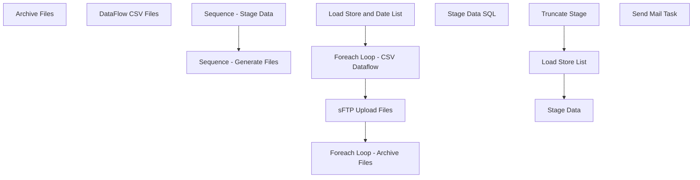

# SSIS Package: UKStoreSalesAuditingETL

**Project:** UKStoreSalesAuditingETL  
**Folder:** SSIS  
**Server:** STL-SSIS-P-01  

## Connection Managers

| Name | Type | Server | Catalog | Connection (sanitized) |
|---|---|---|---|---|
| DW | OLEDB | papamart | dw | Data Source=papamart; Initial Catalog=dw; Provider=SQLNCLI11.1; Integrated Security=SSPI; Auto Translate=False |
| DWStaging | OLEDB | papamart | DWStaging | Data Source=papamart; Initial Catalog=DWStaging; Provider=SQLNCLI11.1; Integrated Security=SSPI; Auto Translate=False |
| IntegrationStaging | OLEDB | STL-SSIS-P-01 | IntegrationStaging | Data Source=STL-SSIS-P-01; Initial Catalog=IntegrationStaging; Provider=SQLNCLI11.1; Integrated Security=SSPI; Auto Translate=False |
| SMTP | SMTP |  |  |  |
| TotalsCSV | FLATFILE |  |  |  |
| TransactionsCSV | FLATFILE |  |  |  |

## Control Flow Tasks

| Task | Type |
|---|---|
| UKStoreSalesAuditingETL | Package |
| Sequence - Generate Files | SEQUENCE |
| Foreach Loop - Archive Files | FOREACHLOOP |
| Archive Files | FileSystemTask |
| Foreach Loop - CSV Dataflow | FOREACHLOOP |
| DataFlow CSV Files | Pipeline |
| Load Store and Date List | ExecuteSQLTask |
| sFTP Upload Files | ExecuteSQLTask |
| Sequence - Stage Data | SEQUENCE |
| Load Store List | ExecuteSQLTask |
| Stage Data | FOREACHLOOP |
| Stage Data SQL | ExecuteSQLTask |
| Truncate Stage | ExecuteSQLTask |
| Send Mail Task | SendMailTask |

## Control Flow Outline

```text
- Send Mail Task [SendMailTask]
- Sequence - Generate Files [SEQUENCE]
  - Foreach Loop - Archive Files [FOREACHLOOP]
    - Archive Files [FileSystemTask]
  - Foreach Loop - CSV Dataflow [FOREACHLOOP]
    - DataFlow CSV Files [Pipeline]
  - Load Store and Date List [ExecuteSQLTask]
  - sFTP Upload Files [ExecuteSQLTask]
- Sequence - Stage Data [SEQUENCE]
  - Load Store List [ExecuteSQLTask]
  - Stage Data [FOREACHLOOP]
    - Stage Data SQL [ExecuteSQLTask]
  - Truncate Stage [ExecuteSQLTask]
```

## Architecture Diagram



## Variables

| Namespace | Name | Expression-bound |
|---|---|---|
| System | Propagate | No |
| User | ConiqLocationID | No |
| User | DateTimeStamp | Yes |
| User | DetailFileName | Yes |
| User | EndDate | Yes |
| User | EndDateAsDATE | Yes |
| User | FileMoveDestinationPath | No |
| User | FileMoveSourcePath | No |
| User | GetDate | Yes |
| User | GetDateAsDATE | Yes |
| User | HeaderFileName | Yes |
| User | StartDate | Yes |
| User | StartDateAsDATE | Yes |
| User | StoreID | No |
| User | StoreIP | No |
| User | StoreKey | No |
| User | StoreList | No |
| User | StoreP | No |
| User | StoreU | No |
| User | YYYYMMDD | No |

### Expression-bound variable values

#### User::DateTimeStamp

**Expression:**

```sql
(DT_WSTR,4)DATEPART("yyyy",GetDate()) 
+ (DT_WSTR,4)DATEPART("mm",GetDate()) 
+ (DT_WSTR,4)DATEPART("dd",GetDate()) 
+ (DT_WSTR,4)DATEPART("hh",GetDate()) 
+ (DT_WSTR,4)DATEPART("mi",GetDate()) 
+ (DT_WSTR,4)DATEPART("ss",GetDate()) 
+ (DT_WSTR,4)DATEPART("ms",GetDate())
```

**Evaluated value:**

```sql
202251292939827
```

#### User::DetailFileName

**Expression:**

```sql
@[User::ConiqLocationID] + "_" +  @[User::YYYYMMDD] + "_transactions.csv"
```

**Evaluated value:**

```sql
76013__transactions.csv
```

#### User::EndDate

**Expression:**

```sql
dateadd("dd", @[$Package::DaysToInclude], @[User::StartDate])
```

**Evaluated value:**

```sql
5/12/2022
```

#### User::EndDateAsDATE

**Expression:**

```sql
(DT_WSTR, 4) datepart("year", @[User::EndDate])  + "-" + 
(DT_WSTR, 2) datepart("mm", @[User::EndDate])  + "-" + 
(DT_WSTR, 2) datepart("dd",  @[User::EndDate])
```

**Evaluated value:**

```sql
2022-5-12
```

#### User::GetDate

**Expression:**

```sql
(DT_DATE)DATEDIFF("Day", (DT_DATE) 0, GETDATE())
```

**Evaluated value:**

```sql
5/12/2022
```

#### User::GetDateAsDATE

**Expression:**

```sql
(DT_WSTR, 4) datepart("year", @[User::GetDate])  + "-" + 
(DT_WSTR, 2) datepart("mm", @[User::GetDate])  + "-" + 
(DT_WSTR, 2) datepart("dd",  @[User::GetDate])
```

**Evaluated value:**

```sql
2022-5-12
```

#### User::HeaderFileName

**Expression:**

```sql
@[User::ConiqLocationID] + "_" +  @[User::YYYYMMDD] + "_totals.csv"
```

**Evaluated value:**

```sql
76013__totals.csv
```

#### User::StartDate

**Expression:**

```sql
dateadd("dd", -@[$Package::DaysToGoBack] , @[User::GetDate] )
```

**Evaluated value:**

```sql
5/11/2022
```

#### User::StartDateAsDATE

**Expression:**

```sql
(DT_WSTR, 4) datepart("year", @[User::StartDate])  + "-" + 
(DT_WSTR, 2) datepart("mm", @[User::StartDate])  + "-" + 
(DT_WSTR, 2) datepart("dd",  @[User::StartDate])
```

**Evaluated value:**

```sql
2022-5-11
```

## Execute SQL Tasks

### Load Store and Date List

**Path:** `Package\Sequence - Generate Files\Load Store and Date List`  
**Connection:** DWStaging (papamart/DWStaging)  

```sql
select distinct
	cast(StoreNumber as int) as StoreID,
	concat(datepart(yyyy, End_Datetime), right(concat('00', datepart(mm, End_Datetime)), 2), right(concat('00', datepart(dd,End_Datetime)),2)) TransactionDate
from StoreSalesAuditingStage 
where datediff(dd, End_Datetime, getdate()) =0
```

### sFTP Upload Files

**Path:** `Package\Sequence - Generate Files\sFTP Upload Files`  
**Connection:** IntegrationStaging (STL-SSIS-P-01/IntegrationStaging)  

```sql
declare 
	@winSCP varchar(1000),
	@script varchar(1000),
	@log varchar(1000),
	@FTP varchar(4000),
	@Log_query varchar(1000),
	@Log_filename varchar(100),
	@Log_file_location varchar(100),
	@Log_bcp varchar(1000),
	@body varchar(4000)
select
	@winSCP = '"\\stl-ssis-p-01\C$\Program Files (x86)\WinSCP\WinSCP.exe"',
	@script = ' /script=\\stl-ssis-p-01\IntegrationStaging\UK_POS_Data\FTP\sFTPuploadScript.txt',
	@log = ' /log=\\stl-ssis-p-01\IntegrationStaging\UK_POS_Data\FTP\Upload.log',
	@FTP = (@winSCP + @script + @log)
			
			
exec master..xp_cmdshell @FTP
```

### Load Store List

**Path:** `Package\Sequence - Stage Data\Load Store List`  
**Connection:** DW (papamart/dw)  

```sql
select 
	store_id as StoreID,
	store_key as StoreKey,
	concat('SW0',right(concat('0000', cast(store_id as varchar)),4),'00001') StoreIP
from store_dim
where store_id in (2078)
```

### Stage Data SQL

**Path:** `Package\Sequence - Stage Data\Stage Data\Stage Data SQL`  
**Connection:** DWStaging (papamart/DWStaging)  

> ⚠️ `SqlStatementSource` is overridden at runtime by a property expression (shown below); the static SQL may not be what executes.

**Static SqlStatementSource:**

```sql
exec spStoreSalesAuditingDataPreStage @StoreID= '0', @StoreKey= '0', @IP= '', @UName= 'sa', @PWord= '5@5t0r3'
```

**Property expression (runtime override):**

```sql
"exec spStoreSalesAuditingDataPreStage @StoreID= '" +  (DT_STR,4, 1252) @[User::StoreID] + "', @StoreKey= '" +  (DT_STR,4, 1252)@[User::StoreKey] + "', @IP= '" +  (DT_STR,20, 1252)@[User::StoreIP] + "', @UName= '" +  @[User::StoreU] + "', @PWord= '" +  @[User::StoreP] + "'"
```

### Truncate Stage

**Path:** `Package\Sequence - Stage Data\Truncate Stage`  
**Connection:** DWStaging (papamart/DWStaging)  

```sql
TRUNCATE TABLE StoreSalesAuditingStage
```

## Data Flow: Sources

| Component | Source Object | Type | Data Flow Task | Connection | SQL Kind |
|---|---|---|---|---|---|
| Sales Details |  | OLEDBSource | DataFlow CSV Files | DWStaging | SqlCommand |
| Sales Header |  | OLEDBSource | DataFlow CSV Files | DWStaging | SqlCommand |

#### Sales Details — SqlCommand

```sql
with 
SalesData as
	(
		select 
			cast(StoreNumber as nvarchar) as StoreNumber,
			cast('76013' as nvarchar) as coniq_location_id,--need to get the actual id 
			rtl_trn_id as transaction_id,
			cast(right(item_no, 6) as nvarchar) as item_id,
			cast(SkuDescription as nvarchar) as item_name,
			DATEDIFF(s, '1970-01-01', End_DateTime) as sale_datetime,  --Unix Timestamp format
			End_DateTime TransactionDate,
			sum(net_sales) as gross_value,
			cast(SUM(CASE
						WHEN CAST(StoreNumber AS INT) between 3000 and 3999 
							THEN isnull((net_sales - redeemed_amount), 0) / 1.1700
						WHEN CAST(StoreNumber as INT) IN (2036, 2054) 
							THEN isnull((net_sales - redeemed_amount), 0) / 1.2300
						WHEN CAST(StoreNumber as INT) = 2301 --Denmark
							THEN isnull((net_sales - redeemed_amount), 0) / 1.2500
						WHEN CAST(StoreNumber AS INT) >= 2000 
							THEN isnull((net_sales - redeemed_amount), 0) / 1.2
						ELSE isnull((net_sales - redeemed_amount), 0) 
						END) as decimal(38,2)) AS net_value,
			cast('FALSE' as nvarchar) as is_discount,
			cast(case when return_flg = 1 then 'TRUE' else 'FALSE' end as nvarchar) as is_return
		from StoreSalesAuditingStage s
		group by 
			StoreNumber, 
			rtl_trn_id,
			right(item_no, 6),
			SkuDescription,
			DATEDIFF(s, '1970-01-01', End_DateTime),
			End_DateTime,
			case when return_flg = 1 then 'TRUE' else 'FALSE' end
	)
select *
from SalesData
where 
	StoreNumber = ?
AND concat(datepart(yyyy, TransactionDate), right(concat('00', datepart(mm, TransactionDate)), 2), right(concat('00', datepart(dd,TransactionDate)),2)) = ?
order by
	coniq_location_id,
	sale_datetime,
	transaction_id,
	item_id
```

#### Sales Header — SqlCommand

```sql
with 
SalesData as
	(
		select  
			cast(StoreNumber as nvarchar) as StoreNumber,
			cast('76013' as nvarchar) as coniq_location_id,--need to get the actual id 
			cast(End_Datetime as date) TransactionDate,
			DATEDIFF(s, '1970-01-01', cast(End_Datetime as date)) as reference_datetime, --Unix Timestamp format
			cast(sum(net_sales) as decimal(38,2)) as total_gross_value,
			cast(SUM(CASE
						WHEN CAST(StoreNumber AS INT) between 3000 and 3999 
							THEN isnull((net_sales - redeemed_amount), 0) / 1.1700
						WHEN CAST(StoreNumber as INT) IN (2036, 2054) 
							THEN isnull((net_sales - redeemed_amount), 0) / 1.2300
						WHEN CAST(StoreNumber as INT) = 2301 --Denmark
							THEN isnull((net_sales - redeemed_amount), 0) / 1.2500
						WHEN CAST(StoreNumber AS INT) >= 2000 
							THEN isnull((net_sales - redeemed_amount), 0) / 1.2
						ELSE isnull((net_sales - redeemed_amount), 0) 
						END) as decimal(38,2)) AS total_net_value, 
			count(distinct rtl_trn_id) as total_transactions,
			sum(tran_units) as total_units
		from StoreSalesAuditingStage 
		group by 
			StoreNumber,
			cast(End_Datetime as date),
			DATEDIFF(s, '1970-01-01', cast(End_Datetime as date))
	)
select *
from SalesData
--where datediff(dd, TransactionDate, getdate()-1) = 0
where 
	StoreNumber = ?
AND concat(datepart(yyyy, TransactionDate), right(concat('00', datepart(mm, TransactionDate)), 2), right(concat('00', datepart(dd,TransactionDate)),2)) = ?
```

## Data Flow: Destinations

| Component | Target Table | Type | Data Flow Task | Connection | SQL Kind |
|---|---|---|---|---|---|
| Totals CSV |  | FlatFileDestination | DataFlow CSV Files | TotalsCSV |  |
| Transactions CSV |  | FlatFileDestination | DataFlow CSV Files | TransactionsCSV |  |
