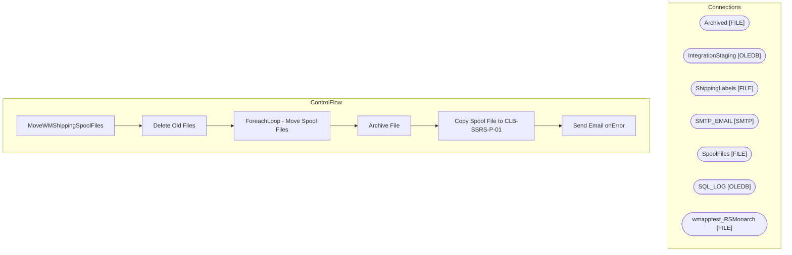

# SSIS Package: MoveWMShippingSpoolFiles

**Project:** WEBMoveWMShippingLabelSpoolFiles  
**Folder:** SSIS  
**Server:** STL-SSIS-P-01  

## Architecture Diagram

## Connection Managers

| Name | Type |
|---|---|
| Archived | FILE |
| IntegrationStaging | OLEDB |
| ShippingLabels | FILE |
| SMTP_EMAIL | SMTP |
| SpoolFiles | FILE |
| SQL_LOG | OLEDB |
| wmapptest_RSMonarch | FILE |

## Control Flow Tasks

| Task | Type |
|---|---|
| MoveWMShippingSpoolFiles | Microsoft.Package |
| Delete Old Files | Microsoft.ExecuteSQLTask |
| ForeachLoop - Move Spool Files | STOCK:FOREACHLOOP |
| Archive File | Microsoft.FileSystemTask |
| Copy Spool File to CLB-SSRS-P-01 | Microsoft.FileSystemTask |
| Send Email onError | Microsoft.SendMailTask |

## Data Flow: Sources

_None detected._

## Data Flow: Destinations

_None detected._

