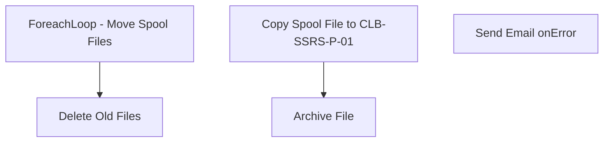

# SSIS Package: MoveWMShippingSpoolFiles

**Project:** WEBMoveWMShippingLabelSpoolFiles  
**Folder:** SSIS  
**Server:** STL-SSIS-P-01  

## Connection Managers

| Name | Type | Server | Catalog | Connection (sanitized) |
|---|---|---|---|---|
| Archived | FILE |  |  |  |
| IntegrationStaging | OLEDB | STL-SSIS-P-01 | IntegrationStaging | Data Source=STL-SSIS-P-01; Initial Catalog=IntegrationStaging; Provider=SQLNCLI11.1; Integrated Security=SSPI; Auto Translate=False |
| SMTP_EMAIL | SMTP |  |  |  |
| SQL_LOG | OLEDB | stl-ssis-p-01 | msdb | Data Source=stl-ssis-p-01; Initial Catalog=msdb; Provider=SQLNCLI11.1; Integrated Security=SSPI; Auto Translate=False |
| ShippingLabels | FILE |  |  |  |
| SpoolFiles | FILE |  |  |  |
| wmapptest_RSMonarch | FILE |  |  |  |

## Control Flow Tasks

| Task | Type |
|---|---|
| MoveWMShippingSpoolFiles | Package |
| Delete Old Files | ExecuteSQLTask |
| ForeachLoop - Move Spool Files | FOREACHLOOP |
| Archive File | FileSystemTask |
| Copy Spool File to CLB-SSRS-P-01 | FileSystemTask |
| Send Email onError | SendMailTask |

## Control Flow Outline

```text
- Send Email onError [SendMailTask]
- Delete Old Files [ExecuteSQLTask]
- ForeachLoop - Move Spool Files [FOREACHLOOP]
  - Archive File [FileSystemTask]
  - Copy Spool File to CLB-SSRS-P-01 [FileSystemTask]
```

## Architecture Diagram



## Variables

| Namespace | Name | Expression-bound |
|---|---|---|
| System | Propagate | No |
| User | ArchivePath | Yes |
| User | FileName | No |
| User | SpoolFilePath | Yes |

### Expression-bound variable values

#### User::ArchivePath

**Expression:**

```sql
@[$Package::Environment] == "test" ? "\\\\wmapptest\\C$\\Program Files\\Manhattan Associates\\WMOS Server\\Services\\BABW_TEST\\spool\\archive\\wmapptest_RSMonarch\\Archived" : "\\\\wmapp02\\D$\\Manhattan Associates\\Services\\BABW_PROD\\spool\\archive\\wmapp01_weblabel\\Archived"
```

**Evaluated value:**

```sql
\\wmapp02\D$\Manhattan Associates\Services\BABW_PROD\spool\archive\wmapp01_weblabel\Archived
```

#### User::SpoolFilePath

**Expression:**

```sql
@[$Package::Environment] == "test" ? "\\\\wmapptest\\C$\\Program Files\\Manhattan Associates\\WMOS Server\\Services\\BABW_TEST\\spool\\archive\\wmapptest_RSMonarch" : "\\\\wmapp02\\D$\\Manhattan Associates\\Services\\BABW_PROD\\spool\\archive\\wmapp01_weblabel"
```

**Evaluated value:**

```sql
\\wmapp02\D$\Manhattan Associates\Services\BABW_PROD\spool\archive\wmapp01_weblabel
```

## Execute SQL Tasks

### Delete Old Files

**Path:** `Package\Delete Old Files`  
**Connection:** IntegrationStaging (STL-SSIS-P-01/IntegrationStaging)  

```sql
exec spDeleteOldFiles @path = '\\clb-ssrs-p-01\IntegrationStaging\BABW\ShippingLabels', @filemask = '', @retention = 7
```

## Data Flow: Sources

_None detected._

## Data Flow: Destinations

_None detected._
