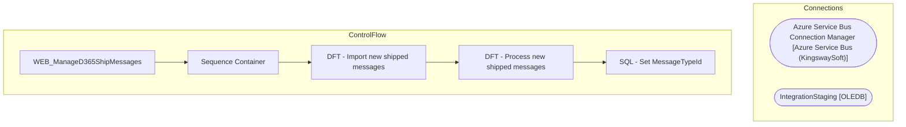

# SSIS Package: WEB_ManageD365ShipMessages

**Project:** WEB_ManageD365ShipMessages  
**Folder:** SSIS  
**Server:** STL-SSIS-P-01  

## Architecture Diagram

## Connection Managers

| Name | Type |
|---|---|
| Azure Service Bus Connection Manager | Azure Service Bus (KingswaySoft) |
| IntegrationStaging | OLEDB |

## Control Flow Tasks

| Task | Type |
|---|---|
| WEB_ManageD365ShipMessages | Microsoft.Package |
| Sequence Container | STOCK:SEQUENCE |
| DFT - Import new shipped messages | Microsoft.Pipeline |
| DFT - Process new shipped messages | Microsoft.Pipeline |
| SQL - Set MessageTypeId | Microsoft.ExecuteSQLTask |

## Data Flow: Sources

| Component | SQL Preview |
|---|---|
|  | select * from [WMS].[WMServiceBusMessage] |
|  | select * from [WMS].[SalesOrderStatusUpdateShipped] |
|  | SELECT [ServiceBusMessageId]       ,[MessageId]       ,[Message]       ,[Sequence]       ,[MessageTypeId]       ,[EnqueuedTimeUTC]   FROM [IntegrationStaging].[WMS].[WMServiceBusMessage] WITH(NOLOCK)   WHERE ServiceBusMessageId IN (SELECT MAX(ServiceBusMessageID) FROM [IntegrationStaging].[WMS].[WMServiceBusMessage] WITH(NOLOCK) WHERE MessageTypeId = ? AND DATEDIFF(MINUTE, EnqueuedTimeUTC, GETUTCD |

## Data Flow: Destinations

| Component | Destination |
|---|---|
|  | [WMS].[WMServiceBusMessage] |
|  | [WMS].[SalesOrderStatusUpdateShipped] |

