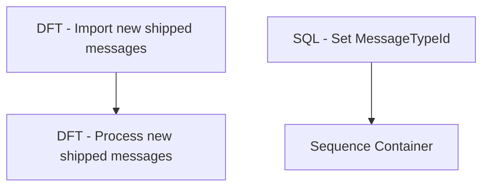

# SSIS Package: WEB_ManageD365ShipMessages

**Project:** WEB_ManageD365ShipMessages  
**Folder:** SSIS  
**Server:** STL-SSIS-P-01  

## Connection Managers

| Name | Type | Server | Catalog | Connection (sanitized) |
|---|---|---|---|---|
| Azure Service Bus Connection Manager | Azure Service Bus (KingswaySoft) |  |  |  |
| IntegrationStaging | OLEDB | STL-SSIS-P-01 | IntegrationStaging | Data Source=STL-SSIS-P-01; Initial Catalog=IntegrationStaging; Provider=SQLNCLI11.1; Integrated Security=SSPI; Auto Translate=False |

## Control Flow Tasks

| Task | Type |
|---|---|
| WEB_ManageD365ShipMessages | Package |
| Sequence Container | SEQUENCE |
| DFT - Import new shipped messages | Pipeline |
| DFT - Process new shipped messages | Pipeline |
| SQL - Set MessageTypeId | ExecuteSQLTask |

## Control Flow Outline

```text
- SQL - Set MessageTypeId [ExecuteSQLTask]
- Sequence Container [SEQUENCE]
  - DFT - Import new shipped messages [Pipeline]
  - DFT - Process new shipped messages [Pipeline]
```

## Architecture Diagram



## Variables

| Namespace | Name | Expression-bound |
|---|---|---|
| Package | messageAgeInMinutes | No |
| User | MessageTypeId | No |

## Execute SQL Tasks

### SQL - Set MessageTypeId

**Path:** `Package\SQL - Set MessageTypeId`  
**Connection:** IntegrationStaging (STL-SSIS-P-01/IntegrationStaging)  

```sql
SELECT [MessageTypeId]
FROM [IntegrationStaging].[WMS].[WMServiceBusMessageType]
  WHERE [Description] = 'outboundso-ship'
```

## Data Flow: Sources

| Component | Source Object | Type | Data Flow Task | Connection | SQL Kind |
|---|---|---|---|---|---|
| WMServiceBusMessage |  | OLEDBSource | DFT - Process new shipped messages | IntegrationStaging | SqlCommand |

#### WMServiceBusMessage — SqlCommand

```sql
SELECT [ServiceBusMessageId]
      ,[MessageId]
      ,[Message]
      ,[Sequence]
      ,[MessageTypeId]
      ,[EnqueuedTimeUTC]
  FROM [IntegrationStaging].[WMS].[WMServiceBusMessage] WITH(NOLOCK)
  WHERE ServiceBusMessageId IN (SELECT MAX(ServiceBusMessageID) FROM [IntegrationStaging].[WMS].[WMServiceBusMessage] WITH(NOLOCK) WHERE MessageTypeId = ? AND DATEDIFF(MINUTE, EnqueuedTimeUTC, GETUTCDATE()) < ? 
GROUP BY MessageId)
```

## Data Flow: Destinations

| Component | Target Table | Type | Data Flow Task | Connection | SQL Kind |
|---|---|---|---|---|---|
| WMServiceBusMessage |  | OLEDBDestination | DFT - Import new shipped messages | IntegrationStaging |  |
| SalesOrderStatusUpdateShipped |  | OLEDBDestination | DFT - Process new shipped messages | IntegrationStaging |  |
