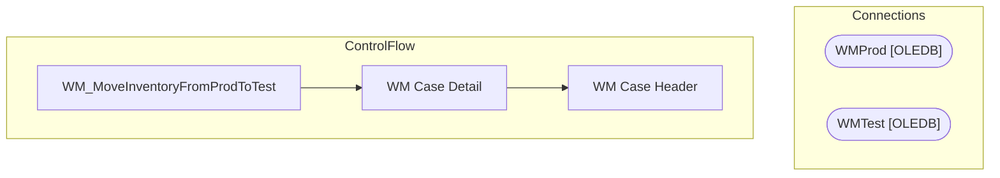

# SSIS Package: WM_MoveInventoryFromProdToTest

**Project:** WM_MoveInventoryFromProdToTest  
**Folder:** SSIS  
**Server:** STL-SSIS-P-01  

## Architecture Diagram

## Connection Managers

| Name | Type |
|---|---|
| WMProd | OLEDB |
| WMTest | OLEDB |

## Control Flow Tasks

| Task | Type |
|---|---|
| WM_MoveInventoryFromProdToTest | Microsoft.Package |
| WM Case Detail | Microsoft.Pipeline |
| WM Case Header | Microsoft.Pipeline |

## Data Flow: Sources

| Component | SQL Preview |
|---|---|
|  | select case_nbr  from case_dtl with (nolock) |
|  | select cd.* from case_dtl cd with (nolock) join case_hdr ch with (nolock) on cd.case_nbr = ch.case_nbr join locn_hdr lh with (nolock) on ch.locn_id = lh.locn_id  and (lh.work_grp <> 'web' or lh.work_grp is null) where ch.stat_code = 30 |
|  | select case_nbr  from case_hdr with (nolock) |
|  | select ch.* from case_hdr ch with (nolock)  join locn_hdr lh with (nolock) on ch.locn_id = lh.locn_id  and (lh.work_grp <> 'web' or lh.work_grp is null) where ch.stat_code = 30 |

## Data Flow: Destinations

| Component | Destination |
|---|---|
|  | [dbo].[CASE_DTL] |
|  | [dbo].[CASE_HDR] |

