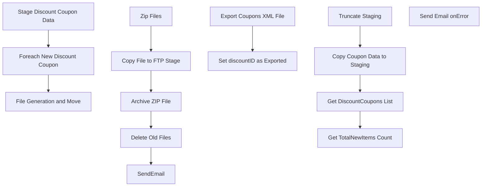

# SSIS Package: ExportWebCouponsPackage

**Project:** WebCoupons  
**Folder:** SSIS  
**Server:** STL-SSIS-P-01  

## Connection Managers

| Name | Type | Server | Catalog | Connection (sanitized) |
|---|---|---|---|---|
| Coupons.zip | FILE |  |  |  |
| Kodiak.DiscountMstrData | OLEDB | Kodiak | DiscountMstrData | Data Source=Kodiak; Initial Catalog=DiscountMstrData; Provider=SQLNCLI11.1; Integrated Security=SSPI; Auto Translate=False |
| SMTP_EMAIL | SMTP |  |  |  |
| SQL_LOG | OLEDB | stl-ssis-p-01 | msdb | Data Source=stl-ssis-p-01; Initial Catalog=msdb; Provider=SQLNCLI11.1; Integrated Security=SSPI; Auto Translate=False |
| STL-SSIS-P-01 | SMOServer |  |  |  |
| STL-SSIS-P-01.IntegrationStaging | OLEDB | STL-SSIS-P-01 | IntegrationStaging | Data Source=STL-SSIS-P-01; Initial Catalog=IntegrationStaging; Provider=SQLNCLI11.1; Integrated Security=SSPI; Auto Translate=False |

## Control Flow Tasks

| Task | Type |
|---|---|
| ExportWebCouponsPackage | Package |
| File Generation and Move | SEQUENCE |
| Archive ZIP File | FileSystemTask |
| Copy File to FTP Stage | FileSystemTask |
| Delete Old Files | ExecuteSQLTask |
| SendEmail | ExecuteSQLTask |
| Zip Files | ExecuteProcess |
| Foreach New Discount Coupon | FOREACHLOOP |
| Export Coupons XML File | ExecuteSQLTask |
| Set discountID as Exported | ExecuteSQLTask |
| Stage Discount Coupon Data | SEQUENCE |
| Copy Coupon Data to Staging | Pipeline |
| Get DiscountCoupons List | ExecuteSQLTask |
| Get TotalNewItems Count | ExecuteSQLTask |
| Truncate Staging | ExecuteSQLTask |
| Send Email onError | SendMailTask |

## Control Flow Outline

```text
- Send Email onError [SendMailTask]
- File Generation and Move [SEQUENCE]
  - Archive ZIP File [FileSystemTask]
  - Copy File to FTP Stage [FileSystemTask]
  - Delete Old Files [ExecuteSQLTask]
  - SendEmail [ExecuteSQLTask]
  - Zip Files [ExecuteProcess]
- Foreach New Discount Coupon [FOREACHLOOP]
  - Export Coupons XML File [ExecuteSQLTask]
  - Set discountID as Exported [ExecuteSQLTask]
- Stage Discount Coupon Data [SEQUENCE]
  - Copy Coupon Data to Staging [Pipeline]
  - Get DiscountCoupons List [ExecuteSQLTask]
  - Get TotalNewItems Count [ExecuteSQLTask]
  - Truncate Staging [ExecuteSQLTask]
```

## Architecture Diagram



## Variables

| Namespace | Name | Expression-bound |
|---|---|---|
| System | Propagate | No |
| User | CouponsFileRename | Yes |
| User | Current_cntryAbbr | No |
| User | Current_discountAmount | No |
| User | Current_discountID | No |
| User | Current_endingDate | No |
| User | Current_group | No |
| User | DiscountCouponsList | No |
| User | FTPStageDirectory | No |
| User | FileCount | No |
| User | FilePath | No |
| User | ListOfXMLFiles | No |
| User | TotalNewItems | No |
| User | ZipCommand | Yes |
| User | ZipDest | No |
| User | ZipSource | No |

### Expression-bound variable values

#### User::CouponsFileRename

**Expression:**

```sql
"\\\\STL-SSIS-P-01\\IntegrationStaging\\WEB\\Outbound\\Coupons\\Archive\\" + "Coupons" + 
(DT_WSTR, 4) YEAR( @[System::ContainerStartTime]  ) +  (DT_WSTR, 2) MONTH( @[System::ContainerStartTime]  ) + (DT_WSTR, 2) DAY( @[System::ContainerStartTime]  ) +  (DT_WSTR, 2) DATEPART("Hh", @[System::ContainerStartTime] ) + (DT_WSTR, 2) DATEPART("mi", @[System::ContainerStartTime] ) + (DT_WSTR, 2) DATEPART("ss", @[System::ContainerStartTime] ) + (DT_WSTR, 2) DATEPART("Ms", @[System::ContainerStartTime] ) + ".zip"
```

**Evaluated value:**

```sql
\\STL-SSIS-P-01\IntegrationStaging\WEB\Outbound\Coupons\Archive\Coupons20171019936390.zip
```

#### User::ZipCommand

**Expression:**

```sql
"a -tzip \""+ @[User::ZipDest]  + "\"  \"" +  @[User::ZipSource]  +"\" -sdel"
```

**Evaluated value:**

```sql
a -tzip "\\STL-SSIS-P-01\IntegrationStaging\WEB\Outbound\Coupons\Coupons.zip"  "\\STL-SSIS-P-01\IntegrationStaging\WEB\Outbound\Coupons\*.xml" -sdel
```

## Execute SQL Tasks

### Delete Old Files

**Path:** `Package\File Generation and Move\Delete Old Files`  
**Connection:** STL-SSIS-P-01.IntegrationStaging (STL-SSIS-P-01/IntegrationStaging)  

```sql
exec spDeleteOldFiles @path = '\\STL-SSIS-P-01\IntegrationStaging\WEB\Outbound\Coupons\Archive', @filemask = '*.zip', @retention = 14
```

### SendEmail

**Path:** `Package\File Generation and Move\SendEmail`  
**Connection:** STL-SSIS-P-01.IntegrationStaging (STL-SSIS-P-01/IntegrationStaging)  

```sql
EXEC dbo.spConvertCouponStagingtoHTML
```

### Export Coupons XML File

**Path:** `Package\Foreach New Discount Coupon\Export Coupons XML File`  
**Connection:** Kodiak.DiscountMstrData (Kodiak/DiscountMstrData)  

```sql
EXEC [dbo].[spExportWebCouponFiles] @discountID = ?, @discountAmount = ?, @endingDate = ?, @cntryAbbr = ?
```

### Set discountID as Exported

**Path:** `Package\Foreach New Discount Coupon\Set discountID as Exported`  
**Connection:** Kodiak.DiscountMstrData (Kodiak/DiscountMstrData)  

```sql
UPDATE Discount
SET isExportedToWeb = 1
WHERE discountID = ?
```

### Get DiscountCoupons List

**Path:** `Package\Stage Discount Coupon Data\Get DiscountCoupons List`  
**Connection:** STL-SSIS-P-01.IntegrationStaging (STL-SSIS-P-01/IntegrationStaging)  

```sql
select * from [WEB].[DiscountCouponExport]
```

### Get TotalNewItems Count

**Path:** `Package\Stage Discount Coupon Data\Get TotalNewItems Count`  
**Connection:** STL-SSIS-P-01.IntegrationStaging (STL-SSIS-P-01/IntegrationStaging)  

```sql
SELECT COUNT(*) as Result FROM [WEB].[DiscountCouponExport]
```

### Truncate Staging

**Path:** `Package\Stage Discount Coupon Data\Truncate Staging`  
**Connection:** STL-SSIS-P-01.IntegrationStaging (STL-SSIS-P-01/IntegrationStaging)  

```sql
TRUNCATE TABLE [WEB].[DiscountCouponExport]
```

## Data Flow: Sources

| Component | Source Object | Type | Data Flow Task | Connection | SQL Kind |
|---|---|---|---|---|---|
| DiscountMstrData |  | OLEDBSource | Copy Coupon Data to Staging | Kodiak.DiscountMstrData | SqlCommand |

#### DiscountMstrData — SqlCommand

```sql
SELECT discountID,
              discountAmount,
              cntryAbbr,
              endingDate,
              totalCoupons,
              couponNumber
FROM [dbo].[vwCouponsExportToWeb]
```

## Data Flow: Destinations

| Component | Target Table | Type | Data Flow Task | Connection | SQL Kind |
|---|---|---|---|---|---|
| CouponExport Staging |  | OLEDBDestination | Copy Coupon Data to Staging | STL-SSIS-P-01.IntegrationStaging |  |
