# SSIS Package: WebIntegrationValidations

**Project:** WebIntegrationValidations  
**Folder:** SSIS  
**Server:** STL-SSIS-P-01  

## Connection Managers

| Name | Type | Server | Catalog | Connection (sanitized) |
|---|---|---|---|---|
| ApplicationResources | OLEDB | BearCluster01.sql.buildabear.com | ApplicationResources | Data Source=BearCluster01.sql.buildabear.com; Initial Catalog=ApplicationResources; Provider=SQLNCLI11.1; Integrated Security=SSPI; Auto Translate=False |
| BABWPartyPlanner | OLEDB | bearcluster01.sql.buildabear.com | BABWPartyPlanner | Data Source=bearcluster01.sql.buildabear.com; Initial Catalog=BABWPartyPlanner; Provider=SQLNCLI11.1; Integrated Security=SSPI; Auto Translate=False |
| BABWeCommerce | OLEDB | BearCluster01.sql.buildabear.com | BABWeCommerce | Data Source=BearCluster01.sql.buildabear.com; Initial Catalog=BABWeCommerce; Provider=SQLNCLI11.1; Integrated Security=SSPI; Auto Translate=False |
| IntegrationStaging | OLEDB | STL-SSIS-P-01 | IntegrationStaging | Data Source=STL-SSIS-P-01; Initial Catalog=IntegrationStaging; Provider=SQLNCLI11.1; Integrated Security=SSPI; Auto Translate=False |
| LoggedFiles | FILE |  |  |  |
| SMTP_EMAIL | SMTP |  |  |  |
| SQL_LOG | OLEDB | stl-ssis-p-01 | msdb | Data Source=stl-ssis-p-01; Initial Catalog=msdb; Provider=SQLNCLI11.1; Integrated Security=SSPI; Auto Translate=False |
| UKFailedFiles | FILE |  |  |  |
| UKPendingWaveCSV | FLATFILE |  |  |  |
| UKSuccessFiles | FILE |  |  |  |
| UKTempFolder | FILE |  |  |  |
| USPendingWaveCSV | FLATFILE |  |  |  |
| WM | OLEDB | wmdb01 | wmprod | Data Source=wmdb01; Initial Catalog=wmprod; Provider=SQLNCLI10.1; Integrated Security=SSPI; Auto Translate=False; Application Name=SSIS-Package-{3F853E9A-9419-4391-BC61-834A46A6847D}wmdb01.WMPROD |
| WebOrderProcessing | OLEDB | BearCluster01.sql.buildabear.com | WebOrderProcessing | Data Source=BearCluster01.sql.buildabear.com; Initial Catalog=WebOrderProcessing; Provider=SQLNCLI11.1; Integrated Security=SSPI; Auto Translate=False |
| auditworks | OLEDB | bedrockdb01 | auditworks | Data Source=bedrockdb01; Initial Catalog=auditworks; Provider=SQLNCLI11.1; Integrated Security=SSPI; Auto Translate=False |

## Control Flow Tasks

| Task | Type |
|---|---|
| WebIntegrationValidations | Package |
| Sequence - Processing Summary | SEQUENCE |
| Order Status Summary Email | ExecuteSQLTask |
| UK Orders Shipped Count | ExecuteSQLTask |
| UK Orders Uploaded Count | ExecuteSQLTask |
| WM Orders Created Count | ExecuteSQLTask |
| WM Orders Shipped Count | ExecuteSQLTask |
| TC Sandbox | SEQUENCE |
| OMS Import Validations | Pipeline |
| Order Status Validations | Pipeline |
| Send Emails | ExecuteSQLTask |
| Sequence - Processing Summary | SEQUENCE |
| Order Status Summary Email | ExecuteSQLTask |
| UK Orders Shipped Count | ExecuteSQLTask |
| UK Orders Uploaded Count | ExecuteSQLTask |
| WM Orders Created Count | ExecuteSQLTask |
| WM Orders Shipped Count | ExecuteSQLTask |
| Testing - Truncate Stage | ExecuteSQLTask |
| UK File Check and Reprocess | SEQUENCE |
| Foreach Loop - UK Failed Folder | FOREACHLOOP |
| Move Failed to Temp | FileSystemTask |
| Foreach Loop - UK Failed Folder - 2nd Pass | FOREACHLOOP |
| Move Failed to Temp | FileSystemTask |
| Foreach Loop - UK Success Folder | FOREACHLOOP |
| Log Success Files | ExecuteSQLTask |
| Move Files To LoggedFiles Folder | FileSystemTask |
| Restage Logged Files Not Sent to UK | ExecuteSQLTask |
| Run FTP | ExecuteSQLTask |
| Run FTP again | ExecuteSQLTask |
| Run FTP to UK | ExecuteSQLTask |
| Validation Sequence | SEQUENCE |
| Foreach Loop - XML Validate ERR Folder | FOREACHLOOP |
| Log Error FileNames To Table | ExecuteSQLTask |
| OMS Custom Import | Pipeline |
| OMS Import Validations | Pipeline |
| Order Status Validations | Pipeline |
| Sales Audit Validation | Pipeline |
| Send Emails | ExecuteSQLTask |
| Truncate Stage | ExecuteSQLTask |
| Send Email onError | SendMailTask |

## Control Flow Outline

```text
- Send Email onError [SendMailTask]
- Sequence - Processing Summary [SEQUENCE]
  - Order Status Summary Email [ExecuteSQLTask]
  - UK Orders Shipped Count [ExecuteSQLTask]
  - UK Orders Uploaded Count [ExecuteSQLTask]
  - WM Orders Created Count [ExecuteSQLTask]
  - WM Orders Shipped Count [ExecuteSQLTask]
- TC Sandbox [SEQUENCE]
  - OMS Import Validations [Pipeline]
  - Order Status Validations [Pipeline]
  - Send Emails [ExecuteSQLTask]
  - Sequence - Processing Summary [SEQUENCE]
    - Order Status Summary Email [ExecuteSQLTask]
    - UK Orders Shipped Count [ExecuteSQLTask]
    - UK Orders Uploaded Count [ExecuteSQLTask]
    - WM Orders Created Count [ExecuteSQLTask]
    - WM Orders Shipped Count [ExecuteSQLTask]
  - Testing - Truncate Stage [ExecuteSQLTask]
- UK File Check and Reprocess [SEQUENCE]
  - Foreach Loop - UK Failed Folder [FOREACHLOOP]
  - Foreach Loop - UK Failed Folder - 2nd Pass [FOREACHLOOP]
    - Move Failed to Temp [FileSystemTask]
    - Move Failed to Temp [FileSystemTask]
  - Foreach Loop - UK Success Folder [FOREACHLOOP]
    - Log Success Files [ExecuteSQLTask]
    - Move Files To LoggedFiles Folder [FileSystemTask]
  - Restage Logged Files Not Sent to UK [ExecuteSQLTask]
  - Run FTP [ExecuteSQLTask]
  - Run FTP again [ExecuteSQLTask]
  - Run FTP to UK [ExecuteSQLTask]
- Validation Sequence [SEQUENCE]
  - Foreach Loop - XML Validate ERR Folder [FOREACHLOOP]
    - Log Error FileNames To Table [ExecuteSQLTask]
  - OMS Custom Import [Pipeline]
  - OMS Import Validations [Pipeline]
  - Order Status Validations [Pipeline]
  - Sales Audit Validation [Pipeline]
  - Send Emails [ExecuteSQLTask]
  - Truncate Stage [ExecuteSQLTask]
```

## Architecture Diagram

```mermaid
flowchart TD
    n_Package_Sequence___Processing_Summary["Sequence - Processing Summary"]
    n_Package_Sequence___Processing_Summary_Order_Status_Summary_Email["Order Status Summary Email"]
    n_Package_Sequence___Processing_Summary_UK_Orders_Shipped_Count["UK Orders Shipped Count"]
    n_Package_Sequence___Processing_Summary_UK_Orders_Uploaded_Count["UK Orders Uploaded Count"]
    n_Package_Sequence___Processing_Summary_WM_Orders_Created_Count["WM Orders Created Count"]
    n_Package_Sequence___Processing_Summary_WM_Orders_Shipped_Count["WM Orders Shipped Count"]
    n_Package_TC_Sandbox["TC Sandbox"]
    n_Package_TC_Sandbox_OMS_Import_Validations["OMS Import Validations"]
    n_Package_TC_Sandbox_Order_Status_Validations["Order Status Validations"]
    n_Package_TC_Sandbox_Send_Emails["Send Emails"]
    n_Package_TC_Sandbox_Sequence___Processing_Summary["Sequence - Processing Summary"]
    n_Package_TC_Sandbox_Sequence___Processing_Summary_Order_Status_Summary_Email["Order Status Summary Email"]
    n_Package_TC_Sandbox_Sequence___Processing_Summary_UK_Orders_Shipped_Count["UK Orders Shipped Count"]
    n_Package_TC_Sandbox_Sequence___Processing_Summary_UK_Orders_Uploaded_Count["UK Orders Uploaded Count"]
    n_Package_TC_Sandbox_Sequence___Processing_Summary_WM_Orders_Created_Count["WM Orders Created Count"]
    n_Package_TC_Sandbox_Sequence___Processing_Summary_WM_Orders_Shipped_Count["WM Orders Shipped Count"]
    n_Package_TC_Sandbox_Testing___Truncate_Stage["Testing - Truncate Stage"]
    n_Package_UK_File_Check_and_Reprocess["UK File Check and Reprocess"]
    n_Package_UK_File_Check_and_Reprocess_Foreach_Loop___UK_Failed_Folder["Foreach Loop - UK Failed Folder"]
    n_Package_UK_File_Check_and_Reprocess_Foreach_Loop___UK_Failed_Folder_Move_Failed_to_Temp["Move Failed to Temp"]
    n_Package_UK_File_Check_and_Reprocess_Foreach_Loop___UK_Failed_Folder___2nd_Pass["Foreach Loop - UK Failed Folder - 2nd Pass"]
    n_Package_UK_File_Check_and_Reprocess_Foreach_Loop___UK_Failed_Folder___2nd_Pass_Move_Failed_to_Temp["Move Failed to Temp"]
    n_Package_UK_File_Check_and_Reprocess_Foreach_Loop___UK_Success_Folder["Foreach Loop - UK Success Folder"]
    n_Package_UK_File_Check_and_Reprocess_Foreach_Loop___UK_Success_Folder_Log_Success_Files["Log Success Files"]
    n_Package_UK_File_Check_and_Reprocess_Foreach_Loop___UK_Success_Folder_Move_Files_To_LoggedFiles_Folder["Move Files To LoggedFiles Folder"]
    n_Package_UK_File_Check_and_Reprocess_Restage_Logged_Files_Not_Sent_to_UK["Restage Logged Files Not Sent to UK"]
    n_Package_UK_File_Check_and_Reprocess_Run_FTP["Run FTP"]
    n_Package_UK_File_Check_and_Reprocess_Run_FTP_again["Run FTP again"]
    n_Package_UK_File_Check_and_Reprocess_Run_FTP_to_UK["Run FTP to UK"]
    n_Package_Validation_Sequence["Validation Sequence"]
    n_Package_Validation_Sequence_Foreach_Loop___XML_Validate_ERR_Folder["Foreach Loop - XML Validate ERR Folder"]
    n_Package_Validation_Sequence_Foreach_Loop___XML_Validate_ERR_Folder_Log_Error_FileNames_To_Table["Log Error FileNames To Table"]
    n_Package_Validation_Sequence_OMS_Custom_Import["OMS Custom Import"]
    n_Package_Validation_Sequence_OMS_Import_Validations["OMS Import Validations"]
    n_Package_Validation_Sequence_Order_Status_Validations["Order Status Validations"]
    n_Package_Validation_Sequence_Sales_Audit_Validation["Sales Audit Validation"]
    n_Package_Validation_Sequence_Send_Emails["Send Emails"]
    n_Package_Validation_Sequence_Truncate_Stage["Truncate Stage"]
    n_Package_EventHandlers_OnError__Send_Email_onError["Send Email onError"]
    n_Package_Sequence___Processing_Summary_UK_Orders_Shipped_Count --> n_Package_Sequence___Processing_Summary_Order_Status_Summary_Email
    n_Package_Sequence___Processing_Summary_UK_Orders_Uploaded_Count --> n_Package_Sequence___Processing_Summary_WM_Orders_Shipped_Count
    n_Package_Sequence___Processing_Summary_WM_Orders_Shipped_Count --> n_Package_Sequence___Processing_Summary_UK_Orders_Shipped_Count
    n_Package_Sequence___Processing_Summary_WM_Orders_Created_Count --> n_Package_Sequence___Processing_Summary_UK_Orders_Uploaded_Count
    n_Package_TC_Sandbox_Sequence___Processing_Summary_UK_Orders_Shipped_Count --> n_Package_TC_Sandbox_Sequence___Processing_Summary_Order_Status_Summary_Email
    n_Package_TC_Sandbox_Sequence___Processing_Summary_WM_Orders_Shipped_Count --> n_Package_TC_Sandbox_Sequence___Processing_Summary_UK_Orders_Shipped_Count
    n_Package_TC_Sandbox_Sequence___Processing_Summary_UK_Orders_Uploaded_Count --> n_Package_TC_Sandbox_Sequence___Processing_Summary_WM_Orders_Shipped_Count
    n_Package_TC_Sandbox_Sequence___Processing_Summary_WM_Orders_Created_Count --> n_Package_TC_Sandbox_Sequence___Processing_Summary_UK_Orders_Uploaded_Count
    n_Package_TC_Sandbox_OMS_Import_Validations --> n_Package_TC_Sandbox_Order_Status_Validations
    n_Package_TC_Sandbox_Testing___Truncate_Stage --> n_Package_TC_Sandbox_OMS_Import_Validations
    n_Package_UK_File_Check_and_Reprocess_Foreach_Loop___UK_Success_Folder_Log_Success_Files --> n_Package_UK_File_Check_and_Reprocess_Foreach_Loop___UK_Success_Folder_Move_Files_To_LoggedFiles_Folder
    n_Package_UK_File_Check_and_Reprocess_Foreach_Loop___UK_Success_Folder --> n_Package_UK_File_Check_and_Reprocess_Restage_Logged_Files_Not_Sent_to_UK
    n_Package_UK_File_Check_and_Reprocess_Run_FTP --> n_Package_UK_File_Check_and_Reprocess_Foreach_Loop___UK_Failed_Folder___2nd_Pass
    n_Package_UK_File_Check_and_Reprocess_Foreach_Loop___UK_Failed_Folder --> n_Package_UK_File_Check_and_Reprocess_Run_FTP_to_UK
    n_Package_UK_File_Check_and_Reprocess_Run_FTP_to_UK --> n_Package_UK_File_Check_and_Reprocess_Foreach_Loop___UK_Success_Folder
    n_Package_UK_File_Check_and_Reprocess_Foreach_Loop___UK_Failed_Folder___2nd_Pass --> n_Package_UK_File_Check_and_Reprocess_Run_FTP_again
    n_Package_UK_File_Check_and_Reprocess_Restage_Logged_Files_Not_Sent_to_UK --> n_Package_UK_File_Check_and_Reprocess_Run_FTP
    n_Package_Validation_Sequence_Foreach_Loop___XML_Validate_ERR_Folder --> n_Package_Validation_Sequence_OMS_Custom_Import
    n_Package_Validation_Sequence_OMS_Import_Validations --> n_Package_Validation_Sequence_Order_Status_Validations
    n_Package_Validation_Sequence_OMS_Custom_Import --> n_Package_Validation_Sequence_OMS_Import_Validations
    n_Package_Validation_Sequence_Order_Status_Validations --> n_Package_Validation_Sequence_Sales_Audit_Validation
    n_Package_Validation_Sequence_Sales_Audit_Validation --> n_Package_Validation_Sequence_Send_Emails
    n_Package_Validation_Sequence_Truncate_Stage --> n_Package_Validation_Sequence_Foreach_Loop___XML_Validate_ERR_Folder
    n_Package_UK_File_Check_and_Reprocess --> n_Package_Validation_Sequence
    n_Package_Validation_Sequence --> n_Package_Sequence___Processing_Summary
```



## Variables

| Namespace | Name | Expression-bound |
|---|---|---|
| System | Propagate | No |
| User | ErrFileName | No |
| User | PickticketRename | Yes |
| User | PickticketXMLFile | No |
| User | PickticketXMLFolder | No |
| User | UKFailedFileName | No |
| User | UKLoggedFileName | No |
| User | UKOrdersShipped | No |
| User | UKOrdersUploaded | No |
| User | UKSuccessFileName | No |
| User | WMOrdersCreated | No |
| User | WMOrdersShipped | No |

### Expression-bound variable values

#### User::PickticketRename

**Expression:**

```sql
replace(@[User::PickticketXMLFile], ".dmt", ".xml")
```

## Execute SQL Tasks

### Order Status Summary Email

**Path:** `Package\Sequence - Processing Summary\Order Status Summary Email`  
**Connection:** WebOrderProcessing (BearCluster01.sql.buildabear.com/WebOrderProcessing)  

> ⚠️ `SqlStatementSource` is overridden at runtime by a property expression (shown below); the static SQL may not be what executes.

**Static SqlStatementSource:**

```sql
exec WM.spEmailWebOrderProcessingSummary @WMCreated = 0,@WMShipped = 0,@UKCreated = 0,@UKShipped = 0
```

**Property expression (runtime override):**

```sql
"exec WM.spEmailWebOrderProcessingSummary " + 
"@WMCreated = " + (DT_STR, 10, 1252)@[User::WMOrdersCreated] + "," + 
"@WMShipped = " + (DT_STR, 10, 1252)@[User::WMOrdersShipped] + "," + 
"@UKCreated = " + (DT_STR, 10, 1252)@[User::UKOrdersUploaded] + "," + 
"@UKShipped = " +  (DT_STR, 10, 1252)@[User::UKOrdersShipped]
```

### UK Orders Shipped Count

**Path:** `Package\Sequence - Processing Summary\UK Orders Shipped Count`  
**Connection:** WebOrderProcessing (BearCluster01.sql.buildabear.com/WebOrderProcessing)  

```sql
select count(o.OrderNum) as UKOrdersShipped
from wm.Orders o
left join wm.OrderStatus os on o.OrderID = os.OrderID and os.CurrentStatus = 1
where datediff(dd, os.StatusDate, getdate()) = 0
and os.Status = 'Shipped'
and o.SourceSite = 'BABW-UK'
```

### UK Orders Uploaded Count

**Path:** `Package\Sequence - Processing Summary\UK Orders Uploaded Count`  
**Connection:** IntegrationStaging (STL-SSIS-P-01/IntegrationStaging)  

```sql
select count(*) as UKOrdersUploaded
from WEB.UKFTPTransmissionLogDump 
where ftplog like '%OMSInBoundOrder%'
and right(ftpLog,4) = '100%'
and datediff(dd, LogDateTime, getdate()) = 0
```

### WM Orders Created Count

**Path:** `Package\Sequence - Processing Summary\WM Orders Created Count`  
**Connection:** IntegrationStaging (STL-SSIS-P-01/IntegrationStaging)  

```sql
select count (distinct WebOrderNumber) as OrdersCreated
from wms.DynamicsAPILog  api with (nolock)
where IntegrationName = 'WM Import OMS'
and ResponseBody like '%hasErrors":false%'
--and ResponseBody not like '%Failed to create sales order%'
--and datediff(dd, api.InsertDate,getdate()) = 0
and datediff(dd, dateadd(hh,-6, api.InsertDate),getdate()) = 0 -- Adjusting for UTC to Central Time 
```

### WM Orders Shipped Count

**Path:** `Package\Sequence - Processing Summary\WM Orders Shipped Count`  
**Connection:** IntegrationStaging (STL-SSIS-P-01/IntegrationStaging)  

```sql
select count (distinct DeckSalesOrderReferenceNumber) as WMOrdersShipped
from [WMS].[SalesOrderStatusUpdateShipped] with (nolock) 
--where datediff(dd,ShipConfirmDateTime,getdate()) = 0 
where datediff(dd, dateadd(hh,-6, ShipConfirmDateTime),getdate()) = 0 -- Adjusting for UTC to Central Time 


```

### Send Emails

**Path:** `Package\TC Sandbox\Send Emails`  
**Connection:** WebOrderProcessing (BearCluster01.sql.buildabear.com/WebOrderProcessing)  

```sql
exec WM.spEmailWebOrdersNotInWM
exec WM.spEmailWebOrdersNotShippedInOMS
exec WM.spEmailWebOrdersNotWavedInOMS
exec WM.spEmailWebOrdersNotInSalesAudit
exec WM.spEmailOMSErrorFiles
exec WM.spEmailWebOrdersNotSentToUK
exec WM.spEmailWebOrdersNotInFileLog
```

### Order Status Summary Email

**Path:** `Package\TC Sandbox\Sequence - Processing Summary\Order Status Summary Email`  
**Connection:** WebOrderProcessing (BearCluster01.sql.buildabear.com/WebOrderProcessing)  

> ⚠️ `SqlStatementSource` is overridden at runtime by a property expression (shown below); the static SQL may not be what executes.

**Static SqlStatementSource:**

```sql
exec WM.spEmailWebOrderProcessingSummary @WMCreated = 0,@WMShipped = 0,@UKCreated = 0,@UKShipped = 0
```

**Property expression (runtime override):**

```sql
"exec WM.spEmailWebOrderProcessingSummary " + 
"@WMCreated = " + (DT_STR, 10, 1252)@[User::WMOrdersCreated] + "," + 
"@WMShipped = " + (DT_STR, 10, 1252)@[User::WMOrdersShipped] + "," + 
"@UKCreated = " + (DT_STR, 10, 1252)@[User::UKOrdersUploaded] + "," + 
"@UKShipped = " +  (DT_STR, 10, 1252)@[User::UKOrdersShipped]
```

### UK Orders Shipped Count

**Path:** `Package\TC Sandbox\Sequence - Processing Summary\UK Orders Shipped Count`  
**Connection:** WebOrderProcessing (BearCluster01.sql.buildabear.com/WebOrderProcessing)  

```sql
select count(o.OrderNum) as UKOrdersShipped
from wm.Orders o
left join wm.OrderStatus os on o.OrderID = os.OrderID and os.CurrentStatus = 1
where datediff(dd, os.StatusDate, getdate()) = 0
and os.Status = 'Shipped'
and o.SourceSite = 'BABW-UK'
```

### UK Orders Uploaded Count

**Path:** `Package\TC Sandbox\Sequence - Processing Summary\UK Orders Uploaded Count`  
**Connection:** IntegrationStaging (STL-SSIS-P-01/IntegrationStaging)  

```sql
select count(*) as UKOrdersUploaded
from WEB.UKFTPTransmissionLogDump 
where ftplog like '%OMSInBoundOrder%'
and right(ftpLog,4) = '100%'
and datediff(dd, LogDateTime, getdate()) = 0
```

### WM Orders Created Count

**Path:** `Package\TC Sandbox\Sequence - Processing Summary\WM Orders Created Count`  
**Connection:** IntegrationStaging (STL-SSIS-P-01/IntegrationStaging)  

```sql
select count (distinct WebOrderNumber) as OrdersCreated
from wms.DynamicsAPILog  api with (nolock)
where IntegrationName = 'WM Import OMS'
and ResponseBody like '%hasErrors":false%'
--and ResponseBody not like '%Failed to create sales order%'
and datediff(dd, api.InsertDate,getdate()) = 0
```

### WM Orders Shipped Count

**Path:** `Package\TC Sandbox\Sequence - Processing Summary\WM Orders Shipped Count`  
**Connection:** IntegrationStaging (STL-SSIS-P-01/IntegrationStaging)  

```sql
select count (distinct DeckSalesOrderReferenceNumber) as WMOrdersShipped
from [WMS].[SalesOrderStatusUpdateShipped] with (nolock) 
where datediff(dd,ShipConfirmDateTime,getdate()) = 0 

```

### Testing - Truncate Stage

**Path:** `Package\TC Sandbox\Testing - Truncate Stage`  
**Connection:** WebOrderProcessing (BearCluster01.sql.buildabear.com/WebOrderProcessing)  

```sql
TRUNCATE TABLE WM.OrdersNotInWM
TRUNCATE TABLE WM.OrdersNotShippedInOMS
TRUNCATE TABLE WM.OrdersNotWavedInOMS
TRUNCATE TABLE WM.OrderXMLErrorLog
TRUNCATE TABLE WM.OrdersNotInSalesAudit
TRUNCATE TABLE WM.OrdersNotSentToUK
TRUNCATE TABLE WM.OrdersNotInImportFileLog

```

### Log Success Files

**Path:** `Package\UK File Check and Reprocess\Foreach Loop - UK Success Folder\Log Success Files`  
**Connection:** WebOrderProcessing (BearCluster01.sql.buildabear.com/WebOrderProcessing)  

> ⚠️ `SqlStatementSource` is overridden at runtime by a property expression (shown below); the static SQL may not be what executes.

**Static SqlStatementSource:**

```sql
insert WM.UKFTPSuccessFolder (OrderNumber, OrderFileName) select '',''
```

**Property expression (runtime override):**

```sql
"insert WM.UKFTPSuccessFolder (OrderNumber, OrderFileName) select '" + SUBSTRING( @[User::UKSuccessFileName], 67, 10 )  + "','" +  SUBSTRING( @[User::UKSuccessFileName], 52, 200 ) + "'"
```

### Restage Logged Files Not Sent to UK

**Path:** `Package\UK File Check and Reprocess\Restage Logged Files Not Sent to UK`  
**Connection:** WebOrderProcessing (BearCluster01.sql.buildabear.com/WebOrderProcessing)  

```sql
IF (Object_ID('tempdb..#DIR') IS NOT NULL) DROP TABLE #DIR
create table #DIR (output varchar(1000))
insert #DIR exec master..xp_cmdshell 'dir \\kermode\FileRepository\OMSOrders\BABW-UK\Success\LoggedFiles\*.xml /B'
delete from #DIR where output is null or output = 'File Not Found'
or substring(output, 16, 10) not in (select OrderNumber from wm.OrdersNotSentToUK)
				
if (select count(*) from #dir) > 0

begin

	declare 
		@count int,
		@FileName varchar(500),
		@Copy varchar(1000)

	select @count = count(*) from #DIR

	while @count > 0

	begin
		select @FileName = max(output) from #DIR
	
		delete from #DIR where output = @FileName
	
		select @Copy = 'copy \\kermode\FileRepository\OMSOrders\BABW-UK\Success\LoggedFiles\' + @FileName + ' \\kermode\FileRepository\OMSOrders\BABW-UK\Temp\'
		EXEC master..xp_cmdshell @Copy
	
		set @count = @count-1
	
		if @count = 0 
		break
			else
		continue
	end

end
```

### Run FTP

**Path:** `Package\UK File Check and Reprocess\Run FTP`  
**Connection:** IntegrationStaging (STL-SSIS-P-01/IntegrationStaging)  

```sql
exec web.spFTPukORDERS
```

### Run FTP again

**Path:** `Package\UK File Check and Reprocess\Run FTP again`  
**Connection:** IntegrationStaging (STL-SSIS-P-01/IntegrationStaging)  

```sql
exec web.spFTPukORDERS
```

### Run FTP to UK

**Path:** `Package\UK File Check and Reprocess\Run FTP to UK`  
**Connection:** IntegrationStaging (STL-SSIS-P-01/IntegrationStaging)  

```sql
exec web.spFTPukORDERS
```

### Log Error FileNames To Table

**Path:** `Package\Validation Sequence\Foreach Loop - XML Validate ERR Folder\Log Error FileNames To Table`  
**Connection:** WebOrderProcessing (BearCluster01.sql.buildabear.com/WebOrderProcessing)  

> ⚠️ `SqlStatementSource` is overridden at runtime by a property expression (shown below); the static SQL may not be what executes.

**Static SqlStatementSource:**

```sql
insert WM.OrderXMLErrorLog (ErrFileName, LogDateTime) select '', getdate() 
```

**Property expression (runtime override):**

```sql
"insert WM.OrderXMLErrorLog (ErrFileName, LogDateTime) select '" + SUBSTRING( @[User::ErrFileName], 40, 100 )  + "', getdate() "
```

### Send Emails

**Path:** `Package\Validation Sequence\Send Emails`  
**Connection:** WebOrderProcessing (BearCluster01.sql.buildabear.com/WebOrderProcessing)  

```sql
exec WM.spEmailWebOrdersNotInWM
exec WM.spEmailWebOrdersNotShippedInOMS
exec WM.spEmailWebOrdersNotWavedInOMS
exec WM.spEmailWebOrdersNotInSalesAudit
exec WM.spEmailOMSErrorFiles
exec WM.spEmailWebOrdersNotSentToUK
exec WM.spEmailWebOrdersNotInFileLog
```

### Truncate Stage

**Path:** `Package\Validation Sequence\Truncate Stage`  
**Connection:** WebOrderProcessing (BearCluster01.sql.buildabear.com/WebOrderProcessing)  

```sql
TRUNCATE TABLE WM.OrdersNotInWM
TRUNCATE TABLE WM.OrdersNotShippedInOMS
TRUNCATE TABLE WM.OrdersNotWavedInOMS
TRUNCATE TABLE WM.OrderXMLErrorLog
TRUNCATE TABLE WM.OrdersNotInSalesAudit
TRUNCATE TABLE WM.OrdersNotSentToUK
TRUNCATE TABLE WM.OrdersNotInImportFileLog

```

## Data Flow: Sources

| Component | Source Object | Type | Data Flow Task | Connection | SQL Kind |
|---|---|---|---|---|---|
| Files Imported from OMS |  | OLEDBSource | OMS Import Validations | ApplicationResources | SqlCommand |
| Orders Shipped From WM |  | OLEDBSource | Order Status Validations | IntegrationStaging | SqlCommand |
| Orders Waved In WM |  | OLEDBSource | Order Status Validations | IntegrationStaging | SqlCommand |
| OMSCustomOrderExport |  | OLEDBSource | OMS Custom Import | WebOrderProcessing | SqlCommand |
| Files Imported from OMS |  | OLEDBSource | OMS Import Validations | ApplicationResources | SqlCommand |
| Orders Shipped From WM |  | OLEDBSource | Order Status Validations | IntegrationStaging | SqlCommand |
| Orders Waved In WM |  | OLEDBSource | Order Status Validations | IntegrationStaging | SqlCommand |
| Orders Shipped in Processing Tables |  | OLEDBSource | Sales Audit Validation | WebOrderProcessing | SqlCommand |

#### Files Imported from OMS — SqlCommand

```sql
with 
ordersWithCancels as
	(
		select 
			distinct o.OrderNum 
		from WebOrderProcessing.wm.Orders O  
		inner join WebOrderProcessing.wm.Orderstatus s on o.Orderid = s.OrderID and s.currentstatus = 1
		inner join WebOrderProcessing.wm.ItemStatus S2 on O.orderid = s2.OrderID and s2.currentstatus = 1      
		where s2.status = 'IV' and s.status = 'Complete' and Isnull(pickticketflag,0) = 0
		and sourcesite IN ( 'BABW-US', 'BABW-UK')
	)
select 
	LogCreatedDate,
	OrderNumber,
	OrderFileName,
	CountryCode,
cast(OrderNumber as varchar(8)) as OrderNumRaw
from vwImportOMSOrderFileLog with (nolock)
where datediff(dd, LogCreatedDate, getdate()) <= 90
and datediff(mi, LogCreatedDate, getdate()) >= 30
and left(Ordernumber,8) not in (select left(OrderNum,8) from OrdersWithCancels)
```

#### Orders Shipped From WM — SqlCommand

```sql
select distinct DeckSalesOrderReferenceNumber as OrderNumber, 
ShipConfirmDateTime as ShipDateTime, 
getdate() as CheckDateTime
from [WMS].[SalesOrderStatusUpdateShipped] SOS with (nolock)
where Warehouse = '1013'
and datediff(mi, sos.ShipConfirmDateTime, getdate()) >= 90
order by 1
```

#### Orders Waved In WM — SqlCommand

```sql
with OrderCreate as (
select distinct cast (WebOrderNumber as varchar) as OrderNumber, 
SUBSTRING(
		api.ResponseBody, 
		charindex('Sales order ',api.ResponseBody,1)
		+12,
		12) 
	as D365_OrderNumber, 
InsertDate as CreateDate
--  ,api.ResponseBody
from wms.DynamicsAPILog  api with (nolock)
where IntegrationName = 'WM Import OMS'
and ResponseBody like '%hasErrors":false%'
--and ResponseBody not like '%Failed to create sales order%'
)

select distinct DeckSalesOrderReferenceNumber as OrderNumber,
ReleasedDateAndTime as WaveDateTime, 
getdate() as CheckDateTime
--, Oc.CreateDate
from [WMS].[SalesOrderStatusUpdateWaved]  SOW with (nolock) 
join OrderCreate OC on sow.DeckSalesOrderReferenceNumber=oc.OrderNumber
where Warehouse = '1013'
and datediff(mi, oc.CreateDate, getdate()) >= 20
order by 1
```

#### OMSCustomOrderExport — SqlCommand

```sql
select distinct cast(e.OrderNumber as varchar(10)) as OrderNumber, e.OrderDateUTC
from wm.OMSCustomOrderExport e with (nolock)
where e.OrderStatus in ('New', 'Pending')
and e.ItemStatus in ('New','Pending Wave')
and e.OrderItemTypeName <> 'eGift'
and e.OrderItemCustom1 <> 'Build-A-Bear Donation'
and datediff(dd, e.OrderDateUTC, getdate()) <= 30
UNION
select left(OrderNumber,8) OrderNumber, OrderDateUTC
from papamart.dw.dbo.WebDemandTracking --no longer loaded as of july 14?
where datediff(dd, OrderDateUTC, getdate())<=30
and OrderStatus in ('New', 'Pending')
UNION
select left(OrderNumber,8) OrderNumber, OrderDateUTC
from papamart.dw.dbo.WebDemandOrdersUS 
where datediff(dd, OrderDateUTC, getdate())<=30
and OrderStatus in ('New', 'Pending')
UNION
select left(OrderNumber,8) OrderNumber, OrderDateUTC
from papamart.dw.dbo.WebDemandOrdersUK
where datediff(dd, OrderDateUTC, getdate())<=30
and OrderStatus in ('New', 'Pending')
UNION
select left(OrderNumber,8) OrderNumber,OrderDate 
from papamart.dw.dbo.WebOrderInboundDemandTrackingFactsV2
where datediff(dd, OrderDate, getdate())<=30
and CurrentStatus not in ('Shipped', 'Waved')
```

#### Files Imported from OMS — SqlCommand

```sql
select 
	v.LogCreatedDate,
	v.OrderNumber,
	v.OrderFileName,
	v.CountryCode,
	cast(v.OrderNumber as varchar(8)) as OrderNumRaw
from vwImportOMSOrderFileLog v with (nolock)
where 1=1
and datediff(dd, v.LogCreatedDate, getdate()) <= 90
and datediff(mi, v.LogCreatedDate, getdate()) >= 30
```

#### Orders Shipped From WM — SqlCommand

```sql
select distinct DeckSalesOrderReferenceNumber as OrderNumber, 
--ShipConfirmDateTime as ShipDateTime, 
dateadd(hh,-6,ShipConfirmDateTime) as ShipDateTime, -- Adjusting for UTC to Central Time 
getdate() as CheckDateTime
from [WMS].[SalesOrderStatusUpdateShipped] SOS with (nolock)
where Warehouse = '1013'
and datediff(mi, sos.ShipConfirmDateTime, getdate()) >= 90
and datediff(dd, sos.ShipConfirmDateTime, getdate()) <= 30
order by 1
```

#### Orders Waved In WM — SqlCommand

```sql
with OrderCreate as (
select distinct cast (WebOrderNumber as varchar) as OrderNumber, 
SUBSTRING(
		api.ResponseBody, 
		charindex('Sales order ',api.ResponseBody,1)
		+12,
		12) 
	as D365_OrderNumber, 
InsertDate as CreateDate
--  ,api.ResponseBody
from wms.DynamicsAPILog  api with (nolock)
where IntegrationName = 'WM Import OMS'
and ResponseBody like '%hasErrors":false%'
and InsertDate > '02-17-2020' -- D365-WMS GoLive 

--and ResponseBody not like '%Failed to create sales order%'
)

select distinct DeckSalesOrderReferenceNumber as OrderNumber,
--ReleasedDateAndTime as WaveDateTime, 
dateadd(hh,-6,ReleasedDateAndTime) as WaveDateTime, -- Adjusting for UTC to Central Time 
getdate() as CheckDateTime
--, Oc.CreateDate
from [WMS].[SalesOrderStatusUpdateWaved]  SOW with (nolock) 
join OrderCreate OC on sow.DeckSalesOrderReferenceNumber=oc.OrderNumber
where Warehouse = '1013'
and datediff(mi, oc.CreateDate, getdate()) >= 20
```

#### Orders Shipped in Processing Tables — SqlCommand

```sql
with 
ordersWithCancels as
	(
		select 
			distinct o.OrderNum
		from WebOrderProcessing.wm.Orders O  
		inner join WebOrderProcessing.wm.Orderstatus s on o.Orderid = s.OrderID and s.currentstatus = 1
		inner join WebOrderProcessing.wm.ItemStatus S2 on O.orderid = s2.OrderID and s2.currentstatus = 1      
		where s2.status = 'IV' and s.status = 'Pending' and Isnull(pickticketflag,0) = 0
		and sourcesite = 'BABW-US'
	)
select 
	O.OrderNum,
	Os.StatusDate as ShipDateTime,
	getdate() as CheckDateTime,
	t.TransactionNum,
cast(left(o.EnterpriseSellingID, 19) as varchar(19)) ESReferenceNo
from WM.OrderStatus os
join WM.Orders o on os.OrderId = o.OrderID
join WM.Transactions t on o.TransactionID = t.TransactionID
where os.CurrentStatus = 1
and os.Status = 'Shipped'
--and left(O.OrderNum, 1) in ('U', 'W','1','7')
and datediff(hh, os.StatusDate, getdate()) >= 2
and datediff(dd, os.StatusDate, getdate()) <= 30
and O.OrderNum not in (select OrderNum from ordersWithCancels)
/*
and (
		(
			sourcesite = 'BABW-US'
			and 
			isnull(o.PickupStore,'') in ('', '0013')
		)
		or
		(
			sourcesite = 'BABW-UK'
			and 
			isnull(o.PickupStore,'') in ('', '2013')
		)
	)
*/
```

## Data Flow: Destinations

| Component | Target Table | Type | Data Flow Task | Connection | SQL Kind |
|---|---|---|---|---|---|
| OrdersNotInWM |  | OLEDBDestination | OMS Import Validations | WebOrderProcessing |  |
| OrdersNotSentToUK |  | OLEDBDestination | OMS Import Validations | WebOrderProcessing |  |
| OrdersNotShippedInOMS |  | OLEDBDestination | Order Status Validations | WebOrderProcessing |  |
| OrdersNotWavedInOMS |  | OLEDBDestination | Order Status Validations | WebOrderProcessing |  |
| OrdersNotInImportFileLog |  | OLEDBDestination | OMS Custom Import | WebOrderProcessing |  |
| OrdersNotInWM |  | OLEDBDestination | OMS Import Validations | WebOrderProcessing |  |
| OrdersNotSentToUK |  | OLEDBDestination | OMS Import Validations | WebOrderProcessing |  |
| OrdersNotShippedInOMS |  | OLEDBDestination | Order Status Validations | WebOrderProcessing |  |
| OrdersNotWavedInOMS |  | OLEDBDestination | Order Status Validations | WebOrderProcessing |  |
| OrdersNotInSalesAudit 1 |  | OLEDBDestination | Sales Audit Validation | WebOrderProcessing |  |
