# SSIS Package: WebInventory

**Project:** WebInventory  
**Folder:** SSIS  
**Server:** STL-SSIS-P-01  

## Connection Managers

| Name | Type | Server | Catalog | Connection (sanitized) |
|---|---|---|---|---|
| DW | OLEDB | papamart | dw | Data Source=papamart; Initial Catalog=dw; Provider=SQLNCLI11.1; Integrated Security=SSPI; Auto Translate=False |
| DWStaging | OLEDB | papamart | DWStaging | Data Source=papamart; Initial Catalog=DWStaging; Provider=SQLNCLI11.1; Integrated Security=SSPI; Auto Translate=False |
| ESELL | OLEDB | bedrockdb02 | esell | Data Source=bedrockdb02; Initial Catalog=esell; Provider=SQLNCLI11.1; Integrated Security=SSPI; Auto Translate=False |
| IntegrationStaging | OLEDB | STL-SSIS-p-01 | IntegrationStaging | Data Source=STL-SSIS-p-01; Initial Catalog=IntegrationStaging; Provider=SQLNCLI11.1; Integrated Security=SSPI; Auto Translate=False |
| ME_01 | OLEDB | bedrockdb02 | me_01 | Data Source=bedrockdb02; Initial Catalog=me_01; Provider=SQLNCLI11.1; Integrated Security=SSPI; Auto Translate=False |
| ProductInventory.xml | FILE |  |  |  |
| ProductInventory.xsd | FILE |  |  |  |
| ProductInventory.zip | FILE |  |  |  |
| ProductInventoryCSV | FLATFILE |  |  |  |
| SMTP_EMAIL | SMTP |  |  |  |
| SQL_LOG | OLEDB | stl-ssis-p-01 | msdb | Data Source=stl-ssis-p-01; Initial Catalog=msdb; Provider=SQLNCLI11.1; Integrated Security=SSPI; Auto Translate=False |
| Validate.xml | FILE |  |  |  |
| XML FILE | FILE |  |  |  |
| wmdb01.WMPROD | OLEDB | wmdb01 | WMPROD | Data Source=wmdb01; Initial Catalog=WMPROD; Provider=SQLNCLI10.1; Integrated Security=SSPI; Auto Translate=False |

## Control Flow Tasks

| Task | Type |
|---|---|
| WebInventory | Package |
| Archive Web Inventory | ExecuteSQLTask |
| CSV File Generation and Move | SEQUENCE |
| Foreach Loop Container | FOREACHLOOP |
| Archive ZIP File | FileSystemTask |
| Copy File to FTP Stage Prod | FileSystemTask |
| Copy File to FTP Stage Test | FileSystemTask |
| Zip File | ExecuteProcess |
| Inventory to CSV | Pipeline |
| FAUX CONTROL | ExecuteSQLTask |
| Load Inventory to DW | SEQUENCE |
| PreStage Web and Store Inventory | ExecuteSQLTask |
| Stage All Inventory | Pipeline |
| Truncate Stage | ExecuteSQLTask |
| Stage Data | SEQUENCE |
| Merge from Enterprise Selling | ExecuteSQLTask |
| Merge from WM Dynamics | ExecuteSQLTask |
| PreStage Inventory | ExecuteSQLTask |
| Stage Inventory from Enterprise Selling | Pipeline |
| Stage WM Inventory from Dynamics | Pipeline |
| Truncate Stage | ExecuteSQLTask |
| XML File Generation and Move | SEQUENCE |
| Foreach Loop Container | FOREACHLOOP |
| Archive ZIP File | FileSystemTask |
| Copy File to FTP Stage Prod | FileSystemTask |
| Copy File to FTP Stage Test | FileSystemTask |
| Delete Old Files | ExecuteSQLTask |
| Validate XML | XMLTask |
| Zip File | ExecuteProcess |
| spOutputInventoryXML | ExecuteSQLTask |
| Send Email onError | SendMailTask |

## Control Flow Outline

```text
- Send Email onError [SendMailTask]
- Archive Web Inventory [ExecuteSQLTask]
- CSV File Generation and Move [SEQUENCE]
  - Foreach Loop Container [FOREACHLOOP]
    - Archive ZIP File [FileSystemTask]
    - Copy File to FTP Stage Prod [FileSystemTask]
    - Copy File to FTP Stage Test [FileSystemTask]
    - Zip File [ExecuteProcess]
  - Inventory to CSV [Pipeline]
- FAUX CONTROL [ExecuteSQLTask]
- Load Inventory to DW [SEQUENCE]
  - PreStage Web and Store Inventory [ExecuteSQLTask]
  - Stage All Inventory [Pipeline]
  - Truncate Stage [ExecuteSQLTask]
- Stage Data [SEQUENCE]
  - Merge from Enterprise Selling [ExecuteSQLTask]
  - Merge from WM Dynamics [ExecuteSQLTask]
  - PreStage Inventory [ExecuteSQLTask]
  - Stage Inventory from Enterprise Selling [Pipeline]
  - Stage WM Inventory from Dynamics [Pipeline]
  - Truncate Stage [ExecuteSQLTask]
- XML File Generation and Move [SEQUENCE]
  - Foreach Loop Container [FOREACHLOOP]
    - Archive ZIP File [FileSystemTask]
    - Copy File to FTP Stage Prod [FileSystemTask]
    - Copy File to FTP Stage Test [FileSystemTask]
    - Delete Old Files [ExecuteSQLTask]
    - Validate XML [XMLTask]
    - Zip File [ExecuteProcess]
  - spOutputInventoryXML [ExecuteSQLTask]
```

## Architecture Diagram

```mermaid
flowchart TD
    n_Package_Archive_Web_Inventory["Archive Web Inventory"]
    n_Package_CSV_File_Generation_and_Move["CSV File Generation and Move"]
    n_Package_CSV_File_Generation_and_Move_Foreach_Loop_Container["Foreach Loop Container"]
    n_Package_CSV_File_Generation_and_Move_Foreach_Loop_Container_Archive_ZIP_File["Archive ZIP File"]
    n_Package_CSV_File_Generation_and_Move_Foreach_Loop_Container_Copy_File_to_FTP_Stage_Prod["Copy File to FTP Stage Prod"]
    n_Package_CSV_File_Generation_and_Move_Foreach_Loop_Container_Copy_File_to_FTP_Stage_Test["Copy File to FTP Stage Test"]
    n_Package_CSV_File_Generation_and_Move_Foreach_Loop_Container_Zip_File["Zip File"]
    n_Package_CSV_File_Generation_and_Move_Inventory_to_CSV["Inventory to CSV"]
    n_Package_FAUX_CONTROL["FAUX CONTROL"]
    n_Package_Load_Inventory_to_DW["Load Inventory to DW"]
    n_Package_Load_Inventory_to_DW_PreStage_Web_and_Store_Inventory["PreStage Web and Store Inventory"]
    n_Package_Load_Inventory_to_DW_Stage_All_Inventory["Stage All Inventory"]
    n_Package_Load_Inventory_to_DW_Truncate_Stage["Truncate Stage"]
    n_Package_Stage_Data["Stage Data"]
    n_Package_Stage_Data_Merge_from_Enterprise_Selling["Merge from Enterprise Selling"]
    n_Package_Stage_Data_Merge_from_WM_Dynamics["Merge from WM Dynamics"]
    n_Package_Stage_Data_PreStage_Inventory["PreStage Inventory"]
    n_Package_Stage_Data_Stage_Inventory_from_Enterprise_Selling["Stage Inventory from Enterprise Selling"]
    n_Package_Stage_Data_Stage_WM_Inventory_from_Dynamics["Stage WM Inventory from Dynamics"]
    n_Package_Stage_Data_Truncate_Stage["Truncate Stage"]
    n_Package_XML_File_Generation_and_Move["XML File Generation and Move"]
    n_Package_XML_File_Generation_and_Move_Foreach_Loop_Container["Foreach Loop Container"]
    n_Package_XML_File_Generation_and_Move_Foreach_Loop_Container_Archive_ZIP_File["Archive ZIP File"]
    n_Package_XML_File_Generation_and_Move_Foreach_Loop_Container_Copy_File_to_FTP_Stage_Prod["Copy File to FTP Stage Prod"]
    n_Package_XML_File_Generation_and_Move_Foreach_Loop_Container_Copy_File_to_FTP_Stage_Test["Copy File to FTP Stage Test"]
    n_Package_XML_File_Generation_and_Move_Foreach_Loop_Container_Delete_Old_Files["Delete Old Files"]
    n_Package_XML_File_Generation_and_Move_Foreach_Loop_Container_Validate_XML["Validate XML"]
    n_Package_XML_File_Generation_and_Move_Foreach_Loop_Container_Zip_File["Zip File"]
    n_Package_XML_File_Generation_and_Move_spOutputInventoryXML["spOutputInventoryXML"]
    n_Package_EventHandlers_OnError__Send_Email_onError["Send Email onError"]
    n_Package_CSV_File_Generation_and_Move_Foreach_Loop_Container_Copy_File_to_FTP_Stage_Test --> n_Package_CSV_File_Generation_and_Move_Foreach_Loop_Container_Archive_ZIP_File
    n_Package_CSV_File_Generation_and_Move_Foreach_Loop_Container_Zip_File --> n_Package_CSV_File_Generation_and_Move_Foreach_Loop_Container_Copy_File_to_FTP_Stage_Prod
    n_Package_CSV_File_Generation_and_Move_Foreach_Loop_Container_Copy_File_to_FTP_Stage_Prod --> n_Package_CSV_File_Generation_and_Move_Foreach_Loop_Container_Copy_File_to_FTP_Stage_Test
    n_Package_CSV_File_Generation_and_Move_Inventory_to_CSV --> n_Package_CSV_File_Generation_and_Move_Foreach_Loop_Container
    n_Package_Load_Inventory_to_DW_PreStage_Web_and_Store_Inventory --> n_Package_Load_Inventory_to_DW_Stage_All_Inventory
    n_Package_Load_Inventory_to_DW_Truncate_Stage --> n_Package_Load_Inventory_to_DW_PreStage_Web_and_Store_Inventory
    n_Package_Stage_Data_Truncate_Stage --> n_Package_Stage_Data_PreStage_Inventory
    n_Package_Stage_Data_Stage_Inventory_from_Enterprise_Selling --> n_Package_Stage_Data_Stage_WM_Inventory_from_Dynamics
    n_Package_Stage_Data_PreStage_Inventory --> n_Package_Stage_Data_Stage_Inventory_from_Enterprise_Selling
    n_Package_Stage_Data_Stage_WM_Inventory_from_Dynamics --> n_Package_Stage_Data_Merge_from_Enterprise_Selling
    n_Package_Stage_Data_Merge_from_Enterprise_Selling --> n_Package_Stage_Data_Merge_from_WM_Dynamics
    n_Package_XML_File_Generation_and_Move_Foreach_Loop_Container_Delete_Old_Files --> n_Package_XML_File_Generation_and_Move_Foreach_Loop_Container_Validate_XML
    n_Package_XML_File_Generation_and_Move_Foreach_Loop_Container_Copy_File_to_FTP_Stage_Test --> n_Package_XML_File_Generation_and_Move_Foreach_Loop_Container_Archive_ZIP_File
    n_Package_XML_File_Generation_and_Move_Foreach_Loop_Container_Validate_XML --> n_Package_XML_File_Generation_and_Move_Foreach_Loop_Container_Zip_File
    n_Package_XML_File_Generation_and_Move_Foreach_Loop_Container_Zip_File --> n_Package_XML_File_Generation_and_Move_Foreach_Loop_Container_Copy_File_to_FTP_Stage_Prod
    n_Package_XML_File_Generation_and_Move_Foreach_Loop_Container_Copy_File_to_FTP_Stage_Prod --> n_Package_XML_File_Generation_and_Move_Foreach_Loop_Container_Copy_File_to_FTP_Stage_Test
    n_Package_XML_File_Generation_and_Move_spOutputInventoryXML --> n_Package_XML_File_Generation_and_Move_Foreach_Loop_Container
    n_Package_Stage_Data --> n_Package_XML_File_Generation_and_Move
    n_Package_Stage_Data --> n_Package_CSV_File_Generation_and_Move
    n_Package_FAUX_CONTROL --> n_Package_Stage_Data
    n_Package_FAUX_CONTROL --> n_Package_Load_Inventory_to_DW
    n_Package_CSV_File_Generation_and_Move --> n_Package_Archive_Web_Inventory
```



## Variables

| Namespace | Name | Expression-bound |
|---|---|---|
| System | Propagate | No |
| User | FTPStageDirectory | No |
| User | FileName | No |
| User | FtpStageDirectoryTest | No |
| User | InventoryFileRename | Yes |
| User | LoadType | Yes |
| User | Source | Yes |
| User | ZipCommand | Yes |
| User | ZipDest | No |
| User | ZipSource | No |

### Expression-bound variable values

#### User::InventoryFileRename

**Expression:**

```sql
"\\\\STL-SSIS-P-01\\IntegrationStaging\\WEB\\Outbound\\Inventory\\Archive\\" + "ProductInventory" + 
(DT_WSTR, 4) YEAR( @[System::ContainerStartTime]  ) +  (DT_WSTR, 2) MONTH( @[System::ContainerStartTime]  ) + (DT_WSTR, 2) DAY( @[System::ContainerStartTime]  ) +  (DT_WSTR, 2) DATEPART("Hh", @[System::ContainerStartTime] ) + (DT_WSTR, 2) DATEPART("mi", @[System::ContainerStartTime] ) + (DT_WSTR, 2) DATEPART("ss", @[System::ContainerStartTime] ) + (DT_WSTR, 2) DATEPART("Ms", @[System::ContainerStartTime] ) + ".zip"
```

**Evaluated value:**

```sql
\\STL-SSIS-P-01\IntegrationStaging\WEB\Outbound\Inventory\Archive\ProductInventory20202251418130.zip
```

#### User::LoadType

**Expression:**

```sql
@[$Package::LoadType]
```

**Evaluated value:**

```sql
FULL
```

#### User::Source

**Expression:**

```sql
@[$Package::WebInventorySource]
```

**Evaluated value:**

```sql
WM
```

#### User::ZipCommand

**Expression:**

```sql
"a -tzip \""+ @[User::ZipDest]  + "\"  \"" +  @[User::ZipSource]  +"\" -sdel"
```

**Evaluated value:**

```sql
a -tzip "\\STL-SSIS-P-01\IntegrationStaging\WEB\Outbound\Inventory\ProductInventory.zip"  "ProductInventory.csv" -sdel
```

## Execute SQL Tasks

### Archive Web Inventory

**Path:** `Package\Archive Web Inventory`  
**Connection:** IntegrationStaging (STL-SSIS-p-01/IntegrationStaging)  

```sql
insert WEB.InventoryFactWebArchive 
select 
 LocationCode,
 GTIN,
 StyleCode,
 QTY,
 PreviousQTY,
 SellingGeography,
 UnbufferedQty,
 InsertDate,
 UpdateDate,
 CheckDate
from WEB.InventoryFact 
where LocationCode in ('0013','2013')

```

### FAUX CONTROL

**Path:** `Package\FAUX CONTROL`  
**Connection:** IntegrationStaging (STL-SSIS-p-01/IntegrationStaging)  

```sql
--DO NOTHING -- CONTROLS FLOW --
```

### PreStage Web and Store Inventory

**Path:** `Package\Load Inventory to DW\PreStage Web and Store Inventory`  
**Connection:** ESELL (bedrockdb02/esell)  

```sql
exec spSelectEnterpriseSellingInventory
```

### Truncate Stage

**Path:** `Package\Load Inventory to DW\Truncate Stage`  
**Connection:** DW (papamart/dw)  

```sql
TRUNCATE TABLE WebInventoryRollups
```

### Merge from Enterprise Selling

**Path:** `Package\Stage Data\Merge from Enterprise Selling`  
**Connection:** IntegrationStaging (STL-SSIS-p-01/IntegrationStaging)  

> ⚠️ `SqlStatementSource` is overridden at runtime by a property expression (shown below); the static SQL may not be what executes.

**Static SqlStatementSource:**

```sql
exec WEB.spMergeInventoryFact 
 @LoadType = 'FULL'
```

**Property expression (runtime override):**

```sql
"exec WEB.spMergeInventoryFact 
 @LoadType = '" +  @[User::LoadType] + "'"
```

### Merge from WM Dynamics

**Path:** `Package\Stage Data\Merge from WM Dynamics`  
**Connection:** IntegrationStaging (STL-SSIS-p-01/IntegrationStaging)  

```sql
exec WEB.spMergeInventoryFactFromWM
```

### PreStage Inventory

**Path:** `Package\Stage Data\PreStage Inventory`  
**Connection:** ESELL (bedrockdb02/esell)  

```sql
exec spSelectEnterpriseSellingInventory
```

### Truncate Stage

**Path:** `Package\Stage Data\Truncate Stage`  
**Connection:** IntegrationStaging (STL-SSIS-p-01/IntegrationStaging)  

```sql
TRUNCATE TABLE WEB.InventoryStage
TRUNCATE TABLE WEB.WMInventoryStage

```

### Delete Old Files

**Path:** `Package\XML File Generation and Move\Foreach Loop Container\Delete Old Files`  
**Connection:** IntegrationStaging (STL-SSIS-p-01/IntegrationStaging)  

```sql
exec spDeleteOldFiles @path = '\\STL-SSIS-P-01\IntegrationStaging\WEB\Outbound\Inventory\Archive', @filemask = '*.zip', @retention = 14
```

### spOutputInventoryXML

**Path:** `Package\XML File Generation and Move\spOutputInventoryXML`  
**Connection:** IntegrationStaging (STL-SSIS-p-01/IntegrationStaging)  

```sql
exec WEB.spOutputInventoryXML
```

## Data Flow: Sources

| Component | Source Object | Type | Data Flow Task | Connection | SQL Kind |
|---|---|---|---|---|---|
| vwInventoryCSV |  | OLEDBSource | Inventory to CSV | IntegrationStaging |  |
| Staged Inventory Data |  | OLEDBSource | Stage All Inventory | ME_01 | SqlCommand |
| WebInventoryStage |  | OLEDBSource | Stage Inventory from Enterprise Selling | ESELL | SqlCommand |
| vwWebInventory |  | OLEDBSource | Stage WM Inventory from Dynamics | IntegrationStaging | SqlCommand |

#### Staged Inventory Data — SqlCommand

```sql
select 
	v.StyleCode,
	v.StoreInventoryUS,
	v.StoreInventoryUK,
	v.WebInventoryUS,
	v.WebInventoryUK,
	v.WarehouseInventoryUS,
	v.WarehouseInventoryUK,
	cast(getdate() as date) as InventoryDate,
	j.attribute_set_code as Jurisdiction  
from vwDWInventoryRollups v
left join vwDW_ProductPrimaryJurisdiction j on v.StyleCode = j.style_code
```

#### WebInventoryStage — SqlCommand

```sql
select x.sku_id, cast(right(x.outlet_id, 4) as varchar(4)) as LocationCode, cast(sum(x.qty) as int) as QTY
from esell.outlet_sku_xref x with (nolock)
group by x.sku_id, cast(right(x.outlet_id, 4) as varchar(4))
```

#### vwWebInventory — SqlCommand

```sql
select 
	cast(ItemNumber as varchar(6)) as SKU,
--	(AvailableOnHandQuantity + OnOrderQuantity) as Quantity
	ONHANDQUANTITY as Quantity
from WMS.WarehouseOnHand 
where 1=1
and InventoryWarehouseID in ('1013')
and isnumeric(left(ItemNumber,1)) = 1
```

## Data Flow: Destinations

| Component | Target Table | Type | Data Flow Task | Connection | SQL Kind |
|---|---|---|---|---|---|
| ProductInventoryCSV |  | FlatFileDestination | Inventory to CSV | ProductInventoryCSV |  |
| WebInventoryRollups |  | OLEDBDestination | Stage All Inventory | DW |  |
| InventoryStage |  | OLEDBDestination | Stage Inventory from Enterprise Selling | IntegrationStaging |  |
| WMInventoryStage |  | OLEDBDestination | Stage WM Inventory from Dynamics | IntegrationStaging |  |
