# SSIS Package: WebInventory

**Project:** WebInventory  
**Folder:** SSIS  
**Server:** STL-SSIS-P-01  

## Architecture Diagram

```mermaid
flowchart TD
    subgraph Connections
        DW_conn(["DW [OLEDB]"])
        DWStaging_conn(["DWStaging [OLEDB]"])
        ESELL_conn(["ESELL [OLEDB]"])
        IntegrationStaging_conn(["IntegrationStaging [OLEDB]"])
        ME_01_conn(["ME_01 [OLEDB]"])
        ProductInventory_xml_conn(["ProductInventory.xml [FILE]"])
        ProductInventory_xsd_conn(["ProductInventory.xsd [FILE]"])
        ProductInventory_zip_conn(["ProductInventory.zip [FILE]"])
        ProductInventoryCSV_conn(["ProductInventoryCSV [FLATFILE]"])
        SMTP_EMAIL_conn(["SMTP_EMAIL [SMTP]"])
        SQL_LOG_conn(["SQL_LOG [OLEDB]"])
        Validate_xml_conn(["Validate.xml [FILE]"])
        wmdb01_WMPROD_conn(["wmdb01.WMPROD [OLEDB]"])
        XML_FILE_conn(["XML FILE [FILE]"])
    end
    subgraph ControlFlow
        WebInventory_task["WebInventory"]
        Archive_Web_Inventory_task["Archive Web Inventory"]
        WebInventory_task --> Archive_Web_Inventory_task
        CSV_File_Generation_and_Move_task["CSV File Generation and Move"]
        Archive_Web_Inventory_task --> CSV_File_Generation_and_Move_task
        Foreach_Loop_Container_task["Foreach Loop Container"]
        CSV_File_Generation_and_Move_task --> Foreach_Loop_Container_task
        Archive_ZIP_File_task["Archive ZIP File"]
        Foreach_Loop_Container_task --> Archive_ZIP_File_task
        Copy_File_to_FTP_Stage_Prod_task["Copy File to FTP Stage Prod"]
        Archive_ZIP_File_task --> Copy_File_to_FTP_Stage_Prod_task
        Copy_File_to_FTP_Stage_Test_task["Copy File to FTP Stage Test"]
        Copy_File_to_FTP_Stage_Prod_task --> Copy_File_to_FTP_Stage_Test_task
        Zip_File_task["Zip File"]
        Copy_File_to_FTP_Stage_Test_task --> Zip_File_task
        Inventory_to_CSV_task["Inventory to CSV"]
        Zip_File_task --> Inventory_to_CSV_task
        FAUX_CONTROL_task["FAUX CONTROL"]
        Inventory_to_CSV_task --> FAUX_CONTROL_task
        Load_Inventory_to_DW_task["Load Inventory to DW"]
        FAUX_CONTROL_task --> Load_Inventory_to_DW_task
        PreStage_Web_and_Store_Inventory_task["PreStage Web and Store Inventory"]
        Load_Inventory_to_DW_task --> PreStage_Web_and_Store_Inventory_task
        Stage_All_Inventory_task["Stage All Inventory"]
        PreStage_Web_and_Store_Inventory_task --> Stage_All_Inventory_task
        Truncate_Stage_task["Truncate Stage"]
        Stage_All_Inventory_task --> Truncate_Stage_task
        Stage_Data_task["Stage Data"]
        Truncate_Stage_task --> Stage_Data_task
        Merge_from_Enterprise_Selling_task["Merge from Enterprise Selling"]
        Stage_Data_task --> Merge_from_Enterprise_Selling_task
        Merge_from_WM_Dynamics_task["Merge from WM Dynamics"]
        Merge_from_Enterprise_Selling_task --> Merge_from_WM_Dynamics_task
        PreStage_Inventory_task["PreStage Inventory"]
        Merge_from_WM_Dynamics_task --> PreStage_Inventory_task
        Stage_Inventory_from_Enterprise_Selling_task["Stage Inventory from Enterprise Selling"]
        PreStage_Inventory_task --> Stage_Inventory_from_Enterprise_Selling_task
        Stage_WM_Inventory_from_Dynamics_task["Stage WM Inventory from Dynamics"]
        Stage_Inventory_from_Enterprise_Selling_task --> Stage_WM_Inventory_from_Dynamics_task
        Truncate_Stage_task["Truncate Stage"]
        Stage_WM_Inventory_from_Dynamics_task --> Truncate_Stage_task
        XML_File_Generation_and_Move_task["XML File Generation and Move"]
        Truncate_Stage_task --> XML_File_Generation_and_Move_task
        Foreach_Loop_Container_task["Foreach Loop Container"]
        XML_File_Generation_and_Move_task --> Foreach_Loop_Container_task
        Archive_ZIP_File_task["Archive ZIP File"]
        Foreach_Loop_Container_task --> Archive_ZIP_File_task
        Copy_File_to_FTP_Stage_Prod_task["Copy File to FTP Stage Prod"]
        Archive_ZIP_File_task --> Copy_File_to_FTP_Stage_Prod_task
        Copy_File_to_FTP_Stage_Test_task["Copy File to FTP Stage Test"]
        Copy_File_to_FTP_Stage_Prod_task --> Copy_File_to_FTP_Stage_Test_task
        Delete_Old_Files_task["Delete Old Files"]
        Copy_File_to_FTP_Stage_Test_task --> Delete_Old_Files_task
        Validate_XML_task["Validate XML"]
        Delete_Old_Files_task --> Validate_XML_task
        Zip_File_task["Zip File"]
        Validate_XML_task --> Zip_File_task
        spOutputInventoryXML_task["spOutputInventoryXML"]
        Zip_File_task --> spOutputInventoryXML_task
        Send_Email_onError_task["Send Email onError"]
        spOutputInventoryXML_task --> Send_Email_onError_task
    end
```

## Connection Managers

| Name | Type |
|---|---|
| DW | OLEDB |
| DWStaging | OLEDB |
| ESELL | OLEDB |
| IntegrationStaging | OLEDB |
| ME_01 | OLEDB |
| ProductInventory.xml | FILE |
| ProductInventory.xsd | FILE |
| ProductInventory.zip | FILE |
| ProductInventoryCSV | FLATFILE |
| SMTP_EMAIL | SMTP |
| SQL_LOG | OLEDB |
| Validate.xml | FILE |
| wmdb01.WMPROD | OLEDB |
| XML FILE | FILE |

## Control Flow Tasks

| Task | Type |
|---|---|
| WebInventory | Microsoft.Package |
| Archive Web Inventory | Microsoft.ExecuteSQLTask |
| CSV File Generation and Move | STOCK:SEQUENCE |
| Foreach Loop Container | STOCK:FOREACHLOOP |
| Archive ZIP File | Microsoft.FileSystemTask |
| Copy File to FTP Stage Prod | Microsoft.FileSystemTask |
| Copy File to FTP Stage Test | Microsoft.FileSystemTask |
| Zip File | Microsoft.ExecuteProcess |
| Inventory to CSV | Microsoft.Pipeline |
| FAUX CONTROL | Microsoft.ExecuteSQLTask |
| Load Inventory to DW | STOCK:SEQUENCE |
| PreStage Web and Store Inventory | Microsoft.ExecuteSQLTask |
| Stage All Inventory | Microsoft.Pipeline |
| Truncate Stage | Microsoft.ExecuteSQLTask |
| Stage Data | STOCK:SEQUENCE |
| Merge from Enterprise Selling | Microsoft.ExecuteSQLTask |
| Merge from WM Dynamics | Microsoft.ExecuteSQLTask |
| PreStage Inventory | Microsoft.ExecuteSQLTask |
| Stage Inventory from Enterprise Selling | Microsoft.Pipeline |
| Stage WM Inventory from Dynamics | Microsoft.Pipeline |
| Truncate Stage | Microsoft.ExecuteSQLTask |
| XML File Generation and Move | STOCK:SEQUENCE |
| Foreach Loop Container | STOCK:FOREACHLOOP |
| Archive ZIP File | Microsoft.FileSystemTask |
| Copy File to FTP Stage Prod | Microsoft.FileSystemTask |
| Copy File to FTP Stage Test | Microsoft.FileSystemTask |
| Delete Old Files | Microsoft.ExecuteSQLTask |
| Validate XML | Microsoft.XMLTask |
| Zip File | Microsoft.ExecuteProcess |
| spOutputInventoryXML | Microsoft.ExecuteSQLTask |
| Send Email onError | Microsoft.SendMailTask |

## Data Flow: Sources

| Component | SQL Preview |
|---|---|
|  | select cast(actual_date as date) as ActualDate, date_key  from date_dim with (nolock) |
|  | select   	style_code, 	jurisdiction_code, 	product_key  from product_dim with (nolock) where style_code is not null and jurisdiction_code in ('US', 'UK') |
|  | select  	v.StyleCode, 	v.StoreInventoryUS, 	v.StoreInventoryUK, 	v.WebInventoryUS, 	v.WebInventoryUK, 	v.WarehouseInventoryUS, 	v.WarehouseInventoryUK, 	cast(getdate() as date) as InventoryDate, 	j.attribute_set_code as Jurisdiction   from vwDWInventoryRollups v left join vwDW_ProductPrimaryJurisdiction j on v.StyleCode = j.style_code |
|  | select x.sku_id, cast(right(x.outlet_id, 4) as varchar(4)) as LocationCode, cast(sum(x.qty) as int) as QTY from esell.outlet_sku_xref x with (nolock) group by x.sku_id, cast(right(x.outlet_id, 4) as varchar(4)) |
|  | select  	cast(ItemNumber as varchar(6)) as SKU, --	(AvailableOnHandQuantity + OnOrderQuantity) as Quantity 	ONHANDQUANTITY as Quantity from WMS.WarehouseOnHand  where 1=1 and InventoryWarehouseID in ('1013') and isnumeric(left(ItemNumber,1)) = 1 |

## Data Flow: Destinations

| Component | Destination |
|---|---|
|  | [WEB].[vwInventoryCSV] |
|  | [dbo].[vwDWInventoryRollups] |
|  | [dbo].[WebInventoryRollups] |
|  | [WEB].[InventoryStage] |
|  | [dbo].[WebInventoryStage] |
|  | [WEB].[WMInventoryStage] |

