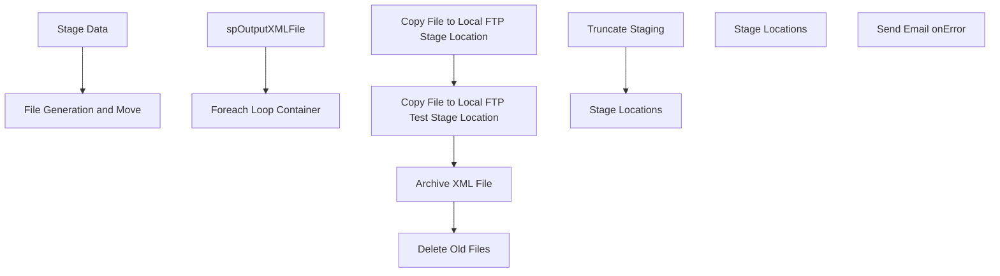

# SSIS Package: WebLocations

**Project:** WebLocations  
**Folder:** SSIS  
**Server:** STL-SSIS-P-01  

## Connection Managers

| Name | Type | Server | Catalog | Connection (sanitized) |
|---|---|---|---|---|
| IntegrationStaging | OLEDB | STL-SSIS-P-01 | IntegrationStaging | Data Source=STL-SSIS-P-01; Initial Catalog=IntegrationStaging; Provider=SQLNCLI11.1; Integrated Security=SSPI; Auto Translate=False |
| ME_01 | OLEDB | bedrockdb02 | me_01 | Data Source=bedrockdb02; Initial Catalog=me_01; Provider=SQLNCLI11.1; Integrated Security=SSPI; Auto Translate=False |
| SMTP_EMAIL | SMTP |  |  |  |
| papamart.dw | OLEDB | papamart | dw | Data Source=papamart; Initial Catalog=dw; Provider=SQLNCLI11.1; Integrated Security=SSPI; Auto Translate=False |

## Control Flow Tasks

| Task | Type |
|---|---|
| WebLocations | Package |
| File Generation and Move | SEQUENCE |
| Foreach Loop Container | FOREACHLOOP |
| Archive XML File | FileSystemTask |
| Copy File to Local FTP Stage Location | FileSystemTask |
| Copy File to Local FTP Test Stage Location | FileSystemTask |
| Delete Old Files | ExecuteSQLTask |
| spOutputXMLFile | ExecuteSQLTask |
| Stage Data | SEQUENCE |
| Stage Locations | Pipeline |
| Truncate Staging | ExecuteSQLTask |
| Stage Locations | Pipeline |
| Send Email onError | SendMailTask |

## Control Flow Outline

```text
- Send Email onError [SendMailTask]
- File Generation and Move [SEQUENCE]
  - Foreach Loop Container [FOREACHLOOP]
    - Archive XML File [FileSystemTask]
    - Copy File to Local FTP Stage Location [FileSystemTask]
    - Copy File to Local FTP Test Stage Location [FileSystemTask]
    - Delete Old Files [ExecuteSQLTask]
  - spOutputXMLFile [ExecuteSQLTask]
- Stage Data [SEQUENCE]
  - Stage Locations [Pipeline]
  - Truncate Staging [ExecuteSQLTask]
- Stage Locations [Pipeline]
```

## Architecture Diagram



## Variables

| Namespace | Name | Expression-bound |
|---|---|---|
| System | Propagate | No |
| User | FTPStageDirectory | Yes |
| User | FTPStageTestDirectory | No |
| User | LocationRename | Yes |
| User | LocationsFIleForLoop | No |

### Expression-bound variable values

#### User::FTPStageDirectory

**Expression:**

```sql
@[$Package::WebLocationsFTPStagingPath]
```

**Evaluated value:**

```sql
\\stl-sftp-p-01\ecommerce\to-deck\Inventory\Prod\
```

#### User::LocationRename

**Expression:**

```sql
"\\\\STL-SSIS-P-01\\IntegrationStaging\\WEB\\Outbound\\Locations\\Archive\\" + "WarehouseLocations" + 
(DT_WSTR, 4) YEAR( @[System::ContainerStartTime]  ) +  (DT_WSTR, 2) MONTH( @[System::ContainerStartTime]  ) + (DT_WSTR, 2) DAY( @[System::ContainerStartTime]  ) +  (DT_WSTR, 2) DATEPART("Hh", @[System::ContainerStartTime] ) + (DT_WSTR, 2) DATEPART("mi", @[System::ContainerStartTime] ) + (DT_WSTR, 2) DATEPART("ss", @[System::ContainerStartTime] ) + (DT_WSTR, 2) DATEPART("Ms", @[System::ContainerStartTime] ) + ".xml"
```

**Evaluated value:**

```sql
\\STL-SSIS-P-01\IntegrationStaging\WEB\Outbound\Locations\Archive\WarehouseLocations20235181741470.xml
```

## Execute SQL Tasks

### Delete Old Files

**Path:** `Package\File Generation and Move\Foreach Loop Container\Delete Old Files`  
**Connection:** IntegrationStaging (STL-SSIS-P-01/IntegrationStaging)  

```sql
exec spDeleteOldFiles @path = '\\STL-SSIS-P-01\IntegrationStaging\WEB\Outbound\Locations\Archive', @filemask = '*.xml', @retention = 14
```

### spOutputXMLFile

**Path:** `Package\File Generation and Move\spOutputXMLFile`  
**Connection:** IntegrationStaging (STL-SSIS-P-01/IntegrationStaging)  

> ⚠️ `SqlStatementSource` is overridden at runtime by a property expression (shown below); the static SQL may not be what executes.

**Static SqlStatementSource:**

```sql
exec WEB.spOutputXMLFile 
 @Query = 'select XMLData from IntegrationStaging.WEB.vwLocationsXML', 
 @FileLocation = '\\STL-SSIS-P-01\IntegrationStaging\WEB\Outbound\Locations\', 
 @FileName = 'WarehouseLocations.xml'
```

**Property expression (runtime override):**

```sql
"exec WEB.spOutputXMLFile 
 @Query = 'select XMLData from IntegrationStaging.WEB.vwLocationsXML', 
 @FileLocation = '" + @[$Package::WebLocationsFileStagePath]  + "', 
 @FileName = 'WarehouseLocations.xml'"
```

### Truncate Staging

**Path:** `Package\Stage Data\Truncate Staging`  
**Connection:** IntegrationStaging (STL-SSIS-P-01/IntegrationStaging)  

```sql
TRUNCATE TABLE WEB.LocationStage
```

## Data Flow: Sources

| Component | Source Object | Type | Data Flow Task | Connection | SQL Kind |
|---|---|---|---|---|---|
| vwWebLocationsForDeck |  | OLEDBSource | Stage Locations | papamart.dw |  |
| ME_01 vwWebLocations |  | OLEDBSource | Stage Locations | ME_01 |  |

## Data Flow: Destinations

| Component | Target Table | Type | Data Flow Task | Connection | SQL Kind |
|---|---|---|---|---|---|
| LocationStage |  | OLEDBDestination | Stage Locations | IntegrationStaging |  |
| LocationStage |  | OLEDBDestination | Stage Locations | IntegrationStaging |  |
