# SSIS Package: WebLocations

**Project:** WebLocations  
**Folder:** SSIS  
**Server:** STL-SSIS-P-01  

## Architecture Diagram

```mermaid
flowchart TD
    subgraph Connections
        IntegrationStaging_conn(["IntegrationStaging [OLEDB]"])
        ME_01_conn(["ME_01 [OLEDB]"])
        papamart_dw_conn(["papamart.dw [OLEDB]"])
        SMTP_EMAIL_conn(["SMTP_EMAIL [SMTP]"])
    end
    subgraph ControlFlow
        WebLocations_task["WebLocations"]
        File_Generation_and_Move_task["File Generation and Move"]
        WebLocations_task --> File_Generation_and_Move_task
        Foreach_Loop_Container_task["Foreach Loop Container"]
        File_Generation_and_Move_task --> Foreach_Loop_Container_task
        Archive_XML_File_task["Archive XML File"]
        Foreach_Loop_Container_task --> Archive_XML_File_task
        Copy_File_to_Local_FTP_Stage_Location_task["Copy File to Local FTP Stage Location"]
        Archive_XML_File_task --> Copy_File_to_Local_FTP_Stage_Location_task
        Copy_File_to_Local_FTP_Test_Stage_Location_task["Copy File to Local FTP Test Stage Location"]
        Copy_File_to_Local_FTP_Stage_Location_task --> Copy_File_to_Local_FTP_Test_Stage_Location_task
        Delete_Old_Files_task["Delete Old Files"]
        Copy_File_to_Local_FTP_Test_Stage_Location_task --> Delete_Old_Files_task
        spOutputXMLFile_task["spOutputXMLFile"]
        Delete_Old_Files_task --> spOutputXMLFile_task
        Stage_Data_task["Stage Data"]
        spOutputXMLFile_task --> Stage_Data_task
        Stage_Locations_task["Stage Locations"]
        Stage_Data_task --> Stage_Locations_task
        Truncate_Staging_task["Truncate Staging"]
        Stage_Locations_task --> Truncate_Staging_task
        Stage_Locations_task["Stage Locations"]
        Truncate_Staging_task --> Stage_Locations_task
        Send_Email_onError_task["Send Email onError"]
        Stage_Locations_task --> Send_Email_onError_task
    end
```

## Connection Managers

| Name | Type |
|---|---|
| IntegrationStaging | OLEDB |
| ME_01 | OLEDB |
| papamart.dw | OLEDB |
| SMTP_EMAIL | SMTP |

## Control Flow Tasks

| Task | Type |
|---|---|
| WebLocations | Microsoft.Package |
| File Generation and Move | STOCK:SEQUENCE |
| Foreach Loop Container | STOCK:FOREACHLOOP |
| Archive XML File | Microsoft.FileSystemTask |
| Copy File to Local FTP Stage Location | Microsoft.FileSystemTask |
| Copy File to Local FTP Test Stage Location | Microsoft.FileSystemTask |
| Delete Old Files | Microsoft.ExecuteSQLTask |
| spOutputXMLFile | Microsoft.ExecuteSQLTask |
| Stage Data | STOCK:SEQUENCE |
| Stage Locations | Microsoft.Pipeline |
| Truncate Staging | Microsoft.ExecuteSQLTask |
| Stage Locations | Microsoft.Pipeline |
| Send Email onError | Microsoft.SendMailTask |

## Data Flow: Sources

_None detected._

## Data Flow: Destinations

| Component | Destination |
|---|---|
|  | [WEB].[LocationStage] |
|  | [dbo].[vwWebLocationsForDeck] |
|  | [WEB].[LocationStage] |
|  | [dbo].[vwWebLocations] |

