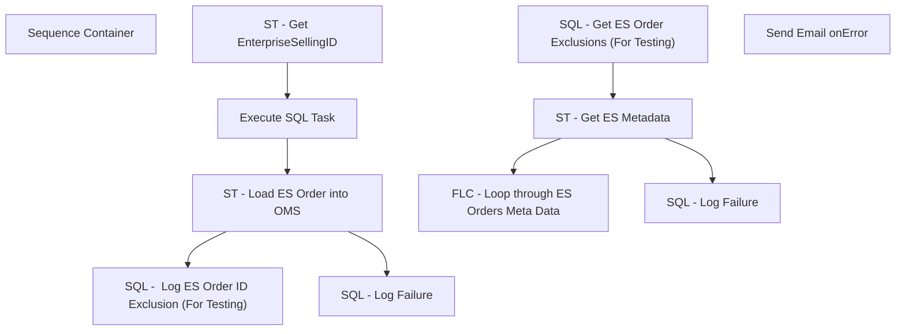

# SSIS Package: AptosEStoDeckOMS

**Project:** WebOrderProcessing  
**Folder:** SSIS  
**Server:** STL-SSIS-P-01  

## Connection Managers

_None detected._

## Control Flow Tasks

| Task | Type |
|---|---|
| AptosEStoDeckOMS | Package |
| Sequence Container | SEQUENCE |
| FLC - Loop through ES Orders Meta Data | FOREACHLOOP |
| Execute SQL Task | ExecuteSQLTask |
| SQL -  Log ES Order ID Exclusion (For Testing) | ExecuteSQLTask |
| SQL - Log Failure | ExecuteSQLTask |
| ST - Get EnterpriseSellingID | ScriptTask |
| ST - Load ES Order into OMS | ScriptTask |
| SQL - Get ES Order Exclusions (For Testing) | ExecuteSQLTask |
| SQL - Log Failure | ExecuteSQLTask |
| ST - Get ES Metadata | ScriptTask |
| Send Email onError | SendMailTask |

## Control Flow Outline

```text
- Send Email onError [SendMailTask]
- Sequence Container [SEQUENCE]
  - FLC - Loop through ES Orders Meta Data [FOREACHLOOP]
    - Execute SQL Task [ExecuteSQLTask]
    - SQL -  Log ES Order ID Exclusion (For Testing) [ExecuteSQLTask]
    - SQL - Log Failure [ExecuteSQLTask]
    - ST - Get EnterpriseSellingID [ScriptTask]
    - ST - Load ES Order into OMS [ScriptTask]
  - SQL - Get ES Order Exclusions (For Testing) [ExecuteSQLTask]
  - SQL - Log Failure [ExecuteSQLTask]
  - ST - Get ES Metadata [ScriptTask]
```

## Architecture Diagram



## Variables

| Namespace | Name | Expression-bound |
|---|---|---|
| System | Propagate | No |
| User | AptosEnterpriseSellingAPIURL | No |
| User | DeckOrderManagementServiceAPIURL | No |
| User | ESCurrentEnterpriseSellingID | No |
| User | ESInboundOrderResponseCode | No |
| User | ESInboundOrderResponseMessage | No |
| User | ESOrderCriteria | No |
| User | ESOrderFullfillingOutledIDUK | No |
| User | ESOrderFullfillingOutledIDUS | No |
| User | ESOrderMetaData | No |
| User | ESOrderOverrideEmailAddress | No |
| User | ESOrderOverrideEmailAddressFlag | No |
| User | ESOrdersMetaData | No |
| User | GetMetaDataExceptionMessage | No |
| User | TestESOrderIDExclusions | No |
| User | TestMode | No |
| User | TestNewESOrderIDtoExclude | No |
| User | TestNumberOfOrdersToCreate | No |

## Execute SQL Tasks

### Execute SQL Task

**Path:** `Package\Sequence Container\FLC - Loop through ES Orders Meta Data\Execute SQL Task`  
**Connection:** {744FE313-1064-4E79-9385-E22229882EC8}  

```sql
EXEC ES.spMergeOMSReferenceNumberBridge ?
```

### SQL -  Log ES Order ID Exclusion (For Testing)

**Path:** `Package\Sequence Container\FLC - Loop through ES Orders Meta Data\SQL -  Log ES Order ID Exclusion (For Testing)`  
**Connection:** {744FE313-1064-4E79-9385-E22229882EC8}  

```sql
INSERT INTO ES.tmpESOrderIDsToExclude
                         (ESOrderID)
VALUES        (?)
```

### SQL - Log Failure

**Path:** `Package\Sequence Container\FLC - Loop through ES Orders Meta Data\SQL - Log Failure`  
**Connection:** {F1291F69-7277-411F-B6EC-AF91B8D3B89A}  

```sql
INSERT [dbo].[ServiceLoggingGeneralUsage] (
       [Message]
      ,[IsAnException]
      ,[ServiceID])
VALUES(?, 0, 5)
```

### SQL - Get ES Order Exclusions (For Testing)

**Path:** `Package\Sequence Container\SQL - Get ES Order Exclusions (For Testing)`  
**Connection:** {744FE313-1064-4E79-9385-E22229882EC8}  

```sql
SELECT [ESOrderID]
  FROM [ES].[tmpESOrderIDsToExclude]
```

### SQL - Log Failure

**Path:** `Package\Sequence Container\SQL - Log Failure`  
**Connection:** {F1291F69-7277-411F-B6EC-AF91B8D3B89A}  

```sql
INSERT [dbo].[ServiceLoggingGeneralUsage] (
       [Message]
      ,[IsAnException]
      ,[ServiceID])
VALUES(?, 1, 5)
```

## Data Flow: Sources

_None detected._

## Data Flow: Destinations

_None detected._
