# SSIS Package: AptosEStoDeckOMS

**Project:** WebOrderProcessing  
**Folder:** SSIS  
**Server:** STL-SSIS-P-01  

## Architecture Diagram

```mermaid
flowchart TD
    subgraph ControlFlow
        AptosEStoDeckOMS_task["AptosEStoDeckOMS"]
        Sequence_Container_task["Sequence Container"]
        AptosEStoDeckOMS_task --> Sequence_Container_task
        FLC___Loop_through_ES_Orders_Meta_Data_task["FLC - Loop through ES Orders Meta Data"]
        Sequence_Container_task --> FLC___Loop_through_ES_Orders_Meta_Data_task
        Execute_SQL_Task_task["Execute SQL Task"]
        FLC___Loop_through_ES_Orders_Meta_Data_task --> Execute_SQL_Task_task
        SQL____Log_ES_Order_ID_Exclusion__For_Testing__task["SQL -  Log ES Order ID Exclusion (For Testing)"]
        Execute_SQL_Task_task --> SQL____Log_ES_Order_ID_Exclusion__For_Testing__task
        SQL___Log_Failure_task["SQL - Log Failure"]
        SQL____Log_ES_Order_ID_Exclusion__For_Testing__task --> SQL___Log_Failure_task
        ST___Get_EnterpriseSellingID_task["ST - Get EnterpriseSellingID"]
        SQL___Log_Failure_task --> ST___Get_EnterpriseSellingID_task
        ST___Load_ES_Order_into_OMS_task["ST - Load ES Order into OMS"]
        ST___Get_EnterpriseSellingID_task --> ST___Load_ES_Order_into_OMS_task
        SQL___Get_ES_Order_Exclusions__For_Testing__task["SQL - Get ES Order Exclusions (For Testing)"]
        ST___Load_ES_Order_into_OMS_task --> SQL___Get_ES_Order_Exclusions__For_Testing__task
        SQL___Log_Failure_task["SQL - Log Failure"]
        SQL___Get_ES_Order_Exclusions__For_Testing__task --> SQL___Log_Failure_task
        ST___Get_ES_Metadata_task["ST - Get ES Metadata"]
        SQL___Log_Failure_task --> ST___Get_ES_Metadata_task
        Send_Email_onError_task["Send Email onError"]
        ST___Get_ES_Metadata_task --> Send_Email_onError_task
    end
```

## Connection Managers

_None detected._

## Control Flow Tasks

| Task | Type |
|---|---|
| AptosEStoDeckOMS | Microsoft.Package |
| Sequence Container | STOCK:SEQUENCE |
| FLC - Loop through ES Orders Meta Data | STOCK:FOREACHLOOP |
| Execute SQL Task | Microsoft.ExecuteSQLTask |
| SQL -  Log ES Order ID Exclusion (For Testing) | Microsoft.ExecuteSQLTask |
| SQL - Log Failure | Microsoft.ExecuteSQLTask |
| ST - Get EnterpriseSellingID | Microsoft.ScriptTask |
| ST - Load ES Order into OMS | Microsoft.ScriptTask |
| SQL - Get ES Order Exclusions (For Testing) | Microsoft.ExecuteSQLTask |
| SQL - Log Failure | Microsoft.ExecuteSQLTask |
| ST - Get ES Metadata | Microsoft.ScriptTask |
| Send Email onError | Microsoft.SendMailTask |

## Data Flow: Sources

_None detected._

## Data Flow: Destinations

_None detected._

