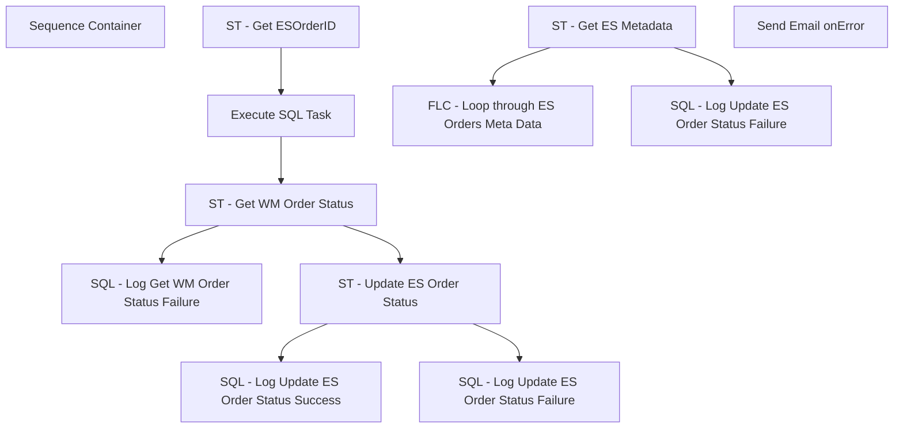

# SSIS Package: ESUpdateOrderStatus

**Project:** WebOrderProcessing  
**Folder:** SSIS  
**Server:** STL-SSIS-P-01  

## Connection Managers

_None detected._

## Control Flow Tasks

| Task | Type |
|---|---|
| ESUpdateOrderStatus | Package |
| Sequence Container | SEQUENCE |
| FLC - Loop through ES Orders Meta Data | FOREACHLOOP |
| Execute SQL Task | ExecuteSQLTask |
| SQL - Log Get WM Order Status Failure | ExecuteSQLTask |
| SQL - Log Update ES Order Status Failure | ExecuteSQLTask |
| SQL - Log Update ES Order Status Success | ExecuteSQLTask |
| ST - Get ESOrderID | ScriptTask |
| ST - Get WM Order Status | ScriptTask |
| ST - Update ES Order Status | ScriptTask |
| SQL - Log Update ES Order Status Failure | ExecuteSQLTask |
| ST - Get ES Metadata | ScriptTask |
| Send Email onError | SendMailTask |

## Control Flow Outline

```text
- Send Email onError [SendMailTask]
- Sequence Container [SEQUENCE]
  - FLC - Loop through ES Orders Meta Data [FOREACHLOOP]
    - Execute SQL Task [ExecuteSQLTask]
    - SQL - Log Get WM Order Status Failure [ExecuteSQLTask]
    - SQL - Log Update ES Order Status Failure [ExecuteSQLTask]
    - SQL - Log Update ES Order Status Success [ExecuteSQLTask]
    - ST - Get ESOrderID [ScriptTask]
    - ST - Get WM Order Status [ScriptTask]
    - ST - Update ES Order Status [ScriptTask]
  - SQL - Log Update ES Order Status Failure [ExecuteSQLTask]
  - ST - Get ES Metadata [ScriptTask]
```

## Architecture Diagram



## Variables

| Namespace | Name | Expression-bound |
|---|---|---|
| System | Propagate | No |
| User | AptosEnterpriseSellingAPIURL | No |
| User | ESOrderCreateDate | No |
| User | ESOrderCriteria | No |
| User | ESOrderFullfillingOutledIDUK | No |
| User | ESOrderFullfillingOutledIDUS | No |
| User | ESOrderID | No |
| User | ESOrderMetaData | No |
| User | ESOrdersMetaData | No |
| User | ESUpdateStatusErrorMessage | No |
| User | ESUpdateStatusMessage | No |
| User | GetMetaDataExceptionMessage | No |
| User | WMOrderData | No |
| User | WMOrderStatus | No |

## Execute SQL Tasks

### Execute SQL Task

**Path:** `Package\Sequence Container\FLC - Loop through ES Orders Meta Data\Execute SQL Task`  
**Connection:** {6c71ac67-bc98-46e8-9678-412afb3961fd}  

```sql
EXEC [WM].[spGetESUpdateOrderStatus] ?
```

### SQL - Log Get WM Order Status Failure

**Path:** `Package\Sequence Container\FLC - Loop through ES Orders Meta Data\SQL - Log Get WM Order Status Failure`  
**Connection:** {F1291F69-7277-411F-B6EC-AF91B8D3B89A}  

```sql
INSERT [dbo].[ServiceLoggingGeneralUsage] (
       [Message]
      ,[IsAnException]
      ,[ServiceID])
VALUES(?, 0, 5)
```

### SQL - Log Update ES Order Status Failure

**Path:** `Package\Sequence Container\FLC - Loop through ES Orders Meta Data\SQL - Log Update ES Order Status Failure`  
**Connection:** {F1291F69-7277-411F-B6EC-AF91B8D3B89A}  

```sql
INSERT [dbo].[ServiceLoggingGeneralUsage] (
       [Message]
      ,[IsAnException]
      ,[ServiceID])
VALUES(?, 0, 6)
```

### SQL - Log Update ES Order Status Success

**Path:** `Package\Sequence Container\FLC - Loop through ES Orders Meta Data\SQL - Log Update ES Order Status Success`  
**Connection:** {F1291F69-7277-411F-B6EC-AF91B8D3B89A}  

```sql
INSERT [dbo].[ServiceLoggingGeneralUsage] (
       [Message]
      ,[IsAnException]
      ,[ServiceID])
VALUES(?, 0, 6)
```

### SQL - Log Update ES Order Status Failure

**Path:** `Package\Sequence Container\SQL - Log Update ES Order Status Failure`  
**Connection:** {F1291F69-7277-411F-B6EC-AF91B8D3B89A}  

```sql
INSERT [dbo].[ServiceLoggingGeneralUsage] (
       [Message]
      ,[IsAnException]
      ,[ServiceID])
VALUES(?, 1, 6)
```

## Data Flow: Sources

_None detected._

## Data Flow: Destinations

_None detected._
