# SSIS Package: ESUpdateOrderStatus

**Project:** WebOrderProcessing  
**Folder:** SSIS  
**Server:** STL-SSIS-P-01  

## Architecture Diagram

```mermaid
flowchart TD
    subgraph ControlFlow
        ESUpdateOrderStatus_task["ESUpdateOrderStatus"]
        Sequence_Container_task["Sequence Container"]
        ESUpdateOrderStatus_task --> Sequence_Container_task
        FLC___Loop_through_ES_Orders_Meta_Data_task["FLC - Loop through ES Orders Meta Data"]
        Sequence_Container_task --> FLC___Loop_through_ES_Orders_Meta_Data_task
        Execute_SQL_Task_task["Execute SQL Task"]
        FLC___Loop_through_ES_Orders_Meta_Data_task --> Execute_SQL_Task_task
        SQL___Log_Get_WM_Order_Status_Failure_task["SQL - Log Get WM Order Status Failure"]
        Execute_SQL_Task_task --> SQL___Log_Get_WM_Order_Status_Failure_task
        SQL___Log_Update_ES_Order_Status_Failure_task["SQL - Log Update ES Order Status Failure"]
        SQL___Log_Get_WM_Order_Status_Failure_task --> SQL___Log_Update_ES_Order_Status_Failure_task
        SQL___Log_Update_ES_Order_Status_Success_task["SQL - Log Update ES Order Status Success"]
        SQL___Log_Update_ES_Order_Status_Failure_task --> SQL___Log_Update_ES_Order_Status_Success_task
        ST___Get_ESOrderID_task["ST - Get ESOrderID"]
        SQL___Log_Update_ES_Order_Status_Success_task --> ST___Get_ESOrderID_task
        ST___Get_WM_Order_Status_task["ST - Get WM Order Status"]
        ST___Get_ESOrderID_task --> ST___Get_WM_Order_Status_task
        ST___Update_ES_Order_Status_task["ST - Update ES Order Status"]
        ST___Get_WM_Order_Status_task --> ST___Update_ES_Order_Status_task
        SQL___Log_Update_ES_Order_Status_Failure_task["SQL - Log Update ES Order Status Failure"]
        ST___Update_ES_Order_Status_task --> SQL___Log_Update_ES_Order_Status_Failure_task
        ST___Get_ES_Metadata_task["ST - Get ES Metadata"]
        SQL___Log_Update_ES_Order_Status_Failure_task --> ST___Get_ES_Metadata_task
        Send_Email_onError_task["Send Email onError"]
        ST___Get_ES_Metadata_task --> Send_Email_onError_task
    end
```

## Connection Managers

_None detected._

## Control Flow Tasks

| Task | Type |
|---|---|
| ESUpdateOrderStatus | Microsoft.Package |
| Sequence Container | STOCK:SEQUENCE |
| FLC - Loop through ES Orders Meta Data | STOCK:FOREACHLOOP |
| Execute SQL Task | Microsoft.ExecuteSQLTask |
| SQL - Log Get WM Order Status Failure | Microsoft.ExecuteSQLTask |
| SQL - Log Update ES Order Status Failure | Microsoft.ExecuteSQLTask |
| SQL - Log Update ES Order Status Success | Microsoft.ExecuteSQLTask |
| ST - Get ESOrderID | Microsoft.ScriptTask |
| ST - Get WM Order Status | Microsoft.ScriptTask |
| ST - Update ES Order Status | Microsoft.ScriptTask |
| SQL - Log Update ES Order Status Failure | Microsoft.ExecuteSQLTask |
| ST - Get ES Metadata | Microsoft.ScriptTask |
| Send Email onError | Microsoft.SendMailTask |

## Data Flow: Sources

_None detected._

## Data Flow: Destinations

_None detected._

