# SSIS Package: ImportOMS

**Project:** WebOrderProcessing  
**Folder:** SSIS  
**Server:** STL-SSIS-P-01  

## Connection Managers

| Name | Type | Server | Catalog | Connection (sanitized) |
|---|---|---|---|---|
| Failure3 | FILE |  |  |  |
| HTTP Connection Manager | HTTP (KingswaySoft) |  |  |  |
| STL-SSIS-T-01.IntegrationStaging | ADO.NET:System.Data.SqlClient.SqlConnection, System.Data, Version=4.0.0.0, Culture=neutral, PublicKeyToken=b77a5c561934e089 | STL-SSIS-T-01 | IntegrationStaging | Data Source=STL-SSIS-T-01; Initial Catalog=IntegrationStaging; Integrated Security=True; Application Name=SSIS-ImportOMS-{8A09B2FD-8A9B-49DA-B2DC-DB44053A2A07}STL-SSIS-T-01.IntegrationStaging |
| STL-SSIS-T-01.IntegrationStaging 1 | OLEDB | STL-SSIS-T-01 | IntegrationStaging | Data Source=STL-SSIS-T-01; Initial Catalog=IntegrationStaging; Provider=SQLNCLI11.1; Integrated Security=SSPI; Auto Translate=False |
| bedrockdb02.esell | OLEDB | bedrocktestdb02 | esell | Data Source=bedrocktestdb02; Initial Catalog=esell; Provider=SQLNCLI11.1; Integrated Security=SSPI; Auto Translate=False |

## Control Flow Tasks

| Task | Type |
|---|---|
| ImportOMS | Package |
| Delete bad US files | FOREACHLOOP |
| Delete bad US Files | FileSystemTask |
| File System Task 1 | FileSystemTask |
| Process US Orders | SEQUENCE |
| Execute Process Task | ExecuteProcess |
| SEC - Process eComm Orders to D365 | SEQUENCE |
| EST - Get eComm OrderIds | ExecuteSQLTask |
| Foreach Loop Container | FOREACHLOOP |
| DFT - Send orders to D365 | Pipeline |
| Sequence Container | SEQUENCE |
| Flip the PickTicketFlag | Pipeline |
| Insert into Enterprise Selling Staging Table | Pipeline |
| Merge to Enterprise selling | ExecuteSQLTask |
| SQL- Truncate StoreOrderQtyStage | ExecuteSQLTask |
| Sequence Container 1 | SEQUENCE |
| Execute Process Task | ExecuteProcess |
| Send Email onError | SendMailTask |
| Delete bad files UK | FOREACHLOOP |
| File System Task | FileSystemTask |
| File System Task 1 | FileSystemTask |
| Delete bad files US | FOREACHLOOP |
| File System Task | FileSystemTask |
| File System Task 1 | FileSystemTask |
| Send Email onError | SendMailTask |

## Control Flow Outline

```text
- Send Email onError [SendMailTask]
- Delete bad files UK [FOREACHLOOP]
  - File System Task [FileSystemTask]
  - File System Task 1 [FileSystemTask]
- Delete bad files US [FOREACHLOOP]
  - File System Task [FileSystemTask]
  - File System Task 1 [FileSystemTask]
- Send Email onError [SendMailTask]
- Delete bad US files [FOREACHLOOP]
  - Delete bad US Files [FileSystemTask]
  - File System Task 1 [FileSystemTask]
- Process US Orders [SEQUENCE]
  - Execute Process Task [ExecuteProcess]
- SEC - Process eComm Orders to D365 [SEQUENCE]
  - EST - Get eComm OrderIds [ExecuteSQLTask]
  - Foreach Loop Container [FOREACHLOOP]
    - DFT - Send orders to D365 [Pipeline]
- Sequence Container [SEQUENCE]
- Sequence Container 1 [SEQUENCE]
  - Execute Process Task [ExecuteProcess]
  - Flip the PickTicketFlag [Pipeline]
  - Insert into Enterprise Selling Staging Table [Pipeline]
  - Merge to Enterprise selling [ExecuteSQLTask]
  - SQL- Truncate StoreOrderQtyStage [ExecuteSQLTask]
```

## Architecture Diagram

```mermaid
flowchart TD
    n_Package_Delete_bad_US_files["Delete bad US files"]
    n_Package_Delete_bad_US_files_Delete_bad_US_Files["Delete bad US Files"]
    n_Package_Delete_bad_US_files_File_System_Task_1["File System Task 1"]
    n_Package_Process_US_Orders["Process US Orders"]
    n_Package_Process_US_Orders_Execute_Process_Task["Execute Process Task"]
    n_Package_SEC___Process_eComm_Orders_to_D365["SEC - Process eComm Orders to D365"]
    n_Package_SEC___Process_eComm_Orders_to_D365_EST___Get_eComm_OrderIds["EST - Get eComm OrderIds"]
    n_Package_SEC___Process_eComm_Orders_to_D365_Foreach_Loop_Container["Foreach Loop Container"]
    n_Package_SEC___Process_eComm_Orders_to_D365_Foreach_Loop_Container_DFT___Send_orders_to_D365["DFT - Send orders to D365"]
    n_Package_Sequence_Container["Sequence Container"]
    n_Package_Sequence_Container_Flip_the_PickTicketFlag["Flip the PickTicketFlag"]
    n_Package_Sequence_Container_Insert_into_Enterprise_Selling_Staging_Table["Insert into Enterprise Selling Staging Table"]
    n_Package_Sequence_Container_Merge_to_Enterprise_selling["Merge to Enterprise selling"]
    n_Package_Sequence_Container_SQL__Truncate_StoreOrderQtyStage["SQL- Truncate StoreOrderQtyStage"]
    n_Package_Sequence_Container_1["Sequence Container 1"]
    n_Package_Sequence_Container_1_Execute_Process_Task["Execute Process Task"]
    n_Package_EventHandlers_OnError__Send_Email_onError["Send Email onError"]
    n_Package_EventHandlers_OnTaskFailed__Delete_bad_files_UK["Delete bad files UK"]
    n_Package_EventHandlers_OnTaskFailed__Delete_bad_files_UK_File_System_Task["File System Task"]
    n_Package_EventHandlers_OnTaskFailed__Delete_bad_files_UK_File_System_Task_1["File System Task 1"]
    n_Package_EventHandlers_OnTaskFailed__Delete_bad_files_US["Delete bad files US"]
    n_Package_EventHandlers_OnTaskFailed__Delete_bad_files_US_File_System_Task["File System Task"]
    n_Package_EventHandlers_OnTaskFailed__Delete_bad_files_US_File_System_Task_1["File System Task 1"]
    n_Package_EventHandlers_OnTaskFailed__Send_Email_onError["Send Email onError"]
    n_Package_Delete_bad_US_files_Delete_bad_US_Files --> n_Package_Delete_bad_US_files_File_System_Task_1
    n_Package_SEC___Process_eComm_Orders_to_D365_EST___Get_eComm_OrderIds --> n_Package_SEC___Process_eComm_Orders_to_D365_Foreach_Loop_Container
    n_Package_Sequence_Container_Insert_into_Enterprise_Selling_Staging_Table --> n_Package_Sequence_Container_Merge_to_Enterprise_selling
    n_Package_Sequence_Container_Merge_to_Enterprise_selling --> n_Package_Sequence_Container_Flip_the_PickTicketFlag
    n_Package_Sequence_Container_SQL__Truncate_StoreOrderQtyStage --> n_Package_Sequence_Container_Insert_into_Enterprise_Selling_Staging_Table
    n_Package_Sequence_Container --> n_Package_Delete_bad_US_files
    n_Package_Process_US_Orders --> n_Package_Sequence_Container_1
    n_Package_Sequence_Container_1 --> n_Package_Sequence_Container
    n_Package_EventHandlers_OnTaskFailed__Delete_bad_files_UK_File_System_Task --> n_Package_EventHandlers_OnTaskFailed__Delete_bad_files_UK_File_System_Task_1
    n_Package_EventHandlers_OnTaskFailed__Delete_bad_files_US_File_System_Task --> n_Package_EventHandlers_OnTaskFailed__Delete_bad_files_US_File_System_Task_1
    n_Package_EventHandlers_OnTaskFailed__Delete_bad_files_US --> n_Package_EventHandlers_OnTaskFailed__Delete_bad_files_UK
    n_Package_EventHandlers_OnTaskFailed__Send_Email_onError --> n_Package_EventHandlers_OnTaskFailed__Delete_bad_files_US
```



## Variables

| Namespace | Name | Expression-bound |
|---|---|---|
| System | Propagate | No |
| System | Propagate | No |
| System | Propagate | No |
| User | CartonFileName | Yes |
| User | CartonNumber | No |
| User | ErrorFileList | No |
| User | FileName | No |
| User | FilePath | No |
| User | FileTest | No |
| User | FileTest2 | Yes |
| User | FileToDelete | Yes |
| User | FileToDeleteUK | Yes |
| User | FileToMove | Yes |
| User | FileToMoveUK | Yes |
| User | FullFile | Yes |
| User | LabelDestinationFolder | No |
| User | LabelFileName | No |
| User | OrderId | No |
| User | OrderIds | No |
| User | OrderInd | No |
| User | OrderNumber | Yes |
| User | SortedFileList | No |
| User | StoreOrderIds | No |
| User | SuccessFile | No |
| User | TempFileName | Yes |
| User | UKDoNotFTPFile | Yes |
| User | UKSortedFileList | No |
| User | UKSuccessFile | Yes |
| User | Variable | No |
| User | Variable2 | No |
| User | WMSXMLFileName | Yes |

### Expression-bound variable values

#### User::CartonFileName

**Expression:**

```sql
@[User::LabelDestinationFolder]  +  @[User::CartonNumber]
```

**Evaluated value:**

```sql
\\sharebear1\shared\warehouseprinting\success\
```

#### User::FileTest2

**Expression:**

```sql
RIGHT( LEFT( @[User::FileTest] ,25),10)
```

#### User::FileToDelete

**Expression:**

```sql
@[$Project::OmsXmlFolder] +  @[User::FileName]
```

**Evaluated value:**

```sql
\\kermode\FileRepository\omsTestOrders\babw-us\
```

#### User::FileToDeleteUK

**Expression:**

```sql
@[$Project::ukOMSFolder]  + @[User::FileName]
```

**Evaluated value:**

```sql
\\kermode\f$\FileRepository\omsTestOrders\babw-uk\
```

#### User::FileToMove

**Expression:**

```sql
@[$Project::OmsXmlFolder] +"Temp\\"+  @[User::FileName]
```

**Evaluated value:**

```sql
\\kermode\FileRepository\omsTestOrders\babw-us\Temp\
```

#### User::FileToMoveUK

**Expression:**

```sql
@[$Project::ukOMSFolder] +"TempFailure\\"+  @[User::FileName]
```

**Evaluated value:**

```sql
\\kermode\f$\FileRepository\omsTestOrders\babw-uk\TempFailure\
```

#### User::FullFile

**Expression:**

```sql
@[User::FilePath] +  @[User::FileName]
```

#### User::OrderNumber

**Expression:**

```sql
REPLACE( @[User::FileName] , @[$Project::ukOMSFolder] , @[$Project::ukOMSFolder] +"Temp\\" )
```

#### User::TempFileName

**Expression:**

```sql
REPLACE( @[User::FileName] , @[$Project::ukOMSFolder] , @[$Project::ukOMSFolder] +"Temp\\" )
```

#### User::UKDoNotFTPFile

**Expression:**

```sql
REPLACE( @[User::FileName] , @[$Project::ukOMSFolder] , @[$Project::ukOMSFolder] +"Success\\DoNotFTP\\" )
```

#### User::UKSuccessFile

**Expression:**

```sql
REPLACE( @[User::FileName] , @[$Project::ukOMSFolder] , @[$Project::ukOMSFolder] +"Success\\")
```

#### User::WMSXMLFileName

**Expression:**

```sql
Replace(@[$Project::WmsXmlFileName]  ,".",
 Left(REPLACE(  REPLACE( REPLACE(  REPLACE(   (DT_STR, 30, 1252) GETDATE(),"-",""),":",""),".","")," ",""),17) + ".")
```

**Evaluated value:**

```sql
PickTicket20220224083829904.xml
```

## Execute SQL Tasks

### EST - Get eComm OrderIds

**Path:** `Package\SEC - Process eComm Orders to D365\EST - Get eComm OrderIds`  
**Connection:** {6c71ac67-bc98-46e8-9678-412afb3961fd}  

```sql
SELECT DISTINCT O1.OrderId
FROM  WM.Orders O1 
inner join wm.Orderstatus s on O1.OrderID = s.OrderID and currentstatus = 1
inner join wm.OrderItems oi on O1.OrderId = oi.OrderId AND LEN(oi.sku) = 6
where  ISNULL(PickTicketFlag,0) = 0 and SourceSite = 'BABW-US'  and OrderStatus = 'Pending'  and charindex('_',orderNum,1) > 0
and O1.PickupStore = 13
```

### Merge to Enterprise selling

**Path:** `Package\Sequence Container\Merge to Enterprise selling`  
**Connection:** bedrockdb02.esell (bedrocktestdb02/esell)  

```sql
exec spMergeEnterpriseSellingStoreOrderQty
```

### SQL- Truncate StoreOrderQtyStage

**Path:** `Package\Sequence Container\SQL- Truncate StoreOrderQtyStage`  
**Connection:** bedrockdb02.esell (bedrocktestdb02/esell)  

```sql
TRUNCATE TABLE dbo.StoreOrderQtyStage
```

## Data Flow: Sources

| Component | Source Object | Type | Data Flow Task | Connection | SQL Kind |
|---|---|---|---|---|---|
| DeliveryModes |  | OLEDBSource | DFT - Send orders to D365 | {744FE313-1064-4E79-9385-E22229882EC8}:external |  |
| Order Items |  | OLEDBSource | DFT - Send orders to D365 | {6c71ac67-bc98-46e8-9678-412afb3961fd}:external | SqlCommand |
| WebOrders |  | OLEDBSource | DFT - Send orders to D365 | {6c71ac67-bc98-46e8-9678-412afb3961fd}:external | SqlCommand |
| OLE DB Source |  | OLEDBSource | Flip the PickTicketFlag | {6c71ac67-bc98-46e8-9678-412afb3961fd}:external | SqlCommand |
| OLE DB Source |  | OLEDBSource | Insert into Enterprise Selling Staging Table | {6c71ac67-bc98-46e8-9678-412afb3961fd}:external |  |

#### Order Items — SqlCommand

```sql
SELECT oi.OrderId
      ,oi.qty AS SalesQty
	  ,CASE
	    WHEN oio.OverrideSku IS NULL THEN oi.sku
	    ELSE oio.OverrideSku
	   END AS ItemID
	  ,oi.Price AS eCommUnitPrice
	  ,0.00 AS totalValue
	  ,ROW_NUMBER() OVER(PARTITION BY oi.OrderId ORDER BY oi.OrderId ASC) AS lineNumber
FROM  WM.OrderItems AS oi 
INNER JOIN WM.Orders AS o ON oi.OrderId = o.OrderId
INNER JOIN WM.OrderStatus AS os ON o.OrderId = os.OrderId AND os.CurrentStatus = 1
LEFT JOIN WM.OrderItemOverride AS oio ON oi.sku = oio.OriginalSku
WHERE (ISNULL(o.PickTicketFlag, 0) = 0) 
AND (o.SourceSite = 'BABW-US') 
AND (o.OrderStatus = 'Pending') 
AND (CHARINDEX('_', o.OrderNum, 1) > 0)
AND LEN(oi.sku) = 6 AND oi.OrderId = ?
```

#### WebOrders — SqlCommand

```sql
SELECT DISTINCT O1.OrderId
,OrderNum AS ECommOrderRefNum
,OrderType
,CONCAT(ShipToFName, ' ', ShipToLName) AS DeliveryName
,CONCAT(ShipToAddress1, ' ', ShipToAddress2) AS Address
,ShipToCity AS City
,CASE
  WHEN ShipToCountry IN ('US', 'CA') THEN ShipToState 
  ELSE ''
 END AS State
,CASE
	WHEN CHARINDEX('-', ShipToPostalCode) = 0 THEN ShipToPostalCode
	ELSE SUBSTRING(ShipToPostalCode, 0,CHARINDEX('-', ShipToPostalCode))
END AS ZipCode
,ShipToCountry AS Country
,ShippingMethod AS DeliveryMode
,PickTicketFlag
FROM  WM.Orders O1 
inner join wm.Orderstatus s on O1.OrderID = s.OrderID and currentstatus = 1
inner join wm.OrderItems oi on O1.OrderId = oi.OrderId AND LEN(oi.sku) = 6
where  ISNULL(PickTicketFlag,0) = 0 and SourceSite = 'BABW-US'  and OrderStatus = 'Pending'  and charindex('_',orderNum,1) > 0 and O1.OrderId = ?
```

#### OLE DB Source — SqlCommand

```sql
SELECT DISTINCT O1.OrderId
FROM   WM.Orders AS O1 
INNER JOIN WM.OrderStatus AS s ON O1.OrderId = s.OrderId AND s.CurrentStatus = 1 
INNER JOIN WM.OrderItems AS oi ON O1.OrderId = oi.OrderId AND LEN(oi.sku) = 6
WHERE (ISNULL(O1.PickTicketFlag, 0) = 0) AND (O1.SourceSite = 'BABW-US') AND (O1.OrderStatus = 'Pending') AND (CHARINDEX('_', O1.OrderNum, 1) > 0) 
AND (O1.PickupStore <> 13)
```

## Data Flow: Destinations

| Component | Target Table | Type | Data Flow Task | Connection | SQL Kind |
|---|---|---|---|---|---|
| OLE DB Destination |  | OLEDBDestination | DFT - Send orders to D365 | {744FE313-1064-4E79-9385-E22229882EC8}:external |  |
| OLE DB Destination |  | OLEDBDestination | Insert into Enterprise Selling Staging Table | bedrockdb02.esell |  |
