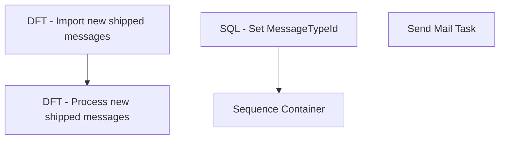

# SSIS Package: ManageD365ShipMessages

**Project:** WebOrderProcessing  
**Folder:** SSIS  
**Server:** STL-SSIS-P-01  

## Connection Managers

| Name | Type | Server | Catalog | Connection (sanitized) |
|---|---|---|---|---|
| Azure Service Bus Connection Manager | Azure Service Bus (KingswaySoft) |  |  |  |
| HTTP Connection Manager | HTTP (KingswaySoft) |  |  |  |

## Control Flow Tasks

| Task | Type |
|---|---|
| ManageD365ShipMessages | Package |
| Sequence Container | SEQUENCE |
| DFT - Import new shipped messages | Pipeline |
| DFT - Process new shipped messages | Pipeline |
| SQL - Set MessageTypeId | ExecuteSQLTask |
| Send Mail Task | SendMailTask |

## Control Flow Outline

```text
- Send Mail Task [SendMailTask]
- SQL - Set MessageTypeId [ExecuteSQLTask]
- Sequence Container [SEQUENCE]
  - DFT - Import new shipped messages [Pipeline]
  - DFT - Process new shipped messages [Pipeline]
```

## Architecture Diagram



## Variables

| Namespace | Name | Expression-bound |
|---|---|---|
| System | Propagate | No |
| User | DateTimeStamp | Yes |
| User | EndDate | Yes |
| User | EndDateAsDATE | Yes |
| User | GetDate | Yes |
| User | GetDateAsDATE | Yes |
| User | MessageTypeId | No |
| User | StartDate | Yes |
| User | StartDateAsDATE | Yes |

### Expression-bound variable values

#### User::DateTimeStamp

**Expression:**

```sql
(DT_WSTR,4)DATEPART("yyyy",GetDate()) 
+ (DT_WSTR,4)DATEPART("mm",GetDate()) 
+ (DT_WSTR,4)DATEPART("dd",GetDate()) 
+ (DT_WSTR,4)DATEPART("hh",GetDate()) 
+ (DT_WSTR,4)DATEPART("mi",GetDate()) 
+ (DT_WSTR,4)DATEPART("ss",GetDate()) 
+ (DT_WSTR,4)DATEPART("ms",GetDate())
```

**Evaluated value:**

```sql
20222248383057
```

#### User::EndDate

**Expression:**

```sql
dateadd("dd", @[$Package::DaysToInclude], @[User::StartDate])
```

**Evaluated value:**

```sql
2/24/2022
```

#### User::EndDateAsDATE

**Expression:**

```sql
(DT_WSTR, 4) datepart("year", @[User::EndDate])  + "-" + 
(DT_WSTR, 2) datepart("mm", @[User::EndDate])  + "-" + 
(DT_WSTR, 2) datepart("dd",  @[User::EndDate])
```

**Evaluated value:**

```sql
2022-2-24
```

#### User::GetDate

**Expression:**

```sql
(DT_DATE)DATEDIFF("Day", (DT_DATE) 0, GETDATE())
```

**Evaluated value:**

```sql
2/24/2022
```

#### User::GetDateAsDATE

**Expression:**

```sql
(DT_WSTR, 4) datepart("year", @[User::GetDate])  + "-" + 
(DT_WSTR, 2) datepart("mm", @[User::GetDate])  + "-" + 
(DT_WSTR, 2) datepart("dd",  @[User::GetDate])
```

**Evaluated value:**

```sql
2022-2-24
```

#### User::StartDate

**Expression:**

```sql
dateadd("dd", -@[$Package::DaysToGoBack] , @[User::GetDate] )
```

**Evaluated value:**

```sql
2/23/2022
```

#### User::StartDateAsDATE

**Expression:**

```sql
(DT_WSTR, 4) datepart("year", @[User::StartDate])  + "-" + 
(DT_WSTR, 2) datepart("mm", @[User::StartDate])  + "-" + 
(DT_WSTR, 2) datepart("dd",  @[User::StartDate])
```

**Evaluated value:**

```sql
2022-2-23
```

## Execute SQL Tasks

### SQL - Set MessageTypeId

**Path:** `Package\SQL - Set MessageTypeId`  
**Connection:** {744FE313-1064-4E79-9385-E22229882EC8}  

```sql
SELECT [MessageTypeId]
FROM [IntegrationStaging].[WMS].[WMServiceBusMessageType]
  WHERE [Description] = 'outboundso-ship'
```

## Data Flow: Sources

| Component | Source Object | Type | Data Flow Task | Connection | SQL Kind |
|---|---|---|---|---|---|
| OLE DB Source |  | OLEDBSource | DFT - Process new shipped messages | {744FE313-1064-4E79-9385-E22229882EC8}:external | SqlCommand |

#### OLE DB Source — SqlCommand

```sql
SELECT [ServiceBusMessageId]
      ,[MessageId]
      ,[Message]
      ,[Sequence]
      ,[MessageTypeId]
      ,[EnqueuedTimeUTC]
  FROM [IntegrationStaging].[WMS].[WMServiceBusMessage] WITH(NOLOCK)
  WHERE ServiceBusMessageId IN (SELECT MAX(ServiceBusMessageID) FROM [IntegrationStaging].[WMS].[WMServiceBusMessage] WITH(NOLOCK) WHERE MessageTypeId = ? AND DATEDIFF(MINUTE, EnqueuedTimeUTC, GETUTCDATE()) < ? 
GROUP BY MessageId)
```

## Data Flow: Destinations

| Component | Target Table | Type | Data Flow Task | Connection | SQL Kind |
|---|---|---|---|---|---|
| OLE DB Destination |  | OLEDBDestination | DFT - Import new shipped messages | {744FE313-1064-4E79-9385-E22229882EC8}:external |  |
| OLE DB Destination |  | OLEDBDestination | DFT - Process new shipped messages | {744FE313-1064-4E79-9385-E22229882EC8}:external |  |
