# SSIS Package: ManageD36WaveMessages

**Project:** WebOrderProcessing  
**Folder:** SSIS  
**Server:** STL-SSIS-P-01  

## Architecture Diagram

```mermaid
flowchart TD
    subgraph Connections
        Azure_Service_Bus_Connection_Manager_conn(["Azure Service Bus Connection Manager [Azure Service Bus (KingswaySoft)]"])
        HTTP_Connection_Manager_conn(["HTTP Connection Manager [HTTP (KingswaySoft)]"])
    end
    subgraph ControlFlow
        ManageD36WaveMessages_task["ManageD36WaveMessages"]
        Sequence_Container_task["Sequence Container"]
        ManageD36WaveMessages_task --> Sequence_Container_task
        Data_Flow_Task_task["Data Flow Task"]
        Sequence_Container_task --> Data_Flow_Task_task
        DFT___Import_new_waved_messages_task["DFT - Import new waved messages"]
        Data_Flow_Task_task --> DFT___Import_new_waved_messages_task
        DFT___Process_new_waved_messages_task["DFT - Process new waved messages"]
        DFT___Import_new_waved_messages_task --> DFT___Process_new_waved_messages_task
        DFT___Process_new_waves_task["DFT - Process new waves"]
        DFT___Process_new_waved_messages_task --> DFT___Process_new_waves_task
        SQL___Set_MessageTypeId_task["SQL - Set MessageTypeId"]
        DFT___Process_new_waves_task --> SQL___Set_MessageTypeId_task
        Send_Mail_Task_task["Send Mail Task"]
        SQL___Set_MessageTypeId_task --> Send_Mail_Task_task
    end
```

## Connection Managers

| Name | Type |
|---|---|
| Azure Service Bus Connection Manager | Azure Service Bus (KingswaySoft) |
| HTTP Connection Manager | HTTP (KingswaySoft) |

## Control Flow Tasks

| Task | Type |
|---|---|
| ManageD36WaveMessages | Microsoft.Package |
| Sequence Container | STOCK:SEQUENCE |
| Data Flow Task | Microsoft.Pipeline |
| DFT - Import new waved messages | Microsoft.Pipeline |
| DFT - Process new waved messages | Microsoft.Pipeline |
| DFT - Process new waves | Microsoft.Pipeline |
| SQL - Set MessageTypeId | Microsoft.ExecuteSQLTask |
| Send Mail Task | Microsoft.SendMailTask |

## Data Flow: Sources

| Component | SQL Preview |
|---|---|
|  | UPDATE [IntegrationStaging].[WMS].[eCommWaveStatus] SET isWaved = 1 WHERE WaveID = ? |
|  | UPDATE [IntegrationStaging].[WMS].[eCommWaveStatus] SET MessageCount = ? WHERE WaveID = ? |
|  | SELECT * FROM [IntegrationStaging].[WMS].[eCommWaveStatus] WHERE isWaved = 0 |
|  | select * from [WMS].[WMServiceBusMessage] |
|  | SELECT [WaveId]       ,[ReleasedDateAndTime]       ,[Warehouse]       ,[ShipmentStatus]       ,[ContainerId]       ,[MasterTrackingNumber]       ,[ItemId]       ,[SalesPoolId]       ,[DeckSalesOrderReferenceNumber]       ,[OrderNum]       ,[WorkId]       ,[ServiceBusSequence]   FROM [IntegrationStaging].[WMS].[SalesOrderStatusUpdateWaved]   WHERE DATEDIFF(HOUR, ReleasedDateAndTime, GETUTCDATE()) < |
|  | SELECT [ServiceBusMessageId]       ,[MessageId]       ,[Message]       ,[Sequence]       ,[MessageTypeId]       ,[EnqueuedTimeUTC]   FROM [IntegrationStaging].[WMS].[WMServiceBusMessage] WITH(NOLOCK)   WHERE ServiceBusMessageId IN (SELECT MAX(ServiceBusMessageID) FROM [IntegrationStaging].[WMS].[WMServiceBusMessage] WITH(NOLOCK) WHERE MessageTypeId = ?  --AND EnqueuedTimeUTC BETWEEN '2020-09-11 00 |
|  | SELECT v.[WaveId] FROM [IntegrationStaging].[WMS].[vwSalesOrderStatusUpdateWaved] v LEFT JOIN [IntegrationStaging].[WMS].[eCommWaveStatus] e WITH(NOLOCK) ON v.WaveId = e.WaveID WHERE e.WaveId IS NULL AND v.WaveId IS NOT NULL GROUP BY v.WaveId |

## Data Flow: Destinations

| Component | Destination |
|---|---|
|  | [WMS].[vweCommWavedMessageCount] |
|  | [WMS].[WMServiceBusMessage] |
|  | [WMS].[SalesOrderStatusUpdateWaved] |
|  | [WMS].[SalesOrderStatusUpdateWaved_Rejected] |
|  | [WMS].[eCommWaveStatus] |
|  | [WMS].[vweCommNewWaves] |

