# SSIS Package: MoveWMShippingSpoolFiles

**Project:** WebOrderProcessing  
**Folder:** SSIS  
**Server:** STL-SSIS-P-01  

## Architecture Diagram

```mermaid
flowchart TD
    subgraph Connections
        wmapptest_RSMonarch_conn(["wmapptest_RSMonarch [FILE]"])
    end
    subgraph ControlFlow
        MoveWMShippingSpoolFiles_task["MoveWMShippingSpoolFiles"]
        Clear_Temp_File_task["Clear Temp File"]
        MoveWMShippingSpoolFiles_task --> Clear_Temp_File_task
        File_System_Task_task["File System Task"]
        Clear_Temp_File_task --> File_System_Task_task
        ForeachLoop___Move_Spool_Files_task["ForeachLoop - Move Spool Files"]
        File_System_Task_task --> ForeachLoop___Move_Spool_Files_task
        Archive_File_task["Archive File"]
        ForeachLoop___Move_Spool_Files_task --> Archive_File_task
        Move_Spool_File_to_CLB_SSRS_P_01_task["Move Spool File to CLB-SSRS-P-01"]
        Archive_File_task --> Move_Spool_File_to_CLB_SSRS_P_01_task
        Rename_Carton_Loop_task["Rename Carton Loop"]
        Move_Spool_File_to_CLB_SSRS_P_01_task --> Rename_Carton_Loop_task
        Copy_file_to_OH_task["Copy file to OH"]
        Rename_Carton_Loop_task --> Copy_file_to_OH_task
        CopyToTemp_task["CopyToTemp"]
        Copy_file_to_OH_task --> CopyToTemp_task
        Create_Order_Directory_task["Create Order Directory"]
        CopyToTemp_task --> Create_Order_Directory_task
        Delete_old_File_task["Delete old File"]
        Create_Order_Directory_task --> Delete_old_File_task
        DeleteFile_task["DeleteFile"]
        Delete_old_File_task --> DeleteFile_task
        Execute_SQL_Task_task["Execute SQL Task"]
        DeleteFile_task --> Execute_SQL_Task_task
        Extract_Carton___task["Extract Carton #"]
        Execute_SQL_Task_task --> Extract_Carton___task
        Send_Email_onError_task["Send Email onError"]
        Extract_Carton___task --> Send_Email_onError_task
    end
```

## Connection Managers

| Name | Type |
|---|---|
| wmapptest_RSMonarch | FILE |

## Control Flow Tasks

| Task | Type |
|---|---|
| MoveWMShippingSpoolFiles | Microsoft.Package |
| Clear Temp File | STOCK:FOREACHLOOP |
| File System Task | Microsoft.FileSystemTask |
| ForeachLoop - Move Spool Files | STOCK:FOREACHLOOP |
| Archive File | Microsoft.FileSystemTask |
| Move Spool File to CLB-SSRS-P-01 | Microsoft.FileSystemTask |
| Rename Carton Loop | STOCK:FOREACHLOOP |
| Copy file to OH | Microsoft.FileSystemTask |
| CopyToTemp | Microsoft.FileSystemTask |
| Create Order Directory | Microsoft.FileSystemTask |
| Delete old File | Microsoft.FileSystemTask |
| DeleteFile | Microsoft.FileSystemTask |
| Execute SQL Task | Microsoft.ExecuteSQLTask |
| Extract Carton # | Microsoft.ScriptTask |
| Send Email onError | Microsoft.SendMailTask |

## Data Flow: Sources

_None detected._

## Data Flow: Destinations

_None detected._

