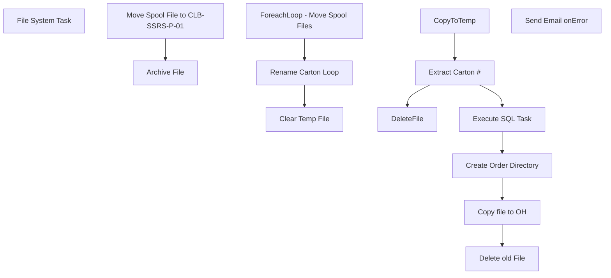

# SSIS Package: MoveWMShippingSpoolFiles

**Project:** WebOrderProcessing  
**Folder:** SSIS  
**Server:** STL-SSIS-P-01  

## Connection Managers

| Name | Type | Server | Catalog | Connection (sanitized) |
|---|---|---|---|---|
| wmapptest_RSMonarch | FILE |  |  |  |

## Control Flow Tasks

| Task | Type |
|---|---|
| MoveWMShippingSpoolFiles | Package |
| Clear Temp File | FOREACHLOOP |
| File System Task | FileSystemTask |
| ForeachLoop - Move Spool Files | FOREACHLOOP |
| Archive File | FileSystemTask |
| Move Spool File to CLB-SSRS-P-01 | FileSystemTask |
| Rename Carton Loop | FOREACHLOOP |
| Copy file to OH | FileSystemTask |
| CopyToTemp | FileSystemTask |
| Create Order Directory | FileSystemTask |
| Delete old File | FileSystemTask |
| DeleteFile | FileSystemTask |
| Execute SQL Task | ExecuteSQLTask |
| Extract Carton # | ScriptTask |
| Send Email onError | SendMailTask |

## Control Flow Outline

```text
- Send Email onError [SendMailTask]
- Clear Temp File [FOREACHLOOP]
  - File System Task [FileSystemTask]
- ForeachLoop - Move Spool Files [FOREACHLOOP]
  - Archive File [FileSystemTask]
  - Move Spool File to CLB-SSRS-P-01 [FileSystemTask]
- Rename Carton Loop [FOREACHLOOP]
  - Copy file to OH [FileSystemTask]
  - CopyToTemp [FileSystemTask]
  - Create Order Directory [FileSystemTask]
  - Delete old File [FileSystemTask]
  - DeleteFile [FileSystemTask]
  - Execute SQL Task [ExecuteSQLTask]
  - Extract Carton # [ScriptTask]
```

## Architecture Diagram



## Variables

| Namespace | Name | Expression-bound |
|---|---|---|
| System | Propagate | No |
| System | Propagate | No |
| User | ArchivePath | Yes |
| User | Carton | Yes |
| User | CartonLabelDestinationFolder | Yes |
| User | CartonNumber | No |
| User | CartonNumber2 | Yes |
| User | CartonStart | Yes |
| User | FileName | No |
| User | FinalFileName | Yes |
| User | LabelFile | No |
| User | LabelOrderNum | No |
| User | LabelTempFolder | Yes |
| User | TempLabelFile | Yes |

### Expression-bound variable values

#### User::ArchivePath

**Expression:**

```sql
@[$Project::SpoolFiles]  + "\\Archived"
```

**Evaluated value:**

```sql
\\clb-mini-P-01\D$\ShippingLabels\\Archived
```

#### User::Carton

**Expression:**

```sql
SUBSTRING( @[User::LabelFile] , @[User::CartonStart] , 20)
```

#### User::CartonLabelDestinationFolder

**Expression:**

```sql
@[$Project::LabelFolder] + @[User::LabelOrderNum]
```

**Evaluated value:**

```sql
\\clb-ssrs-p-01\integrationstaging\babw\test\shippinglabels\
```

#### User::CartonNumber2

**Expression:**

```sql
REPLACE(REPLACE( @[User::LabelFile] , @[$Project::SpoolFiles] , "" ), ".zpl", "")
```

#### User::CartonStart

**Expression:**

```sql
ABS(FINDSTRING( ".zpl", @[User::LabelFile] , 1) - 20)
```

**Evaluated value:**

```sql
20
```

#### User::FinalFileName

**Expression:**

```sql
@[User::CartonLabelDestinationFolder] +  @[User::CartonNumber]
```

**Evaluated value:**

```sql
\\clb-ssrs-p-01\integrationstaging\babw\test\shippinglabels\
```

#### User::LabelTempFolder

**Expression:**

```sql
@[$Project::SpoolFiles]  + "Temp\\"
```

**Evaluated value:**

```sql
\\clb-mini-P-01\D$\ShippingLabels\Temp\
```

#### User::TempLabelFile

**Expression:**

```sql
@[User::LabelTempFolder] + REPLACE( @[User::LabelFile] , @[$Project::SpoolFiles] , ""  )
```

**Evaluated value:**

```sql
\\clb-mini-P-01\D$\ShippingLabels\Temp\
```

## Execute SQL Tasks

### Execute SQL Task

**Path:** `Package\Rename Carton Loop\Execute SQL Task`  
**Connection:** {011A211A-3E3A-4155-8D7D-182B23DAC82B}  

```sql
if (select count(1)
 from pkt_hdr_intrnl p left join carton_hdr c on p.pkt_ctrl_nbr = c.pkt_ctrl_nbr
  where   c.Carton_nbr  = ?) > 0
Begin
select p.pkt_ctrl_nbr, c.Carton_nbr
 from pkt_hdr_intrnl p left join carton_hdr c on p.pkt_ctrl_nbr = c.pkt_ctrl_nbr
  where   c.Carton_nbr  = ?
End
Else
Begin
Select 'NoOrder' as OrderNum,? as CartonNum
End
```

## Data Flow: Sources

_None detected._

## Data Flow: Destinations

_None detected._
